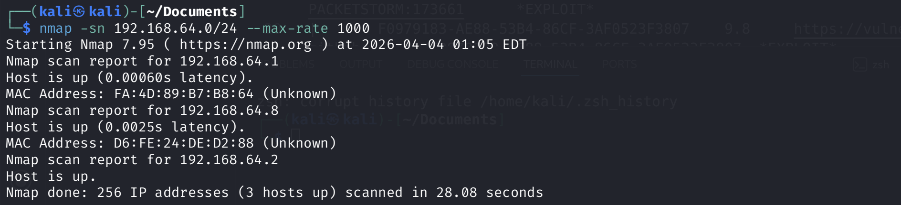
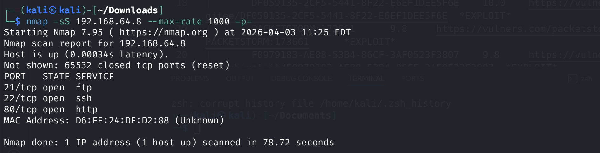
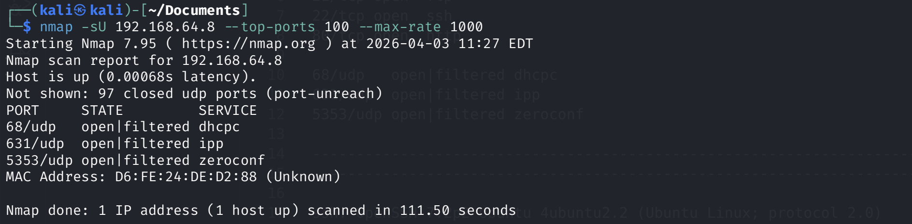
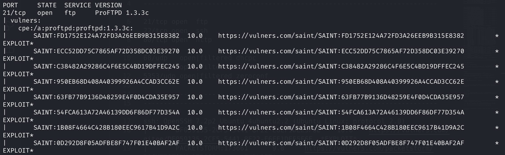
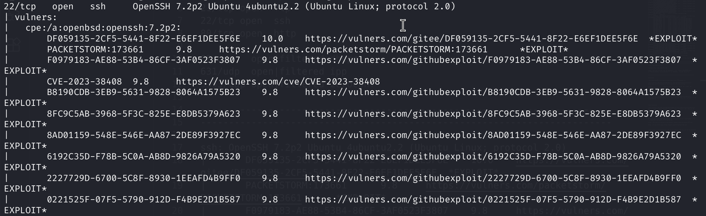
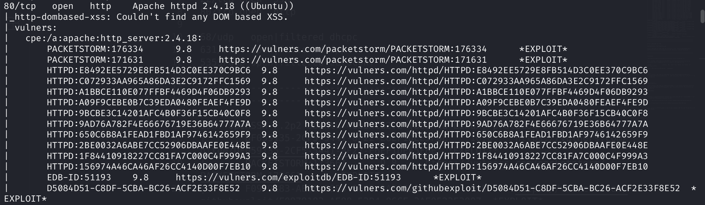
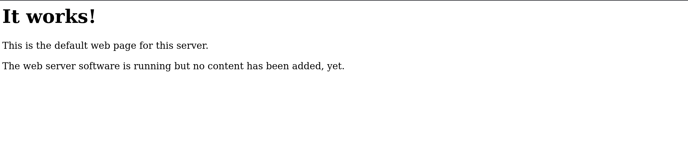
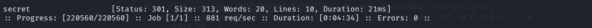
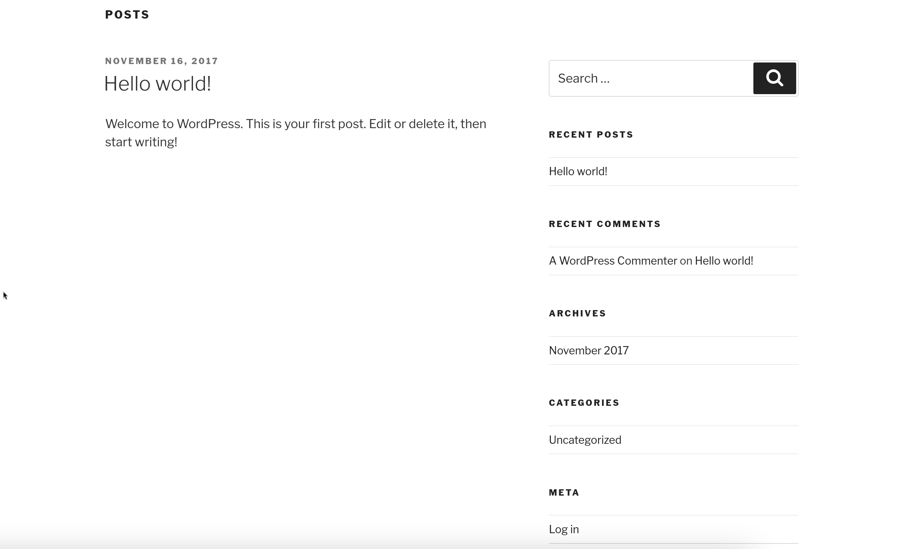
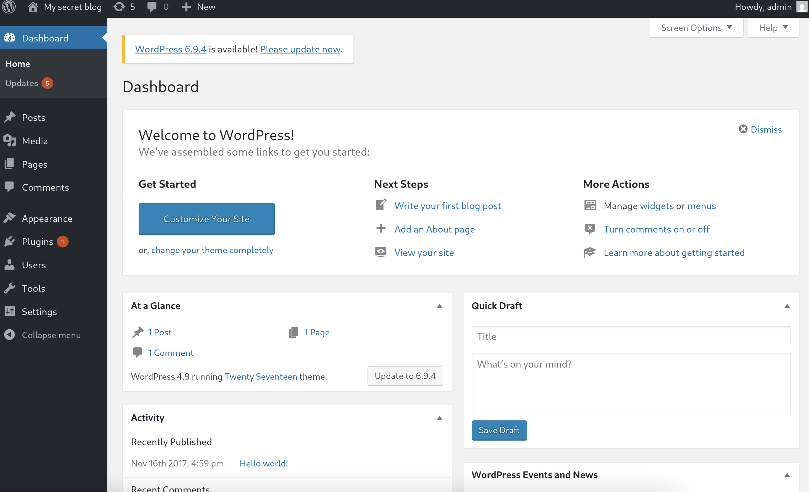

# 目标

This is a small boot2root VM I created for my university’s cyber security group. It contains multiple remote vulnerabilities and multiple privilege escalation vectors. I did all of my testing for this VM on VirtualBox, so that’s the recommended platform. I have been informed that it also works with VMware, but I haven’t tested this personally.

This VM is specifically intended for newcomers to penetration testing. If you’re a beginner, you should hopefully find the difficulty of the VM to be just right.

Your goal is to remotely attack the VM and **gain root privileges**. Once you’ve finished, *try to find other vectors you might have missed!*

---

# 信息收集

## 1.主机发现
```shell
nmap -sn 192.168.64.0/24 --max-rate 1000
```
结果如下：


靶机的主机IP地址为:` 192.168.64.8`

## 2.端口扫描
```shell
nmap -sS 192.168.64.8 --max-rate 1000 -p-
nmap -sU 192.168.64.8 --max-rate 1000 --top-ports 1000
```



**使用nmap中默认的漏洞扫描脚本：**
```shell
nmap -sV -O --script=vuln 192.168.64.8 -p21,22,80
```
部分结果显示如下：




## 3.浏览器查看
靶机开放了80端口，去访问一下：`http://192.168.64.8:80`
页面显示如下：


使用ffuf扫描一下目录：
```shell
ffuf -u http://192.168.64.8:80/FUZZ -w /usr/share/wordlists/dirbuster/directory-list-2.3-medium.txt -p 0.1-0.5 -t 20 -rate 20 -ac
```
结果如下：


浏览器访问：`http://192.168.64.8:80/secret`
页面显示如下：

是wordpress!!!

点击`Log in`，尝试一下输入：
- username: admin
- password: admin

竟然直接就可以登陆，


---

# 后续过程参考`prime-1`

这题的解法还有很多！！！

---
---

# 硬件与软件平台
## 硬件
- Apple Macbook pro M1-Pro 32G 512G
- `UTM虚拟机`

## 软件
kali
- IP: `192.168.64.2`
- OS Realease: `debian 2025.4`
- `Arm64`

靶机shenron-1: 
- `https://www.vulnhub.com/entry/basic-pentesting-1,216/`
- 解压出来的`xxx.ova`文件，使用
    ```shell
    tar -xvf xxx.ova
    ```
    使用解压出来的`.vmdk`文件

---

> 水平有限，有不足、错误之处欢迎指出。🧐