# 目标

get **flags**

---

# 1.信息收集
## 1.1 主机发现
```shell
nmap 192.168.64.0/24 -sn --max-rate 10000
```
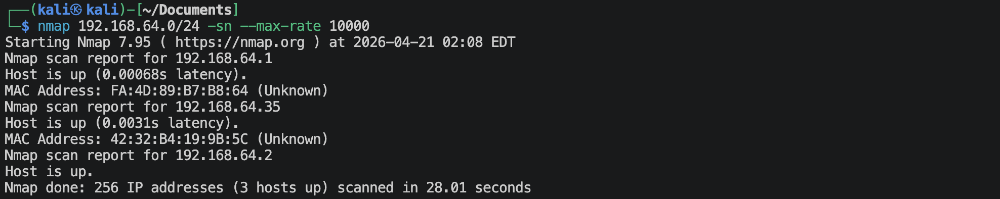
靶机的IP地址是：`192.168.64.35`

## 1.2 端口扫描
**SYN扫描**
```shell
nmap 192.168.64.35 -sS -Pn --max-rate 10000 -p- -oA nmap-scan/syn
```
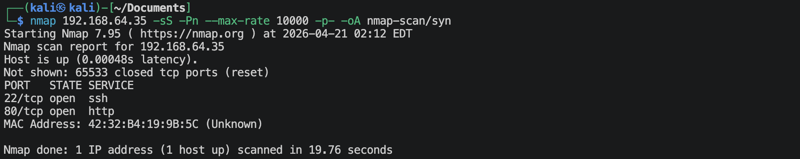

**TCP connection扫描**
```shell
nmap 192.168.64.35 -sT -Pn --max-rate 10000 -p- -oA nmap-scan/tcp
```
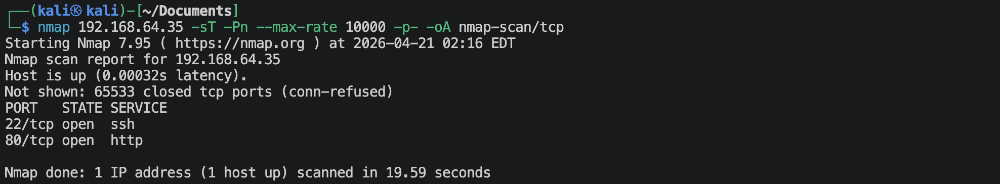

**UDP扫描**
```shell
nmap 192.168.64.35 -sU -Pn --max-rate 10000 --top-ports 100 -oA nmap-scan/udp
```
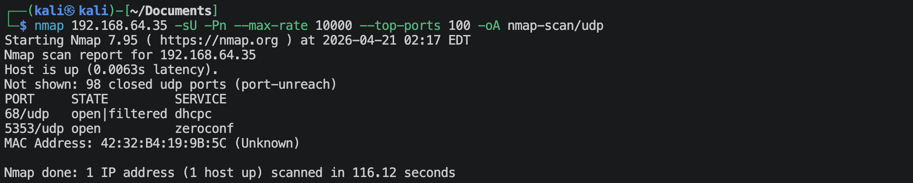

**nmap默认脚本扫描**
```shell
nmap 192.168.64.35 -Pn -sV -sC -O -p 22,80,2 -oA nmap-scan/default
```
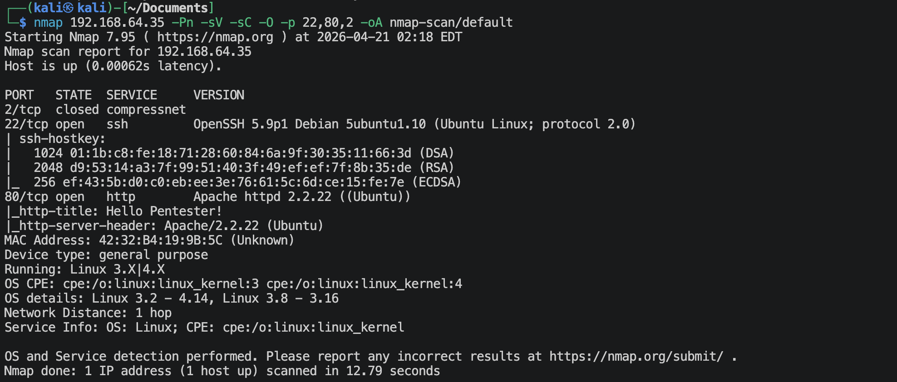

**nmap漏洞脚本扫描**
```shell
nmap 192.168.64.35 -Pn -sV --script vuln -O -p 22,80,2 -oA nmap-scan/vuln
```
有很多信息。

## 1.3 22端口获取信息
**访问`http://192.168.64.35`**
```shell
nmap 192.168.64.35 -sV --script ssh-auth-methods.nse,ssh-hostkey.nse -p 22
```
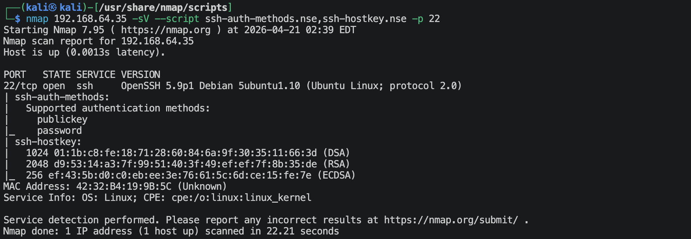

## 1.4 80端口获取信息
**访问`http://192.168.64.35`**
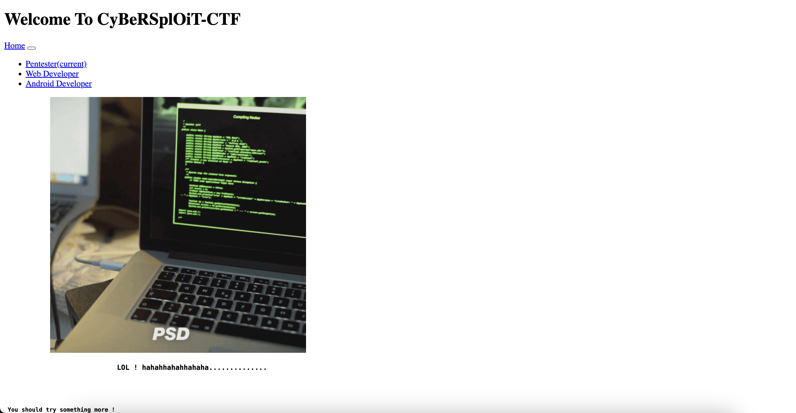
下面有句话 *You should try something more !*

**查看网站首页的源码**
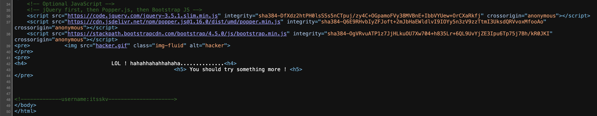
有一个用户名: `itsskv`

**扫描网站目录/文件**
```shell
gobuster dir --url http://192.168.64.35 --wordlist /usr/share/wordlists/dirbuster/directory-list-2.3-medium.txt -x zip,txt,git,php,bak,html,jpg,png -db
```
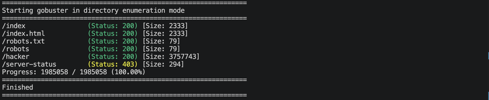

**访问`http://192.168.64.35/robots.txt`**
里面有内容，
```text
R29vZCBXb3JrICEKRmxhZzE6IGN5YmVyc3Bsb2l0e3lvdXR1YmUuY29tL2MvY3liZXJzcGxvaXR9
```
看着像是base64编码过的，尝试着解码一下，
```shell
echo -n 'R29vZCBXb3JrICEKRmxhZzE6IGN5YmVyc3Bsb2l0e3lvdXR1YmUuY29tL2MvY3liZXJzcGxvaXR9' | base64 -d
```
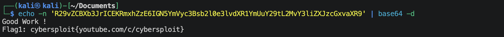
得到了一个**flag**.

**访问`http://192.168.64.35/hacker`**
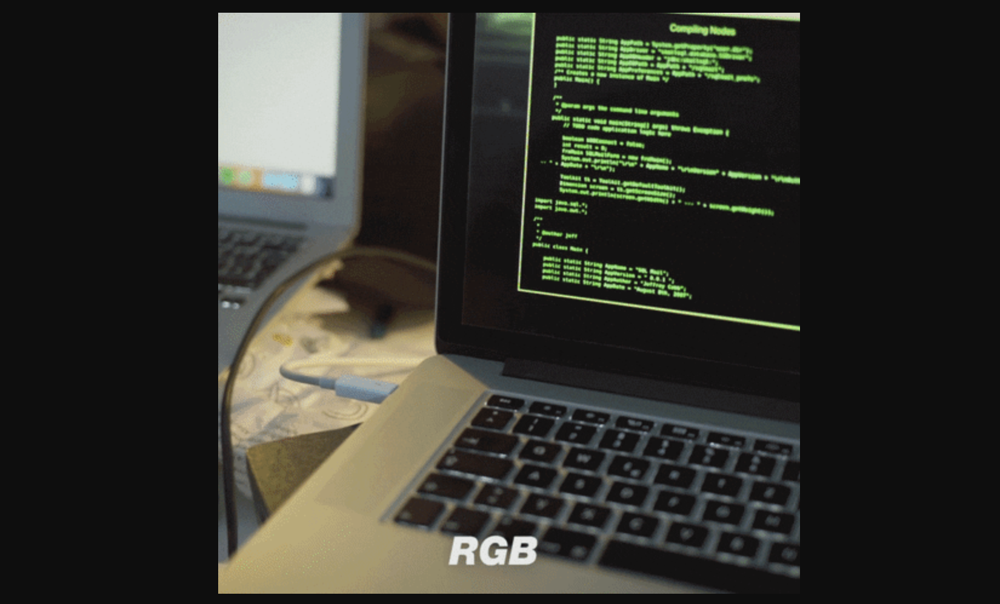
这是一张gif图片, 可以考虑gif隐写，
```shell
exiftool hacker.gif
binwalk hacker.gif
```
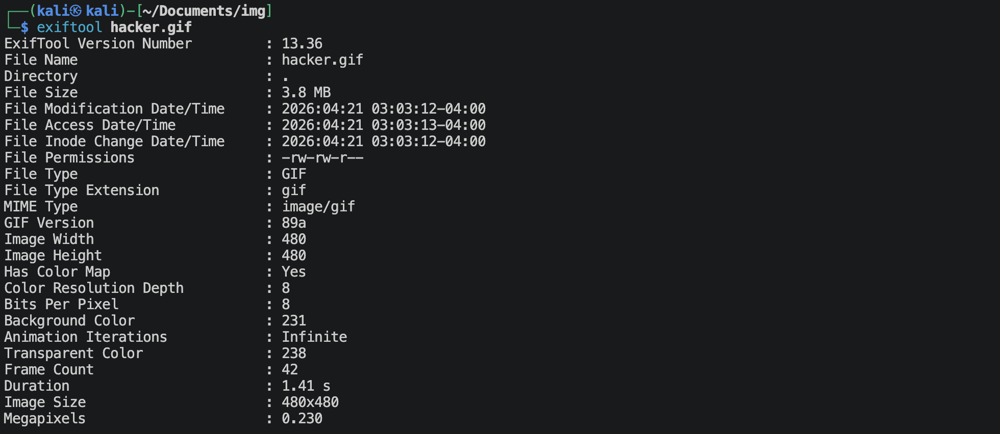
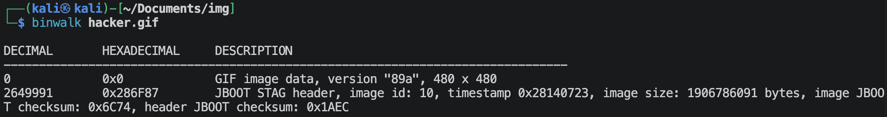
现在简单看了一下没有信息，万一后面是在找不到信息了可以来仔细看看。


---

# 2.建立系统立足点

获得了一个用户名，目前的话之后ssh这一个地方有登陆入口，尝试破解登陆。先尝试利用网站内的关键词构造小字典，如果不行就再使用rockyou.txt。

```shell
# 构造网站小字典
cewl -m 4 -d 3 -w sw.txt --with-numbers http://192.168.64.35
# 破解ssh用户itsskv的密码
hydra -l itsskv -P sw.txt ssh://192.168.64.35 -V -f -t 4
```
没结果。

那使用rockyou.txt来破解一下，
```shell
hydra -l itsskv -P /usr/share/wordlists/rockyou.txt ssh://192.168.64.35 -V -f -t 4
```
跑了前面3万个，没破解出来。这个选项先保留。

唯一还没用的就是上面拿到的那个*flag1*, 会不会就是ssh密码？
去登陆一下，
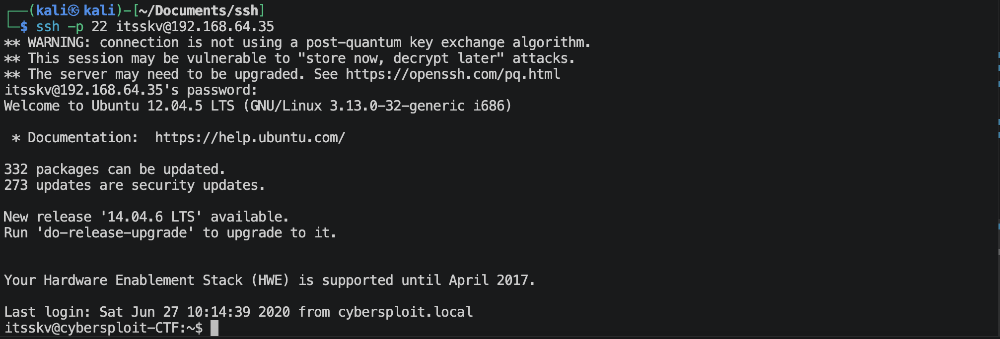
还真是 🤡

---

# 3.系统提权
**拿到第二个flag**
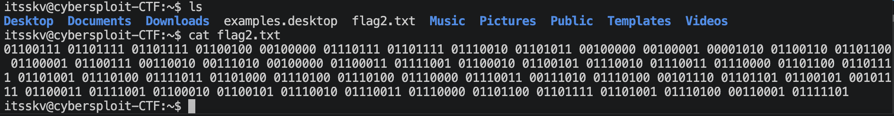
使用下面的代码，
```python
binary_data = """
01100111 01101111 01101111 01100100 00100000 01110111 01101111 01110010
01101011 00100000 00100001 00001010 01100110 01101100 01100001 01100111
00110010 00111010 00100000 01100011 01111001 01100010 01100101 01110010
01110011 01110000 01101100 01101111 01101001 01110100 01111011 01101000
01110100 01110100 01110000 01110011 00111010 01110100 00101110 01101101
01100101 00101111 01100011 01111001 01100010 01100101 01110010 01110011
01110000 01101100 01101111 01101001 01110100 00110001 01111101
"""

ascii_text = ''.join(chr(int(b, 2)) for b in binary_data.split())
print(ascii_text)
```
结果，
```text
good work !
flag2: cybersploit{https:t.me/cybersploit1}
```
flag2会不会就是root用户的密码？会不会就是cybersploit（通过查看/etc/passwd就知道有这个用户）的密码？
尝试之后，就知道都不行。🤡

查看内核版本，
```shell
uname -a
Linux cybersploit-CTF 3.13.0-32-generic #57~precise1-Ubuntu SMP Tue Jul 15 03:50:54 UTC 2014 i686 i686 i386 GNU/Linux
```

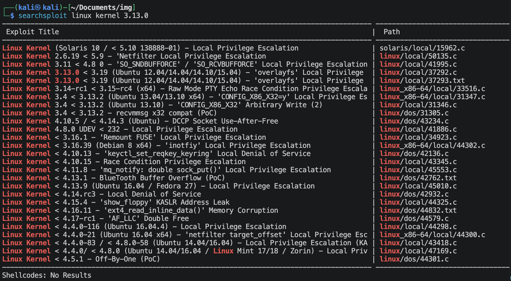

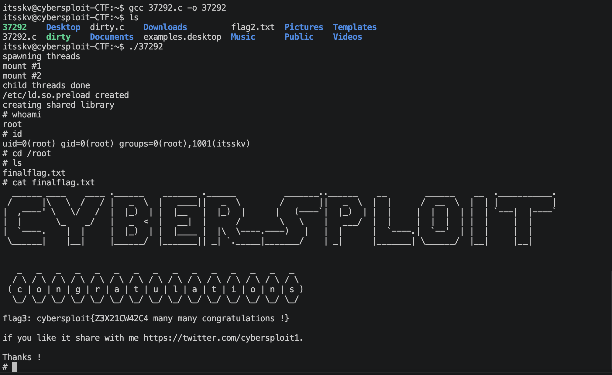
尝试了脏牛*40839*，但是机器直接死机了，后来尝试了*37292*成功了。

---
---

# 💻 硬件与软件平台
## 硬件
- Apple Macbook pro `M1-Pro` `32G` `512G`
- macOS `14.8.5`

## 软件
- UTM version `4.7.5`

**kali**:
- IP: `192.168.64.2`
- OS Realease: `debian 2025.4`
- CPU Arch: `Arm64`
- CPU Cores: `4`

**cybersploit-1**: 
- website: `https://www.vulnhub.com/entry/cybersploit-1,506/`
- IP: `192.168.64.35`
- CPU Arch: `x86_amd_64`
- CPU Cores: `2`

---

> 水平有限，有不足、错误之处欢迎指出。🧐