# 目标

**拿到系统的root权限**

*注*：靶机的IP地址有2个（因为靶机重装了）
- `192.168.64.3`
- `192.168.64.9`

# 信息收集
## 1.主机发现
查看当前主机（kali）的IP地址：
```shell
ip a
```
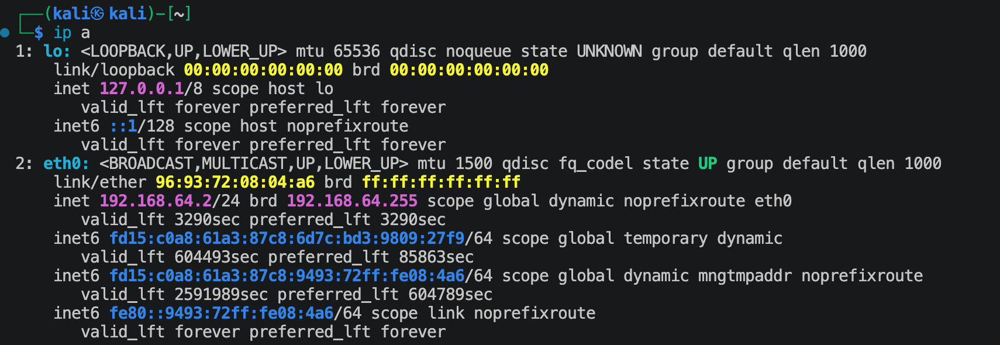

扫描192.168.64.0/24这个网段：
```shell
nmap -sn 192.168.64.0/24 --max-rate 1000
```
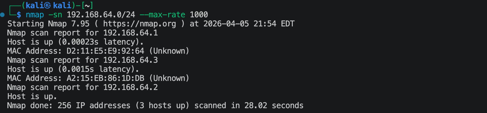

可以比较清楚的发现靶机IP为`192.168.64.3`

## 2.端口扫描与服务发现

**使用TCP SYN扫描靶机开放端口：**
```shell
nmap -sS 192.168.64.3 -p- --max-rate 1000 
```
结果如下：
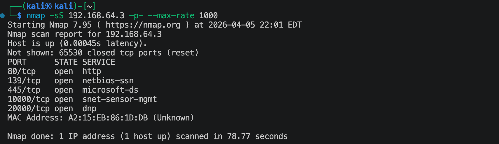

**使用UDP扫描：**
```shell
nmap -sU 192.168.64.3 --top-ports 100 --max-rate 1000
```
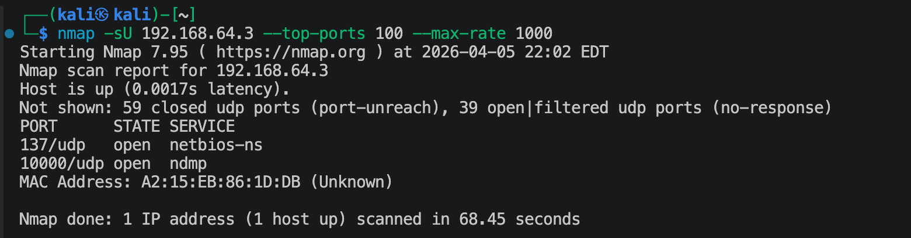

**扫描各个端口对应的服务与系统可能的版本：**
```shell
nmap -sV -O -p80,139,445,10000,20000,137 192.168.64.3 --max-rate 1000
```
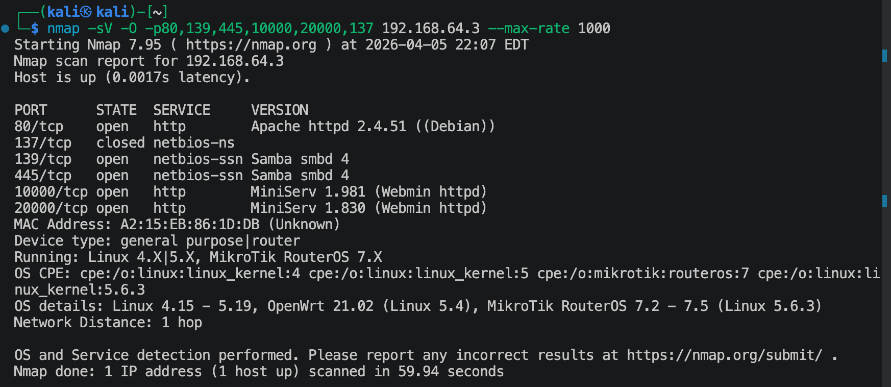

> **139 端口 (NetBIOS Session Service)**
> - 服务名： netbios-ssn
> - 作用： 这是较旧的 NetBIOS over TCP/IP 协议。它主要用于局域网内的机器发现、名称解析以及早期的文件和打印机共享。
> - 背景： 在 Windows 2000 之前的时代，它是文件共享的主力。现在它通常作为备份或为了兼容旧设备而存在。

> **445 端口 (Microsoft-DS / SMB)**
> - 服务名： microsoft-ds (Direct Host) 或 samba (Linux 环境下)
> - 作用： 这是现代的 SMB (Server Message Block) 协议，直接运行在 TCP/IP 之上。
> - 核心功能： 它是目前 Windows 网络中文件共享、打印机共享、域控制器通信以及*远程管理（如 IPC 管道）*的标准端口。

> **什么是 MiniServ / Webmin？**
> MiniServ 是 Webmin 自带的一个轻量级、用 Perl 编写的 HTTP 服务器。它的设计初衷是让管理员能够通过浏览器远程管理 Linux 系统（如修改用户、配置防火墙、管理服务等），而不需要直接操作命令行。

**使用nmap内置的漏洞扫描脚本来发现可能存在的漏洞：**
```shell
nmap -sV --script=vuln -O -p80,139,445,10000,20000,137 192.168.64.3 --max-rate 1000 -oN nmap_vuln.txt
```
将可能的漏洞信息保存在`nmap_vuln.txt`文件中。


## 3.浏览器访问，获取信息

访问网址：
- `http://192.168.64.3:80`
    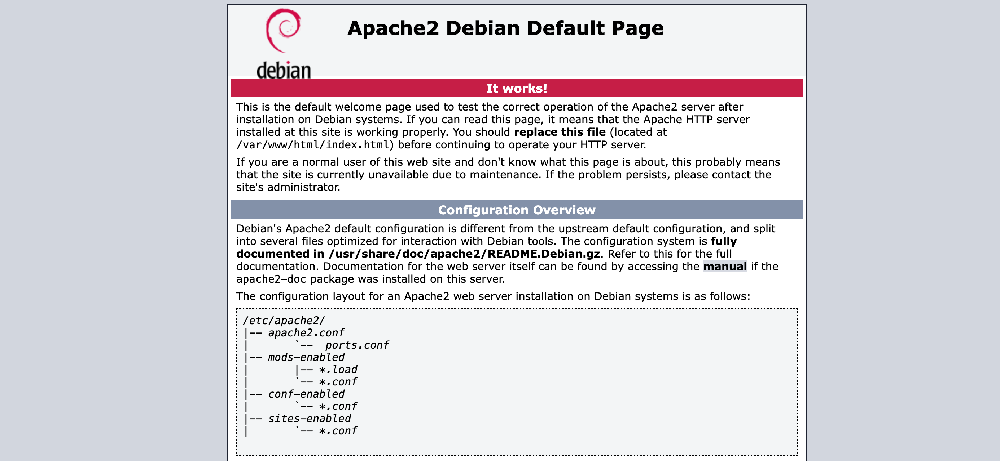
- `http://192.168.64.3:10000`: 访问这个链接会跳转到`https://192.168.64.3:10000`
    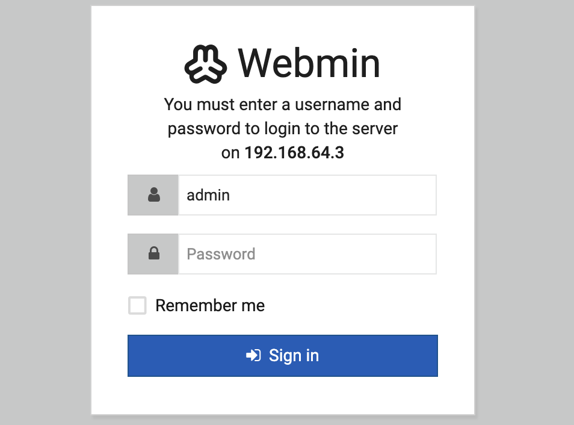
- `http://192.168.64.3:20000`: 访问这个链接会跳转到`https://192.168.64.3:20000`
    

### 3.1 进攻80端口
当前显示的是Aphace的默认页面，看一下网页源码，可以发现在最下面有一段话：（如图）
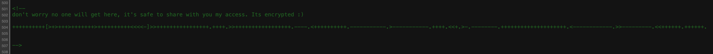
尝试着“解密”一下：（这是一种名叫*Brainfuck*的极简主义编程语言）
将上面的内容写入code.txt文件中，
```shell
beef code.txt
```
解密如下：
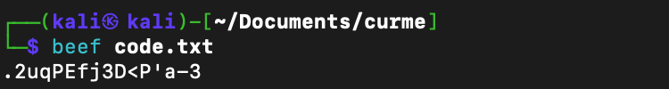
这个应该就是密码，但是不知到用户名是啥。

> **Brainfuck简介**
> Brainfuck（简称 BF）是极简主义编程语言中的“一代宗师”。它由 Urban Müller 在 1993 年发明，最初的目标是设计一种编译器体积最小的语言。
如果用一句话形容它：它用最简单的规则，实现了最复杂的混乱。
Brainfuck 的工作原理完全基于图灵机的概念。你可以想象面前有一条无限长的“纸带”，纸带被分成一个个小格子（单元格），每个格子初始值都是 0。
> - `>`: 指针向右移动一格
> - `<`: 指针向左移动一格
> - `+`: 当前格子的数值 +1
> - `-`: 当前格子的数值 -1
> - `.`: 输出当前格子的 ASCII 字符
> - `,`:输入一个字符存入当前格子
> - `[`: 如果当前值为 0，跳到对应的 ] 之后
> - `]`|如果当前值不为 0，跳回对应的 [ 处

扫描一下网站目录/文件：
```shell
ffuf -u http://192.168.64.3:80/FUZZ -w /usr/share/wordlists/dirbuster/directory-list-2.3-small.txt -ac -t 30 -p 0.1-0.3 -rate 20
```
结果如下：
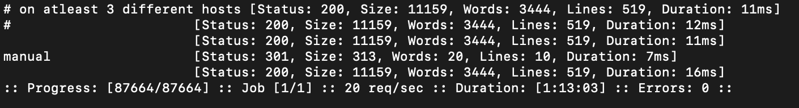
网站下面至少有manual文件夹。

> 在kali上, 下载*seclists*
> `sudo apt install seclists`

访问一下: `http://192.168.64.3:80/manual`
页面如下：
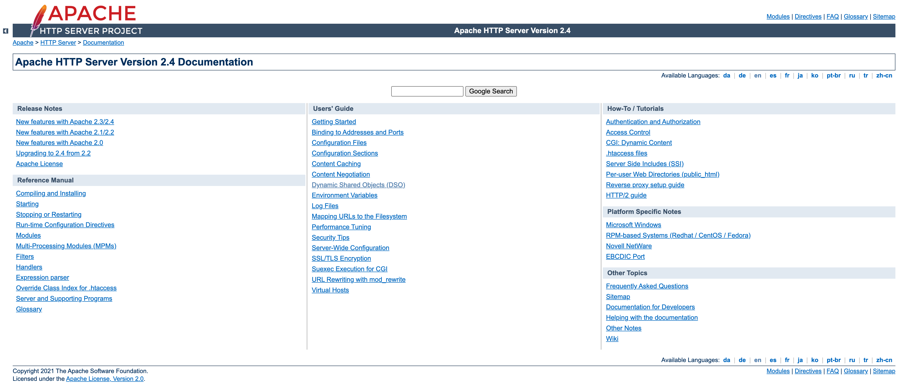
好像没啥用。

### 3.2 进攻139/445端口
```shell
smbmap -H 192.168.64.3 -P 139
smbmap -H 192.168.64.3 -P 445
```
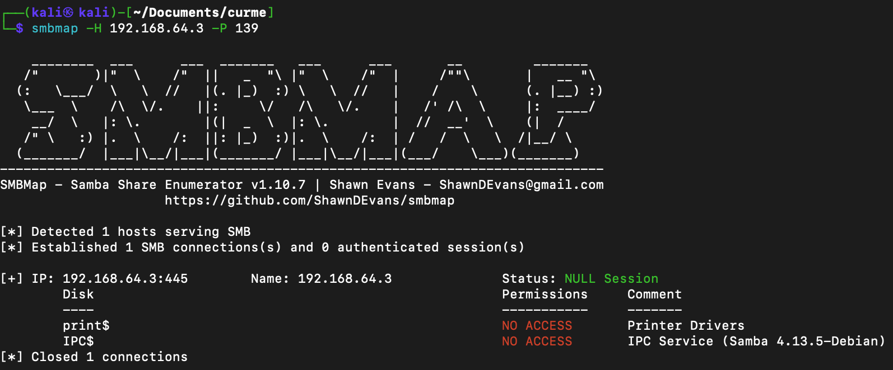
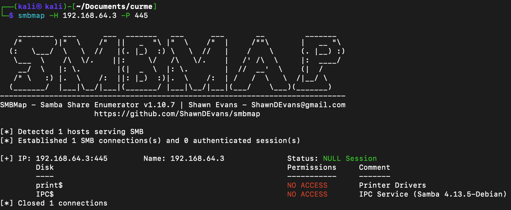
从图片中可以看出，这个SMD允许匿名用户登陆。

**枚举用户名：**
```shell
enum4linux -U 192.168.64.3
```
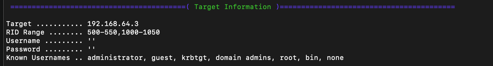
上图中的用户是默认拥有的用户，没有太多得意义。
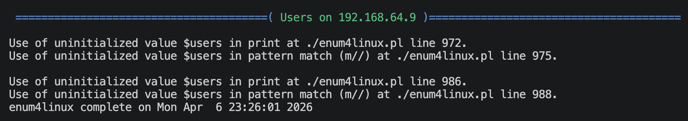
上图中发现`enum4linux`报错了，使用如下命令来枚举用户
```shell
enum4linux -r 192.168.64.9
```
结果如下：

找到用户了`cyber`.

这个用户一定是linux系统中的用户！有用户名了，那要找一个登陆的地方。

### 3.3 进攻10000/2000端口
根据浏览器界面显示的内容可以判断出：
- 10000端口是给管理员登录的
- 20000端口是给普通用户登陆的

---

# 登陆网站

对端口10000与端口20000分别进行了登陆尝试：在20000端口成功登陆了。
在登陆界面找到如下位置：


直接点击就可以打开shell界面了，也不需要上传文件什么的了。

---

# 系统提权

## 1.寻找提权突破口

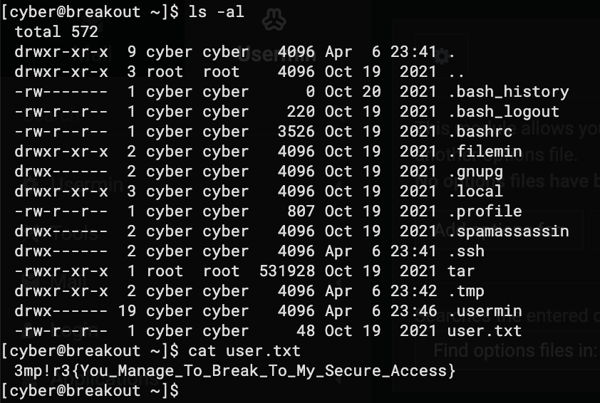

- 寻找拥有root权限运行的文件
    ```shell
    find / -perm -u=s -type f 2>/dev/null
    ```
    结果如下：
    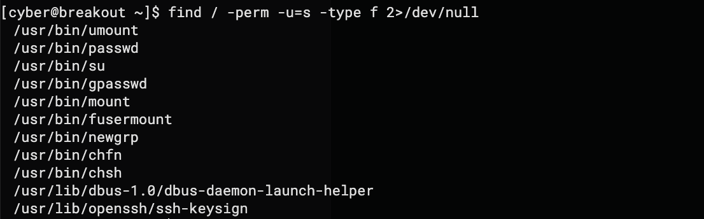

- 寻找拥有敏感字眼的文件
    - key
    - pass
    - bak
    - back
    ```shell
    find / \( -path /sys -o -path /proc -o -path /root -o -path /dev -o -path /lib -o -path /usr \) -prune -o -iname "*<xxx>*" 2>/dev/null
    ```
    结果如下：
    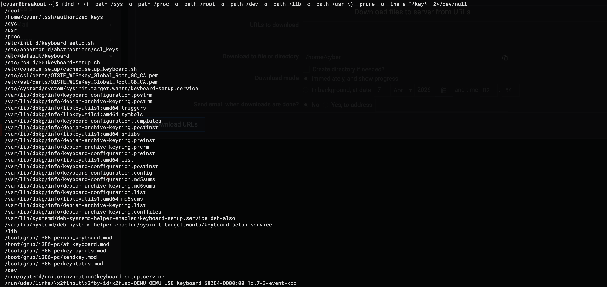
    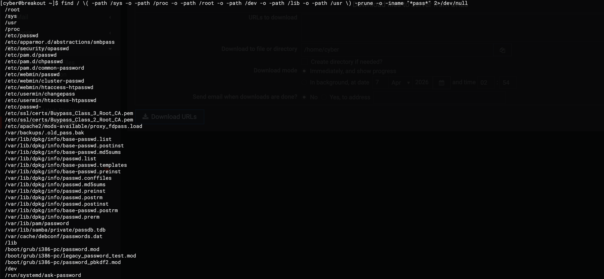
    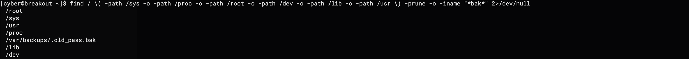
    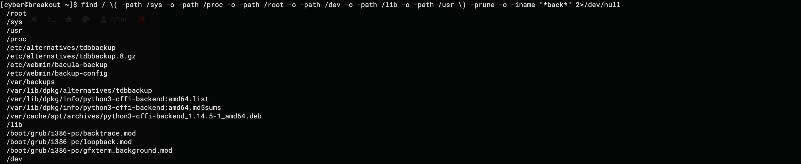
    可以发现一个比较有意思的文件：`.old_pass.bak`

- 寻找有高危capabilities的命令（细粒度特权）
    ```shell
    getcap -r / 2>/dev/null
    ```
    结果如下：
    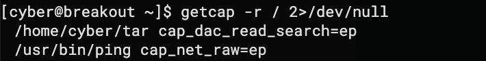
    可以发现在/home/cyber的目录下面的tar命令有一个高危的权限：允许无视任何权限读取文件内容（而且权限的核心状态是`ep`）

去查看一下上面找到的`.old_pass.bak`:
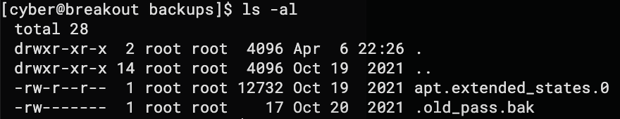

## 2.思考提权路径
这是root用户的文件，当前cyber用户是看不了的。但是可以利用上面发现的tar命令来读取这个文件的内容：(先利用tar的权限来打包，然后解包，这样解出来的包就是属于当前用户的，就可以查看了)
```shell
cd ~
./tar -cf ./old_pass.tar /var/backups/.old_pass.bak
./tar -xf ./old_pass.tar -C ./
cat ./var/backups/.old_pass.bak
```
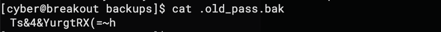

## 3.实现提权
**username**: `root`
**password**: `Ts&4&YurgtRX(=~h`

登陆`https://192.168.64.9:10000`: 
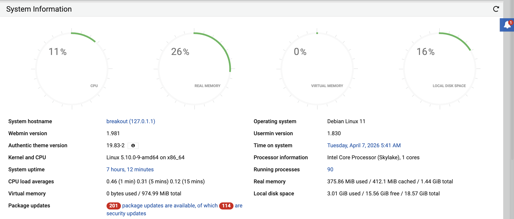
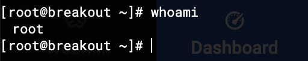

---
---

# 硬件与软件平台
## 硬件
- Apple Macbook pro M1-Pro 32G 512G
- `UTM虚拟机`

## 软件
**kali**: 
- IP: `192.168.64.2`
- OS Realease: `debian 2025.4`
- `Arm64`

**EMPIRE-BREAKOUT**: 
- `https://www.vulnhub.com/entry/dc-9,412/`
- 使用解压出来的`.vmdk`文件

---

> 水平有限，有不足、错误之处欢迎指出。🧐